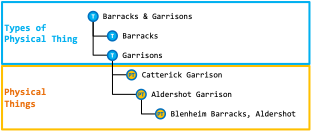

[back to readme](README.md)

# Introduction to 4D Ontology
One of the biggest changes from previous versions of IES is the use of the BORO Methodology. BORO is a modelling approach for developing ontologies that are particularly good at describing how things change and move over time - perfect for investigations, operations and intelligence sharing. The BORO approach has previously been used in the Oil and Gas industry for data sharing, resulting in the ISO15926 standard. It has also been used in defence before, under the 5EYES IDEAS Group where the upper ontology that was developed went on to be used in DoDAF, MODAF, NAF and the OMG's UPDM standard.

## What is an Ontology?
An ontology is a formal model of stuff we are interested in. It defines physical things, types of things, and relationships between them. To be taken seriously as an ontology, certain features have to be in place. A proper ontology must have some underpinning in formal logic and/or set theory – this basically means the fundamental building blocks of the ontology are based on sound mathematical and logical principles. Most serious ontologies also have consistent ways to deal with common concepts such as time, location, properties, etc. Finally, if the ontology is to be developed by more than one person, some sort of repeatable methodology is required. Defining all these things from first principles is a lot of work, so most ontologies re-use an existing “upper ontology”.

So, in summary, an ontology is an extensible model of the things we’re interested in. Formal ontologies provide a set of fundamental components which can be extended to particular domains, and connected together using standard patterns of business logic so as to provide accurate, useful models of those domains of interest. For IES, we have chosen an existing upper ontology with 5EYES pedigree (IDEAS) that we can extend for our purposes, and we’ve chosen an existing and proven methodology (BORO).

## What an Ontology isn’t
An ontology has some features in common with data models and taxonomies, but it is important to describe how these differ. A data model defines the structure of some data storage system – e.g. a database or data file. Data models are often developed in three stages; conceptual, logical and physical. The conceptual data model is intended to be an implementation-neutral specification of the core concepts and the relationships between them. The logical data model adds some rigour to the model, but will generally still be reasonably implementation-neutral. The physical data model takes the requirement specified in the logical model and attempts to map it to the storage mechanism of the implementation. An ontology is somewhat like a conceptual model, but one where the logical rigour of the logical data model is enforced by the modelling approach (i.e. it does away with the conceptual/logical split). Furthermore, an ontology is not confined to just types of information. The rigid divide between data model and data that drives traditional information systems development does not exist in an ontology – everything is data. This allows models to adapt and grow with minimal impact on implementation.

In common with a taxonomy, an ontology generally has a hierarchy of classes – types of things. The difference between the two is really one of rigour and purpose. A taxonomy (for information management purposes) is generally structured to enable the classification of information. This classification work is done in order to aid discovery of that information, and so the taxonomy’s structure is dictated by the requirement to make information easier to find. An ontology’s purpose is to provide an accurate model of the business, so tends to take a more neutral and pedantic approach to classification. The example below is from the UK Defence Taxonomy:

A taxonomy works with words, and the relationships between words. In this case, as we descend the tree, the words become narrower in terms of what they refer to. This is great as a filing system as it allows us to be systematic about where we store our information whilst providing a hierarchical way to search for it.

An ontology is intended to be both computer and human interpretable – i.e. it requires a little more semantic and logical rigour. The first enhancement required is to work out the nature of the elements in the taxonomy. Some of these elements are types of things, whilst others are physical things:

Although the broader-narrower relationship between the words holds true, the relationships between the things in the real world to which those words refer1 is somewhat more varied:

[back to readme](README.md)
