[back to readme](README.md)

Crown Copyright (c) 2025

# IES Model version: 4.3.1
## Contents
* Introduction Diagrams
    * [Notation](#9bea56ca-2e23-47b6-af37-991f72d7c4dd)
    * [Model Change Log](#f2b6cfa8-1b10-4cb8-af0d-ffaf0a28c247)
    * [IES Overview](#e169a2f5-85cb-41a7-a8b5-5bfac5330ab5)
    * [Relationships](#164bafc4-0c40-4900-8a83-2b62248bf22d)
    * [Period of Time](#ac49de36-990b-4c27-ba39-7c78a474c589)
    * [Where and When](#37882c3a-2915-4112-8eb2-abb1c071165c)
    * [Start and End](#926f5679-25c6-47a6-aab0-65f3a7406b99)
    * [Event Linkages](#0ebd3547-89a5-45c0-aca6-bc125d0e885e)
    * [Event Participation](#1ee6c0c5-b494-4395-9c59-aedc7b7971d9)
    * [Sometimes](#c8abe75c-87af-4b36-9d4a-456cf2657b39)
    * [Types](#55486513-19eb-4a97-aadb-62317e9ea00f)
    * [Representation and Content](#393bd76e-39f3-4bd0-9bba-7e1ac7c63f0a)
    * [Identifiers](#a72d9272-df55-4e58-9174-3f9f168438a0)
    * [Characteristics and Measures](#80403a46-2297-4e05-8c9c-1f6ef5596779)
    * [Disposition](#c9919009-48a5-4db1-8123-90396a6f3ad0)
    * [Replaceable Parts](#6c923e0c-455b-46bb-b498-2a47aa1a8de3)
    * [Stuff and Count](#5b7a4e68-4f12-48d2-ae62-d359e4cba907)
    * [Attributes](#1a40117e-e6f6-4ae0-a438-8583e896be00)
    * [Source References](#60cd4a4c-652b-40c9-a65b-321a73329d6e)
    * [Payloads and Groups](#17f25b76-6d6d-4d6e-8bc8-f97c1b2dcc0b)
    * [Metadata](#c58f08d6-9661-4b21-8576-b7620b7d84e3)
* [Entities](#Entities)
    * [Amount of Money](#e9ec7882-a905-4bc5-acf7-6ac9c28e8596)
    * [Assets](#dc826580-c2bf-482e-abf2-b90684a4cb74)
    * [Communications Account](#a4475333-349b-4d3a-81fa-b899dc1961d1)
    * [Communications Device](#9e7698fd-a154-4fb7-8054-a04d67eb71f1)
    * [Communications Identifier](#3b36b41f-8e34-4a09-8586-5a8df2fc3574)
    * [Communications Identifier Range](#1810a643-ccd5-474b-af1b-ce748179b427)
    * [Data Object](#1f0ffc2a-9636-4070-bf77-e7503e68b9e1)
    * [Document](#7a96da48-8eef-46d2-9362-c506781af268)
    * [Financial Account](#29646663-65cc-41b5-a127-f8c3d6dd4ff5)
    * [Identity Document](#563b8c72-68ea-439b-88af-424bf75daa54)
    * [Location](#12f41073-a280-42a2-a83b-a299c85b78f4)
    * [Online](#8be1a4ef-ad1d-4e9f-8681-ab9c658da4d6)
    * [Organisation](#ad64cf62-6430-44f1-8943-df7c22c31dfb)
    * [Posts and Roles](#58bab7ed-90b7-4ec5-82e5-02208aa0d521)
    * [PaymentArtefact](#282bc043-9277-4814-b98f-dfe588356c73)
    * [Person](#d2cdd899-3080-4887-897f-63ea08b5e949)
    * [Ticket](#a98c6576-d0d5-42cf-af90-89cc2b1f47f3)
    * [Vehicle](#6d8b1dc4-4361-4edb-818f-ac96863555ad)
    * [All Entities](#d97110d9-791e-4e88-a92b-5139286e5f05)
* [Events](#Events)
    * [Events Dear Boy, Events](#4c6aef32-6360-4671-82e3-019df67d2496)
    * [Assessment](#5df03a2c-f6df-4433-82d5-7e5c14b6045c)
    * [Authorisation](#df5aab67-46eb-40a8-b96e-8f3b5382d145)
    * [Observation](#6d55c5e7-d9d9-454a-97c7-b682d9334d78)
    * [Agreement](#c8ee24ef-889d-4e8f-96de-ccbe47d4be4f)
    * [Disagreement and War](#6eef4705-72ce-4979-90ff-1966940b7c35)
    * [Business](#2c2171e3-e7a6-4702-ad72-1e02b11afaa7)
    * [Attendance](#6780105e-2091-491e-aebf-c68e03b0074e)
    * [Communication](#d25935bf-2b8f-4315-a858-1fc4dc691df3)
    * [Lifecycle](#8db48415-57e7-47d8-a6ee-97ad59cca8b9)
    * [OnlineEvent](#70dafab2-f28a-4822-a211-00731ad90d62)
    * [Criminal](#852ca74f-2858-4145-908d-5dceb1aa0589)
    * [Law Enforcement](#460b1d00-10cb-4f93-a518-f2a96af54cf7)
    * [Operational](#45f6decc-1d67-4037-83de-0047c8815ef5)
    * [Political](#f919dbec-ce53-478f-8eea-fb151d7b1102)
    * [Trade](#b84b31e9-62dd-4a6b-89f3-459896232f75)
    * [Movement](#41f61d94-0e76-4f81-a005-ae93346db054)
    * [Travel Booking](#0641b013-5267-4314-84c8-1856eba51a47)
    * [All Events](#d488bdae-aaea-4c4a-b866-ed79d154d547)
* [Relationships](#Relationships)
    * [Familial](#c6937856-2424-4e96-bfe1-8ca3611869d1)
    * [Interest](#59f513b8-3ece-4bac-8bd0-908306396a8f)
    * [Lifecycle Relationships](#9e3102fc-46dc-4363-b0b4-d0ea7275d05d)
    * [Mutual Understanding](#9d1812ff-691f-4847-b79c-9136091d93e0)
    * [Operational Part 1](#461d38a7-e51f-4e68-ab15-ca7b0e27b1f6)
    * [Operational Part 2](#bad148fb-d906-45c4-9a2c-d79819f47655)
    * [Professional](#dc8f8219-960a-4207-b9af-98b9486529a8)
    * [Social](#e92f9ed3-bb84-4e2f-b9fb-5b787d917bd0)
    * [Structural](#bed9b9a0-547e-49d5-ab9d-2bd0a634a3ea)
    * [Topological](#20bf4e8f-9683-4bf4-b59c-f7f2ab2fb8f3)
    * [All Relationships](#de627d02-c0d9-462a-9cb7-1c496714a13d)
* [All Elements](#All-Elements)
## Notation
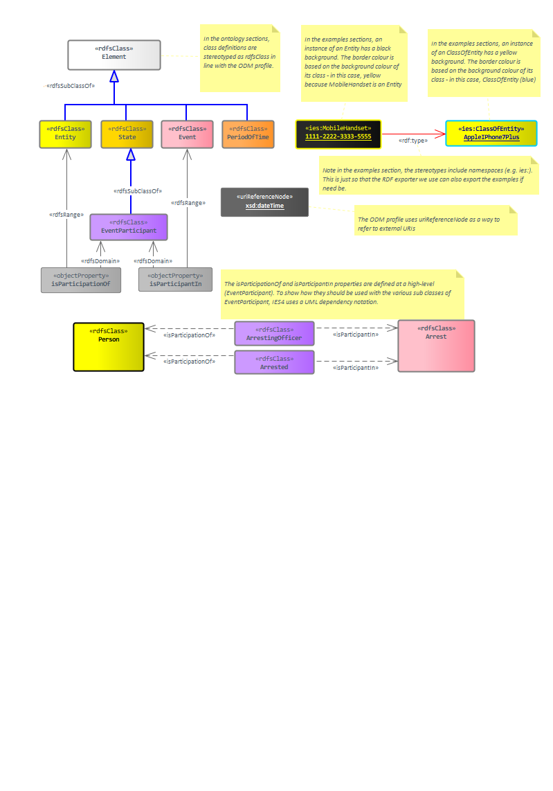

### IES elements in this diagram:

* [Entity](#f4ede167-6f5a-417d-9984-0221ccdf752c)
* [Event](#b376370e-f5e8-4287-a3ec-ac35532919b1)
* [Element](#97edc90f-3b36-4da8-ae77-d5fdbdea2b21)
* [State](#47301d66-cbd5-4d10-9481-b66966a3f3a2)
* [PeriodOfTime](#3fdfa898-c340-4279-8b3c-275359d5b02d)
* [Arrest](#d8d7184c-2f7b-4a5d-aa8f-7ee7b5a04f94)
* [Person](#5d5c5b9b-5e90-4100-8353-8ee9f3d772e2)
* [ArrestingOfficer](#5b3f41c3-91cc-442f-a4f8-615e77751734)
* [Arrested](#b870a3b5-32fa-4aaf-86f1-7db674585f3a)
* [EventParticipant](#c5ab420c-1ab6-479a-97e1-4f2fd37725cb)
* [isParticipationOf](#df9f6056-ccd4-41aa-9a86-536f6150ec25)
* [isParticipantIn](#baea86d9-c90e-4f8d-96f5-a01bb0c49711)

The IES4 model has been developed using the OMG's ontology definition meta-model (ODM) profile for UML. Whilst UML may be somewhat foreign to ontology developers, ODM seemed a reasonable compromise for presenting the model to both data architects and ontologists. 

<b>Notes for data modellers:</b>
Basic background reading on how to use RDF is the book "Semantic Web for the Working Ontologist".
Otherwise, things to watch out for in the UML are:
<ul>
	<li>Relationship definitions and attributes (properties in RDF speak) are shown as boxes rather than lines.</li>
	<li>Multiple inheritance and multiple classification is not just possible, but encouraged in ontology modelling</li>
	<li>Properties (relationships and attributes) can be specialised using the rdfs:subPropertyOf relationship</li>
</ul>
<b>
</b><b>Notes for ontologists:</b>
<ul>
	<li>The model uses RDF Schema in preference to OWL wherever possible - this ontology is not intended for reasoning / inference</li>
	<li>It is a formal 4D ontology using the BORO approach...</li>
	<li>...In other words, the emphasis is on real-world semantic and precision of description rather than any compromises to enable reasoning.</li>
	<li>The ontology is higher order (classes of classes of classes...etc.), and extensional.</li>
	<li>The Sparx ODM template uses something called uriReferenceNode to refer to an external resource. There are a few of these in the ontology, used where it makes reference to RDFS or RDF class definitions.</li>
	<li>There are several sub-classes of classes defined in RDF and RDFS, and also some sub-properties of rdf:type</li>
</ul>

<b>General notes on notation:</b>
<ul>
	<li>UML Stereotypes (e.g. &lt;&lt;rdfsClass&gt;&gt;) are used as a shortcut to indicate class membership (rdf:type). It means the thing you're seeing on the page (box or line) is an instance of the thing specified in the stereotype.</li>
	<li>There is an examples package (not exported with the RDF) that contains a number of instances used in example diagrams. Instances of <b>Elements </b>are shown with a black background. Instances of <b>ClassOfElement </b>are shown with a yellow background if they're <b>ClassOfEntity </b>and a pink background if they're <b>ClassOfEvent</b>.</li>
	<li>Stereotypes are used liberally (see above) as a shorthand for rdf:type</li>
	<li>rdfs:subClassOf (relates classes to their supertypes) is shown with a thick royal blue line</li>
	<li>rdfs:subPropertyOf (related properties to their subproperties) is shown with a thick dark blue line</li>
	<li>Sometimes, a pattern defined at a high-level is referred to using a UML:dependency. This has no formal semantics other than to indicate to the implementer that the pattern should be used in this case</li>
</ul>

## Model Change Log

<b>v4 Beta 1 - Released September 2018 to IES team for internal review</b>
<b>
</b><b>v4 Beta 2 - Released December 2018 to wider community for review, including some implementation trials</b>
<b>
</b><b>v4.0.0 - FIRST OFFICIAL RELEASE - Changes resulting from initial release and trial implementations</b>
<ul>
	<li>Rename iso3166-1Alpha-3 to iso3166_1Alpha_3 - hyphens may cause issues with some programming languages (e.g. Python)</li>
	<li>Rename UN-LOCODE to UN_LOCODE - hyphens may cause issues with some programming languages (e.g. Python)</li>
	<li>Addition of SubjectOfInterest - required for every inter-agency data exchange trial implementation</li>
	<li>Addition of isPrimaryForOrganisation - added to cover things like primary names, primary SOIs, etc. within context of an organisation</li>
	<li>"venue" attribute on Ticket changed to "venueStatedOnTicket" to make it clear this may not be the final venue of the event</li>
	<li>Attendance added as subtype of Presence for when the Entity present is a Person (particularly useful with unidentified people)</li>
	<li>Duration added - this was an oversight. It had been discussed and was supposed to have been added, but slipped through the net.</li>
	<li>Reversed the direction of all the representation relationships (names, IDs, etc.) as the existing direction was counter-intuitive in RDF TTL and JSON-LD</li>
	<li>vehicleIdentificationNumber had not been changed to an Identifier before initial release. This was an oversight. Now corrected.</li>
</ul>
<ul>
	<li>bookingReference had not been changed to an Identifier before initial release. This was an oversight. Now corrected.</li>
	<li>Added knownAssociate to the Social diagram</li>
	<li>isTeacherOf added to Professional diagram</li>
	<li>worksWith reinstated (was taken out in v4, but there are cases where it can't be replaced by organisation and employedBy)</li>
	<li>PeriodOfTime was causing problems in initial implementations around how to query it. This has now been fixed with the explicit addition of ArbitraryPeriod and the rationalisation of the attributes used.</li>
	<li>Added OnlineArtefactInEvent to cover when OnlineArtefacts participate in online events</li>
	<li>Added Cookie as an OnlineArtefact and also a relationship called cookieOnDevice</li>
	<li>Changed a lot of IDs and Names in the Online diagram that were attributes into Names and Identifiers.</li>
	<li>URI is now all upper-case</li>
	<li>Added subtypes of CommunicationsAccount - e.g. TelephoneAccount, EmailAccount, etc.</li>
	<li>Added hostedOn relating a WebResourceState to the OnlineService that hosts it</li>
	<li>WholeLifeState removed. Was never needed and was a hangover from early IES 4 development work.</li>
	<li>holderOfAccount direction changed and renamed to holdsAccount</li>
	<li>ClassOfState added to enable Roles</li>
	<li>Roles and Posts added</li>
	<li>OnlineAccountState added to cope with changing screen names, passwords</li>
</ul>

<b>v4.1.0 - Changes resulting from project engagements</b>
<ul>
	<li>Device - classes replace attributes - <i>make </i>property now points to Organisation, <i>installedSoftware </i>replaces <i>operatingSystem</i>, <i>model</i> now relates to ModelOfDevice</li>
	<li>Currency model revised to use classes, and link to ISO standard ID and country</li>
	<li>TelephoneCountryCode revised to uses classes and link to Country</li>
	<li>Documents - DocumentFormat added as class, title changed to subclass of Name, publicationDate now an objectProperty to ParticularPeriod</li>
	<li>DataObject - DataKey becomes an identifier and ObjectName a Name</li>
	<li>IdentityDocument - dates changed to objectProperties pointing at ParticularPeriod. idGender now an objectProperty. visaType now an objectProperty</li>
	<li>Person - Gender now a Class</li>
	<li>Communication / Online Event - there were two classes for Message - Message and Messaging. Messaging has been removed.</li>
	<li>vehicleColour now changed to objectProperty (hasColour) and moved up to AssetState</li>
	<li>GeoRepresentation, ISO19125-WKT and GeoJSON added (see Location page)</li>
	<li>Language is now a class and hasLanguageProficiency links a PersonState to their LanguageProficiency - also inLanguage property added to Representation, and called-out the proficiency as a class in its own right</li>
	<li>PaymentArtefact - branding now relationship to Organisation, cardType now relationship to a Class, areaOfCoverage now relationship to Location</li>
	<li>AgreementName added - now using naming pattern</li>
	<li>Business - transferType now an objectProperty (relationship)</li>
	<li>CriminalActivity - type of offence now managed as a class, and the offenceCode identifies the Class</li>
	<li>PartNumber now identifier on ModelOfDevice</li>
	<li>serviceIdentifier now TravelServiceIdentifier</li>
	<li>Observation pattern added</li>
	<li>Actor and ResponsibleActor replace PersonOrOrganisation</li>
	<li>serviceType now onlineServiceType and is now an objectProperty</li>
	<li>ClassOfFinancialAccount added. JointAccount added</li>
	<li>bookingMethod now implemented as ClassOfTravelBooking</li>
	<li>paymentMethod (TravelBooking) now replaced using the Trade model</li>
	<li>Rights and Reservations added</li>
	<li>Interest - now modelled as states so that attributes can be attached.</li>
	<li>altitude - now uses the measures and characteristics model</li>
	<li>PointOnEarthSurface, Latitude, Longitude and isCentroidOf added, replacing the old geoIdentity which was a hangover from IES3 and made no sense in 4.</li>
	<li>hasHeight (person) now uses characteristics and measures model - now PersonHeight</li>
	<li>hasTheme (Investigation, Communication, etc.) added to cover those things that are of interest post-event or thematically - e.g. the thing being investigated is not involved formally</li>
	<li>Definition for IPAddress still mentioned attribute qualifiers (from v3 of IES) for dealing with IPv4 and IPv6. These are now subtype of IPAddress</li>
	<li>A very large number of definitions were incomplete, wrong or just missing. These are now fixed</li>
	<li>GeoPoint added - supertype of PointOnEarthSurface - this allows for points above or below the surface of the earth</li>
	<li>PassengerName, SeatNumber and BoardingCardNumber are now identifiers and names of Passenger</li>
	<li>countryOfRegistration and countryWhereRegistered merged</li>
	<li>A basic model for characteristics, measures and units of measure has been added as the current reliance on strings and fixed units was seen to be inadequate by users</li>
	<li>PartOfFacility and RoomNumber added</li>
	<li>AssessToBeTrue and PossibleWorld added - straw-man models for working with probabilistic data and scenarios</li>
	<li>Disposition - Capability and Tendency added - way to deal with dispositional properties</li>
	<li>payLoadContents relationship added - provides way to hold more than one payload per file</li>
</ul>

<b>v4.2.0 - Changes resulting from project engagements</b>
<ul>
	<li><b>Possible Worlds Model Added - </b>placeholder for dealing with modal logic. This will grow over time. Shown on assessments page.</li>
	<li><b>TerroristOrganisation </b>now a subtype of OrganisationState to allow for different parties viewing and organisation as being terrorist at different times. This also allows the assessments model to be used.</li>
	<li><b>CriminalOrganisation added</b> - subtype of OrganisationState, working in a similar way to TerroristOrganisation</li>
	<li><b>LawEnforcementOrganisation </b>added - subype of Organisation.</li>
	<li><b>ClassOfOperation </b>added at request of Home Office Vivace. This enables them to manage multiple taxonomies of criminal investigations in used throughout the UK and international partners</li>
	<li><b>Authorisation </b>model added at request of HO Vivace - provides a high-level framework for things like warrants and other types of authorisations.</li>
	<li><b>EventState </b>added</li>
	<li>make and serialNumber now properties of Asset rather than Device</li>
	<li>staysAt added to show where a Person stays as opposed to where they legally reside.</li>
	<li><b>VersionOfDocument </b>added</li>
	<li><b>NetworkInterface </b>added</li>
	<li><b>RadioMast </b>and <b>CellularBaseStation </b>added</li>
	<li><b>RadioCoverageArea </b>added</li>
	<li><b>MapGridArea </b>and <b>OSGridReference </b>added (requested by Police / Home Office)</li>
	<li><b>Easting </b>and <b>Northing </b>added (requested by Police / Home Office)</li>
	<li>nephewOrNieceOf and cousinOf added</li>
	<li><b>Team </b>and <b>Department </b>added to organisation model</li>
	<li><b>ClassOfOrganisation </b>added  (requested by Police / Home Office)</li>
	<li><b>OrganisationIdentifier </b>added  (requested by Police / Home Office)</li>
	<li><b>Accent </b>added  (requested by Police / Home Office)</li>
	<li><b>DocumentSection </b>added  (requested by Police / Home Office)</li>
	<li><b>AuthorisationDocument </b>and <b>RequestDocument </b>added  (requested by Police / Home Office)</li>
	<li><b>EncodedData </b>and <b>JsonData </b>added  (requested by Police / Home Office)</li>
	<li>"model" property removed - now use rdf:type</li>
</ul>

<b>v4.3.0 - Changes resulting from project engagements</b>
1. Added <b>Stuff and Count </b>pattern, including addition of:
<ul>
	<li><b>Stuff</b> class</li>
	<li><b>FiniteClassOfElement</b> class</li>
	<li><b>finiteMembershipCount</b> attribute</li>
	<li><b>pluriverse </b>as an instance of Element</li>
	<li>Added example use</li>
</ul>
2. Added <b>Replaceable Parts </b>pattern, including addition of:
<ul>
	<li><b>ReplaceablePart </b>class</li>
	<li><b>InstalledState </b>class as a superclass of <b>InPost </b>(non-breaking)</li>
	<li>Added example use</li>
</ul>
3. Changes to <b>Payloads and Groups</b> pattern:
<ul>
	<li>(Bug fix) Added <b>rdfs:subClassOf </b>relation between <b>SecurityLabel</b> and <b>rdfs:Resource</b></li>
</ul>
<ul>
	<li>(Bug fix) Added <b>rdfs:subClassOf </b>relation between <b>ExchangedPayload</b> and <b>rdfs:Resource</b></li>
</ul>
4. Changes to <b>Posts and Roles</b> pattern:
<ul>
	<li>Removal of <b>hasRole</b>, <b>Role </b>and <b>OrganisationRole </b>(breaking change). Instead use <b>ReplaceablePart</b>/<b>InPost</b> example now provided in the same pattern</li>
	<li>Update to definition of <b>InPost </b>now that is also a <b>InstalledState</b></li>
	<li>Corrected relationship between <b>inPost </b>and <b>Post </b>from isPartOf to <b>isStateOf</b></li>
</ul>
5. Changes to <b>Assessment </b>pattern:
<ul>
	<li>Addition of <b>Assessment </b>as a new superclass of <b>AssessToBeTrue </b>(non-breaking)</li>
</ul>
6. Changes to <b>Location </b>pattern:
<ul>
	<li><b>regionCountry</b>, <b>addressRegion </b>deleted. Use <b>inLocation </b>instead</li>
	<li><b>isCentroidOf </b>corrected from being a <b>subProperty </b>of relationship to <b>inLocation</b></li>
	<li><b>MapGridArea </b>no longer an <b>Asset </b>as well as a <b>Location</b></li>
	<li><b>RadioCoverageArea </b>no longer an <b>Asset </b>as well as a <b>Location</b></li>
</ul>
7. Changes to <b>Where and When</b> pattern:
<ul>
	<li><b>happensIn</b>, <b>takesplaceIn </b>deleted. Use <b>inLocation </b>instead.</li>
</ul>
8. Changes to <b>Asset </b>pattern
<ul>
	<li><b>storedIn </b>deleted. Use <b>inLocation </b>instead.</li>
</ul>
9. Changes to <b>Communications Device</b> pattern:
<ul>
	<li>Removal of <b>installedSoftware</b>, replaced with <b>InstanceOfSoftware </b>which can be associated as being installed using <b>isPartOf.</b></li>
	<li>Removed <b>ModelOfDevice </b>and <b>ClassOfDevice</b>. Instantiations of <b>ModelOfDevice </b>to be done instead using subClassOf <b>Device.</b></li>
	<li>Linked Device to <b>PartNumber </b>using <b>isIdentifiedBy</b></li>
</ul>
10. Changes to <b>Period of Time</b> pattern:
<ul>
	<li><b>ParticularPeriod</b> URI pattern now mandated to be non-punctuated encoding (20070118T153000Z).  This avoids the use of escape characters in the URI. NOTE:<b> </b>the literal for <b>iso8601PeriodRepresentation </b>remains punctuated.</li>
	<li><b>ParticularPeriod</b> mandated to be in UTC / Zulu time</li>
	<li><b>Period of Time</b> diagram changed to reflect changes to URI encoding</li>
	<li>Updates to all examples to include new encoding</li>
</ul>
11. Changes to <b>Disposition</b> pattern:
<ul>
	<li>Correction to <b>allHaveDisposition</b> rdfs:Domain - fixed to <b>ClassOfElement </b>not <b>Element</b></li>
</ul>
12. Changes to <b>Amount of Money </b>pattern:
<ul>
	<li>Currency identifier correct to <b>ISO4217Code </b>not <b>ISO639-3Code</b> (country code)</li>
</ul>
13. Changes to <b>Online </b>and <b>Communication </b>patterns covering <b>Message</b>. <b>Message </b>used to inherit from both <b>OnlineEvent </b>and <b>Communication </b>which didn't make sense considering <b>SMS </b>is a subtype of <b>Message</b>. Changes included:
<ul>
	<li>Deleted subclass relation between <b>Message </b>and <b>OnlineContentEvent</b></li>
	<li>Added <b>OnlineMessage </b>class with the definition of "A Message that was sent Online."</li>
	<li>Added <b>OnlineMessage </b>to the <b>OnlineEvent </b>diagram</li>
	<li>Made <b>OnlineMessage </b>a subclass of <b>OnlineContentEvent </b>and Message</li>
	<li>Added Communication class to <b>OnlineEvent </b>diagram</li>
	<li>Changed <b>Message </b>definition from "A Communication or OnlineContentEvent where a message is sent" to "A Communication where a message is sent"</li>
</ul>
14. IES 4.2 had ClassOfElements and subProperties of rdf:type which encouraged extending the IES classes via ClassOfElements hierarchy rather than the Elements hierarchy. IES 4.3 prunes some of classes (breaking changes) to discourage this behaviour and encourage one approach of extending IES. This approach is documented in "Extending IES4 2024-03-v1.0 O.pdf". Pruned classes and properties include:
<ul>
	<li>From <b>Authorisation pattern - AuthorisationEventClass </b>deleted � just use subclasses of <b>AuthorisationRequest </b>or <b>GrantOfAuthority</b>. Also <b>requestedActivity</b>, <b>grantedActivityType </b>and <b>allAuthorisedAgainst</b> deleted</li>
	<li>From <b>Operational </b>pattern - <b>ClassOfOperationalEvent</b>, <b>ClassOfCriminalActivity </b>and <b>typicallyTargets</b></li>
	<li>From <b>Criminal </b>pattern - Deleted of <b>special forms of rdf:type</b>, <b>typeOfCriminality. Also deleted</b> <b>OffenceCode</b>.</li>
	<li>From <b>Financial Account</b> pattern - Deleted special forms of rdf:type, <b>financialAccountType ClassOfFinancialAccount</b></li>
	<li>From <b>Organisation </b>pattern - Deleted <b>ClassOfResponsibleActor</b></li>
	<li>From <b>Identity Document</b> pattern - Deleted special form of rdf:type, <b>visaType</b>. Also deleted <b>ClassOfTravelVisa</b>.</li>
</ul>
<ul>
	<li>From <b>PaymentArtefact </b>pattern - <b>cardType </b>and <b>ClassOfPaymentArtefact</b>. Just extend <b>PaymentArtifact</b></li>
	<li>From <b>Business </b>pattern - deleted <b>transferType </b>and <b>ClassOfMoneyTransfer</b>. Instead just extend <b>TravelBooking</b></li>
	<li>From <b>Online </b>pattern - deleted <b>onlineServiceType </b>and <b>ClassOfOnlineService</b>. Instead just extend <b>OnlineService. </b>Also deleted ClassOfWebResource.</li>
	<li>From <b>Travel Booking</b> - deleted <b>bookingType </b>and <b>ClassOfTravelBooking</b></li>
	<li>From <b>Communications Account</b> - deleted <b>ClassOfAccount</b></li>
</ul>
15. Other changes:
<ul>
	<li><b>ExchangedItem </b>changed to <b>Thing</b>. Its definition has also been changed.</li>
	<li><b>VersionNumber </b>- update to definition to apply to anything that is identifiable</li>
	<li><b>currencyDenomination </b>no longer a subProperty of relationship and rdf:type. Its now just a subtype of rdf:type only.</li>
	<li><b>isParticipantStateIn </b>deleted. Just use <b>isParticipantIn</b>.</li>
</ul>
<ul>
	<li>Removed all references of PersonOrOrganisation. All updated to <b>ResponsibleActor</b></li>
	<li><b>Marriage </b>no longer a subClassOf <b>LawEnforcement</b></li>
	<li><b>Latitude </b>and <b>Longitude </b>specified to be xsd:decimal literals</li>
	<li><b>hasTheme </b>no longer domain as <b>Investigation</b>, <b>Communication </b>and <b>Meeting</b>. Now that of only <b>Event</b></li>
</ul>
<ul>
	<li>Updated comment for <b>RecurringPeriod</b>. Changed mention of recurringFrom and recurringUntil to startsIn and endsIn respectively within the definition of <b>RecurringPeriod</b>. Also corrected the mention of <b>recurrentPeriodRepresentation </b>from recurrentPeriod in the definition of <b>RecurringPeriod</b>.</li>
	<li>Inclusion of missing <b>powertype </b>relations between Elements and ClassOfElements</li>
</ul>

<b>v4.3.1 - License change from Apache 2 to MIT</b>

## IES Overview
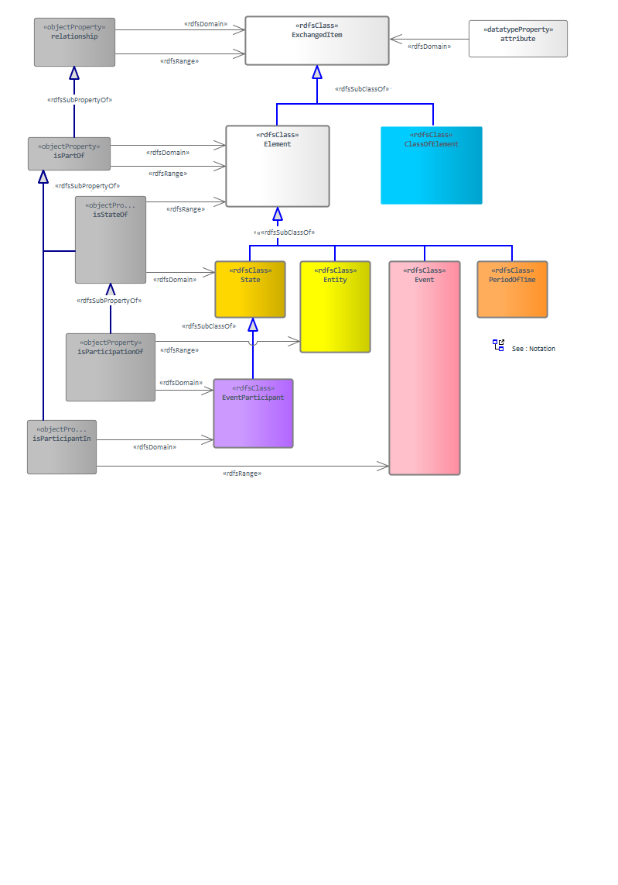

### IES elements in this diagram:

* [Entity](#f4ede167-6f5a-417d-9984-0221ccdf752c)
* [Thing](#485cbf1a-04ff-4741-8471-46a03d28c406)
* [Event](#b376370e-f5e8-4287-a3ec-ac35532919b1)
* [attribute](#4a8e5877-32df-428f-9a60-6ac3d083ffca)
* [State](#47301d66-cbd5-4d10-9481-b66966a3f3a2)
* [Element](#97edc90f-3b36-4da8-ae77-d5fdbdea2b21)
* [ClassOfElement](#3c13e07d-5796-4d03-9ebc-c75277e87ca4)
* [PeriodOfTime](#3fdfa898-c340-4279-8b3c-275359d5b02d)
* [isPartOf](#cd85d7f7-783b-4d06-b023-56dbbddc02dc)
* [isStateOf](#f7cbf87a-6ecc-4c9f-b698-fd3cf3f7980e)
* [EventParticipant](#c5ab420c-1ab6-479a-97e1-4f2fd37725cb)
* [isParticipationOf](#df9f6056-ccd4-41aa-9a86-536f6150ec25)
* [isParticipantIn](#baea86d9-c90e-4f8d-96f5-a01bb0c49711)
* [relationship](#dce662f5-7bdb-457e-ae7e-2e5fe43dba1a)

The Information Exchange Standard is based on 6 key items which are subtypes of Thing:
&nbsp;
<ul>
	<li>Element - anything physical - i.e. things that have extent in space (and time)</li>
	<li>Entity - a tangible thing like a Person, a Device, Location, etc.</li>
	<li>ClassOfElement- a class or category of Element</li>
	<li>State - a temporal state of an Entity (e.g. a moment in a Person's life, a phase of a Project, etc.) and can be of any duration</li>
	<li>Event - an activity or incident, involving one of more participating Entities, that occurred/started at a specific point in time - e.g. a meeting or a telephone call.</li>
	<li>PeriodOfTime - a specific period of time (past, present or future)</li>
	<li>relationship - relates Things.</li>
</ul>

## Relationships
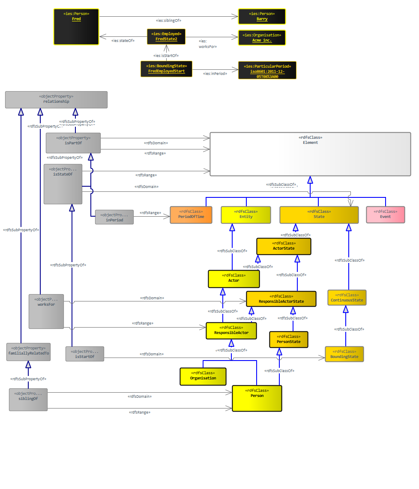

### IES elements in this diagram:

* [Event](#b376370e-f5e8-4287-a3ec-ac35532919b1)
* [Entity](#f4ede167-6f5a-417d-9984-0221ccdf752c)
* [State](#47301d66-cbd5-4d10-9481-b66966a3f3a2)
* [Element](#97edc90f-3b36-4da8-ae77-d5fdbdea2b21)
* [isStateOf](#f7cbf87a-6ecc-4c9f-b698-fd3cf3f7980e)
* [relationship](#dce662f5-7bdb-457e-ae7e-2e5fe43dba1a)
* [ResponsibleActor](#d09ede21-e862-4ec1-bc0f-045cce5454a9)
* [Person](#5d5c5b9b-5e90-4100-8353-8ee9f3d772e2)
* [Organisation](#1ecb4c6e-6a30-4dc5-a4ac-9a9df5b6a54f)
* [PeriodOfTime](#3fdfa898-c340-4279-8b3c-275359d5b02d)
* [BoundingState](#892345cd-9fa7-4982-978d-b6d3abae839c)
* [isStartOf](#d9e068b1-2a44-4523-b8fc-f9888212b35c)
* [isPartOf](#cd85d7f7-783b-4d06-b023-56dbbddc02dc)
* [inPeriod](#2f08ef25-a5c8-48ad-85e3-903db008aa19)
* [worksFor](#181aac84-26ce-4531-ac32-a73b8fd8b858)
* [ResponsibleActorState](#100b93cd-937e-4fdd-8851-02d1dc07f5b6)
* [ContinuousState](#6e5af4bb-bb7f-4387-a7bb-476b81fec103)
* [PersonState](#38f8b795-0bce-4945-8c69-8678ed935c1a)
* [familiallyRelatedTo](#3aa26ac6-206d-4b6d-bdec-c9e2b4814be7)
* [siblingOf](#a0d40c4f-b513-4c9f-8d4a-79d0fa7cef50)
* [Actor](#b2b15802-9ce9-4a9d-9de0-8289d8474e9b)
* [ActorState](#7ed8bc7c-a85f-4ed5-ac6f-d640f2df4b7b)

Relationships may exist between Things in IES - and can be used to assert anything from structural to legal connections between things. The concept of a relationship should be familiar to anyone who has looked at data model or ontology before. However, as IES4 is a 4D ontology, the relationships may only apply to a certain phase (state) of the Element - e.g. someone working for an Organisation for a period of time. Unlike attributes, the majority of relationships fall into this category. There are exceptions, such as being the sibling of someone (it's for life for both of them) but it turns out the majority are temporal. Like attributes, we create a State of the Entity instance in question and then attach the relationship to the State. 

In the example below, Fred has always been Barry's sibling and will continue to be whilst they both exist so there is no need for a State. In the second relationship, Fred worked for Acme since 5th December 2011, and is still working there because there is no end date. 

Note: in the example below, Fred still works for Acme. But if Fred had left Acme, and we didn't know when, the end BoundingState should be created to show the Employed state had ended, even though there is no associated PeriodOfTime

## Period of Time
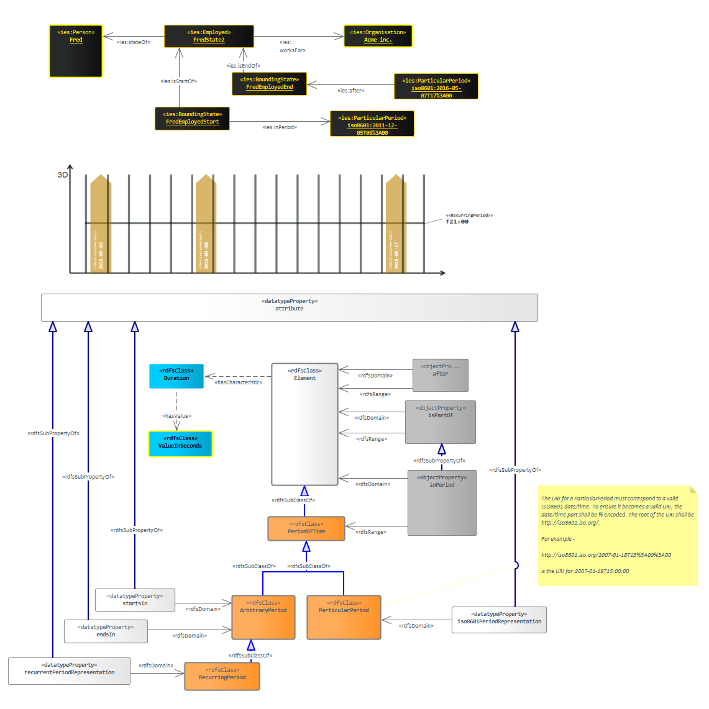

### IES elements in this diagram:

* [after](#fa4ddf04-16da-4b5c-ae9a-6ab8cd07dcdb)
* [Element](#97edc90f-3b36-4da8-ae77-d5fdbdea2b21)
* [isPartOf](#cd85d7f7-783b-4d06-b023-56dbbddc02dc)
* [inPeriod](#2f08ef25-a5c8-48ad-85e3-903db008aa19)
* [PeriodOfTime](#3fdfa898-c340-4279-8b3c-275359d5b02d)
* [RecurringPeriod](#986e66ac-9092-410b-88ad-30b86efc32dd)
* [ParticularPeriod](#2173f463-524c-457c-b106-51322f64f122)
* [Duration](#7852a5e5-8684-49f2-82ae-3368032163b1)
* [ValueInSeconds](#e485d394-b9d7-40b6-bd44-e5970b2118bd)
* [attribute](#4a8e5877-32df-428f-9a60-6ac3d083ffca)
* [ArbitraryPeriod](#68ba678c-dca8-453e-bfcc-d9fb48339d99)
* [recurrentPeriodRepresentation](#442ac7f0-ae57-4090-88d6-55a3825eceaa)
* [startsIn](#861e3d08-3659-489a-b100-0e943cf3f3f0)
* [endsIn](#6767dfcd-3fcb-42cc-bee3-9fa9a324df0b)
* [iso8601PeriodRepresentation](#e9372543-434e-45d3-a1f0-8d711952d10a)

Periods of time are Elements in a 4D ontology. They can be treated like any other element -e.g.  assembled with isPartOf relationships. This is the big advantage to a 4D ontology - time is treated the same way as space, which allows complex temporal logic information to be expressed using very simple constructs. 

IES also allows a duration to specified even when the precise start and end are not known - e.g. we can specify a meeting lasted an hour and took place on a particular day, but we don't know what time it began and ended.

Note: to prevent duplicate periods being created, the uri of each period should reflect the ISO8601 datetime in Coordinated Universal Time (encoded without punctuation). So for example, the uri for January 2008 would be http://iso8601.iso.org#200801. For ParticularPeriod, this is fairly simple. For PeriodOfTime, the ISO8601 encoding for the period should be used.

In the first example below, we show that Fred began working for Acme in 2011, and that we know he left Acme, and we're not sure of the day he left, but it was before 2016-05-07.

Technically, a PeriodOfTime is all of space, for a specific (or recurring) period (see the second example below; a space-time diagram which has 3 particular days, and a recurring 1 minute period, every day):

## Where and When

### IES elements in this diagram:

* [Entity](#f4ede167-6f5a-417d-9984-0221ccdf752c)
* [isPartOf](#cd85d7f7-783b-4d06-b023-56dbbddc02dc)
* [inLocation](#463f9b14-2d14-4364-b4f0-658a20dfcbfa)
* [inPeriod](#2f08ef25-a5c8-48ad-85e3-903db008aa19)
* [Location](#e1a494ed-d493-44ab-8bf9-abc6889d4d9a)
* [PeriodOfTime](#3fdfa898-c340-4279-8b3c-275359d5b02d)
* [Event](#b376370e-f5e8-4287-a3ec-ac35532919b1)
* [State](#47301d66-cbd5-4d10-9481-b66966a3f3a2)
* [EventParticipant](#c5ab420c-1ab6-479a-97e1-4f2fd37725cb)
* [Element](#97edc90f-3b36-4da8-ae77-d5fdbdea2b21)

Because IES4 is a 4D ontology, time and space (in fact spacetime) are handled in the same way*. If something happens entirely within a location, it is part of that location. If a person walks through a location, there is a state of them that is part of that location. Similarly, if something happens in a particular period of time, it is part of that period of time. IES4 specifies subproperties of the isPartOf relationship with slightly more intuitive names;<i> inLocation, happensIn, takesPlaceIn, inPeriod</i>, etc.

States are a key feature in all of this. States are special kinds of parts (in 4D) that are all of the space for some of the time - e.g. you yesterday, you today. They form the basis for temporal properties, participations, etc. 

<i>* Space is a relative thing - you may move around relative to other things, but the whole-life you is a single Entity instance. There are states of the that whole-life Entity that are part of different Locations though. </i>

## Start and End
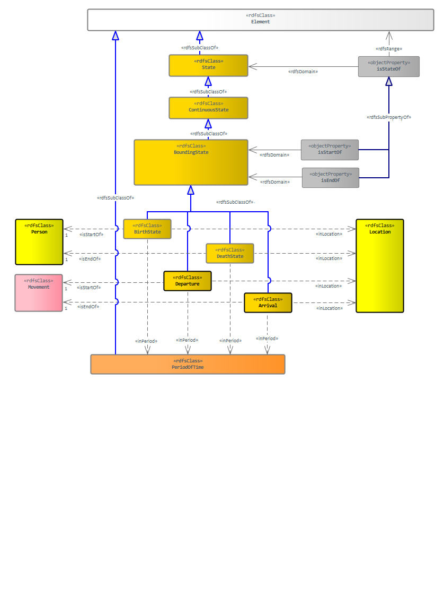

### IES elements in this diagram:

* [State](#47301d66-cbd5-4d10-9481-b66966a3f3a2)
* [BoundingState](#892345cd-9fa7-4982-978d-b6d3abae839c)
* [BirthState](#cfe53096-32fc-47c8-98ba-950ee6f988cb)
* [Departure](#0fcbda68-1b1c-40e1-9c5b-0e225ca827db)
* [DeathState](#f6173d27-d86d-40f8-a5b0-36dccf85d396)
* [Arrival](#f2c03da3-b554-4bde-a0de-efb5bee19c56)
* [Person](#5d5c5b9b-5e90-4100-8353-8ee9f3d772e2)
* [Location](#e1a494ed-d493-44ab-8bf9-abc6889d4d9a)
* [PeriodOfTime](#3fdfa898-c340-4279-8b3c-275359d5b02d)
* [ContinuousState](#6e5af4bb-bb7f-4387-a7bb-476b81fec103)
* [Movement](#95b5acc4-956a-4b29-ab9e-bdcd12ef319f)
* [Element](#97edc90f-3b36-4da8-ae77-d5fdbdea2b21)
* [isStateOf](#f7cbf87a-6ecc-4c9f-b698-fd3cf3f7980e)
* [isEndOf](#ea859d48-5ba4-40b3-a52d-1465d1765262)
* [isStartOf](#d9e068b1-2a44-4523-b8fc-f9888212b35c)

The starts and ends of Elements can be modelled using BoundingStates. A BoundingState can be connected to the Element via an <i>isStartOf </i>or and <i>isEndOf </i>relationship to indicate whether it begins or ends the Element. 

There are some special cases of BoundingStates such as BirthState, Departure, etc.

The use of BoundingStates in combination with the <i>after </i>relationship allow complex temporal logic to be expressed using very simple constructs - e.g. Elements starting before others, ending before others, etc.

## Event Linkages
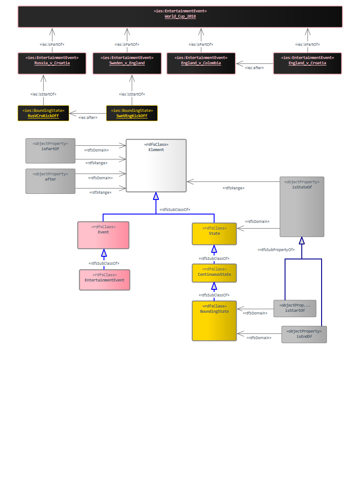

### IES elements in this diagram:

* [Element](#97edc90f-3b36-4da8-ae77-d5fdbdea2b21)
* [isPartOf](#cd85d7f7-783b-4d06-b023-56dbbddc02dc)
* [after](#fa4ddf04-16da-4b5c-ae9a-6ab8cd07dcdb)
* [Event](#b376370e-f5e8-4287-a3ec-ac35532919b1)
* [isStateOf](#f7cbf87a-6ecc-4c9f-b698-fd3cf3f7980e)
* [State](#47301d66-cbd5-4d10-9481-b66966a3f3a2)
* [BoundingState](#892345cd-9fa7-4982-978d-b6d3abae839c)
* [isStartOf](#d9e068b1-2a44-4523-b8fc-f9888212b35c)
* [isEndOf](#ea859d48-5ba4-40b3-a52d-1465d1765262)
* [ContinuousState](#6e5af4bb-bb7f-4387-a7bb-476b81fec103)
* [EntertainmentEvent](#78c33499-cd14-43cb-82ae-93a0f8cf022b)

IES 3 introduced the concept of EventLinkage - associations between Events. As of v3.2 of IES, few of these EventLinkages had been specified and those that had were covered by relationships in v4 - isPartOf and after. 

The example below shows two football matches that were part of the World Cup in 2018, and the fact that one happened (i.e. started <i>and </i>finished) before the other.

For more complex temporal logic, such as an Event <i>starting </i>before another one, the after relationship can be used between BoundingStates. In the example below, the Sweden vs England match started after the Russia V Croatia match

## Event Participation
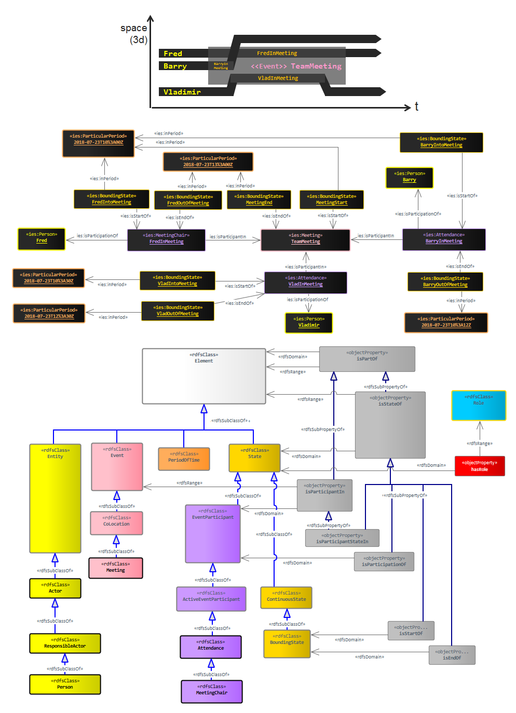

### IES elements in this diagram:

* [Entity](#f4ede167-6f5a-417d-9984-0221ccdf752c)
* [State](#47301d66-cbd5-4d10-9481-b66966a3f3a2)
* [Element](#97edc90f-3b36-4da8-ae77-d5fdbdea2b21)
* [isStateOf](#f7cbf87a-6ecc-4c9f-b698-fd3cf3f7980e)
* [EventParticipant](#c5ab420c-1ab6-479a-97e1-4f2fd37725cb)
* [isParticipationOf](#df9f6056-ccd4-41aa-9a86-536f6150ec25)
* [Event](#b376370e-f5e8-4287-a3ec-ac35532919b1)
* [isPartOf](#cd85d7f7-783b-4d06-b023-56dbbddc02dc)
* [isParticipantIn](#baea86d9-c90e-4f8d-96f5-a01bb0c49711)
* [PeriodOfTime](#3fdfa898-c340-4279-8b3c-275359d5b02d)
* [ResponsibleActor](#d09ede21-e862-4ec1-bc0f-045cce5454a9)
* [Person](#5d5c5b9b-5e90-4100-8353-8ee9f3d772e2)
* [ContinuousState](#6e5af4bb-bb7f-4387-a7bb-476b81fec103)
* [BoundingState](#892345cd-9fa7-4982-978d-b6d3abae839c)
* [isStartOf](#d9e068b1-2a44-4523-b8fc-f9888212b35c)
* [isEndOf](#ea859d48-5ba4-40b3-a52d-1465d1765262)
* [Meeting](#6445e51f-3ddf-4dcf-abdf-3ed123d53188)
* [CoLocation](#3524d10d-d9b0-416d-aded-d5aaeb99dd09)
* [ActiveEventParticipant](#3360dcc9-d39b-4280-8872-2fe122240407)
* [MeetingChair](#b499c172-310d-4c5f-ba92-93b1c7874eeb)
* [Attendance](#626d5f2c-9153-40f4-9f2a-393b6db072d3)
* [Actor](#b2b15802-9ce9-4a9d-9de0-8289d8474e9b)

Participation in Events is modelled in a similar way to temporal relationships. Just as with relationships, we care about the period of time that a participant (an Entity) was involved in an Event. A subtype of State (EventParticipant) connects the Entity to the Event.

This allows us to have many participants (Entities) in an Event, and for each of their participations to have a different start and end times. So, in the example below, we can see that Barry left the meeting after 12 minutes and that Vlad was only there for 2 of the 3 hours.

IES4 also has a subtype of EventParticipant called ActiveEventParticipant. Subtypes of this class are those participations where the participant is actively contributing to the event. Those participations that are not subtypes of ActiveEventParticipant are assumed to be passive.

The Role construct for states is inherited by EventParticipant allowing more specific roles to be defined for the EventParticipant. 

## Sometimes
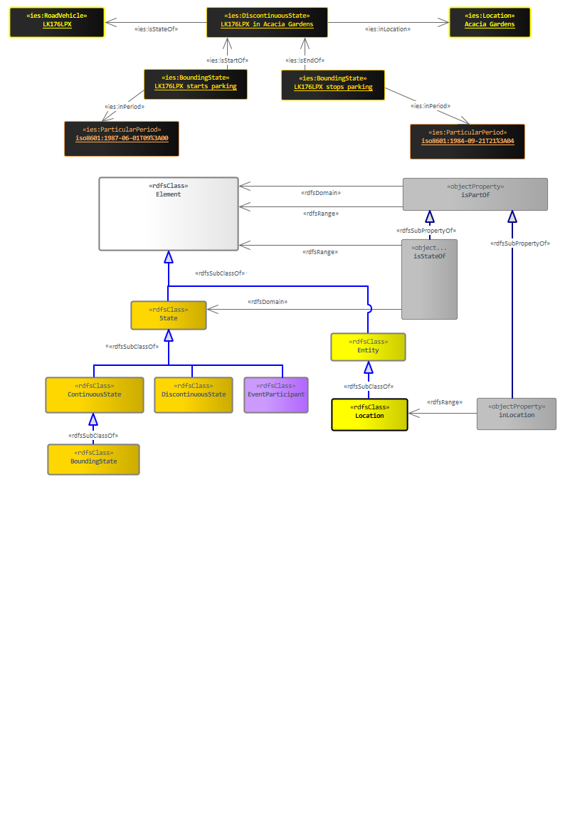

### IES elements in this diagram:

* [Element](#97edc90f-3b36-4da8-ae77-d5fdbdea2b21)
* [isPartOf](#cd85d7f7-783b-4d06-b023-56dbbddc02dc)
* [State](#47301d66-cbd5-4d10-9481-b66966a3f3a2)
* [isStateOf](#f7cbf87a-6ecc-4c9f-b698-fd3cf3f7980e)
* [Entity](#f4ede167-6f5a-417d-9984-0221ccdf752c)
* [inLocation](#463f9b14-2d14-4364-b4f0-658a20dfcbfa)
* [Location](#e1a494ed-d493-44ab-8bf9-abc6889d4d9a)
* [DiscontinuousState](#52db371e-71ac-4812-b3cf-0fd7d73f1bb0)
* [ContinuousState](#6e5af4bb-bb7f-4387-a7bb-476b81fec103)
* [BoundingState](#892345cd-9fa7-4982-978d-b6d3abae839c)
* [EventParticipant](#c5ab420c-1ab6-479a-97e1-4f2fd37725cb)

When modelling real world events, many models fail to distinguish between a specific Event or occurrence, and the more general case where something <i>usually </i>occurs. The 4D approach has an answer for this - temporally dissected states. These are like ordinary states, but are not contiguous in time. We also don't have to identify the individual occurrences, we just have to say that there are occurrences.

This is particularly useful with locations. If we want to say a vehicle is usually in a location, we don't want to have to identify every state of it when it was in that location. We can simply identify the collection of those temporally separated states, called a DiscontinuousState in IES 4. If we say that the DiscontinuousState of the car is in a location, we mean that all of the extent (which we haven't explicitly called out) is part of the location.

At first glance, this may seem contrary to the BORO mantra about always identifying the spatio-temporal extent of Elements. However, what this does allow us to identify an extent that we know exists, but we don't know the details. Like other States, we can identify the start and end times - e.g. saying a car usually parked in a particular location between one date and another.

## Types
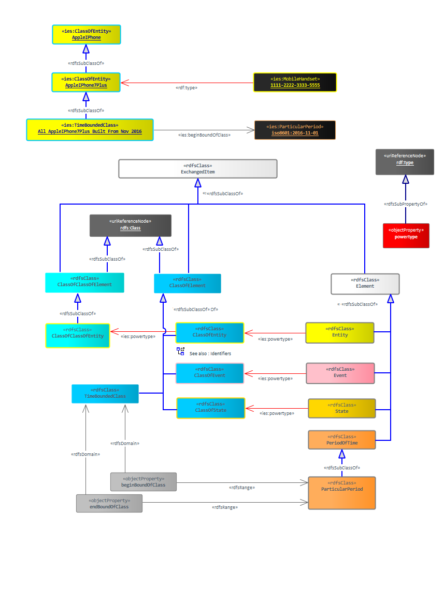

### IES elements in this diagram:

* [ClassOfClassOfEntity](#1f9ac8fe-3862-48d6-a3dc-e429b08d2b26)
* [ClassOfClassOfElement](#85305668-de1a-454a-87ee-346a221e846c)
* [Thing](#485cbf1a-04ff-4741-8471-46a03d28c406)
* [Entity](#f4ede167-6f5a-417d-9984-0221ccdf752c)
* [Event](#b376370e-f5e8-4287-a3ec-ac35532919b1)
* [ClassOfElement](#3c13e07d-5796-4d03-9ebc-c75277e87ca4)
* [Element](#97edc90f-3b36-4da8-ae77-d5fdbdea2b21)
* [ClassOfEntity](#d1b2fb30-36ca-4012-b85f-514e270bf541)
* [ClassOfEvent](#4ea194c6-bbf9-45ab-85de-5802d8c3a531)
* [powertype](#d4bd48e8-76b8-4d3c-ab83-e653db89170d)
* [TimeBoundedClass](#e7a659a5-9059-4ea5-8fab-8a29afc47d9a)
* [PeriodOfTime](#3fdfa898-c340-4279-8b3c-275359d5b02d)
* [ParticularPeriod](#2173f463-524c-457c-b106-51322f64f122)
* [beginBoundOfClass](#2c441f0a-635d-41ef-b8cc-96aa07958f8e)
* [endBoundOfClass](#f8109922-1cb1-490d-bbb5-fd5b76e19fd1)
* [State](#47301d66-cbd5-4d10-9481-b66966a3f3a2)
* [ClassOfState](#0358ddab-d22c-4ee5-8f9a-cf18f3e432bd)
* [MobileHandset](#3bf8fc71-64bd-4fb5-befd-d7fcb936fa12)

IES4 allows new types (classes, categories, sets, whatever you want to call them) to be exchanged in the data payload. To do this, we "push up" a type level using the powertype relationship which formally specifies that one class is the set of all possible subsets of the other (see wikipedia entry for "powerset" and "Cantor's theorem"). 

<b>ClassOfEntity </b>is explicitly specialised for use in representation and identifiers, but otherwise <b>ClassOfEntity </b>and <b>ClassOfEvent </b>replace the old GeneralConcept Entity in IES3.

Hierarchies of <b>ClassOfElement </b>can be built using the <i>rdfs:subClassOf </i>relationship. Instances of the <b>ClassOfElement </b>can be asserted using <i>rdf:type</i>. See example below:

## Representation and Content
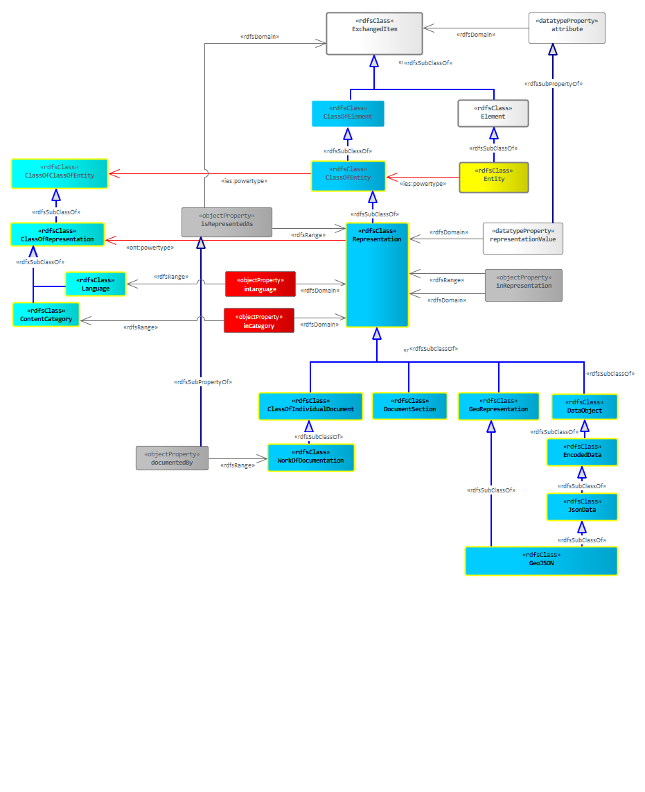

### IES elements in this diagram:

* [Thing](#485cbf1a-04ff-4741-8471-46a03d28c406)
* [Entity](#f4ede167-6f5a-417d-9984-0221ccdf752c)
* [ClassOfElement](#3c13e07d-5796-4d03-9ebc-c75277e87ca4)
* [Element](#97edc90f-3b36-4da8-ae77-d5fdbdea2b21)
* [ClassOfEntity](#d1b2fb30-36ca-4012-b85f-514e270bf541)
* [Representation](#675a5c23-0746-43d0-96d0-af0df72cd697)
* [WorkOfDocumentation](#f0b48978-d4e4-45a4-8238-091a5b714d82)
* [isRepresentedAs](#d106a0a9-55c4-454f-9e20-35ba54114036)
* [attribute](#4a8e5877-32df-428f-9a60-6ac3d083ffca)
* [representationValue](#ae00f1de-f42b-4fc0-b07b-21f754f16fd4)
* [ClassOfIndividualDocument](#ccc8fa06-cda8-491d-bffc-0a88d6a565b1)
* [documentedBy](#ac7c948a-f19c-4296-ac38-0fee6a4c5e90)
* [ClassOfClassOfEntity](#1f9ac8fe-3862-48d6-a3dc-e429b08d2b26)
* [ContentCategory](#8ca5551a-eaeb-4145-a75f-2e7d7dad5a57)
* [inCategory](#d10b4b95-5bf1-4e3f-a2a8-8f52f045c31a)
* [inRepresentation](#7238489d-6802-4733-9f7f-9b31d02b3c81)
* [GeoRepresentation](#a8c07233-5d62-4ad4-b405-2d15cfc37497)
* [ClassOfRepresentation](#4ffeb84d-b823-4829-9a3a-ade51ef0f0f5)
* [Language](#82652ff5-258f-459c-bc7f-6dac65e1eca1)
* [inLanguage](#ff902f8e-6b22-4f17-9c16-48543251d22e)
* [DocumentSection](#19fe20ba-d898-46d4-8916-3e73bc059d54)
* [EncodedData](#8af1db0b-9beb-4a33-a459-7ef2be309e81)
* [GeoJSON](#417c1f4e-6a5d-4631-b275-8e982252791a)
* [DataObject](#cac97eb4-e0e8-4576-9637-1fbed5f9fef2)
* [JsonData](#6a9a065c-a31a-42be-b7e2-275f076dca9d)

IES distinguished between things in the real world and our representations of them. In this case, a Representation is not a PhysicalThing (see Document for the distinction). Representations may be documents, videos, blog text, etc. The represents relationship links Things to their Representations.

Sometimes it is important to establish arbitrary categories of Representation - such as "financial accounts", "pictures of kittens" or "educational films". ContentCategory is used to collect together all Representations of similar content.

## Identifiers
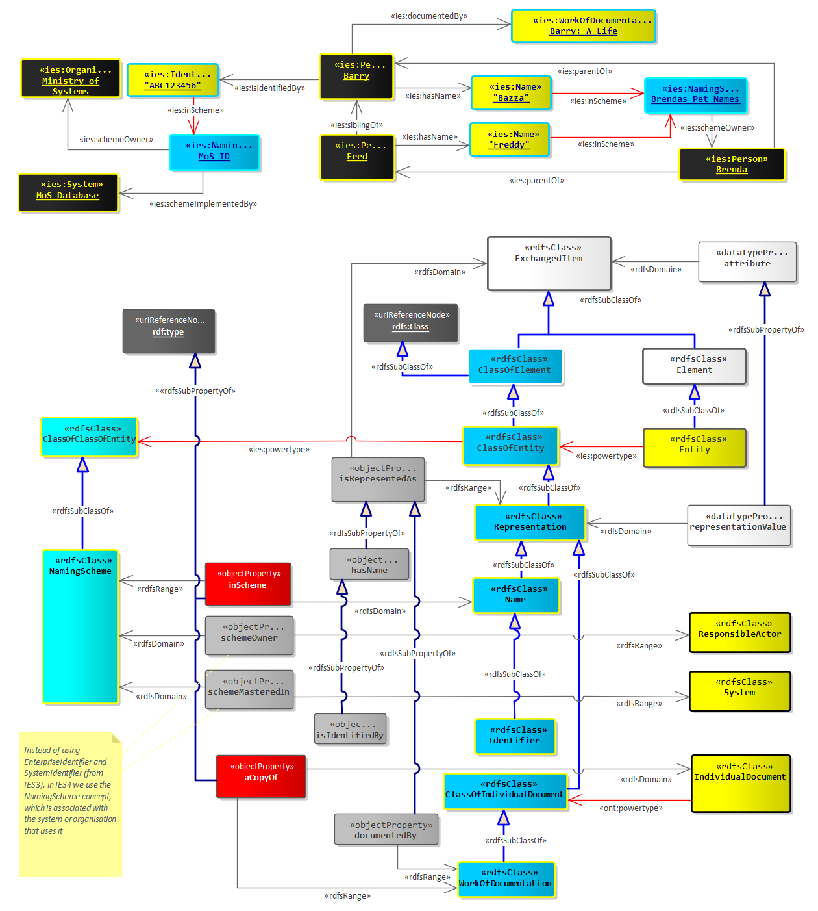

### IES elements in this diagram:

* [Thing](#485cbf1a-04ff-4741-8471-46a03d28c406)
* [Entity](#f4ede167-6f5a-417d-9984-0221ccdf752c)
* [ClassOfElement](#3c13e07d-5796-4d03-9ebc-c75277e87ca4)
* [Element](#97edc90f-3b36-4da8-ae77-d5fdbdea2b21)
* [ClassOfEntity](#d1b2fb30-36ca-4012-b85f-514e270bf541)
* [Representation](#675a5c23-0746-43d0-96d0-af0df72cd697)
* [Identifier](#315e6ad3-f2da-4f69-864f-da2b95121e2e)
* [Name](#7d7cc966-56eb-4220-a650-a993e598f2e2)
* [WorkOfDocumentation](#f0b48978-d4e4-45a4-8238-091a5b714d82)
* [isRepresentedAs](#d106a0a9-55c4-454f-9e20-35ba54114036)
* [attribute](#4a8e5877-32df-428f-9a60-6ac3d083ffca)
* [representationValue](#ae00f1de-f42b-4fc0-b07b-21f754f16fd4)
* [ResponsibleActor](#d09ede21-e862-4ec1-bc0f-045cce5454a9)
* [ClassOfClassOfEntity](#1f9ac8fe-3862-48d6-a3dc-e429b08d2b26)
* [NamingScheme](#222534a5-25c8-4ecd-be55-27da1534d402)
* [inScheme](#7eb9fe85-127c-4918-ac56-62e1be1de825)
* [schemeOwner](#8d42b4a8-30d3-459d-a729-f5c8fe16d418)
* [schemeMasteredIn](#c2c5ff87-189c-478a-b3bf-4706d798087f)
* [System](#f682a265-1afe-4287-a9cd-0d4c83f54c52)
* [IndividualDocument](#0f327324-6b4e-40b1-b96b-97a334ba5e4a)
* [ClassOfIndividualDocument](#ccc8fa06-cda8-491d-bffc-0a88d6a565b1)
* [aCopyOf](#22d9054c-ae5c-4afe-99d9-3c9d65c86cb9)
* [isIdentifiedBy](#fba54eef-91bf-4ba2-8b67-79c899963149)
* [hasName](#c3a36e36-0c73-4af7-88e3-81c9243ce456)
* [documentedBy](#ac7c948a-f19c-4296-ac38-0fee6a4c5e90)

IES4 distinguishes between things in the real world and representations of those things. The representation pattern allows any <b>Thing</b> to have multiple representations - e.g. a book about the Ministry Of Defence, the DUNS number for the Ministry Of Defence, etc. 

Representations specialise into <b>WorksOfDocumentation </b>(see Document diagram in Entities section), <b>Name</b>s, and <b>Identifier</b>s. <b>Name</b>s and<b> Identifier</b>s belong to <b>NamingScheme</b>s - this allows us to give context when an <b>Element </b>has more than one <b>Name </b>or <b>Identifier</b>. <b>NamingScheme</b>s may be implemented in <b>System</b>s and used by <b>Organisation</b>s. This replaces the idea of EnterpriseIdentity and SystemIdentity in IES3

## Characteristics and Measures
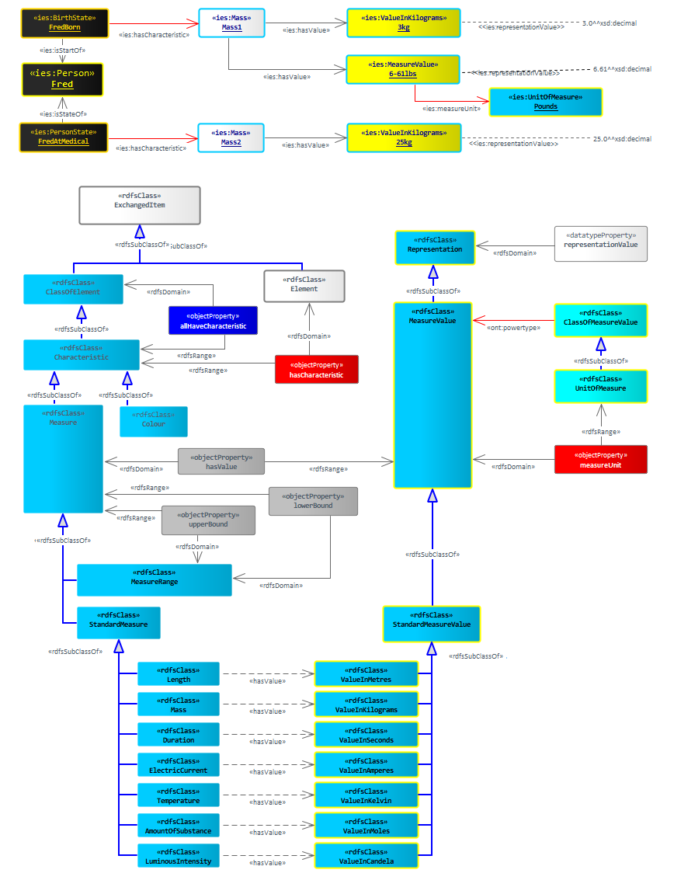

### IES elements in this diagram:

* [Thing](#485cbf1a-04ff-4741-8471-46a03d28c406)
* [Element](#97edc90f-3b36-4da8-ae77-d5fdbdea2b21)
* [ClassOfElement](#3c13e07d-5796-4d03-9ebc-c75277e87ca4)
* [Characteristic](#a7f266e8-b1cb-4b9b-8af1-1ef2a7d8f5ee)
* [Colour](#b10d22fb-1d6a-47c9-b1c0-e870d43a5c52)
* [StandardMeasure](#c441de5b-739a-4a83-be87-96bc63a530b3)
* [MeasureValue](#3693b7de-dce7-4bf9-bc2a-a8914da4a11e)
* [Length](#5c21de93-329f-4209-87ff-19610cb0d367)
* [Mass](#ae8fc416-9650-472d-99c6-f0a46b7359eb)
* [Duration](#7852a5e5-8684-49f2-82ae-3368032163b1)
* [ElectricCurrent](#9442c4e6-a52b-4c93-b942-8b93d90b3b14)
* [measureUnit](#161079f3-8089-4124-a67a-5d6a7a4ea511)
* [ValueInKilograms](#e7a9bc2d-85e2-4999-90dc-b76c9cb57c42)
* [Representation](#675a5c23-0746-43d0-96d0-af0df72cd697)
* [hasCharacteristic](#720d0aa3-81f7-4220-a7a5-34304e33b72f)
* [allHaveCharacteristic](#81a1e70d-6adb-4843-bca6-c0a710e7716b)
* [representationValue](#ae00f1de-f42b-4fc0-b07b-21f754f16fd4)
* [MeasureRange](#ccbbf963-eb27-40d5-be9f-47cdf4d352f8)
* [upperBound](#d700fe64-4100-4ade-93ce-6219a7bc0bcb)
* [lowerBound](#96717346-1df4-4eae-a7cf-e389b4454b47)
* [hasValue](#8fd84185-a7ce-4d5d-974b-55f693c4376d)
* [Temperature](#3feb0bb0-f127-431a-b117-cc986b11d61a)
* [AmountOfSubstance](#324d0329-1299-45cc-92a5-270134e66512)
* [LuminousIntensity](#8431c546-b6f9-406f-9ecd-383fe985d115)
* [Measure](#6cf79fce-e2c9-4e8b-848c-39bd8616f77d)
* [ClassOfMeasureValue](#4520a91c-d956-46c1-9a81-93c4c0b12880)
* [UnitOfMeasure](#9f2de0f4-58b1-46b7-b25a-545d765381a8)
* [StandardMeasureValue](#773272f0-dbab-4c47-8e21-01171fc82245)
* [ValueInMetres](#c8d4c3cb-16c2-44a7-b709-35cebf219bf0)
* [ValueInCandela](#391f91e4-768f-406c-a344-cc3331abe2ac)
* [ValueInSeconds](#e485d394-b9d7-40b6-bd44-e5970b2118bd)
* [ValueInAmperes](#0c682ba6-23ab-459c-b8ff-a114aa27650b)
* [ValueInKelvin](#32097c4d-a0fb-4024-bdb8-8e899ddcf217)
* [ValueInMoles](#943ca047-f259-4181-bf04-f6d54065aad4)
* [isRepresentedAs](#d106a0a9-55c4-454f-9e20-35ba54114036)

IES provides a basic set of classes for characteristics and measures. Characteristics are properties of Elements that are qualitative, Measures are quantitative. To support Measures, IES provides classes for all the SI units, a model for units of measure and an ability to specify measure ranges. 

The key points about this model are that the Measure is separate from its representation so the same measure can have more than value with different units of measure (e.g. 1kg and 2.2lbs). 

Characteristics and measures can be applied to an Element, or to a ClassOfElement in the case where all instances of the ClassOfElement share the same characteristic or measure - e.g. all London buses being red. 

This model is new in IES 4.1 - previously, there was no consistent way to do this, but mostly it relied on attributes.

## Disposition
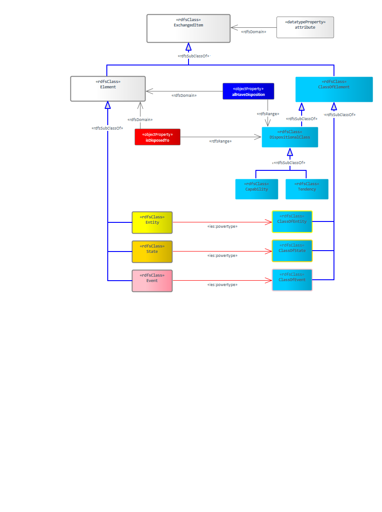

### IES elements in this diagram:

* [Entity](#f4ede167-6f5a-417d-9984-0221ccdf752c)
* [Thing](#485cbf1a-04ff-4741-8471-46a03d28c406)
* [Event](#b376370e-f5e8-4287-a3ec-ac35532919b1)
* [attribute](#4a8e5877-32df-428f-9a60-6ac3d083ffca)
* [State](#47301d66-cbd5-4d10-9481-b66966a3f3a2)
* [Element](#97edc90f-3b36-4da8-ae77-d5fdbdea2b21)
* [ClassOfElement](#3c13e07d-5796-4d03-9ebc-c75277e87ca4)
* [DispositionalClass](#2855af50-eee4-4ced-b499-ae42423a4de3)
* [ClassOfEntity](#d1b2fb30-36ca-4012-b85f-514e270bf541)
* [ClassOfEvent](#4ea194c6-bbf9-45ab-85de-5802d8c3a531)
* [ClassOfState](#0358ddab-d22c-4ee5-8f9a-cf18f3e432bd)
* [Capability](#91d62f08-ed05-4558-9321-368712a34a30)
* [isDisposedTo](#b093f8da-ae08-4819-8e1c-f119ef212566)
* [Tendency](#2b451601-ec1d-4bd4-a782-6e0b7e0d416d)
* [allHaveDisposition](#6f8504e0-e03c-43fa-aa81-c3341ca551e3)

A disposition is about an Element's capability or tendency to do something or to exhibit a property. It may be that the Element has never actually done the thing it is capable of - e.g. an aircraft capable of Mach 2 but that has not yet flown that fast. Similarly, a Person may be assessed as having a tendency towards violence based just on what they say and threaten to do, but may not have actually been violent.

Dispositions are managed in IES using DispositionalClass - something that was also in the international IDEAS ontology where capability was a key concept they had to model. Dispositional classes collect together all Elements that share the same disposition (e.g. all aircraft capable of Mach 2). 

## Replaceable Parts
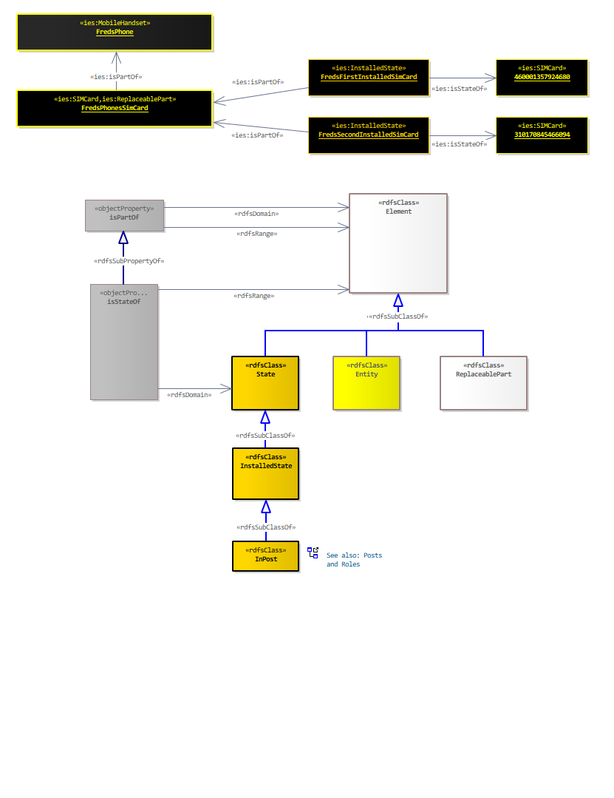

### IES elements in this diagram:

* [Element](#97edc90f-3b36-4da8-ae77-d5fdbdea2b21)
* [Entity](#f4ede167-6f5a-417d-9984-0221ccdf752c)
* [State](#47301d66-cbd5-4d10-9481-b66966a3f3a2)
* [ReplaceablePart](#624d6cd1-31d9-46db-b42d-56dad35babd8)
* [InstalledState](#6b36c428-3a86-493e-9b3b-6d394c567577)
* [InPost](#6c1949b5-b86b-4940-8912-9008ccd67150)
* [isPartOf](#cd85d7f7-783b-4d06-b023-56dbbddc02dc)
* [isStateOf](#f7cbf87a-6ecc-4c9f-b698-fd3cf3f7980e)

Understanding a thing's parts can be straight-forward at any given time, however that is complicated by changes over time. For example, a car�s components, like its gearbox or tyres, can be replaced when worn. When we replace a car�s tyre, it remains the same car, just with a different tyre. BORO and 4D thinking clarifies this: the extent of the car contains a temporal part of one tyre followed by the temporal part of another tyre. At any one time, the car overlaps with only one tyre; but, over time, it overlaps with two tyres. The two tyres have <b>InstalledStates</b> that are parts of the car.

Sometimes it is useful to call out the enduring part of an Element e.g. the tyre of a car whichever actual tyre is installed at a given time. This is what we call a <b>ReplaceablePart</b>.<b> </b>A replaceable part can be substituted or exchanged without altering the overall identity or functionality. Moreover, the identity of a <b>ReplaceablePart</b> can survive periods when nothing fulfils its purpose or role, i.e. its existence is not necessarily continuous.

In IES, we instantiate this enduring, replaceable part as both a <b>ReplaceablePart</b> and the class of Element that is intended to be installed into it. For example, the replaceable tyre part of a car is instantiated as both a <b>ReplaceablePart</b> and a Tyre.

## Stuff and Count
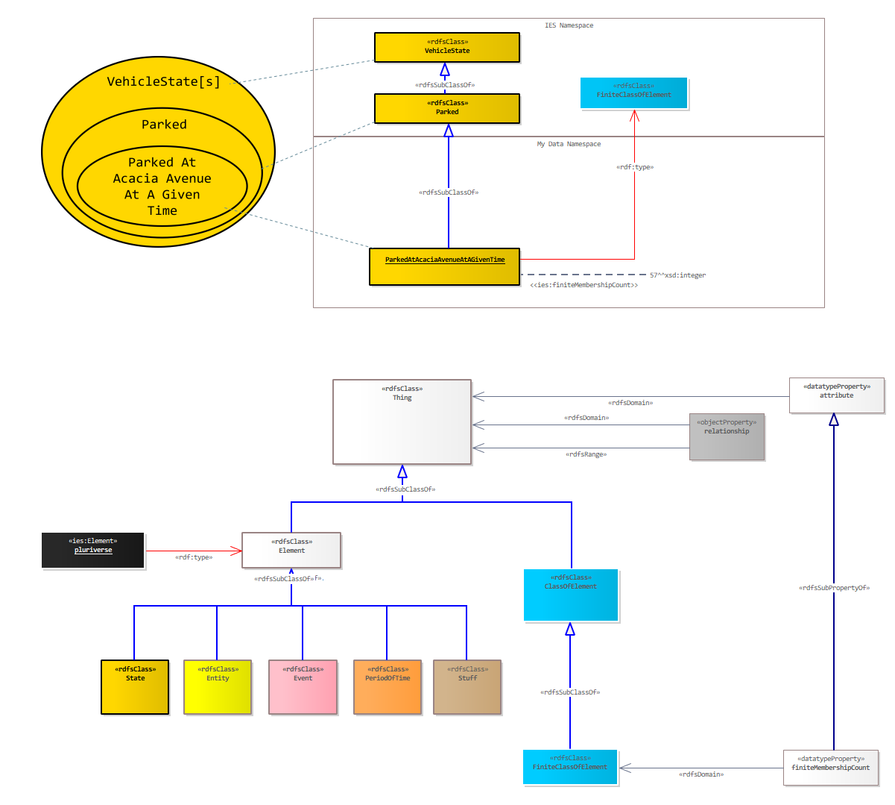

### IES elements in this diagram:

* [Element](#97edc90f-3b36-4da8-ae77-d5fdbdea2b21)
* [ClassOfElement](#3c13e07d-5796-4d03-9ebc-c75277e87ca4)
* [relationship](#dce662f5-7bdb-457e-ae7e-2e5fe43dba1a)
* [Stuff](#cc9e60ac-b3c8-4c9b-b657-2734538ae2b9)
* [Entity](#f4ede167-6f5a-417d-9984-0221ccdf752c)
* [Event](#b376370e-f5e8-4287-a3ec-ac35532919b1)
* [State](#47301d66-cbd5-4d10-9481-b66966a3f3a2)
* [PeriodOfTime](#3fdfa898-c340-4279-8b3c-275359d5b02d)
* [Thing](#485cbf1a-04ff-4741-8471-46a03d28c406)
* [Parked](#b6a503e5-3fc4-4a45-8dc0-994ea31a895a)
* [VehicleState](#d3275233-7381-483e-b2d2-77f13d73a52e)
* [attribute](#4a8e5877-32df-428f-9a60-6ac3d083ffca)
* [finiteMembershipCount](#ff3ddc24-010c-4cd2-bf97-7464eaf45317)
* [FiniteClassOfElement](#06bac6f4-f6b2-4be1-95c5-8e31c34796cb)

There are times where we want to talk about sets of elements without having to instantiate every individual element as an instance. Instead, we want to just provide a count of the members of the set e.g. the number of cars in the set parked at Acacia Avenue. Such sets are instances of <b>FiniteClassOfElement</b> where the count is provided using the attribute <b>finiteMembershipCount</b>. 

In the illustrated example, to get the set of cars parked at Acacia Avenue, we create a subClassOf of the set of all parked cars, <b>Parked</b>. This gives us a specific subset of cars parked at Acacia Avenue at a time. This subclass is also an instance of <b>FiniteClassOfElement</b> allowing us to assign <i>57</i> as its <b>finiteMembershipCount</b>.

There are physically things in the world that are difficult to call out as separate individuals due to their high divisibility. For example, water in a swimming pool, sand on a beach or the walls and floors of a building. <b>Stuff</b> allows us to talk about these highly divisible or generally uncountable things.

## Attributes
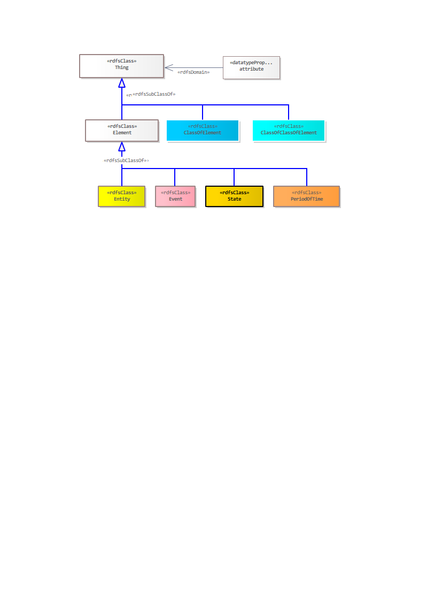

### IES elements in this diagram:

* [Thing](#485cbf1a-04ff-4741-8471-46a03d28c406)
* [attribute](#4a8e5877-32df-428f-9a60-6ac3d083ffca)
* [Element](#97edc90f-3b36-4da8-ae77-d5fdbdea2b21)
* [ClassOfClassOfElement](#85305668-de1a-454a-87ee-346a221e846c)
* [Entity](#f4ede167-6f5a-417d-9984-0221ccdf752c)
* [State](#47301d66-cbd5-4d10-9481-b66966a3f3a2)
* [PeriodOfTime](#3fdfa898-c340-4279-8b3c-275359d5b02d)
* [ClassOfElement](#3c13e07d-5796-4d03-9ebc-c75277e87ca4)
* [Event](#b376370e-f5e8-4287-a3ec-ac35532919b1)

Attributes can be applied to any Exchanged Item - Entities, Events and ClassOfEntity.

Attributes are RDF properties (actually, OWL datatype properties), typed by any XML Schema simple datatype - e.g. xsd:string, xsd:double, xsd:dateTime, etc. (refer to W3C XML Schema specification for complete list).

Attributes are not as widely used in IES4 as in IES3 where they were used for measures, identifiers and names. In IES4 they are only used for categorical statements - e.g. the purpose of a mission, the amount of currency, etc.

## Source References
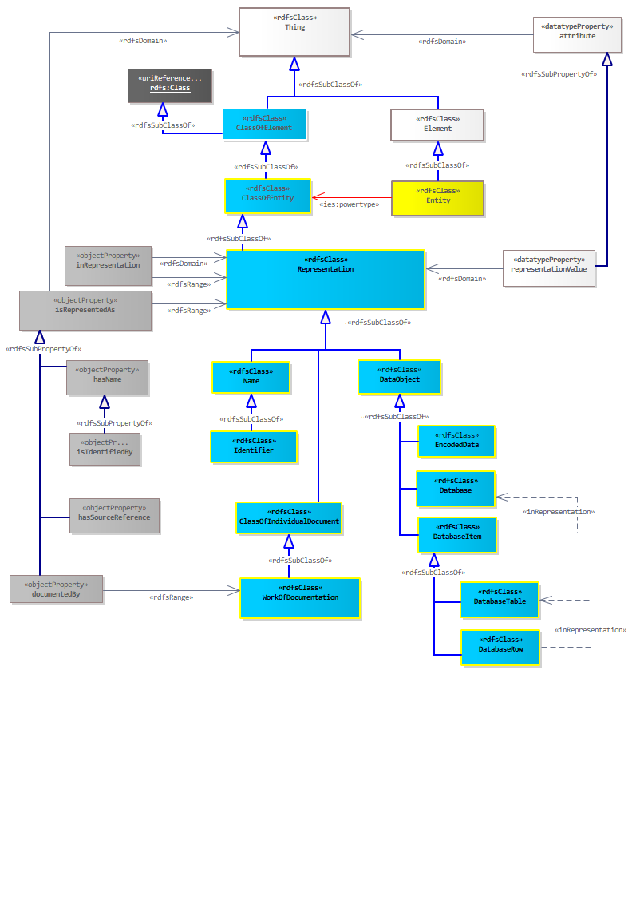

### IES elements in this diagram:

* [Thing](#485cbf1a-04ff-4741-8471-46a03d28c406)
* [Entity](#f4ede167-6f5a-417d-9984-0221ccdf752c)
* [ClassOfElement](#3c13e07d-5796-4d03-9ebc-c75277e87ca4)
* [Element](#97edc90f-3b36-4da8-ae77-d5fdbdea2b21)
* [ClassOfEntity](#d1b2fb30-36ca-4012-b85f-514e270bf541)
* [Representation](#675a5c23-0746-43d0-96d0-af0df72cd697)
* [Identifier](#315e6ad3-f2da-4f69-864f-da2b95121e2e)
* [Name](#7d7cc966-56eb-4220-a650-a993e598f2e2)
* [WorkOfDocumentation](#f0b48978-d4e4-45a4-8238-091a5b714d82)
* [isRepresentedAs](#d106a0a9-55c4-454f-9e20-35ba54114036)
* [attribute](#4a8e5877-32df-428f-9a60-6ac3d083ffca)
* [representationValue](#ae00f1de-f42b-4fc0-b07b-21f754f16fd4)
* [ClassOfIndividualDocument](#ccc8fa06-cda8-491d-bffc-0a88d6a565b1)
* [isIdentifiedBy](#fba54eef-91bf-4ba2-8b67-79c899963149)
* [hasName](#c3a36e36-0c73-4af7-88e3-81c9243ce456)
* [documentedBy](#ac7c948a-f19c-4296-ac38-0fee6a4c5e90)
* [DataObject](#cac97eb4-e0e8-4576-9637-1fbed5f9fef2)
* [Database](#3099b032-4b0a-4aec-abcd-3e862c4c1979)
* [DatabaseTable](#d9e56caa-4668-4248-b087-c041363816dd)
* [DatabaseItem](#73f8d96c-a9ec-4301-9968-0f7bf9826c45)
* [inRepresentation](#7238489d-6802-4733-9f7f-9b31d02b3c81)
* [DatabaseRow](#1f23eb62-323b-402d-84bd-b4d417ed1a73)
* [hasSourceReference](#16480e86-9fe4-4b37-acfb-9e410f190664)
* [EncodedData](#8af1db0b-9beb-4a33-a459-7ef2be309e81)

The IES3 Source Reference capability is maintained in IES4, but leverages the Representation pattern to achieve the same thing. The key relationship here is hasSourceReference  which links the Representation (Document, DataObject, etc.) to the Thing it was the source for.

Representations can be assembled into structures using the inRepresentation relationship.

<i>Note: As IES4 is modelled in RDF Schema, the data will be RDF (encoded as TTL, JSON, XML, etc.). Referring to relationships (i.e. triples) in RDF involves using the RDF reification pattern, so if sourceReferenceFor is to relate to an attribute or relationship then RDF reification is the approach that shall be used.</i>

## Payloads and Groups
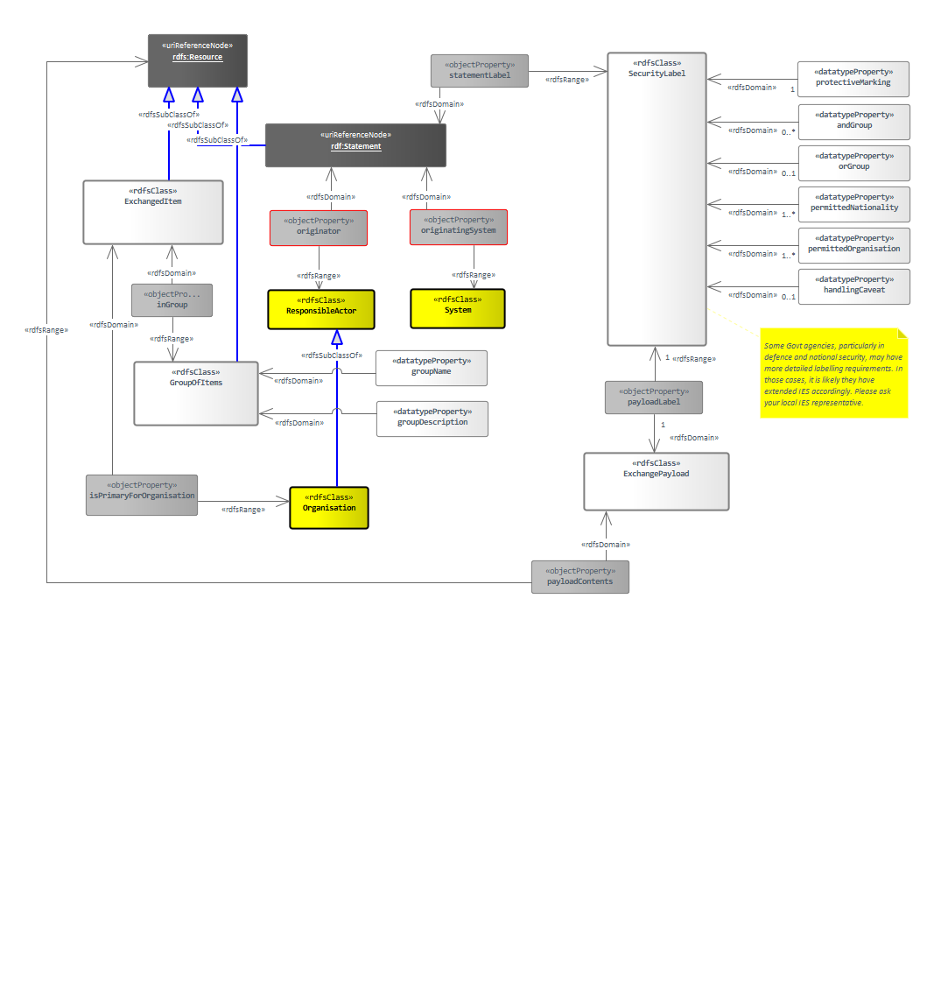

### IES elements in this diagram:

* [Organisation](#1ecb4c6e-6a30-4dc5-a4ac-9a9df5b6a54f)
* [SecurityLabel](#ced628e4-8641-486b-bcd7-cb4e147e7ae6)
* [payloadLabel](#259167e4-d0b3-4f03-9653-cad778f5f6f3)
* [protectiveMarking](#7e5590f8-b142-49d8-8fb0-414716cf9f16)
* [andGroup](#1326576a-6240-47b0-aed7-5f3fc4e3884d)
* [orGroup](#71249792-e0af-4f98-86ed-17115f1734a7)
* [permittedNationality](#fa623989-b6a4-40e2-a956-b8ffea478895)
* [permittedOrganisation](#90f3e89d-1456-41fe-9354-4e13c4d79564)
* [handlingCaveat](#1c02b06e-3159-48f6-9575-64b62765498b)
* [statementLabel](#7ec7fcee-7c60-4233-8938-d6320bd951f2)
* [Thing](#485cbf1a-04ff-4741-8471-46a03d28c406)
* [GroupOfItems](#04c2111a-d958-4a95-9271-7208b849ddd8)
* [inGroup](#c21d2ca2-6f42-4b7c-9092-8b8c5b7baf9f)
* [groupName](#42463865-450c-4a9a-9ef0-5322222c2b97)
* [groupDescription](#2f618a01-5d5f-483c-8652-8b81196aa086)
* [ExchangePayload](#749b002e-37b1-4754-b3b2-96642b3cf4a7)
* [ResponsibleActor](#d09ede21-e862-4ec1-bc0f-045cce5454a9)
* [System](#f682a265-1afe-4287-a9cd-0d4c83f54c52)
* [originator](#4978d7f3-e686-4b30-9356-f0c4dc7a158d)
* [originatingSystem](#d4a003a3-7fef-409c-8935-743cd97299e7)
* [isPrimaryForOrganisation](#d6974f5e-b24c-4a06-9ac1-db6299e9bf55)
* [payloadContents](#10deb6b8-80cc-4bfc-b10f-1830b559c21f)

IES3 had the concept of an <b>ExchangePayload </b>object to which all the Things and Groups were attached. In reality, there was only ever one payload in a file, so in IES4, whilst the <b>ExchangePayload </b>class is kept, it is simply an object in the RDF file to which meta-data about the whole file can be attached. The concept of <b>GroupOfItems </b>is retained from IES3.

It is sometimes important to specify the origins (organisation, system, etc.) of certain information. This is achieved using the <i>originator </i>and <i>originatingSystem </i>which link <b>rdf:Resource</b>s (i.e. anything) to their origin. These can be applied to GroupsOfItems also, but care must be taken not to put the same <b>Thing</b> in different <b>GroupOfItem </b>instances that have <i>originator </i>or <i>originatingSystem </i>properties linked to them. If the source of a relationship (triple) has to be specified, the originator and originatingSystem properties can be applied to rdf:Statement (see RDF documentation on reification).

## Metadata
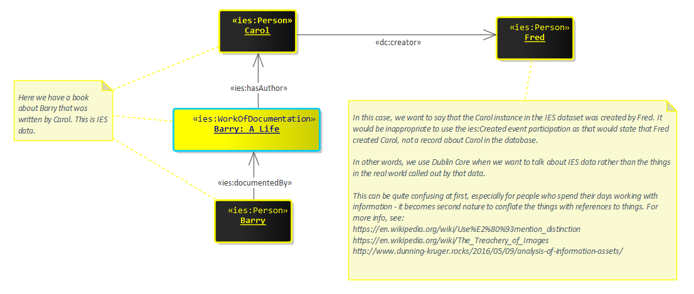

### IES elements in this diagram:

IES has classes for dealing with documents, and for dealing with representation of objects in a lot of different ways. However, when it comes to specifying meta-data about IES instances - e.g. who created, when it was created, etc. - the Dublin Code metadata standard is to be used.

The fact that IES has its own document referencing capability <i>and</i> Dublin Core may seem a little confusing. The example below attempts to clear this. 

## Entities

### Amount of Money
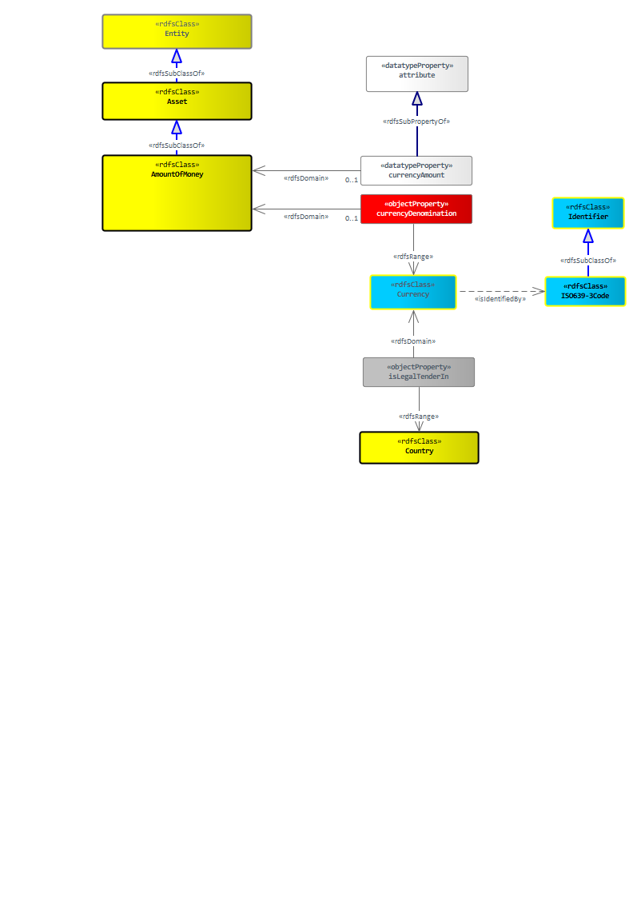

#### IES elements in this diagram:

* [attribute](#4a8e5877-32df-428f-9a60-6ac3d083ffca)
* [Entity](#f4ede167-6f5a-417d-9984-0221ccdf752c)
* [AmountOfMoney](#0df94de5-68b7-45b4-a106-a11ce06c31b8)
* [currencyDenomination](#ae8a5533-9c08-46e7-8131-e3d119f6aae3)
* [currencyAmount](#c53f62d0-0817-404b-9624-95a89d94f9a2)
* [Asset](#40231334-5acc-4dd4-a8c1-05012e2170e0)
* [Currency](#a06ee74f-9a66-4b63-8dc3-3b1c2b362862)
* [Identifier](#315e6ad3-f2da-4f69-864f-da2b95121e2e)
* [Country](#92eba9b9-48c2-4082-9fe5-603977bd6846)
* [isLegalTenderIn](#2415b865-3c37-4595-9f38-11075eab5d34)
* [ISO4217Code](#598acbb6-df51-4bd9-a5dd-52ede1895327)

This part of IES deals with  specific amounts of a given currency

### Assets
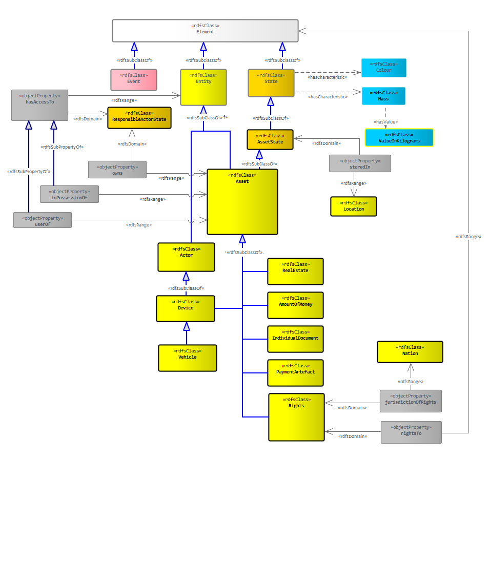

#### IES elements in this diagram:

* [Mass](#ae8fc416-9650-472d-99c6-f0a46b7359eb)
* [Actor](#b2b15802-9ce9-4a9d-9de0-8289d8474e9b)
* [Entity](#f4ede167-6f5a-417d-9984-0221ccdf752c)
* [Asset](#40231334-5acc-4dd4-a8c1-05012e2170e0)
* [AssetState](#ca196722-9531-4eb4-a8cf-b9a5145cdcfd)
* [State](#47301d66-cbd5-4d10-9481-b66966a3f3a2)
* [IndividualDocument](#0f327324-6b4e-40b1-b96b-97a334ba5e4a)
* [PaymentArtefact](#9882d901-1b22-4b89-81d1-031f840a20d0)
* [Vehicle](#3b916f09-f3f4-43e9-9c84-99009c685396)
* [AmountOfMoney](#0df94de5-68b7-45b4-a106-a11ce06c31b8)
* [Device](#115f2f9b-21f3-4903-8eaa-ab3aefe97461)
* [RealEstate](#8e0df17f-34ee-43c6-8da4-30f698384fd3)
* [Location](#e1a494ed-d493-44ab-8bf9-abc6889d4d9a)
* [owns](#fdd94d9f-f343-4c1b-9688-752c896a3c7c)
* [ResponsibleActorState](#100b93cd-937e-4fdd-8851-02d1dc07f5b6)
* [inPossessionOf](#0a28624b-c5e3-461e-b84a-e55b550b5dd6)
* [userOf](#01984617-c96d-48b3-acde-25f525719aef)
* [hasAccessTo](#cb7f872f-7999-4bfd-8274-2c0e0afe22ab)
* [ValueInKilograms](#e7a9bc2d-85e2-4999-90dc-b76c9cb57c42)
* [Colour](#b10d22fb-1d6a-47c9-b1c0-e870d43a5c52)
* [Rights](#487778e0-4bd7-4d9a-b7f7-63731478e1a2)
* [Nation](#6ae6f8a5-f427-4ea6-babd-5720f07430f5)
* [jurisdictionOfRights](#62ef76b2-4ab0-4e1e-98c4-61c3a85bf980)
* [Element](#97edc90f-3b36-4da8-ae77-d5fdbdea2b21)
* [Event](#b376370e-f5e8-4287-a3ec-ac35532919b1)
* [rightsTo](#04a80ef0-8e34-4bdb-8a8e-31d89028f9b6)

Assets are Entities that are either man-made or whose extent is defined in such a way as to specify ownership - e.g. a parcel of real estate.

### Communications Account
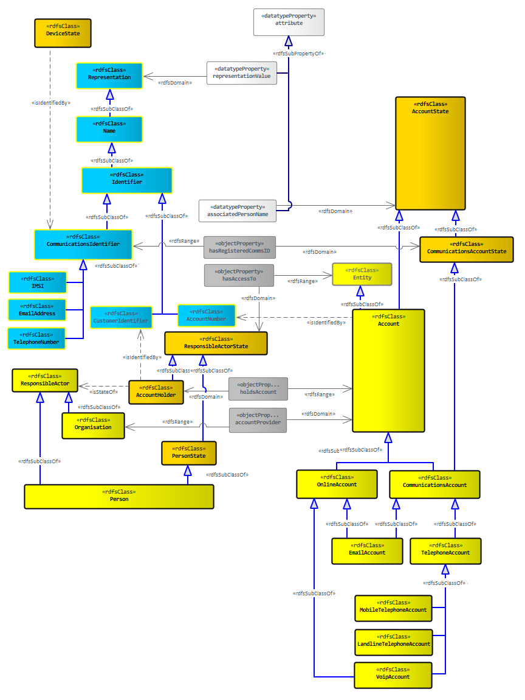

#### IES elements in this diagram:

* [attribute](#4a8e5877-32df-428f-9a60-6ac3d083ffca)
* [TelephoneAccount](#593ae684-c2e9-4e40-a7fd-549bfa64900d)
* [EmailAddress](#36f61edf-6e6e-4d8d-9e75-275a820f6d96)
* [IMSI](#c817c1ed-863b-41f0-b5c1-14117e926a94)
* [TelephoneNumber](#168d7b01-cd70-4f83-a414-19b6abeb961c)
* [EmailAccount](#fcbb35b9-704b-46c1-8054-10b7da7eb8f8)
* [OnlineAccount](#e95170b9-2599-46dc-bedc-012b08f09d43)
* [MobileTelephoneAccount](#9f5eda24-5991-48e7-9303-c86e25a196cf)
* [LandlineTelephoneAccount](#d7f83a2d-6428-4211-964d-e1e8a8089083)
* [VoipAccount](#2db8231f-0673-4788-ae41-3f52a3702a2b)
* [CommunicationsIdentifier](#a82378b9-9774-46b9-9845-cc75be882f06)
* [Representation](#675a5c23-0746-43d0-96d0-af0df72cd697)
* [Identifier](#315e6ad3-f2da-4f69-864f-da2b95121e2e)
* [Name](#7d7cc966-56eb-4220-a650-a993e598f2e2)
* [representationValue](#ae00f1de-f42b-4fc0-b07b-21f754f16fd4)
* [DeviceState](#6107eea5-1a13-46e4-83fb-14740437b814)
* [AccountNumber](#a72f0ff1-88f2-4b36-a2c4-26b4b0698a2c)
* [CustomerIdentifier](#43560c95-66a3-4d69-a743-f0a166de51fc)
* [associatedPersonName](#022535de-2100-420b-b4bc-10465deeec3c)
* [Account](#31bfe794-924e-44e3-942e-adc9ed19fba1)
* [AccountState](#0bcdb801-1f3b-4496-b04b-95ef545e9445)
* [CommunicationsAccount](#8300451c-1df9-4545-9174-d8aa69c58ccd)
* [CommunicationsAccountState](#20bb42f0-3f2d-4bb7-88dd-f4d05377d59b)
* [hasRegisteredCommsID](#e076afb8-f6f8-4b06-82b3-7ed568d1ee73)
* [Organisation](#1ecb4c6e-6a30-4dc5-a4ac-9a9df5b6a54f)
* [accountProvider](#0f9244c3-b2f5-4b8a-aed2-54b7fdab9578)
* [holdsAccount](#6314a9b0-4578-42a8-a553-1fddf35ac7f1)
* [ResponsibleActor](#d09ede21-e862-4ec1-bc0f-045cce5454a9)
* [Person](#5d5c5b9b-5e90-4100-8353-8ee9f3d772e2)
* [PersonState](#38f8b795-0bce-4945-8c69-8678ed935c1a)
* [hasAccessTo](#cb7f872f-7999-4bfd-8274-2c0e0afe22ab)
* [Entity](#f4ede167-6f5a-417d-9984-0221ccdf752c)
* [ResponsibleActorState](#100b93cd-937e-4fdd-8851-02d1dc07f5b6)
* [AccountHolder](#c93379f2-6b01-4100-abfa-bd26098ac1cb)

Communications Accounts are new for IES4. In most online and telecoms scenarios, the account, who holds it, and who provides it are more important than the device or handset (which IES 4 majored on). CommunicationsAccount inherits much from the generic Account class, then adds a relationship to CommunicationsIdentifier.

### Communications Device
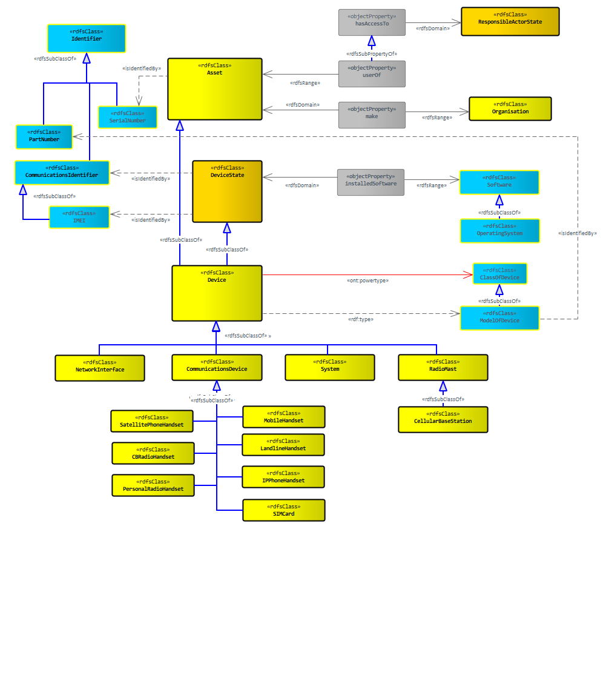

#### IES elements in this diagram:

* [CommunicationsDevice](#32eb46a5-0fa4-44e9-a9e9-9424e80bde91)
* [MobileHandset](#3bf8fc71-64bd-4fb5-befd-d7fcb936fa12)
* [SatellitePhoneHandset](#3634dbf3-aa3a-402e-9d08-906c06fafedb)
* [LandlineHandset](#57c9f8df-afe6-4374-9403-acacac26fce4)
* [CBRadioHandset](#18eb7b22-5927-4b0e-98a8-638d28bdcf87)
* [IPPhoneHandset](#0b494f4a-9e82-4667-89ad-3d22fc9b5742)
* [PersonalRadioHandset](#9d84921f-87a3-4ee9-8a3d-a88f564295fa)
* [SIMCard](#3244f6b1-8636-4895-b3b1-283cf057f826)
* [SerialNumber](#51f79bc9-9bb5-47d6-973b-6f86f289b5fb)
* [make](#e0036b31-8d73-4268-8959-6e9a5ee55bb2)
* [IMEI](#3987794e-6e2e-4457-8bf7-47813b51b139)
* [Software](#b6014bb6-fd82-4748-8dff-65401770515c)
* [OperatingSystem](#4f83d781-7e46-4ad4-b2a5-ecd27565ea49)
* [DeviceState](#6107eea5-1a13-46e4-83fb-14740437b814)
* [Device](#115f2f9b-21f3-4903-8eaa-ab3aefe97461)
* [Asset](#40231334-5acc-4dd4-a8c1-05012e2170e0)
* [System](#f682a265-1afe-4287-a9cd-0d4c83f54c52)
* [CommunicationsIdentifier](#a82378b9-9774-46b9-9845-cc75be882f06)
* [Identifier](#315e6ad3-f2da-4f69-864f-da2b95121e2e)
* [NetworkInterface](#c544ccac-91c5-4e82-b5d9-7a1b8d48e771)
* [RadioMast](#f02cff55-12a7-4308-9a60-e2353de5be58)
* [CellularBaseStation](#9d4a1395-8687-4f0b-bc5d-61a756210b4d)
* [userOf](#01984617-c96d-48b3-acde-25f525719aef)
* [hasAccessTo](#cb7f872f-7999-4bfd-8274-2c0e0afe22ab)
* [ResponsibleActorState](#100b93cd-937e-4fdd-8851-02d1dc07f5b6)
* [Organisation](#1ecb4c6e-6a30-4dc5-a4ac-9a9df5b6a54f)
* [PartNumber](#772cd8a3-3dca-4cc7-8ba3-17d1c57e94bc)
* [InstanceOfSoftware](#297f9cc1-2acf-4da0-92d9-0aa9e808cad8)
* [MobileHandset](#a2780bdd-ce76-40a9-baea-153afaa99005)

Devices are Assets that have been designed to perform one or more functions. IES then further sub-divides Device into <i>System </i>and <i>CommunicationsDevice</i>. A CommunicationsDevice is a self-contained device that acts as an endpoint for communication. A System is a collection of interacting Devices that together provide one or more functions. System components are generally removable / replacable.

### Communications Identifier
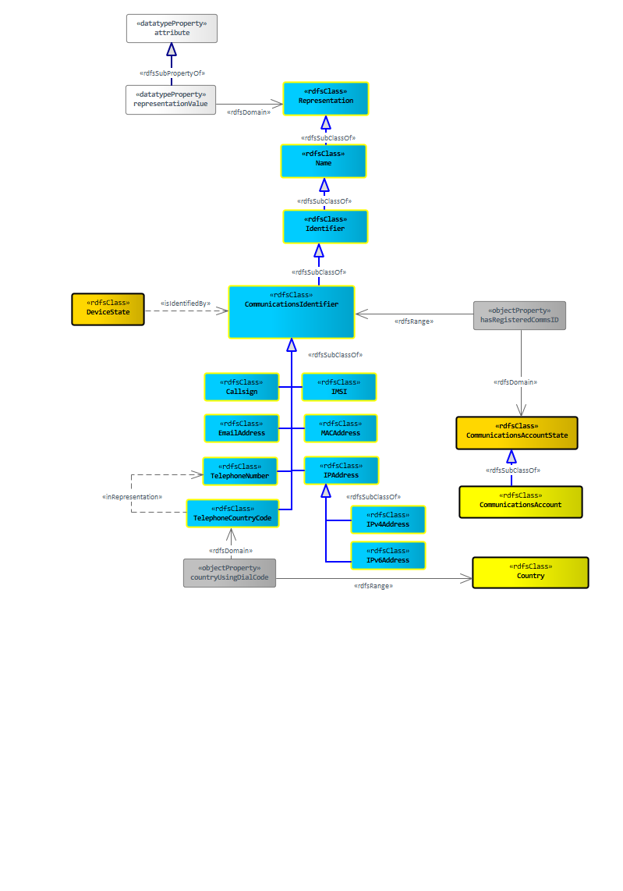

#### IES elements in this diagram:

* [attribute](#4a8e5877-32df-428f-9a60-6ac3d083ffca)
* [CommunicationsIdentifier](#a82378b9-9774-46b9-9845-cc75be882f06)
* [Callsign](#25f4f685-3931-4cdc-af43-1a9194bbe15d)
* [IPAddress](#451c4c40-4183-4130-b67c-6f746b8b8bca)
* [EmailAddress](#36f61edf-6e6e-4d8d-9e75-275a820f6d96)
* [IMSI](#c817c1ed-863b-41f0-b5c1-14117e926a94)
* [MACAddress](#de1ede92-142c-4c05-ad61-be58822b2e17)
* [TelephoneNumber](#168d7b01-cd70-4f83-a414-19b6abeb961c)
* [Representation](#675a5c23-0746-43d0-96d0-af0df72cd697)
* [Identifier](#315e6ad3-f2da-4f69-864f-da2b95121e2e)
* [Name](#7d7cc966-56eb-4220-a650-a993e598f2e2)
* [representationValue](#ae00f1de-f42b-4fc0-b07b-21f754f16fd4)
* [DeviceState](#6107eea5-1a13-46e4-83fb-14740437b814)
* [CommunicationsAccount](#8300451c-1df9-4545-9174-d8aa69c58ccd)
* [CommunicationsAccountState](#20bb42f0-3f2d-4bb7-88dd-f4d05377d59b)
* [hasRegisteredCommsID](#e076afb8-f6f8-4b06-82b3-7ed568d1ee73)
* [TelephoneCountryCode](#79c84ec1-83ec-45a8-a3ce-f88cffbf9434)
* [Country](#92eba9b9-48c2-4082-9fe5-603977bd6846)
* [countryUsingDialCode](#8c3f2c71-c7a2-414a-85c2-dfcd2d91d8e5)
* [IPv4Address](#142d6d4d-6ef3-48aa-8b7b-86da73690e3e)
* [IPv6Address](#78549d65-75f2-41c3-ac14-f0d441ad6354)

CommunicationsIdentifiers identify Devices (actually DeviceState, as the identifier may change over time). The identifiers are usually managed in a CommunicationsAccount, and again, we use the State rather than the WholeLife CommunicationsAccount as CommunicationsIdentifiers can move from account to account. 

### Communications Identifier Range
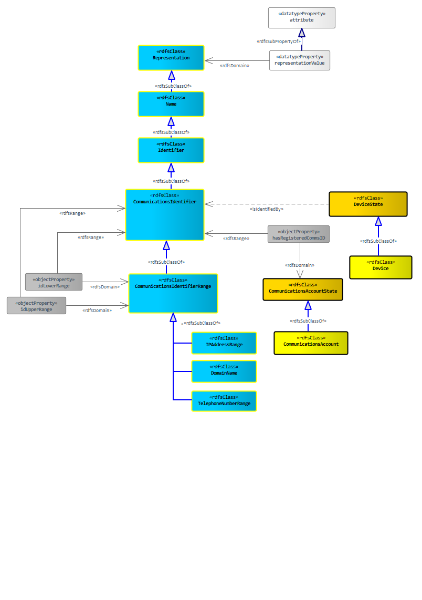

#### IES elements in this diagram:

* [attribute](#4a8e5877-32df-428f-9a60-6ac3d083ffca)
* [CommunicationsIdentifierRange](#df388418-f296-46a5-a2a3-4297f084dd07)
* [IPAddressRange](#bec2fdbc-6f37-4446-aee1-3d4627ddd5f2)
* [DomainName](#42ffb9ac-2d28-453a-80a0-2a271da32eb5)
* [TelephoneNumberRange](#007f88ad-9cdf-4aa1-be73-18c688da8c05)
* [idLowerRange](#6c79ce89-8e17-4ee7-aba8-dda5d4afc78b)
* [idUpperRange](#7615fb07-e0c5-4734-afc8-fd52688dd2cc)
* [CommunicationsIdentifier](#a82378b9-9774-46b9-9845-cc75be882f06)
* [DeviceState](#6107eea5-1a13-46e4-83fb-14740437b814)
* [Representation](#675a5c23-0746-43d0-96d0-af0df72cd697)
* [Identifier](#315e6ad3-f2da-4f69-864f-da2b95121e2e)
* [Name](#7d7cc966-56eb-4220-a650-a993e598f2e2)
* [representationValue](#ae00f1de-f42b-4fc0-b07b-21f754f16fd4)
* [CommunicationsAccountState](#20bb42f0-3f2d-4bb7-88dd-f4d05377d59b)
* [hasRegisteredCommsID](#e076afb8-f6f8-4b06-82b3-7ed568d1ee73)
* [CommunicationsAccount](#8300451c-1df9-4545-9174-d8aa69c58ccd)
* [Device](#115f2f9b-21f3-4903-8eaa-ab3aefe97461)

A CommunicationsIdentifierRange is a CommunicationsIdentifier that specifies a group of identifiers for Devices. 

### Data Object
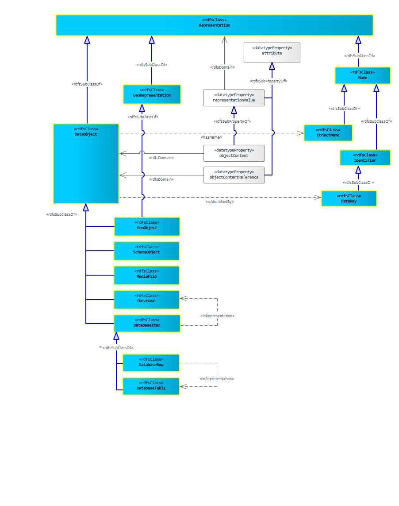

#### IES elements in this diagram:

* [attribute](#4a8e5877-32df-428f-9a60-6ac3d083ffca)
* [DataObject](#cac97eb4-e0e8-4576-9637-1fbed5f9fef2)
* [objectContentReference](#6b06abdd-05cf-485c-a483-563c5e85f189)
* [GeoObject](#ea165884-8df6-4aa6-848c-c682f6969d9f)
* [SchemaObject](#d3375bb5-6773-40e1-8ca2-b393dd02b98c)
* [MediaFile](#ce2e2eb2-17f7-4054-9107-e8dc275b0b11)
* [objectContent](#222fbd07-dccf-40c6-bd15-4adbc64a8aa5)
* [GeoRepresentation](#a8c07233-5d62-4ad4-b405-2d15cfc37497)
* [Representation](#675a5c23-0746-43d0-96d0-af0df72cd697)
* [representationValue](#ae00f1de-f42b-4fc0-b07b-21f754f16fd4)
* [Database](#3099b032-4b0a-4aec-abcd-3e862c4c1979)
* [DatabaseItem](#73f8d96c-a9ec-4301-9968-0f7bf9826c45)
* [DatabaseTable](#d9e56caa-4668-4248-b087-c041363816dd)
* [DatabaseRow](#1f23eb62-323b-402d-84bd-b4d417ed1a73)
* [Identifier](#315e6ad3-f2da-4f69-864f-da2b95121e2e)
* [Name](#7d7cc966-56eb-4220-a650-a993e598f2e2)
* [ObjectName](#9a372833-b327-4cb0-9950-786a2fbf7cc3)
* [DataKey](#2d88de83-f87f-48ad-a485-9ffa79ed90d8)

A DataObject is a Representationt that may contain internal structure that can be exploited using bespoke tools and/or applications. DataObjects might be geoobjects, video files, audio files, etc.

### Document
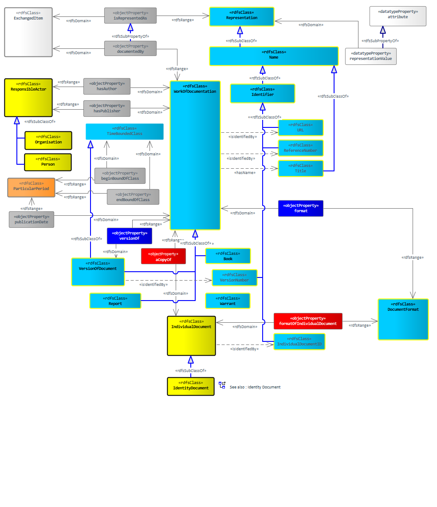

#### IES elements in this diagram:

* [attribute](#4a8e5877-32df-428f-9a60-6ac3d083ffca)
* [IndividualDocument](#0f327324-6b4e-40b1-b96b-97a334ba5e4a)
* [Report](#8d510cb0-c9bf-4de3-a442-9070abb15732)
* [Book](#22ab6ea2-b088-4ef6-ae3a-5843fba5c8ae)
* [Warrant](#4cad884a-1ea7-473d-9881-8b76ebf8526f)
* [Title](#30f5944f-75c3-4f12-a315-4e94abca809e)
* [publicationDate](#cd6e380b-7ad4-43d6-a128-9c666abd8223)
* [hasPublisher](#07fd1df6-ba77-4657-b3d3-d6d579fd4608)
* [ReferenceNumber](#a0dc70dd-9237-480b-a712-f5381c5ffa1a)
* [formatOfIndividualDocument](#f1f94713-6d95-4928-b537-4fba55d09e34)
* [hasAuthor](#9464d864-e76f-4e09-89e1-d3b2d3e63f3b)
* [Person](#5d5c5b9b-5e90-4100-8353-8ee9f3d772e2)
* [Organisation](#1ecb4c6e-6a30-4dc5-a4ac-9a9df5b6a54f)
* [ResponsibleActor](#d09ede21-e862-4ec1-bc0f-045cce5454a9)
* [URL](#c23ab49c-0734-45b7-a383-8eea305cdbe4)
* [WorkOfDocumentation](#f0b48978-d4e4-45a4-8238-091a5b714d82)
* [aCopyOf](#22d9054c-ae5c-4afe-99d9-3c9d65c86cb9)
* [IdentityDocument](#bdf4ebd9-7f41-4d90-91a7-571177330c1b)
* [Representation](#675a5c23-0746-43d0-96d0-af0df72cd697)
* [Identifier](#315e6ad3-f2da-4f69-864f-da2b95121e2e)
* [Name](#7d7cc966-56eb-4220-a650-a993e598f2e2)
* [representationValue](#ae00f1de-f42b-4fc0-b07b-21f754f16fd4)
* [IndividualDocumentID](#d68f4e10-957a-4e98-8447-8f2768940da7)
* [TimeBoundedClass](#e7a659a5-9059-4ea5-8fab-8a29afc47d9a)
* [beginBoundOfClass](#2c441f0a-635d-41ef-b8cc-96aa07958f8e)
* [endBoundOfClass](#f8109922-1cb1-490d-bbb5-fd5b76e19fd1)
* [VersionOfDocument](#adb16761-4981-4476-bc53-2843587d1c02)
* [VersionNumber](#e4c44f5b-5d57-4283-b985-5a2da87bf212)
* [versionOf](#c01f47a2-f545-4fac-a707-469ad32fbf94)
* [DocumentFormat](#acb44e46-7a30-4911-a9f0-3d5412fb3725)
* [format](#ef2c13d4-7106-4799-bb72-7cd47714f257)
* [ParticularPeriod](#2173f463-524c-457c-b106-51322f64f122)
* [isRepresentedAs](#d106a0a9-55c4-454f-9e20-35ba54114036)
* [Thing](#485cbf1a-04ff-4741-8471-46a03d28c406)
* [documentedBy](#ac7c948a-f19c-4296-ac38-0fee6a4c5e90)

In IES 3 there was just "Document", but it wasn't clear if this referred to a specific, individual copy of a document, or just the document in general (of which there may be many copies). For example, it wasn't clear if it was "my copy of War &amp; Peace" or just "War and Peace".

This has been rectified in IES4 and "Document" has been replaced by "Work of Documentation" (the general case) and "IndividualDocument" (a particular instance of a document). In the majority of cases, WorkOfDocumentation will be used, but where we care about a particular instance (e.g. forensics, evidence, historical interest, etc.) then IndividualDocument should be used. The IndividualDocument can be related to the WorkOfDocumentation it is an instance of using the "aCopyOf" property.

### Financial Account
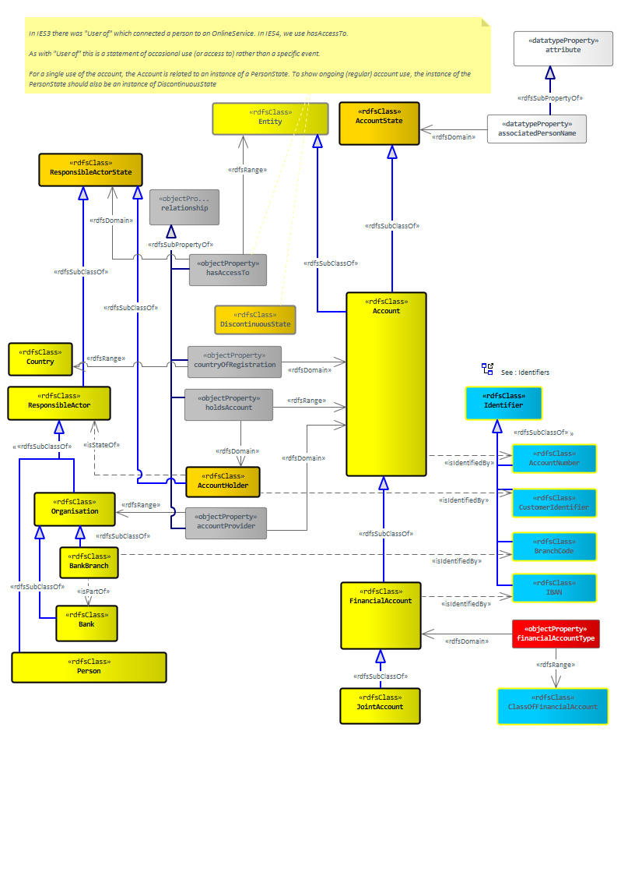

#### IES elements in this diagram:

* [attribute](#4a8e5877-32df-428f-9a60-6ac3d083ffca)
* [FinancialAccount](#44dac574-2a2e-44bc-acd2-236811fa8d29)
* [AccountNumber](#a72f0ff1-88f2-4b36-a2c4-26b4b0698a2c)
* [BranchCode](#012f7f29-4f8e-4263-8224-126050ee175f)
* [IBAN](#40e59970-04ce-4961-83fc-179739c4dec3)
* [CustomerIdentifier](#43560c95-66a3-4d69-a743-f0a166de51fc)
* [Country](#92eba9b9-48c2-4082-9fe5-603977bd6846)
* [associatedPersonName](#022535de-2100-420b-b4bc-10465deeec3c)
* [holdsAccount](#6314a9b0-4578-42a8-a553-1fddf35ac7f1)
* [ResponsibleActor](#d09ede21-e862-4ec1-bc0f-045cce5454a9)
* [Organisation](#1ecb4c6e-6a30-4dc5-a4ac-9a9df5b6a54f)
* [accountProvider](#0f9244c3-b2f5-4b8a-aed2-54b7fdab9578)
* [countryOfRegistration](#d33498ed-b6a0-41ea-864f-ce95e2b1e010)
* [Account](#31bfe794-924e-44e3-942e-adc9ed19fba1)
* [AccountState](#0bcdb801-1f3b-4496-b04b-95ef545e9445)
* [Person](#5d5c5b9b-5e90-4100-8353-8ee9f3d772e2)
* [DiscontinuousState](#52db371e-71ac-4812-b3cf-0fd7d73f1bb0)
* [relationship](#dce662f5-7bdb-457e-ae7e-2e5fe43dba1a)
* [hasAccessTo](#cb7f872f-7999-4bfd-8274-2c0e0afe22ab)
* [ResponsibleActorState](#100b93cd-937e-4fdd-8851-02d1dc07f5b6)
* [Entity](#f4ede167-6f5a-417d-9984-0221ccdf752c)
* [BankBranch](#02e3c3b8-8650-4867-8390-823e4b3360e6)
* [Bank](#4e10343e-8350-4354-b3db-a7f74b4535ef)
* [Identifier](#315e6ad3-f2da-4f69-864f-da2b95121e2e)
* [AccountHolder](#c93379f2-6b01-4100-abfa-bd26098ac1cb)
* [JointAccount](#ad17e3d9-cab2-4a60-99c9-109f4496f92f)

Accounts are ways to collect together transactions and other related Events. A FinancialAccount is an Account that is used to manage financial transactions.

### Identity Document
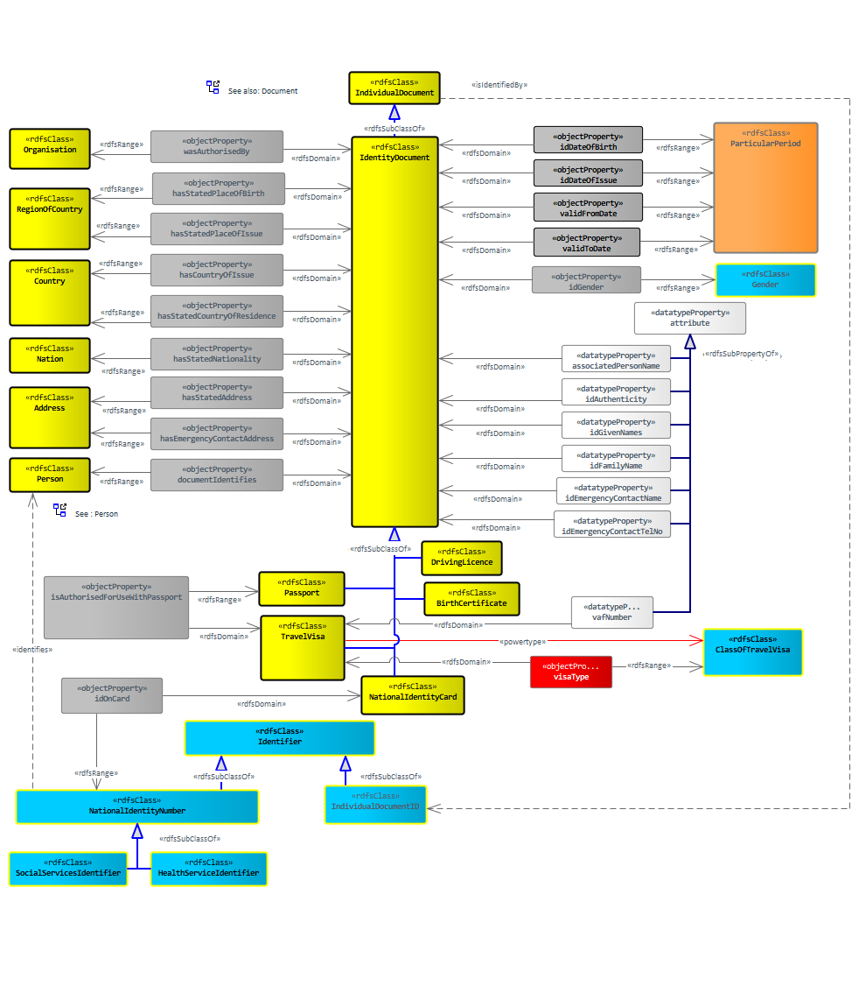

#### IES elements in this diagram:

* [IdentityDocument](#bdf4ebd9-7f41-4d90-91a7-571177330c1b)
* [BirthCertificate](#4457e8af-edbd-4ef1-b62b-59037829b961)
* [DrivingLicence](#44c1dd59-354b-405a-9755-417240802de4)
* [NationalIdentityCard](#843ede77-78c4-4a09-9866-dbcc726ad5e6)
* [NationalIdentityNumber](#f2cf8705-da4a-4131-ab60-cf1ac33bed95)
* [Passport](#13abc7ca-915e-4069-8ea7-fd205a5336c5)
* [TravelVisa](#c066eeb4-91af-4ee6-bb02-44a49087946b)
* [attribute](#4a8e5877-32df-428f-9a60-6ac3d083ffca)
* [hasCountryOfIssue](#e7500475-8c4f-47a3-8aab-c5679621fae8)
* [idDateOfBirth](#9e77b9de-e76a-454d-b4b5-52496358fc65)
* [hasStatedPlaceOfBirth](#f95710a9-b0a7-4f7b-adaa-08a2dcbd9c35)
* [idAuthenticity](#1185f43f-7ebb-4e38-a1b3-ff1421f3416d)
* [validFromDate](#6acc2acc-46f2-4a02-a3e7-d16be8eb723b)
* [validToDate](#680f737d-a8ab-4410-9f1d-fad7bdc98447)
* [idDateOfIssue](#acac12ad-16c3-480d-8149-c026f8be9f81)
* [wasAuthorisedBy](#7a58c9ad-c198-4a61-8244-de5bbc591416)
* [HealthServiceIdentifier](#fbccd717-e163-4129-b270-966f5d404260)
* [SocialServicesIdentifier](#df17458a-3bb8-4851-b88a-1e08c2efa697)
* [idGivenNames](#77ca0c8d-71f0-4cb9-8621-407396fac5a1)
* [idFamilyName](#ccd1f7fe-c42a-4503-bf24-00e8805bd5dd)
* [idGender](#d5b27630-c222-45be-87c2-5c4f8592487b)
* [hasStatedAddress](#0451b5d4-99cb-47a7-bb93-df4df6625837)
* [idEmergencyContactName](#96b7c774-1fe0-4307-bb62-b5899f953ff2)
* [idEmergencyContactTelNo](#0198c1be-43a0-4841-925e-fa5c47991ac3)
* [hasEmergencyContactAddress](#0aaf6757-aac9-43c4-8b43-cb3358eadca4)
* [hasStatedPlaceOfIssue](#644b75e8-92a0-4f16-861e-3b4fdfdf572e)
* [Organisation](#1ecb4c6e-6a30-4dc5-a4ac-9a9df5b6a54f)
* [hasStatedCountryOfResidence](#9a4eb722-0bda-4ba7-b895-7a4e273865c9)
* [hasStatedNationality](#c8ab9a91-97ed-4868-8167-44e71f40afe7)
* [isAuthorisedForUseWithPassport](#1ca57828-3b6b-450b-b477-c59a196eae34)
* [vafNumber](#6deb5776-59e6-4645-9566-65ec62a36330)
* [Country](#92eba9b9-48c2-4082-9fe5-603977bd6846)
* [RegionOfCountry](#65d869db-19ee-4886-98ba-e579c39c4a68)
* [Address](#c90267b5-77a3-4b79-bd0d-7c50c3f4c333)
* [associatedPersonName](#022535de-2100-420b-b4bc-10465deeec3c)
* [IndividualDocument](#0f327324-6b4e-40b1-b96b-97a334ba5e4a)
* [Identifier](#315e6ad3-f2da-4f69-864f-da2b95121e2e)
* [Person](#5d5c5b9b-5e90-4100-8353-8ee9f3d772e2)
* [idOnCard](#92d9b068-f8d4-4cbc-ad57-1da39d5cc1c7)
* [documentIdentifies](#2f8738a6-5eba-4d80-980b-aa9e6f28b81a)
* [ParticularPeriod](#2173f463-524c-457c-b106-51322f64f122)
* [IndividualDocumentID](#d68f4e10-957a-4e98-8447-8f2768940da7)
* [Nation](#6ae6f8a5-f427-4ea6-babd-5720f07430f5)
* [Gender](#8b4db18e-df46-4419-b0ed-0159a25f2319)

IdentityDocuments are IndividualDocuments that can be used to authenticate the identity of their bearers. 

### Location
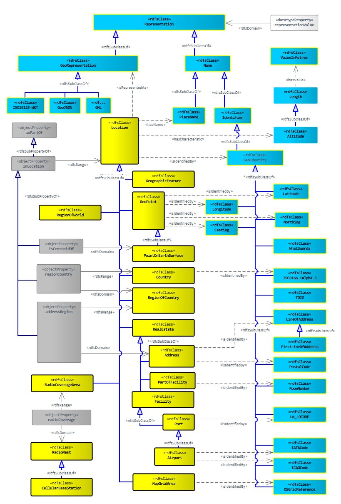

#### IES elements in this diagram:

* [Location](#e1a494ed-d493-44ab-8bf9-abc6889d4d9a)
* [Country](#92eba9b9-48c2-4082-9fe5-603977bd6846)
* [ISO3166_1Alpha_3](#b92d79e2-9e7d-4df7-8d38-3d884aa09ad2)
* [GeographicFeature](#7eee1ef7-c814-4eee-85b3-f48698fd52b6)
* [RegionOfWorld](#18c405ce-cc09-4e02-a44d-0fb00c6f6b37)
* [RegionOfCountry](#65d869db-19ee-4886-98ba-e579c39c4a68)
* [Address](#c90267b5-77a3-4b79-bd0d-7c50c3f4c333)
* [Facility](#9cd2c1b1-85b1-4579-9376-07827ad68461)
* [Port](#57860a04-0128-4c7e-9bfd-83d3ba432f8c)
* [Airport](#82e3793f-d0d1-40ca-927c-7a6fef913503)
* [UN_LOCODE](#aea785bb-b625-41aa-8738-fb0f3726a281)
* [IATACode](#aa530bce-02f2-4195-a431-573d13a5b41c)
* [ICAOCode](#239a3a0c-183c-432f-9147-7259c9573aa2)
* [GeoIdentity](#87251da1-7293-445e-987f-f13e331b6bdf)
* [What3words](#b2262900-bf01-4691-8de1-46a726a6d1cb)
* [TOID](#79d9049d-e63f-4c94-b348-49506a75b9f8)
* [PostalCode](#6a0385e2-3fb1-4a42-a254-bc382d92e27a)
* [FirstLineOfAddress](#8b6dd87e-3d76-4836-9201-1244b80cdc69)
* [isPartOf](#cd85d7f7-783b-4d06-b023-56dbbddc02dc)
* [inLocation](#463f9b14-2d14-4364-b4f0-658a20dfcbfa)
* [Representation](#675a5c23-0746-43d0-96d0-af0df72cd697)
* [Name](#7d7cc966-56eb-4220-a650-a993e598f2e2)
* [representationValue](#ae00f1de-f42b-4fc0-b07b-21f754f16fd4)
* [PlaceName](#37db1a2c-9382-4dac-8ae8-9dec5a337e16)
* [RealEstate](#8e0df17f-34ee-43c6-8da4-30f698384fd3)
* [Length](#5c21de93-329f-4209-87ff-19610cb0d367)
* [ValueInMetres](#c8d4c3cb-16c2-44a7-b709-35cebf219bf0)
* [Altitude](#51b6f4c5-0da3-437d-9507-38514bc2abcd)
* [Identifier](#315e6ad3-f2da-4f69-864f-da2b95121e2e)
* [LineOfAddress](#e0d8895d-2230-4c80-8b06-351581c53436)
* [RadioCoverageArea](#7a2cc7c7-6b82-4751-bdbe-a770b3afbbeb)
* [RadioMast](#f02cff55-12a7-4308-9a60-e2353de5be58)
* [CellularBaseStation](#9d4a1395-8687-4f0b-bc5d-61a756210b4d)
* [radioCoverage](#3b5e5043-30c2-4e67-86c8-f59f55aeba90)
* [MapGridArea](#18a66904-823f-471d-a465-65ecd2d69867)
* [OSGridReference](#697eaa12-8fd3-49e0-a4a2-a045b4570550)
* [Easting](#a4502460-54b7-446b-a9aa-003b49f9682b)
* [Northing](#09649fe9-ddd7-4493-b9ec-7a716b0fc616)
* [GeoRepresentation](#a8c07233-5d62-4ad4-b405-2d15cfc37497)
* [GeoJSON](#417c1f4e-6a5d-4631-b275-8e982252791a)
* [ISO19125-WKT](#22b79cfd-deda-42e1-8864-e8421d36cf19)
* [GML](#ae59cb88-3178-4bad-9f43-1276337c7944)
* [GeoPoint](#9a9467c3-d5fc-4964-8943-fe63adf38914)
* [isCentroidOf](#44adc197-d9fa-4889-b6af-929c3546f4a0)
* [Latitude](#bd14ef81-ddbc-4bdf-bc40-e5fae937ada6)
* [Longitude](#b2c5522f-ea60-455a-b00f-9cc87a76e5b0)
* [PointOnEarthSurface](#a11a426e-ed15-4aaf-b9a5-02a4060533aa)
* [PartOfFacility](#3efea421-6b88-4e51-9b20-4ffa22e8c5ca)
* [RoomNumber](#0b2564a8-9a95-4164-bb49-01900dd530ad)
* [relationship](#dce662f5-7bdb-457e-ae7e-2e5fe43dba1a)

Locations are physical chunks of the earth (and usually the airspace above) - i.e. they are defined by their extent. 

The model is intended to be used hierarchically - e.g. an Address should be part of (inLocation) a RegionOfCountry which should be part of (inLocation) a Country, etc. 

### Online
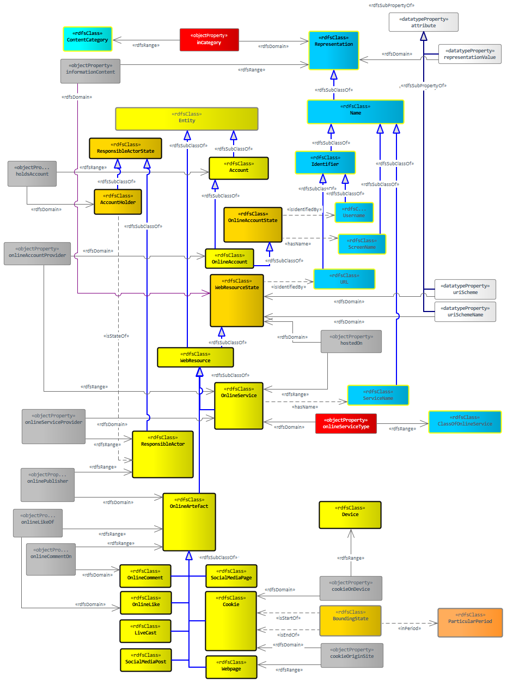

#### IES elements in this diagram:

* [attribute](#4a8e5877-32df-428f-9a60-6ac3d083ffca)
* [OnlineAccount](#e95170b9-2599-46dc-bedc-012b08f09d43)
* [OnlineService](#27befd0a-b30b-47db-b863-13e48d1172f9)
* [Webpage](#79098c74-e063-4c45-886d-d0b88a48e954)
* [onlineAccountProvider](#2cf1b157-a2f6-41c8-8a87-7b82eeb71f40)
* [ResponsibleActor](#d09ede21-e862-4ec1-bc0f-045cce5454a9)
* [onlineServiceProvider](#dee1404a-aac3-4d46-9ba3-8e097a55c7f5)
* [URL](#c23ab49c-0734-45b7-a383-8eea305cdbe4)
* [WebResource](#46d508b4-f1cc-45d7-9e4b-ba8a3c88d82a)
* [uriScheme](#d97141bd-f6cf-4b10-b4e5-b1ecf6df5178)
* [ScreenName](#8c1321b7-8686-4a21-b99a-6c4a98b411a7)
* [ServiceName](#8f8428ba-8586-4e34-9c75-fba7a647b8ea)
* [uriSchemeName](#aaa8de3d-31d8-4c1e-b114-72e8b37d6caa)
* [Entity](#f4ede167-6f5a-417d-9984-0221ccdf752c)
* [Username](#9d703ce2-ded0-4aba-be21-474781670297)
* [OnlineArtefact](#54500458-51cf-46b5-a5a3-14b1d5c7f755)
* [onlineLikeOf](#4a3f24c6-eec9-48ce-93fb-26ff64e1268a)
* [holdsAccount](#6314a9b0-4578-42a8-a553-1fddf35ac7f1)
* [Account](#31bfe794-924e-44e3-942e-adc9ed19fba1)
* [SocialMediaPage](#3dc012c3-e273-4ec2-a462-cedeb27262c1)
* [SocialMediaPost](#4b3ae19c-6369-49d0-b7b5-949714fffc95)
* [OnlineComment](#ff216817-5b58-4db5-88c5-20ae6a466265)
* [OnlineLike](#5b50eecc-45fc-4e5b-933e-51bc0fee0fcd)
* [LiveCast](#ecc6e85e-cb08-464d-81a4-ba3ecdcb784c)
* [onlineCommentOn](#0a4c12e6-ca4c-43f1-9c6c-fbe23197975f)
* [Representation](#675a5c23-0746-43d0-96d0-af0df72cd697)
* [WebResourceState](#3be61ccf-dcd0-411d-9d43-5deabf8381f2)
* [representationValue](#ae00f1de-f42b-4fc0-b07b-21f754f16fd4)
* [informationContent](#5bee4248-dc98-4625-8553-3bb2171a1ede)
* [ContentCategory](#8ca5551a-eaeb-4145-a75f-2e7d7dad5a57)
* [inCategory](#d10b4b95-5bf1-4e3f-a2a8-8f52f045c31a)
* [Identifier](#315e6ad3-f2da-4f69-864f-da2b95121e2e)
* [AccountHolder](#c93379f2-6b01-4100-abfa-bd26098ac1cb)
* [ResponsibleActorState](#100b93cd-937e-4fdd-8851-02d1dc07f5b6)
* [ParticularPeriod](#2173f463-524c-457c-b106-51322f64f122)
* [BoundingState](#892345cd-9fa7-4982-978d-b6d3abae839c)
* [cookieOriginSite](#24e8b958-284f-4be2-aacd-a7b2a94b97d4)
* [onlinePublisher](#34f13f26-7c4e-451a-bda0-62ba7738039f)
* [Name](#7d7cc966-56eb-4220-a650-a993e598f2e2)
* [hostedOn](#f5c27e55-623e-4fa7-95c3-dd0a722d1035)
* [OnlineAccountState](#4c0d1724-b820-4a87-ad36-08c0612ce21e)
* [Cookie](#c81b6ead-8494-45ca-928c-21cb6d395c39)
* [Device](#115f2f9b-21f3-4903-8eaa-ab3aefe97461)
* [cookieOnDevice](#76d8ea41-e338-4db5-bb30-d642cf0f90eb)

This diagram covers the online aspects of IES. 

### Organisation
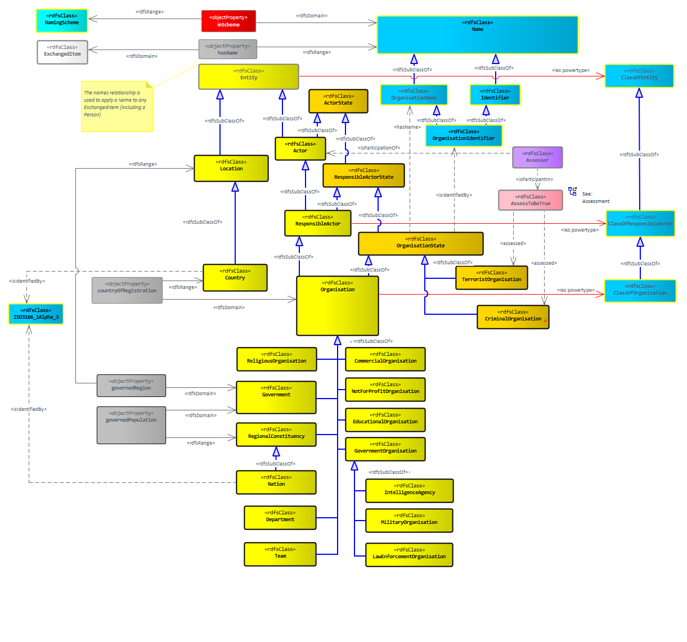

#### IES elements in this diagram:

* [LawEnforcementOrganisation](#15806699-2f00-4891-b2a0-8a211cedfc10)
* [CriminalOrganisation](#3cefb37c-d5ee-4c9d-848d-c8e2db206482)
* [AssessToBeTrue](#7150208d-a02e-45ed-8279-44843f4da897)
* [Assessor](#80f9b97d-2c7f-4978-83a3-be934dd4e1ff)
* [Organisation](#1ecb4c6e-6a30-4dc5-a4ac-9a9df5b6a54f)
* [ResponsibleActor](#d09ede21-e862-4ec1-bc0f-045cce5454a9)
* [OrganisationName](#065c9b64-96e2-47f5-9769-e7942c1a208f)
* [Country](#92eba9b9-48c2-4082-9fe5-603977bd6846)
* [countryOfRegistration](#d33498ed-b6a0-41ea-864f-ce95e2b1e010)
* [GovernmentOrganisation](#0d042066-06c8-48d6-8387-500cf8ee2592)
* [CommercialOrganisation](#1456439c-65c9-4a39-a743-09a7d0fbf248)
* [NotForProfitOrganisation](#c2b4a066-e4a7-4cf5-bd1f-8381364f5d30)
* [IntelligenceAgency](#f87e3b6f-5872-47eb-89f8-6642dd7c8237)
* [MilitaryOrganisation](#492ab59a-342e-4d74-b85b-e6ca95bbc3b2)
* [TerroristOrganisation](#6467a4ef-46ba-401c-a5c7-668bafb6e228)
* [ReligiousOrganisation](#2978340b-c4aa-4331-a68d-54a158798dac)
* [EducationalOrganisation](#f30d350c-848d-4b02-aea5-86575ceeefb3)
* [Entity](#f4ede167-6f5a-417d-9984-0221ccdf752c)
* [Location](#e1a494ed-d493-44ab-8bf9-abc6889d4d9a)
* [Government](#d62ddbb8-53fc-405a-bc43-89ca337563a0)
* [governedRegion](#72dc3e90-53ce-434d-a5f3-89bdce08a201)
* [RegionalConstituency](#fc55d479-07c4-4d98-b48c-5032190e493d)
* [Nation](#6ae6f8a5-f427-4ea6-babd-5720f07430f5)
* [governedPopulation](#917c549c-259f-4850-9cfd-35e05485bf63)
* [ISO3166_1Alpha_3](#b92d79e2-9e7d-4df7-8d38-3d884aa09ad2)
* [OrganisationState](#f3db6a59-b2de-4743-a9a8-7da9ccc68638)
* [Name](#7d7cc966-56eb-4220-a650-a993e598f2e2)
* [NamingScheme](#222534a5-25c8-4ecd-be55-27da1534d402)
* [inScheme](#7eb9fe85-127c-4918-ac56-62e1be1de825)
* [hasName](#c3a36e36-0c73-4af7-88e3-81c9243ce456)
* [Team](#7b20ec37-6d66-4cd9-97df-2a30b324c421)
* [Department](#6c7891c7-e095-41f4-a894-aa0c6a22f5d2)
* [Thing](#485cbf1a-04ff-4741-8471-46a03d28c406)
* [ResponsibleActorState](#100b93cd-937e-4fdd-8851-02d1dc07f5b6)
* [Actor](#b2b15802-9ce9-4a9d-9de0-8289d8474e9b)
* [ActorState](#7ed8bc7c-a85f-4ed5-ac6f-d640f2df4b7b)
* [Identifier](#315e6ad3-f2da-4f69-864f-da2b95121e2e)
* [OrganisationIdentifier](#13865b40-b57d-44e7-9658-00c45c8175c8)

This diagram covers the Organisation aspects of IES. 

### Posts and Roles
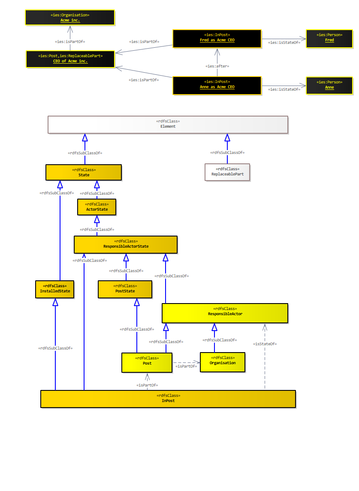

#### IES elements in this diagram:

* [ResponsibleActor](#d09ede21-e862-4ec1-bc0f-045cce5454a9)
* [State](#47301d66-cbd5-4d10-9481-b66966a3f3a2)
* [Organisation](#1ecb4c6e-6a30-4dc5-a4ac-9a9df5b6a54f)
* [ActorState](#7ed8bc7c-a85f-4ed5-ac6f-d640f2df4b7b)
* [Post](#7c28e83c-1895-4901-abf8-9d78c9c12c62)
* [ResponsibleActorState](#100b93cd-937e-4fdd-8851-02d1dc07f5b6)
* [InPost](#6c1949b5-b86b-4940-8912-9008ccd67150)
* [PostState](#db51b007-e3e8-431f-9c23-3c0a7e83fb11)
* [InstalledState](#6b36c428-3a86-493e-9b3b-6d394c567577)
* [ReplaceablePart](#624d6cd1-31d9-46db-b42d-56dad35babd8)
* [Element](#97edc90f-3b36-4da8-ae77-d5fdbdea2b21)

Posts are parts of Organisations. A ResponsibleActor can be in post for a period of time - i.e. there is a state of the ResponsibleActor (InPost) that is part of the Post. Note that this is part of the Post, not a state of it, as there may be more than one ResponsibleActor in a given Post at the same time.

Roles are also defined. These are ClassOfStates that are used to categorise a given state in terms of it role. 

### PaymentArtefact
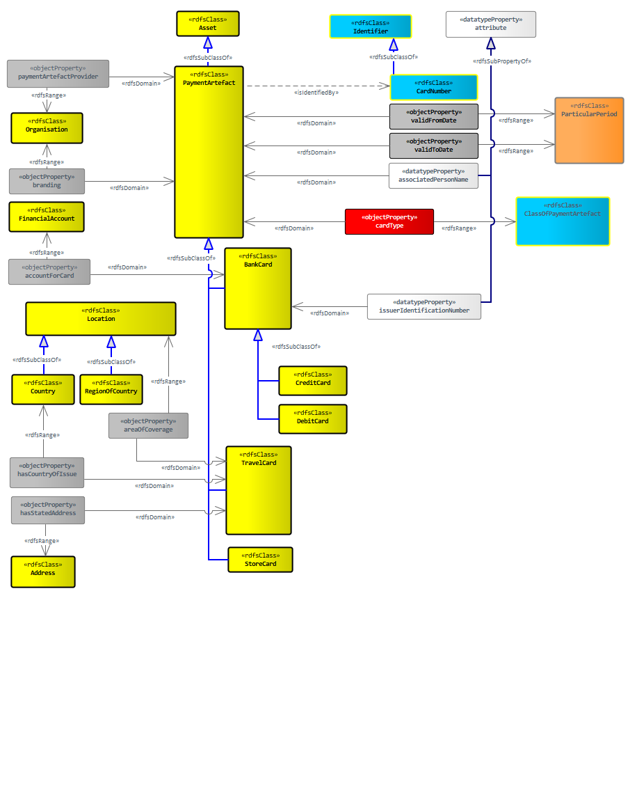

#### IES elements in this diagram:

* [attribute](#4a8e5877-32df-428f-9a60-6ac3d083ffca)
* [PaymentArtefact](#9882d901-1b22-4b89-81d1-031f840a20d0)
* [BankCard](#848a9e0f-f3b4-47c3-aa7e-2ff6be92170c)
* [StoreCard](#686293f8-123b-478f-9a67-a6074937b528)
* [TravelCard](#e1d8a09d-c260-4dd8-b6ff-c2fa8968a00b)
* [Organisation](#1ecb4c6e-6a30-4dc5-a4ac-9a9df5b6a54f)
* [paymentArtefactProvider](#c793e699-c27b-49cc-9358-c4a0e17e609e)
* [validFromDate](#6acc2acc-46f2-4a02-a3e7-d16be8eb723b)
* [validToDate](#680f737d-a8ab-4410-9f1d-fad7bdc98447)
* [CreditCard](#c2174205-c96f-4427-a401-19c1def0e4af)
* [DebitCard](#f0c846e7-76b9-4ab6-988e-3694c95818e7)
* [FinancialAccount](#44dac574-2a2e-44bc-acd2-236811fa8d29)
* [accountForCard](#7891e893-56db-4d47-80b4-c78a667767f6)
* [issuerIdentificationNumber](#5e353b12-2503-429f-a683-f7c77e0dfbad)
* [branding](#62675b63-9169-4f05-9993-e1b17540a6c1)
* [Country](#92eba9b9-48c2-4082-9fe5-603977bd6846)
* [hasCountryOfIssue](#e7500475-8c4f-47a3-8aab-c5679621fae8)
* [areaOfCoverage](#c6ba7464-c00e-4ff6-ae7b-9ce9d4e08fdf)
* [hasStatedAddress](#0451b5d4-99cb-47a7-bb93-df4df6625837)
* [Address](#c90267b5-77a3-4b79-bd0d-7c50c3f4c333)
* [associatedPersonName](#022535de-2100-420b-b4bc-10465deeec3c)
* [ParticularPeriod](#2173f463-524c-457c-b106-51322f64f122)
* [Identifier](#315e6ad3-f2da-4f69-864f-da2b95121e2e)
* [CardNumber](#087f3453-b1d7-41e6-b79f-31b123ed0d68)
* [Asset](#40231334-5acc-4dd4-a8c1-05012e2170e0)
* [Location](#e1a494ed-d493-44ab-8bf9-abc6889d4d9a)
* [RegionOfCountry](#65d869db-19ee-4886-98ba-e579c39c4a68)

PaymentArtefacts are used in transactions, and also sometimes to identify people.

### Person
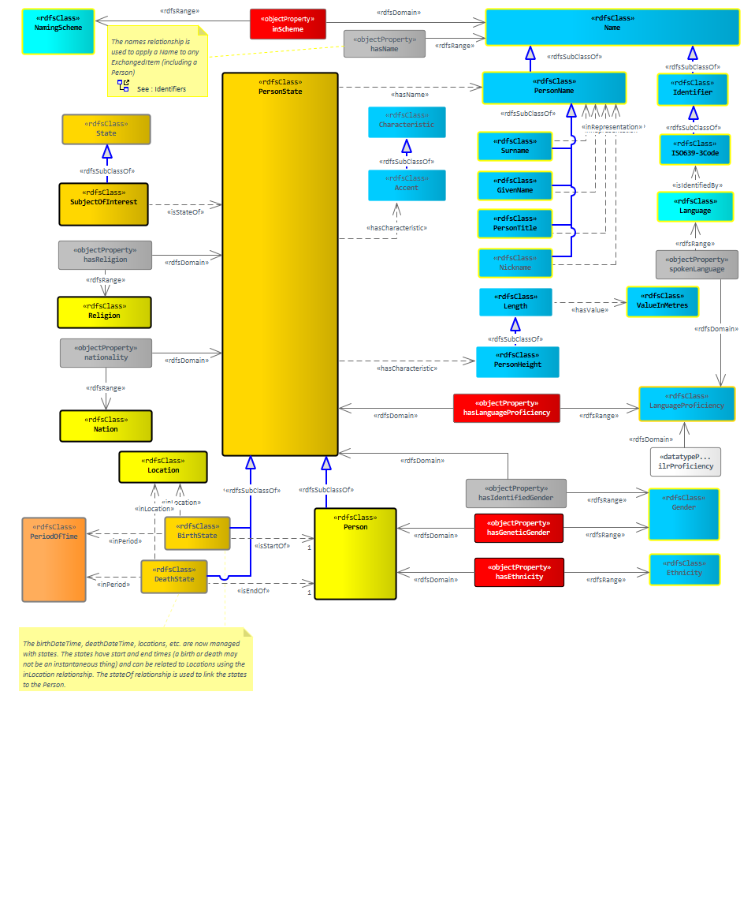

#### IES elements in this diagram:

* [Person](#5d5c5b9b-5e90-4100-8353-8ee9f3d772e2)
* [State](#47301d66-cbd5-4d10-9481-b66966a3f3a2)
* [nationality](#45cda5c1-624d-4f2f-81f6-ef19300820a9)
* [PersonTitle](#ca36058b-835c-48ef-944a-2507708ada71)
* [hasGeneticGender](#8914e7df-443b-4a3a-a945-aad11b82a86a)
* [hasReligion](#6d1839a4-342a-4e34-823c-bdb392483048)
* [hasEthnicity](#bc3185ce-53f4-45de-a6d4-dac8343b4d1c)
* [hasLanguageProficiency](#2065b9a0-dcad-45be-9f0d-bd4398261a7f)
* [Location](#e1a494ed-d493-44ab-8bf9-abc6889d4d9a)
* [BirthState](#cfe53096-32fc-47c8-98ba-950ee6f988cb)
* [DeathState](#f6173d27-d86d-40f8-a5b0-36dccf85d396)
* [Nation](#6ae6f8a5-f427-4ea6-babd-5720f07430f5)
* [GivenName](#a01a5045-b09c-4bea-8c96-881c29f2ee60)
* [Surname](#b5a0c08a-39b3-4bd1-9d19-ce87e0f7debb)
* [Nickname](#ba4b97ee-58e2-4796-949c-f62eaaae56c9)
* [PeriodOfTime](#3fdfa898-c340-4279-8b3c-275359d5b02d)
* [PersonState](#38f8b795-0bce-4945-8c69-8678ed935c1a)
* [Religion](#bd538820-ce91-4b9a-adb8-c105fe0f2e7b)
* [hasIdentifiedGender](#7640dbfc-b520-458c-a7c1-16651ddf217f)
* [Name](#7d7cc966-56eb-4220-a650-a993e598f2e2)
* [NamingScheme](#222534a5-25c8-4ecd-be55-27da1534d402)
* [inScheme](#7eb9fe85-127c-4918-ac56-62e1be1de825)
* [hasName](#c3a36e36-0c73-4af7-88e3-81c9243ce456)
* [PersonName](#f114f86c-3ba8-4be7-a686-a1d80002df28)
* [Length](#5c21de93-329f-4209-87ff-19610cb0d367)
* [ValueInMetres](#c8d4c3cb-16c2-44a7-b709-35cebf219bf0)
* [PersonHeight](#57060ad9-a6d7-496d-a2bf-22b930400eee)
* [SubjectOfInterest](#bffbc847-ad87-458e-9a86-690d659eb48f)
* [Ethnicity](#8ac946a4-4c03-463c-9f32-37ea8593988a)
* [Gender](#8b4db18e-df46-4419-b0ed-0159a25f2319)
* [Language](#82652ff5-258f-459c-bc7f-6dac65e1eca1)
* [Identifier](#315e6ad3-f2da-4f69-864f-da2b95121e2e)
* [ISO639-3Code](#ecfed94d-cc69-46b9-b09d-b282d5665787)
* [LanguageProficiency](#eb73ab32-8232-4b58-8271-640ddddcc7de)
* [spokenLanguage](#fa149043-ea61-4497-a036-589da1fd312e)
* [ilrProficiency](#471cf113-1728-47fd-a763-d1fa69226fc4)
* [Accent](#63409d9a-1779-444a-bf04-23c03b3b2f72)
* [Characteristic](#a7f266e8-b1cb-4b9b-8af1-1ef2a7d8f5ee)

This diagram covers people, and people pretending to be other people (aliases). Most personal attributes belong to a PersonState as they are things that can change throughout the Person's life. The two whole-life properties that cannot changed are their ethnicity and their genetic gender.

Two special states are identified - birth and death which are bounding states for the whole life person and can be used to identify the location and date of birth. 

### Ticket
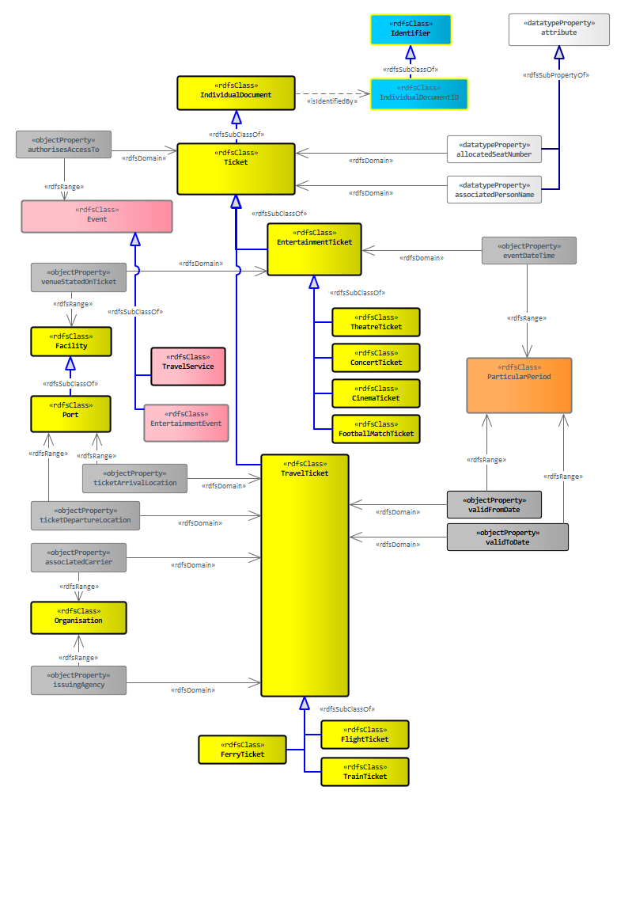

#### IES elements in this diagram:

* [attribute](#4a8e5877-32df-428f-9a60-6ac3d083ffca)
* [Ticket](#0bc61540-2afb-42e6-a845-79771ee0268d)
* [EntertainmentTicket](#96989c30-99cc-4606-a8d4-dfd9421f0e34)
* [TravelTicket](#6c669bef-9267-4612-9f29-b28918b203f5)
* [eventDateTime](#07dcd4fc-938c-438d-abe6-f7f64e66a255)
* [Facility](#9cd2c1b1-85b1-4579-9376-07827ad68461)
* [venueStatedOnTicket](#3345aeca-925e-4bfc-820e-2294d5921e71)
* [allocatedSeatNumber](#518e9b39-58c0-4e89-831d-b6099c3b9892)
* [authorisesAccessTo](#a2da918d-843c-43c9-a974-4795601e9d65)
* [Port](#57860a04-0128-4c7e-9bfd-83d3ba432f8c)
* [TheatreTicket](#5cd50268-582a-426b-b4cc-f6ee308b84a3)
* [CinemaTicket](#7e0c25c9-dd3a-463e-a481-7ca4ea4ac8c5)
* [FootballMatchTicket](#da626f73-5748-47db-813f-e1813577f41b)
* [ConcertTicket](#8ff9de7f-137b-4a03-ab24-7d84fcfb99c0)
* [FlightTicket](#3a9a1ba9-465f-4f6d-bd55-9f3f8ae40ae0)
* [TrainTicket](#a8715447-3583-45d0-9550-625cf96b3e2e)
* [FerryTicket](#b2ed961f-245e-4e74-a32f-6b9cf1bbdf2b)
* [Organisation](#1ecb4c6e-6a30-4dc5-a4ac-9a9df5b6a54f)
* [associatedCarrier](#2e464c7f-fc0b-4dcc-9b1c-5dca87b4ce3a)
* [issuingAgency](#74d86486-8e18-474a-8930-b92e759bbe06)
* [associatedPersonName](#022535de-2100-420b-b4bc-10465deeec3c)
* [ticketDepartureLocation](#952e5981-257f-429e-9f22-8d2e3b9282c7)
* [ticketArrivalLocation](#a4906b5e-8718-404e-8eef-20ae29106383)
* [validFromDate](#6acc2acc-46f2-4a02-a3e7-d16be8eb723b)
* [validToDate](#680f737d-a8ab-4410-9f1d-fad7bdc98447)
* [EntertainmentEvent](#78c33499-cd14-43cb-82ae-93a0f8cf022b)
* [Identifier](#315e6ad3-f2da-4f69-864f-da2b95121e2e)
* [IndividualDocument](#0f327324-6b4e-40b1-b96b-97a334ba5e4a)
* [IndividualDocumentID](#d68f4e10-957a-4e98-8447-8f2768940da7)
* [Event](#b376370e-f5e8-4287-a3ec-ac35532919b1)
* [TravelService](#3d0fc30a-cf82-44f2-970e-bfd04eadba74)
* [ParticularPeriod](#2173f463-524c-457c-b106-51322f64f122)

Tickets are IndividualDocuments that authorise access to Events - e.g. travel and entertainment.

### Vehicle
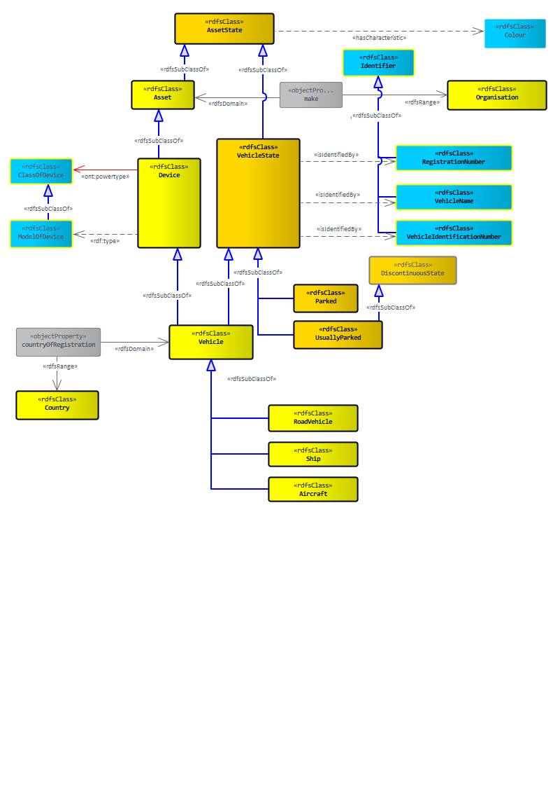

#### IES elements in this diagram:

* [Vehicle](#3b916f09-f3f4-43e9-9c84-99009c685396)
* [RegistrationNumber](#1e784b9c-1a5d-4035-b134-67a758fb869d)
* [RoadVehicle](#830b2164-e880-4bef-a62c-b38ceb6a824d)
* [Aircraft](#01a64a84-7a14-45a5-aaf2-f1aa614d5f30)
* [Ship](#14098560-1ff3-4599-b9a5-41167861538b)
* [make](#e0036b31-8d73-4268-8959-6e9a5ee55bb2)
* [VehicleName](#9d24b4be-2ad4-42d6-a906-8f6efda23ec5)
* [Country](#92eba9b9-48c2-4082-9fe5-603977bd6846)
* [countryOfRegistration](#d33498ed-b6a0-41ea-864f-ce95e2b1e010)
* [VehicleState](#d3275233-7381-483e-b2d2-77f13d73a52e)
* [Asset](#40231334-5acc-4dd4-a8c1-05012e2170e0)
* [Identifier](#315e6ad3-f2da-4f69-864f-da2b95121e2e)
* [Organisation](#1ecb4c6e-6a30-4dc5-a4ac-9a9df5b6a54f)
* [Device](#115f2f9b-21f3-4903-8eaa-ab3aefe97461)
* [DiscontinuousState](#52db371e-71ac-4812-b3cf-0fd7d73f1bb0)
* [Parked](#b6a503e5-3fc4-4a45-8dc0-994ea31a895a)
* [UsuallyParked](#fce0d994-4838-48fa-a274-57db092a2960)
* [AssetState](#ca196722-9531-4eb4-a8cf-b9a5145cdcfd)
* [VehicleIdentificationNumber](#ac9ab7b0-6c38-4b08-b2b9-caa8486f0f4b)
* [Colour](#b10d22fb-1d6a-47c9-b1c0-e870d43a5c52)

A means of transportation � e.g. car, aircraft, ship.

### All Entities
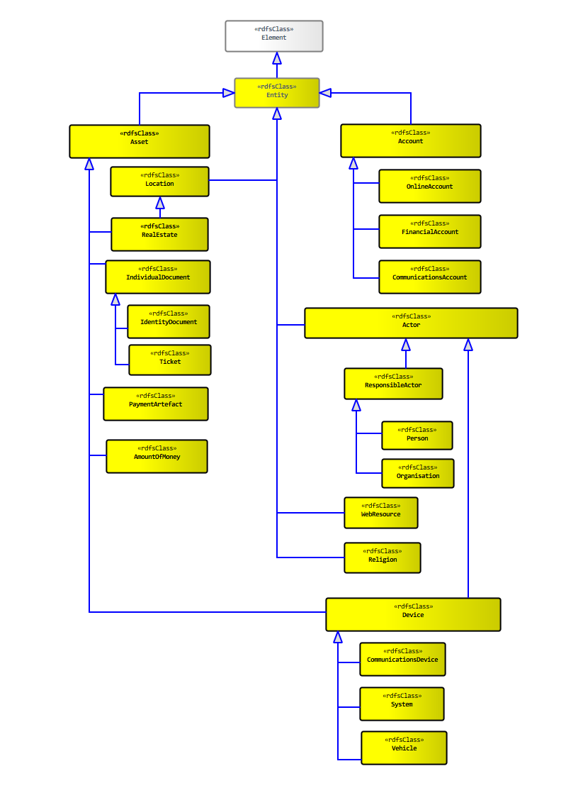

#### IES elements in this diagram:

* [Entity](#f4ede167-6f5a-417d-9984-0221ccdf752c)
* [Element](#97edc90f-3b36-4da8-ae77-d5fdbdea2b21)
* [CommunicationsDevice](#32eb46a5-0fa4-44e9-a9e9-9424e80bde91)
* [IndividualDocument](#0f327324-6b4e-40b1-b96b-97a334ba5e4a)
* [FinancialAccount](#44dac574-2a2e-44bc-acd2-236811fa8d29)
* [IdentityDocument](#bdf4ebd9-7f41-4d90-91a7-571177330c1b)
* [Location](#e1a494ed-d493-44ab-8bf9-abc6889d4d9a)
* [OnlineAccount](#e95170b9-2599-46dc-bedc-012b08f09d43)
* [Organisation](#1ecb4c6e-6a30-4dc5-a4ac-9a9df5b6a54f)
* [PaymentArtefact](#9882d901-1b22-4b89-81d1-031f840a20d0)
* [Person](#5d5c5b9b-5e90-4100-8353-8ee9f3d772e2)
* [Ticket](#0bc61540-2afb-42e6-a845-79771ee0268d)
* [Vehicle](#3b916f09-f3f4-43e9-9c84-99009c685396)
* [WebResource](#46d508b4-f1cc-45d7-9e4b-ba8a3c88d82a)
* [ResponsibleActor](#d09ede21-e862-4ec1-bc0f-045cce5454a9)
* [Account](#31bfe794-924e-44e3-942e-adc9ed19fba1)
* [CommunicationsAccount](#8300451c-1df9-4545-9174-d8aa69c58ccd)
* [Device](#115f2f9b-21f3-4903-8eaa-ab3aefe97461)
* [Asset](#40231334-5acc-4dd4-a8c1-05012e2170e0)
* [RealEstate](#8e0df17f-34ee-43c6-8da4-30f698384fd3)
* [AmountOfMoney](#0df94de5-68b7-45b4-a106-a11ce06c31b8)
* [Religion](#bd538820-ce91-4b9a-adb8-c105fe0f2e7b)
* [System](#f682a265-1afe-4287-a9cd-0d4c83f54c52)
* [Actor](#b2b15802-9ce9-4a9d-9de0-8289d8474e9b)
* [RadioCoverageArea](#7a2cc7c7-6b82-4751-bdbe-a770b3afbbeb)
* [MapGridArea](#18a66904-823f-471d-a465-65ecd2d69867)
* [Rights](#487778e0-4bd7-4d9a-b7f7-63731478e1a2)
* [InstanceOfSoftware](#297f9cc1-2acf-4da0-92d9-0aa9e808cad8)
* [Post](#7c28e83c-1895-4901-abf8-9d78c9c12c62)
* [RadioMast](#f02cff55-12a7-4308-9a60-e2353de5be58)
* [NetworkInterface](#c544ccac-91c5-4e82-b5d9-7a1b8d48e771)

## Events

### Events Dear Boy, Events
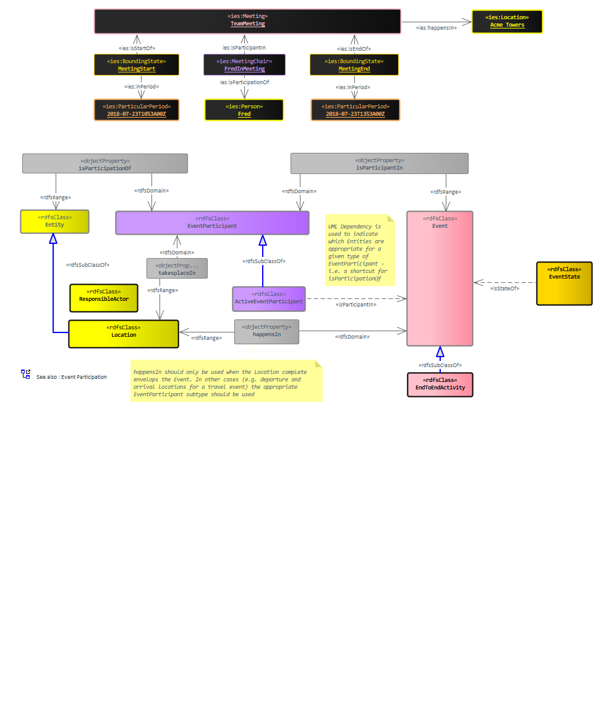

#### IES elements in this diagram:

* [Event](#b376370e-f5e8-4287-a3ec-ac35532919b1)
* [Location](#e1a494ed-d493-44ab-8bf9-abc6889d4d9a)
* [ActiveEventParticipant](#3360dcc9-d39b-4280-8872-2fe122240407)
* [Entity](#f4ede167-6f5a-417d-9984-0221ccdf752c)
* [ResponsibleActor](#d09ede21-e862-4ec1-bc0f-045cce5454a9)
* [EventParticipant](#c5ab420c-1ab6-479a-97e1-4f2fd37725cb)
* [isParticipationOf](#df9f6056-ccd4-41aa-9a86-536f6150ec25)
* [isParticipantIn](#baea86d9-c90e-4f8d-96f5-a01bb0c49711)
* [EndToEndActivity](#a88abe99-1d6c-4843-a2e4-7531626d3859)
* [EventState](#fe668c24-d25c-4273-872a-eb77cb09341d)

An Event is an activity or incident involving one or more participants (i.e. Entities). The participating Entities are related to the Events via an EventParticipant subtype. To relate the EventParticipant to the Entity, use the isParticipationOf relationship. To relate the EventParticipation to the Event, use the isParticipantIn relationship. Rather than create sub-properties of these relationships for each type of EventParticipation, a simplified notation (UML Dependency - dashed line with arrow-head) is used in the Event diagrams to indicate the appropriate Events and Entities for each type of EventParticipation.

There are two key types of EventParticipant - Actor and ActedUpon. Actor relates a Person or Organisation to the Event they conduct. ActedUpon relates an Entity to the Event that has an effect upon them. These two EventParticipants generalise and replace a number of the participants specified in IES 3.x (see the specific Event subtypes for examples).

Locations of Events are handled with more precision in IES4. The happensIn relationship can be used to assert the encompassing Location for the whole Event - e.g. an arrest that takes place in Trafalgar Square. However, some Locations merely participate in the Event - e.g. departure and destination ports, weapon and target locations in attacks, etc. For this reason, happensIn should only be used when the Event takes place entirely within the envelope of the Location. This precision is necessary for interpreting Events in geo systems, timeline visualisations, etc.

### Assessment
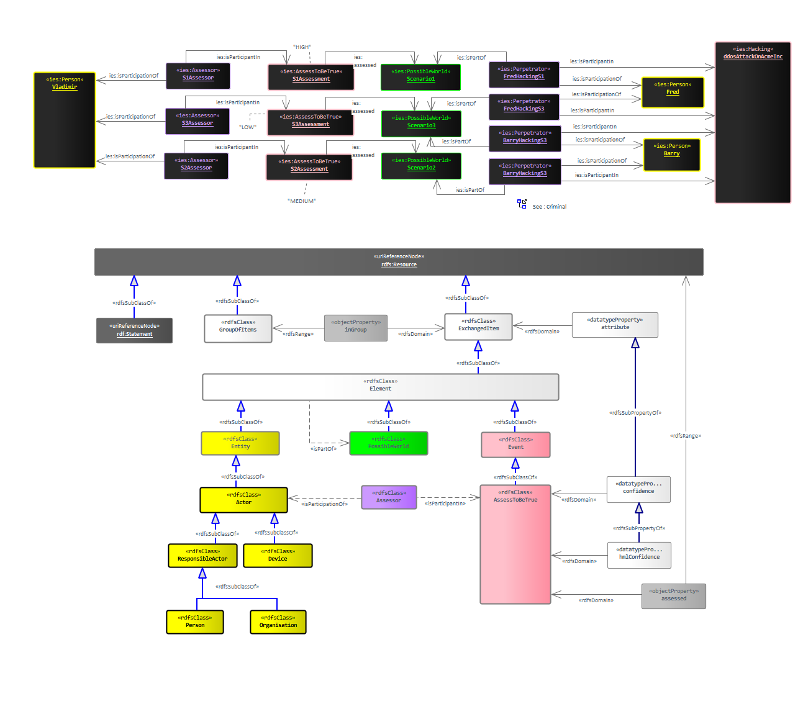

#### IES elements in this diagram:

* [Event](#b376370e-f5e8-4287-a3ec-ac35532919b1)
* [Element](#97edc90f-3b36-4da8-ae77-d5fdbdea2b21)
* [Actor](#b2b15802-9ce9-4a9d-9de0-8289d8474e9b)
* [AssessToBeTrue](#7150208d-a02e-45ed-8279-44843f4da897)
* [Thing](#485cbf1a-04ff-4741-8471-46a03d28c406)
* [Assessor](#80f9b97d-2c7f-4978-83a3-be934dd4e1ff)
* [assessed](#669e3cd0-cd9d-496c-a711-ecde3f589012)
* [attribute](#4a8e5877-32df-428f-9a60-6ac3d083ffca)
* [confidence](#45fe24b3-b146-4199-b760-c1150cef9ab2)
* [hmlConfidence](#04f797e7-9b5c-48c5-a50d-a14cff7725de)
* [PossibleWorld](#15e93b86-6969-47f2-8036-0b7b96e9bda2)
* [inGroup](#c21d2ca2-6f42-4b7c-9092-8b8c5b7baf9f)
* [Person](#5d5c5b9b-5e90-4100-8353-8ee9f3d772e2)
* [Device](#115f2f9b-21f3-4903-8eaa-ab3aefe97461)
* [ResponsibleActor](#d09ede21-e862-4ec1-bc0f-045cce5454a9)
* [Entity](#f4ede167-6f5a-417d-9984-0221ccdf752c)
* [Organisation](#1ecb4c6e-6a30-4dc5-a4ac-9a9df5b6a54f)
* [GroupOfItems](#04c2111a-d958-4a95-9271-7208b849ddd8)
* [Assessment](#e4ab33d9-9978-446f-9c39-4f4c41fb3d45)

The Assessment pattern breaks away from the usual IES EventParticipant pattern slightly. There is still an event (AssessToBeTrue) and a participant (Assessor) but the thing that is being assessed isn't necessarily a participant - it could be something intangible such as Class or relationship, so a simple owl:objectProperty is used to link the event to the thing that has been assessed to be true.

A high, medium, low rating must be provided for all assessments. Whilst it is realised that these values may have different meanings between various parties - e.g. medical, policing, intelligence, etc., there has to be some rough indicator, so hmlConfidence will have to be it. 

A further (e.g. more specific) confidence indicator may also be provided. IES does not mandate how that confidence is measured.  

This model also introduces (new to IES 4.1.0) the idea of a PossibleWorld (as used in ISO15926, IDEAS and Prof Matthew West's guide to high quality data models). A PossibleWorld is a scenario - something that may are may not have occurred, and encompasses a number of events and entities that would have existed in that world. The likelihood of a PossibleWorld is defined using AssessToBeTrue.

In the example shown, there are three scenarios. In scenario 1, Fred is assessed to have carried out the hacking alone. In 2, Barry did it alone. In 3, they both did it. Vladimir has assessed the scenarios with HIGH MEDIUM and LOW confidence. 

### Authorisation
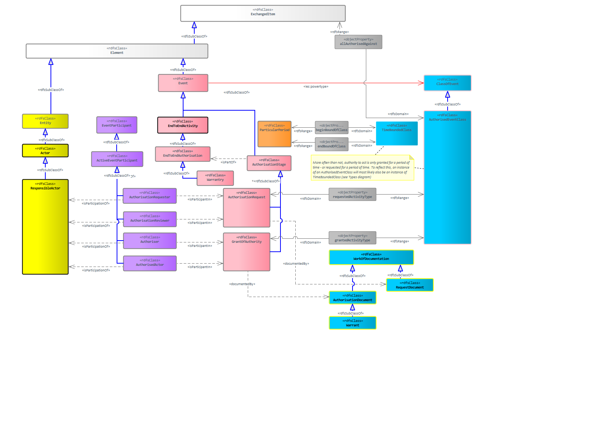

#### IES elements in this diagram: 

* [Event](#b376370e-f5e8-4287-a3ec-ac35532919b1)
* [EndToEndActivity](#a88abe99-1d6c-4843-a2e4-7531626d3859)
* [EndToEndAuthorisation](#d75f18d1-95d6-481b-84d5-f8d7f3a5a389)
* [AuthorisationStage](#2d5069f2-fe77-477f-a607-fa6458e64173)
* [AuthorisationRequest](#1d6bae08-b8f1-4eee-928e-991b3b46eadf)
* [GrantOfAuthority](#f5eaaeee-c0b2-469f-9048-3e0731ed8342)
* [ResponsibleActor](#d09ede21-e862-4ec1-bc0f-045cce5454a9)
* [EventParticipant](#c5ab420c-1ab6-479a-97e1-4f2fd37725cb)
* [ActiveEventParticipant](#3360dcc9-d39b-4280-8872-2fe122240407)
* [AuthorisationReviewer](#8e4cc036-c4c5-4222-8532-9b6c53eec56e)
* [AuthorisationRequester](#81bf6ea6-996d-4148-8f5d-8b41156637f6)
* [Actor](#b2b15802-9ce9-4a9d-9de0-8289d8474e9b)
* [Authoriser](#466dcdfb-b642-468b-a47a-e83291a86c6b)
* [AuthorisedActor](#f69279d2-ba11-4a31-8739-0d91ef5b9bef)
* [Warrantry](#ca2023c6-1677-4d24-a1e6-22bc4d595e6f)
* [Warrant](#4cad884a-1ea7-473d-9881-8b76ebf8526f)
* [WorkOfDocumentation](#f0b48978-d4e4-45a4-8238-091a5b714d82)
* [AuthorisationDocument](#8177a2fb-ca54-4dc5-9884-33fba660b174)
* [RequestDocument](#c0273975-049b-40f0-817c-dfbfa4a3e5ce)

The Authorisation Model (added in v4.2 of IES) is about capturing the end-to-end authorisation process from request, through grant of authority to act, through to the actions that take place under that authority. The primary need for this model is in Police warrantry, though the model is general and can be used for other forms of authorisation. 

The EndToEndAuthorisation is composed of (using isPartOf) the AuthorisationRequest and the GrantOfAuthority. Any other Events that occur under that authority should also be made part of the EndToEndAuthorisation - i.e. it encompasses not only the administration of the authorisation but also the actions that take place under it. 

The request and grant events are linked to the AuthorisedEventClass (or classes) they authorise - e.g. requesting authorisation to travel would mean the travel EventClass is then related to AuthorisationRequest via a requestedActivityType relationship.  It is usual for authorisations (esp. warrants) to be time-bounded. Hence, any AuthorisedEventClass will usually also be an instance of a TimeBoundedClass.

### Observation
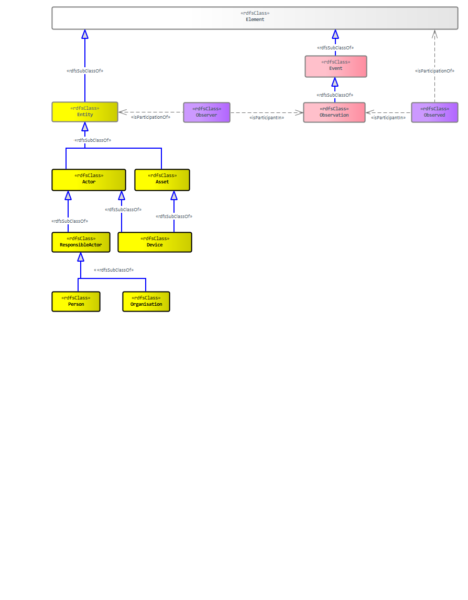

#### IES elements in this diagram:

* [Event](#b376370e-f5e8-4287-a3ec-ac35532919b1)
* [Element](#97edc90f-3b36-4da8-ae77-d5fdbdea2b21)
* [Observation](#8ca40ccf-a099-49fd-80cb-ca6da733fab4)
* [Observer](#c58a1ab4-19e2-48d0-b606-3bdfc5dd3860)
* [Person](#5d5c5b9b-5e90-4100-8353-8ee9f3d772e2)
* [Device](#115f2f9b-21f3-4903-8eaa-ab3aefe97461)
* [ResponsibleActor](#d09ede21-e862-4ec1-bc0f-045cce5454a9)
* [Asset](#40231334-5acc-4dd4-a8c1-05012e2170e0)
* [Entity](#f4ede167-6f5a-417d-9984-0221ccdf752c)
* [Organisation](#1ecb4c6e-6a30-4dc5-a4ac-9a9df5b6a54f)
* [Observed](#cc05abd0-7bab-4484-8e8c-ed07c1aa3c93)
* [Actor](#b2b15802-9ce9-4a9d-9de0-8289d8474e9b)

The Observation pattern specialises the EventParticipation pattern. There is an Event (activity) of Observation, in which one or more Entities can be involved as Observer. Elements (Events or Entities) also participate as the Observed role.

The use of the EventParticipation pattern allows for the locations of Observer and Observed to be different.

### Agreement

#### IES elements in this diagram:

* [Event](#b376370e-f5e8-4287-a3ec-ac35532919b1)
* [EventParticipant](#c5ab420c-1ab6-479a-97e1-4f2fd37725cb)
* [EndToEndAgreement](#1b39630b-b00f-4def-9c65-48082c4ad2e0)
* [AgreementStage](#422b4f1c-da90-400b-8ffd-43c90b4f10f4)
* [Negotiation](#fb2ea8ae-164a-4642-82e3-d2622dc6fccb)
* [Ratification](#31977608-5432-4d6f-aee0-19838197c813)
* [AgreementExecution](#93f71faf-aef4-4e41-8ceb-fc6447b20428)
* [ResponsibleActor](#d09ede21-e862-4ec1-bc0f-045cce5454a9)
* [PartyToAgreement](#af57e842-9bf7-4f6e-b180-ddeacb0f5386)
* [Signatory](#c55a12c9-cf85-4b7c-b422-1d41054e9570)
* [Negotiator](#d4b25aaf-f083-45ba-8188-25de9d86013d)
* [Treaty](#59599c4b-f3de-49a0-b76f-be4cb1293cba)
* [Organisation](#1ecb4c6e-6a30-4dc5-a4ac-9a9df5b6a54f)
* [Nation](#6ae6f8a5-f427-4ea6-babd-5720f07430f5)
* [RegionalConstituency](#fc55d479-07c4-4d98-b48c-5032190e493d)
* [NonDisclosureAgreement](#672c510d-8836-4a41-8921-c732df430278)
* [RentalAgreement](#f38d2e58-c29a-4e3c-93bf-c33800969720)
* [Renter](#e2fc3a09-ec9d-4ab9-b273-a526cb511b5a)
* [RentalProvider](#8ecc64a4-ced0-4122-ab54-64ea870837fc)
* [Rented](#e5c65cab-65be-4502-8b46-5c5cc3c73b00)
* [EndToEndActivity](#a88abe99-1d6c-4843-a2e4-7531626d3859)
* [PoliticalAgreement](#686c8bfb-6cb2-4185-9fcf-89d2d4bb3051)
* [TradeAgreement](#54a4e900-7e8e-49fd-91f4-23adddf2da60)
* [ActiveEventParticipant](#3360dcc9-d39b-4280-8872-2fe122240407)
* [Name](#7d7cc966-56eb-4220-a650-a993e598f2e2)
* [AgreementName](#7a750064-e711-4871-afc3-39057342fb9e)
* [Location](#e1a494ed-d493-44ab-8bf9-abc6889d4d9a)

In IES4, Agreements are handled using a pattern of AgreementStages that form part of an EndToEndAgreement. 

### Disagreement and War
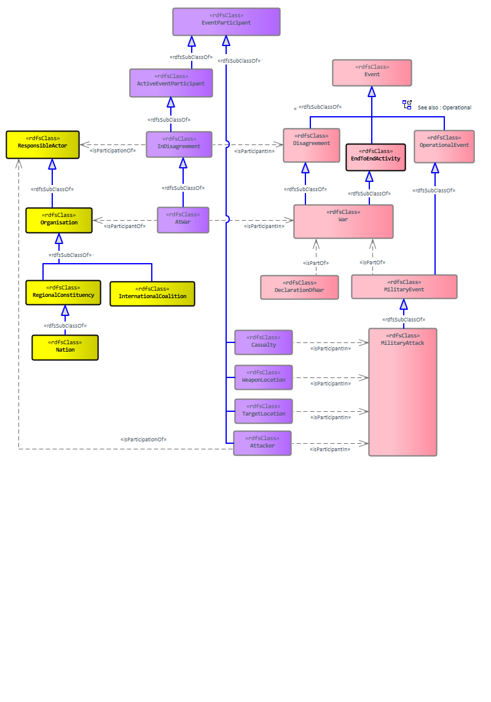

#### IES elements in this diagram:

* [Event](#b376370e-f5e8-4287-a3ec-ac35532919b1)
* [EventParticipant](#c5ab420c-1ab6-479a-97e1-4f2fd37725cb)
* [ResponsibleActor](#d09ede21-e862-4ec1-bc0f-045cce5454a9)
* [Organisation](#1ecb4c6e-6a30-4dc5-a4ac-9a9df5b6a54f)
* [Nation](#6ae6f8a5-f427-4ea6-babd-5720f07430f5)
* [RegionalConstituency](#fc55d479-07c4-4d98-b48c-5032190e493d)
* [Disagreement](#e73c74a9-b356-40a4-bdbb-40567592bbd0)
* [InDisagreement](#f12d45ea-66d5-4016-bdf7-e1cd8f48ccf5)
* [War](#d4f568f5-7bc4-489d-94bc-ae1305e5c0c2)
* [InternationalCoalition](#ae70547d-8e7e-474e-b7fd-f0a81f470157)
* [AtWar](#89953404-8a71-46ef-8f7b-90c12ee286fd)
* [EndToEndActivity](#a88abe99-1d6c-4843-a2e4-7531626d3859)
* [DeclarationOfWar](#5e25dc95-e376-420f-9991-f5175476b386)
* [MilitaryEvent](#8ea1764b-26be-4a72-adef-385c4cd657c3)
* [MilitaryAttack](#8787be51-8fe0-4d76-97b4-608311434f5b)
* [Casualty](#61d00f47-977e-43f6-bd30-77cbaaa74cc1)
* [WeaponLocation](#b513f0d8-e527-4548-8453-d905775e3a4f)
* [TargetLocation](#9bef1c80-3823-4611-9349-aa1e11e41be7)
* [OperationalEvent](#59121c21-38e4-4224-8c2d-4d3e94a3a0d9)
* [ActiveEventParticipant](#3360dcc9-d39b-4280-8872-2fe122240407)
* [Attacker](#73d38c0e-3291-4de9-8920-f37980cb3a9e)

IES3 listed disagreements and war in the event tables. IES4 has maintained these two concepts, making War a specialisation of Disagreement. There are two accompanying EventParticipations (inDisagreement and atWar) also.

### Business
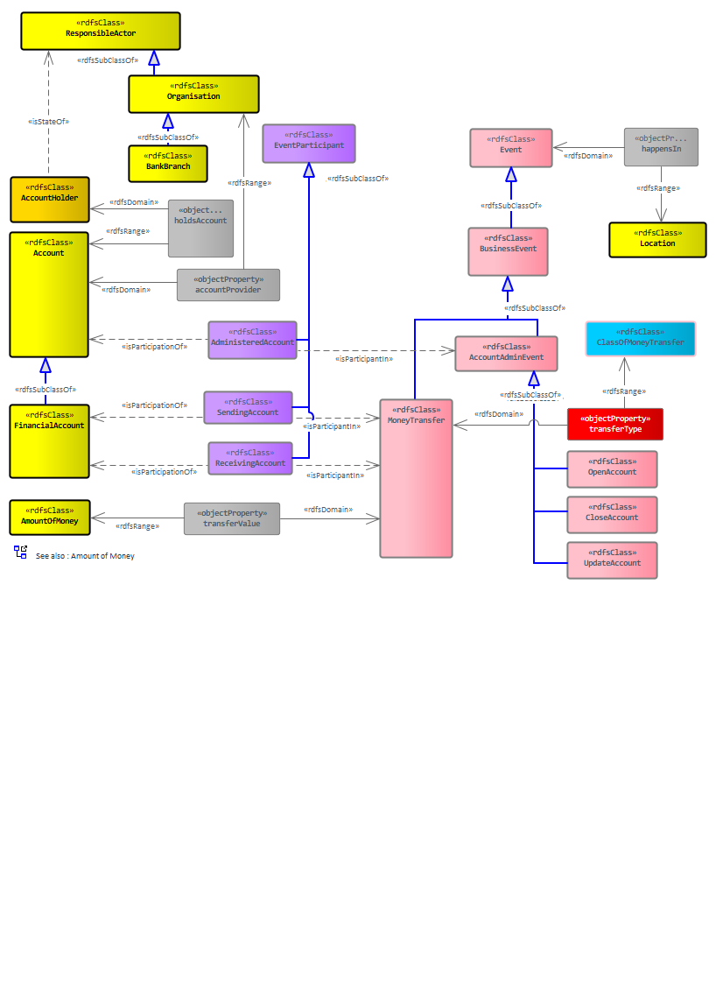

#### IES elements in this diagram:

* [Event](#b376370e-f5e8-4287-a3ec-ac35532919b1)
* [BusinessEvent](#94cedbd1-8e3d-4cb4-8155-fbd621da6a0d)
* [AccountAdminEvent](#19e90ca4-f0eb-4245-826e-edc278642b41)
* [OpenAccount](#a8b06392-a9a3-4de4-93fb-24f08a546434)
* [CloseAccount](#2a5450a7-5b26-4605-a109-5cb26dd9a70f)
* [UpdateAccount](#e2d19be1-b1bf-4e0b-8d44-affd739756ba)
* [holdsAccount](#6314a9b0-4578-42a8-a553-1fddf35ac7f1)
* [ResponsibleActor](#d09ede21-e862-4ec1-bc0f-045cce5454a9)
* [Organisation](#1ecb4c6e-6a30-4dc5-a4ac-9a9df5b6a54f)
* [accountProvider](#0f9244c3-b2f5-4b8a-aed2-54b7fdab9578)
* [FinancialAccount](#44dac574-2a2e-44bc-acd2-236811fa8d29)
* [MoneyTransfer](#d94ed70f-8cca-4c6e-8ae5-65450bba62d7)
* [transferValue](#a9d01dab-281e-48ae-bb33-8518701abbde)
* [EventParticipant](#c5ab420c-1ab6-479a-97e1-4f2fd37725cb)
* [SendingAccount](#f7172876-85f6-4d29-b11f-a1b36616416a)
* [ReceivingAccount](#25965198-3fe0-4bb9-bca9-808e15a3ee49)
* [AdministeredAccount](#d779f547-c1fb-4d48-9bb8-cb37b9d2f82c)
* [Location](#e1a494ed-d493-44ab-8bf9-abc6889d4d9a)
* [Account](#31bfe794-924e-44e3-942e-adc9ed19fba1)
* [AmountOfMoney](#0df94de5-68b7-45b4-a106-a11ce06c31b8)
* [AccountHolder](#c93379f2-6b01-4100-abfa-bd26098ac1cb)
* [BankBranch](#02e3c3b8-8650-4867-8390-823e4b3360e6)

The BusinessEvent model is really about Events that affect accounts - opening them, closing them and updating them. It also covers money transfers between FinancialAccounts.

### Attendance
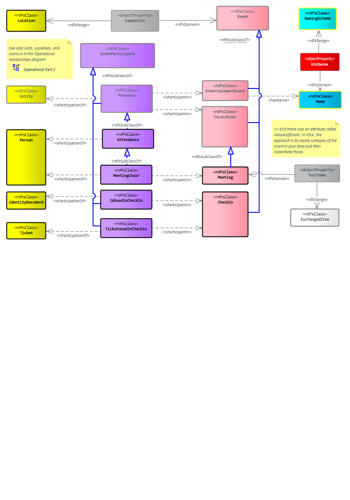

#### IES elements in this diagram:

* [Event](#b376370e-f5e8-4287-a3ec-ac35532919b1)
* [EventParticipant](#c5ab420c-1ab6-479a-97e1-4f2fd37725cb)
* [EntertainmentEvent](#78c33499-cd14-43cb-82ae-93a0f8cf022b)
* [Person](#5d5c5b9b-5e90-4100-8353-8ee9f3d772e2)
* [CoLocation](#3524d10d-d9b0-416d-aded-d5aaeb99dd09)
* [Location](#e1a494ed-d493-44ab-8bf9-abc6889d4d9a)
* [Entity](#f4ede167-6f5a-417d-9984-0221ccdf752c)
* [Presence](#8404464d-3904-4c59-ae0e-b3fafb46ac4e)
* [CheckIn](#87308a03-5c79-4d94-99e1-660042ac7929)
* [IdentityDocument](#bdf4ebd9-7f41-4d90-91a7-571177330c1b)
* [IdUsedInCheckIn](#f481c966-058b-4caf-a427-9e492cad0d63)
* [TicketUsedInCheckIn](#92470c59-dfa6-47f7-a525-50cdabc8f852)
* [Ticket](#0bc61540-2afb-42e6-a845-79771ee0268d)
* [Meeting](#6445e51f-3ddf-4dcf-abdf-3ed123d53188)
* [MeetingChair](#b499c172-310d-4c5f-ba92-93b1c7874eeb)
* [Name](#7d7cc966-56eb-4220-a650-a993e598f2e2)
* [NamingScheme](#222534a5-25c8-4ecd-be55-27da1534d402)
* [inScheme](#7eb9fe85-127c-4918-ac56-62e1be1de825)
* [Attendance](#626d5f2c-9153-40f4-9f2a-393b6db072d3)
* [Thing](#485cbf1a-04ff-4741-8471-46a03d28c406)
* [hasTheme](#654cb83b-75cf-4940-a2cf-c7820141c5ae)

The attendance model in IES4 introduces some new concepts form IES3 - Meeting and CheckIn. These events weren't explicitly called out in IES3 - being colocated doesn't necessarily mean people are meeting.

### Communication
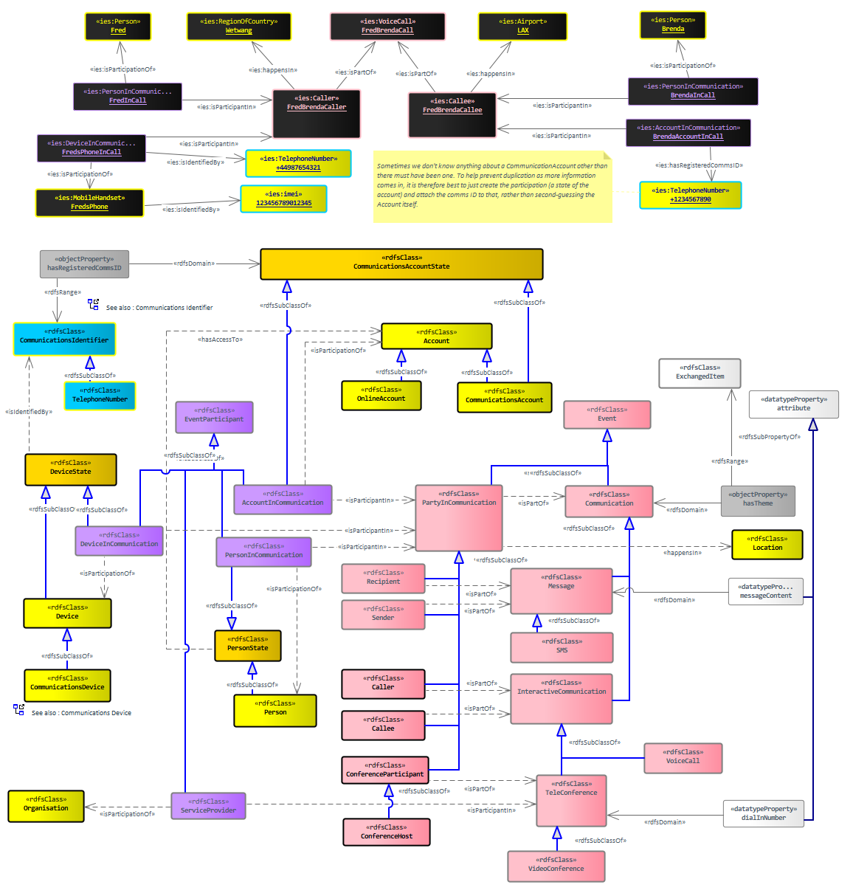

#### IES elements in this diagram:

* [Event](#b376370e-f5e8-4287-a3ec-ac35532919b1)
* [attribute](#4a8e5877-32df-428f-9a60-6ac3d083ffca)
* [Communication](#6698805f-f492-4f1f-954c-e1eb3c53e148)
* [Message](#70aedfc7-2b17-43d8-bf49-b5acf8812317)
* [SMS](#4c19e163-710b-4ccb-9f1c-569f8e348bdc)
* [InteractiveCommunication](#6d5e11ee-c61a-4e38-913f-bbaf2a34a288)
* [VoiceCall](#f186e39f-a251-4b84-85e9-577c7290f6d9)
* [messageContent](#e1a85bea-c374-4727-a189-e536ba248d98)
* [CommunicationsIdentifier](#a82378b9-9774-46b9-9845-cc75be882f06)
* [EventParticipant](#c5ab420c-1ab6-479a-97e1-4f2fd37725cb)
* [Sender](#44c93db5-8dfa-4585-9060-eec789e0a5ac)
* [Recipient](#aac709fb-0b88-4517-b5bb-fe2320992073)
* [Caller](#03ddc2f5-f961-47c2-b8f8-b27a752aec34)
* [Callee](#f50bad6d-ebe0-4fd8-b54c-3e24a62491a6)
* [PartyInCommunication](#a5713b2c-e098-4dd2-bd46-42da51899fea)
* [PersonInCommunication](#0383d09b-8c40-417d-8c1a-75220eaf496e)
* [PersonState](#38f8b795-0bce-4945-8c69-8678ed935c1a)
* [Location](#e1a494ed-d493-44ab-8bf9-abc6889d4d9a)
* [Person](#5d5c5b9b-5e90-4100-8353-8ee9f3d772e2)
* [TeleConference](#6eac8930-3d16-4e44-9706-989bdf6564a5)
* [VideoConference](#1ed09a3d-7ee9-4b7a-8f0b-8590023c9f81)
* [ConferenceParticipant](#5c76fe3f-fe06-4abc-b495-0d4f35fb5252)
* [Organisation](#1ecb4c6e-6a30-4dc5-a4ac-9a9df5b6a54f)
* [ServiceProvider](#496683c9-eb89-46ac-87d0-4864f1b54ed4)
* [ConferenceHost](#b59ab165-6d9c-423f-9cb2-85b4e1b37d93)
* [dialInNumber](#73f2438b-77f5-49ee-b70d-84d5d50b378f)
* [DeviceState](#6107eea5-1a13-46e4-83fb-14740437b814)
* [Device](#115f2f9b-21f3-4903-8eaa-ab3aefe97461)
* [DeviceInCommunication](#0073bd83-64cb-433c-bf4d-a6bb01862f14)
* [CommunicationsDevice](#32eb46a5-0fa4-44e9-a9e9-9424e80bde91)
* [CommunicationsAccount](#8300451c-1df9-4545-9174-d8aa69c58ccd)
* [CommunicationsAccountState](#20bb42f0-3f2d-4bb7-88dd-f4d05377d59b)
* [hasRegisteredCommsID](#e076afb8-f6f8-4b06-82b3-7ed568d1ee73)
* [AccountInCommunication](#942fbf46-a7ef-432b-99dd-1e0e3e874c21)
* [Account](#31bfe794-924e-44e3-942e-adc9ed19fba1)
* [OnlineAccount](#e95170b9-2599-46dc-bedc-012b08f09d43)
* [TelephoneNumber](#168d7b01-cd70-4f83-a414-19b6abeb961c)
* [Thing](#485cbf1a-04ff-4741-8471-46a03d28c406)
* [hasTheme](#654cb83b-75cf-4940-a2cf-c7820141c5ae)

The Communication Event consists of two or more PartyInCommunication events - each being an "end" of the communcation. A PartyInCommunication may involve the participations of people, accounts or devices. 

In the example shown, Fred calls Brenda (we know they were both on the call). We also know which phone Fred used, but we don't know for Brenda, so all we can do is assume she has a US phone account that had a particular number.

### Lifecycle
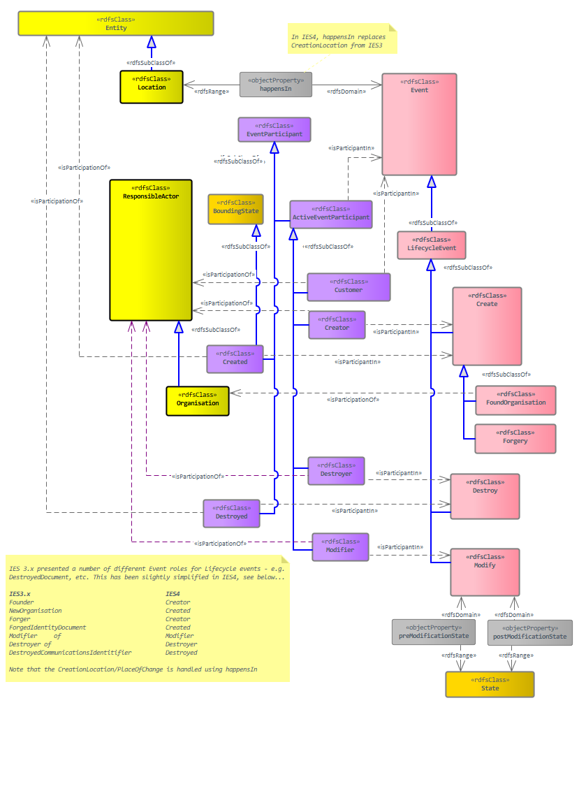

#### IES elements in this diagram:

* [ResponsibleActor](#d09ede21-e862-4ec1-bc0f-045cce5454a9)
* [Event](#b376370e-f5e8-4287-a3ec-ac35532919b1)
* [LifecycleEvent](#fa07ab7a-0ee8-4258-be8b-260f9a1192a7)
* [Create](#af60517b-e4ef-48ca-be0f-56e0a89660fd)
* [Modify](#3ef09ce4-79b0-42be-9aa1-12b97611bf2b)
* [Destroy](#27000bba-f3f9-4355-b466-92ce04477c9b)
* [Entity](#f4ede167-6f5a-417d-9984-0221ccdf752c)
* [FoundOrganisation](#5054afa3-8fc7-449d-93ee-c69b9d2ae118)
* [Forgery](#78686d99-2aac-4f5b-8ee0-456bdcc6f99e)
* [EventParticipant](#c5ab420c-1ab6-479a-97e1-4f2fd37725cb)
* [ActiveEventParticipant](#3360dcc9-d39b-4280-8872-2fe122240407)
* [Location](#e1a494ed-d493-44ab-8bf9-abc6889d4d9a)
* [State](#47301d66-cbd5-4d10-9481-b66966a3f3a2)
* [preModificationState](#4e954855-d50a-42ab-9401-4b1c890542ad)
* [postModificationState](#2b02ef33-e12a-42ec-b047-533f6d8f159d)
* [Customer](#76689446-5969-49d3-8e7e-a92c86c244d5)
* [Created](#46de5d1f-b3ce-4858-a6d1-64a0b891a00f)
* [Destroyed](#e70ca8cd-51dc-4f77-982c-c233f9493ff9)
* [Organisation](#1ecb4c6e-6a30-4dc5-a4ac-9a9df5b6a54f)
* [Creator](#850db6d5-c8e8-4aa8-87a0-4e7680ff854a)
* [Destroyer](#c029299d-5946-48dd-94cb-80ec23a56300)
* [Modifier](#21a341ae-9a38-4f45-bcb5-b29b02dc1b90)
* [BoundingState](#892345cd-9fa7-4982-978d-b6d3abae839c)

Lifecycle Events cover the creation, modification and destruction of things.

Some of the roles originally in IES3 have been simplified in IES4 (see table at the bottom of the diagram)

### OnlineEvent
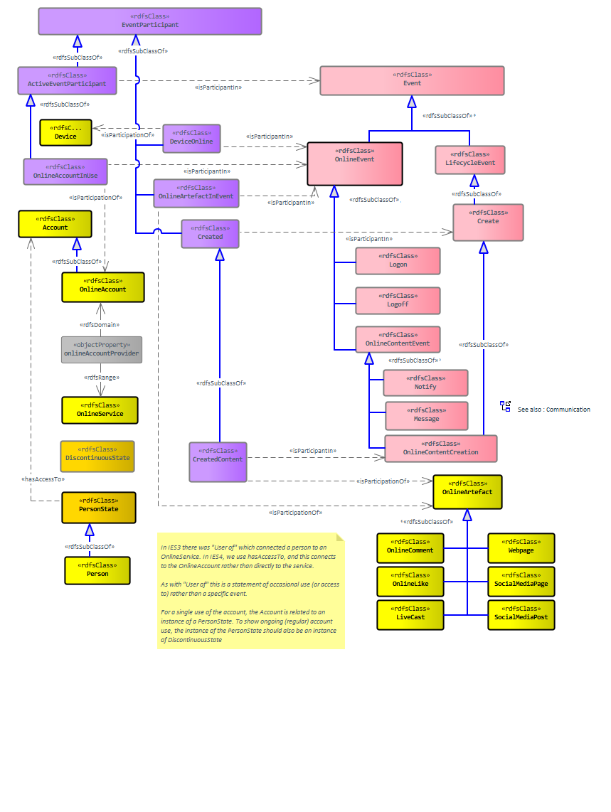

#### IES elements in this diagram:

* [Event](#b376370e-f5e8-4287-a3ec-ac35532919b1)
* [EventParticipant](#c5ab420c-1ab6-479a-97e1-4f2fd37725cb)
* [OnlineEvent](#24499751-7d9b-4f2e-b880-8d5bc4fcef30)
* [Logon](#43cdb7f8-e77e-4eba-a92e-c6a74af954ca)
* [Notify](#15ef63e0-1223-4874-a2d4-43f75acf5315)
* [OnlineAccount](#e95170b9-2599-46dc-bedc-012b08f09d43)
* [OnlineService](#27befd0a-b30b-47db-b863-13e48d1172f9)
* [OnlineAccountInUse](#bcfd5bed-785d-4c5d-b004-2c8a5c7b40c3)
* [onlineAccountProvider](#2cf1b157-a2f6-41c8-8a87-7b82eeb71f40)
* [Person](#5d5c5b9b-5e90-4100-8353-8ee9f3d772e2)
* [ActiveEventParticipant](#3360dcc9-d39b-4280-8872-2fe122240407)
* [Account](#31bfe794-924e-44e3-942e-adc9ed19fba1)
* [PersonState](#38f8b795-0bce-4945-8c69-8678ed935c1a)
* [OnlineArtefactInEvent](#fe21e354-7770-4e6b-a7ea-e012f759e835)
* [OnlineContentCreation](#db70d7ee-5076-4eb2-950b-63c71a3c8859)
* [Logoff](#8010625f-ba25-457a-93cf-7ec1e99261d7)
* [OnlineContentEvent](#2176deae-6b5a-4906-ae37-fc76b0a50c0d)
* [LifecycleEvent](#fa07ab7a-0ee8-4258-be8b-260f9a1192a7)
* [Webpage](#79098c74-e063-4c45-886d-d0b88a48e954)
* [OnlineArtefact](#54500458-51cf-46b5-a5a3-14b1d5c7f755)
* [SocialMediaPage](#3dc012c3-e273-4ec2-a462-cedeb27262c1)
* [SocialMediaPost](#4b3ae19c-6369-49d0-b7b5-949714fffc95)
* [OnlineComment](#ff216817-5b58-4db5-88c5-20ae6a466265)
* [OnlineLike](#5b50eecc-45fc-4e5b-933e-51bc0fee0fcd)
* [LiveCast](#ecc6e85e-cb08-464d-81a4-ba3ecdcb784c)
* [Created](#46de5d1f-b3ce-4858-a6d1-64a0b891a00f)
* [Create](#af60517b-e4ef-48ca-be0f-56e0a89660fd)
* [CreatedContent](#1ebc6375-b26c-4506-b4de-85b74e476362)
* [DeviceOnline](#700bc564-35e1-4921-8759-5dafa51b4e83)
* [Device](#115f2f9b-21f3-4903-8eaa-ab3aefe97461)
* [Message](#70aedfc7-2b17-43d8-bf49-b5acf8812317)
* [OnlineMessage](#067aea85-d3dd-478c-af00-fb54f95df1e2)
* [Communication](#6698805f-f492-4f1f-954c-e1eb3c53e148)

OnlineEvents are activities such as logging in, notifications, etc. 

### Criminal
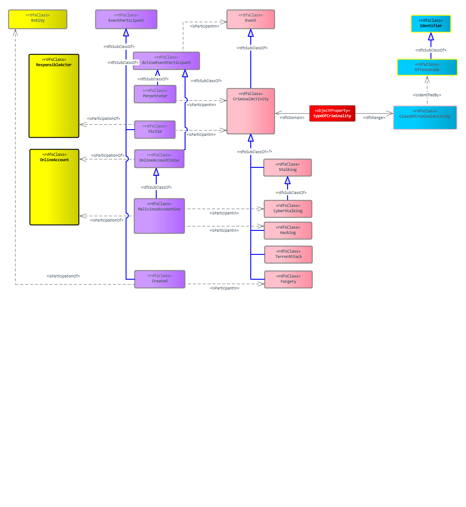

#### IES elements in this diagram:

* [ResponsibleActor](#d09ede21-e862-4ec1-bc0f-045cce5454a9)
* [Entity](#f4ede167-6f5a-417d-9984-0221ccdf752c)
* [EventParticipant](#c5ab420c-1ab6-479a-97e1-4f2fd37725cb)
* [Event](#b376370e-f5e8-4287-a3ec-ac35532919b1)
* [ActiveEventParticipant](#3360dcc9-d39b-4280-8872-2fe122240407)
* [CriminalActivity](#43e58528-16e4-48b3-8f13-10500879ea83)
* [Hacking](#2ac7fdab-7bb8-41ee-b558-aebfe01274f2)
* [TerrorAttack](#f8454637-80dd-44a7-ad91-6dece44f0171)
* [Perpetrator](#d625b538-7d72-4d7d-ba50-d79712a264ed)
* [Victim](#3b47fcd0-e7d1-4b2b-bc07-c96d3f07abc3)
* [Forgery](#78686d99-2aac-4f5b-8ee0-456bdcc6f99e)
* [Stalking](#9b232210-27a3-410a-a713-efde7922c61c)
* [CyberStalking](#8cf52fb7-69f2-4ef2-8074-fb90ee924139)
* [OnlineAccount](#e95170b9-2599-46dc-bedc-012b08f09d43)
* [OnlineAccountInUse](#bcfd5bed-785d-4c5d-b004-2c8a5c7b40c3)
* [MaliciousAccountUse](#f0c08ade-7ee5-4392-9877-5fd8fb4076e9)
* [Created](#46de5d1f-b3ce-4858-a6d1-64a0b891a00f)

Criminal Activity covers any Event that involves breaking the law

### Law Enforcement
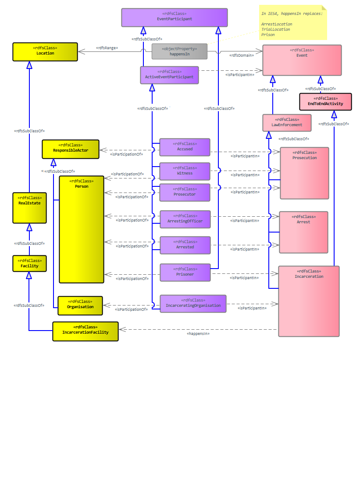

#### IES elements in this diagram:

* [ResponsibleActor](#d09ede21-e862-4ec1-bc0f-045cce5454a9)
* [EventParticipant](#c5ab420c-1ab6-479a-97e1-4f2fd37725cb)
* [Location](#e1a494ed-d493-44ab-8bf9-abc6889d4d9a)
* [Event](#b376370e-f5e8-4287-a3ec-ac35532919b1)
* [ActiveEventParticipant](#3360dcc9-d39b-4280-8872-2fe122240407)
* [LawEnforcement](#3876b81c-e316-4e11-a6c4-8024e52f769b)
* [Arrest](#d8d7184c-2f7b-4a5d-aa8f-7ee7b5a04f94)
* [Person](#5d5c5b9b-5e90-4100-8353-8ee9f3d772e2)
* [Witness](#9c9ed058-4bb5-43d0-a311-ff7a532ed6d6)
* [Prosecution](#024133fe-9d0b-4e5d-a97d-a34b5ea01c41)
* [Organisation](#1ecb4c6e-6a30-4dc5-a4ac-9a9df5b6a54f)
* [Prosecutor](#abdc5fd5-3281-4cd5-a9b0-188292d8c6b7)
* [ArrestingOfficer](#5b3f41c3-91cc-442f-a4f8-615e77751734)
* [Prisoner](#885ea1c2-29d7-4b7c-b479-d43e4f77b5bd)
* [Incarceration](#06972684-050b-4f36-9393-b8790d510f5c)
* [EndToEndActivity](#a88abe99-1d6c-4843-a2e4-7531626d3859)
* [IncarceratingOrganisation](#321cb600-140f-452f-96b7-640de8289ecf)
* [IncarcerationFacility](#b5c15382-451a-4446-bbe6-c67fbdb04402)
* [Accused](#a4d8a62a-dc98-410c-80d2-57c98c1e95c0)
* [Arrested](#b870a3b5-32fa-4aaf-86f1-7db674585f3a)
* [Facility](#9cd2c1b1-85b1-4579-9376-07827ad68461)
* [RealEstate](#8e0df17f-34ee-43c6-8da4-30f698384fd3)

In IES3, law enforcement came under OperationalEvent, but has been separated out for IES4. 

### Operational
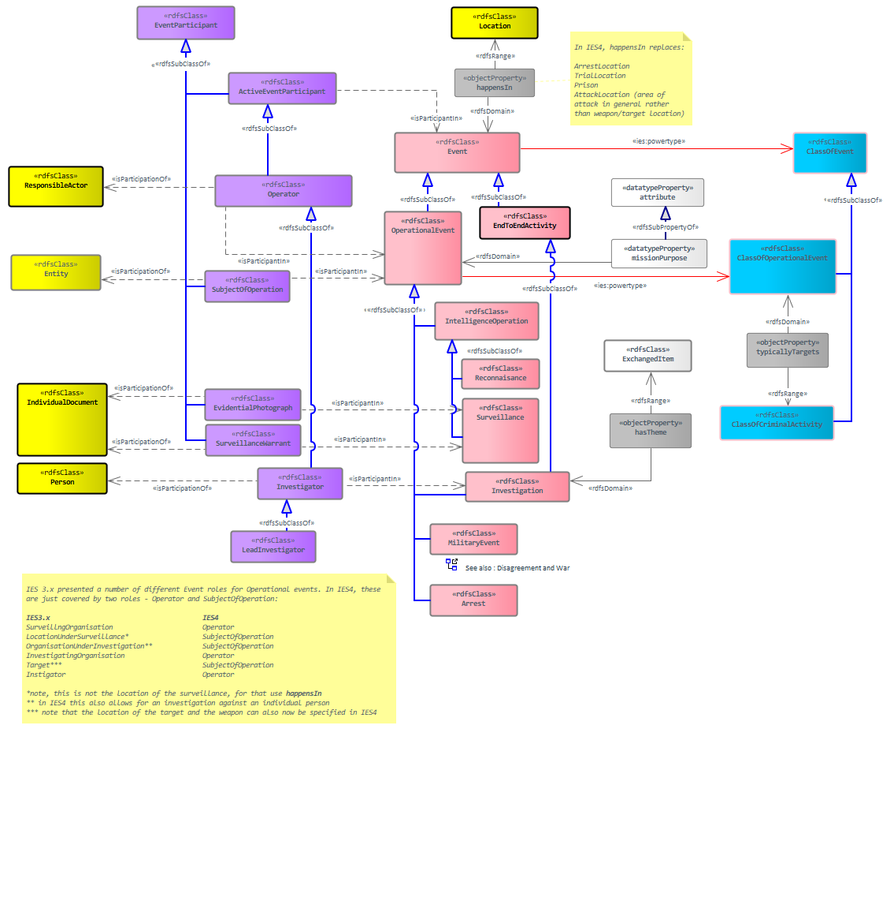

#### IES elements in this diagram:

* [ResponsibleActor](#d09ede21-e862-4ec1-bc0f-045cce5454a9)
* [Entity](#f4ede167-6f5a-417d-9984-0221ccdf752c)
* [EventParticipant](#c5ab420c-1ab6-479a-97e1-4f2fd37725cb)
* [Location](#e1a494ed-d493-44ab-8bf9-abc6889d4d9a)
* [Event](#b376370e-f5e8-4287-a3ec-ac35532919b1)
* [attribute](#4a8e5877-32df-428f-9a60-6ac3d083ffca)
* [ActiveEventParticipant](#3360dcc9-d39b-4280-8872-2fe122240407)
* [OperationalEvent](#59121c21-38e4-4224-8c2d-4d3e94a3a0d9)
* [IntelligenceOperation](#a0a9cd13-a4b4-415b-9187-64c9b72e2f4e)
* [missionPurpose](#a6ded556-12b8-45b7-a69c-a6a3d813269b)
* [Surveillance](#ad0f575e-5c28-4594-b346-50e9f22c2a8e)
* [IndividualDocument](#0f327324-6b4e-40b1-b96b-97a334ba5e4a)
* [EvidentialPhotograph](#affff30f-b274-4466-b0f2-d2a6a78e1832)
* [SurveillanceWarrant](#a86ec717-55af-456c-bec4-e1ba295d0227)
* [Investigation](#2912e599-436d-4b79-b94f-02fa2319f201)
* [Person](#5d5c5b9b-5e90-4100-8353-8ee9f3d772e2)
* [MilitaryEvent](#8ea1764b-26be-4a72-adef-385c4cd657c3)
* [Reconnaisance](#88e8f5e6-afe5-4376-8112-ec294a673923)
* [SubjectOfOperation](#11f2a275-650f-407d-8e86-f99ddef4aaaf)
* [EndToEndActivity](#a88abe99-1d6c-4843-a2e4-7531626d3859)
* [Operator](#6730b57a-3e53-4bd2-b784-78c4fb239dbf)
* [Investigator](#3525f314-87ed-43c8-9a84-68edcd203b30)
* [LeadInvestigator](#e1af7afe-fa2f-40f7-88a3-ca6988bc2e0d)
* [Arrest](#d8d7184c-2f7b-4a5d-aa8f-7ee7b5a04f94)
* [Thing](#485cbf1a-04ff-4741-8471-46a03d28c406)
* [hasTheme](#654cb83b-75cf-4940-a2cf-c7820141c5ae)

Operational Events are conducted against targets (SubjectOfOperation). They specialise into IntelligenceOperations and MilitaryEvents.

### Political
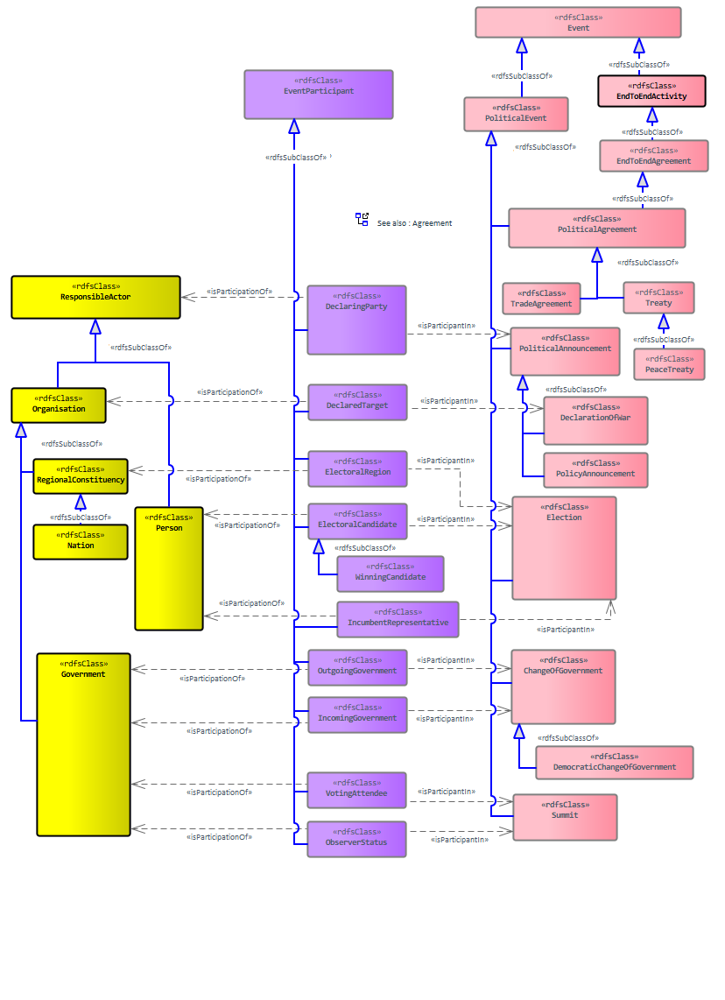

#### IES elements in this diagram:

* [Event](#b376370e-f5e8-4287-a3ec-ac35532919b1)
* [EventParticipant](#c5ab420c-1ab6-479a-97e1-4f2fd37725cb)
* [PoliticalEvent](#3a0e6fdd-5b3b-4092-9549-c05e8a5fed41)
* [ResponsibleActor](#d09ede21-e862-4ec1-bc0f-045cce5454a9)
* [PoliticalAgreement](#686c8bfb-6cb2-4185-9fcf-89d2d4bb3051)
* [TradeAgreement](#54a4e900-7e8e-49fd-91f4-23adddf2da60)
* [PoliticalAnnouncement](#53d5957b-e4b6-4cbb-8ce9-887f7152820f)
* [DeclarationOfWar](#5e25dc95-e376-420f-9991-f5175476b386)
* [PolicyAnnouncement](#345e8f46-ac41-452b-b2f9-694dbed556fd)
* [Nation](#6ae6f8a5-f427-4ea6-babd-5720f07430f5)
* [RegionalConstituency](#fc55d479-07c4-4d98-b48c-5032190e493d)
* [Organisation](#1ecb4c6e-6a30-4dc5-a4ac-9a9df5b6a54f)
* [DeclaringParty](#82139547-0ca1-448d-997f-3386efdf049c)
* [DeclaredTarget](#19b808bb-348e-4ea3-b62e-ed6356f7d4a0)
* [ChangeOfGovernment](#7fa15f56-86c4-47f4-9032-999c17703368)
* [DemocraticChangeOfGovernment](#33c68a39-af9c-4f37-97ea-1de4bac4f7fb)
* [Government](#d62ddbb8-53fc-405a-bc43-89ca337563a0)
* [OutgoingGovernment](#a5516cd2-940b-4827-b38a-ad86af934e99)
* [IncomingGovernment](#bc752c7e-611b-47d6-ba89-05e58cd23803)
* [Election](#7d9e328d-345e-43f5-8163-9657e4d016bd)
* [Person](#5d5c5b9b-5e90-4100-8353-8ee9f3d772e2)
* [ElectoralCandidate](#e035d766-cb68-49c3-ac69-a56f3487c625)
* [ElectoralRegion](#515468c2-b4d9-449d-8ac4-575973efbf6b)
* [WinningCandidate](#9fc35e2c-3d28-4f21-8ff7-3baa51860958)
* [IncumbentRepresentative](#5c4c2871-5f61-4704-83d0-9f8cf42890bf)
* [Summit](#78d65599-bcbb-491a-8c34-75b9f7ab60d5)
* [VotingAttendee](#b94ff143-3681-41eb-8264-d3e85c558efc)
* [ObserverStatus](#fb2fda67-b258-4b18-9e95-3b9dfab8fb14)
* [EndToEndActivity](#a88abe99-1d6c-4843-a2e4-7531626d3859)
* [EndToEndAgreement](#1b39630b-b00f-4def-9c65-48082c4ad2e0)
* [Treaty](#59599c4b-f3de-49a0-b76f-be4cb1293cba)
* [PeaceTreaty](#10fbbf98-4604-46d9-ad12-211597532b9e)

PoliticalEvents are Events that take place in local or national government, or in intergovernmental interactions.

### Trade
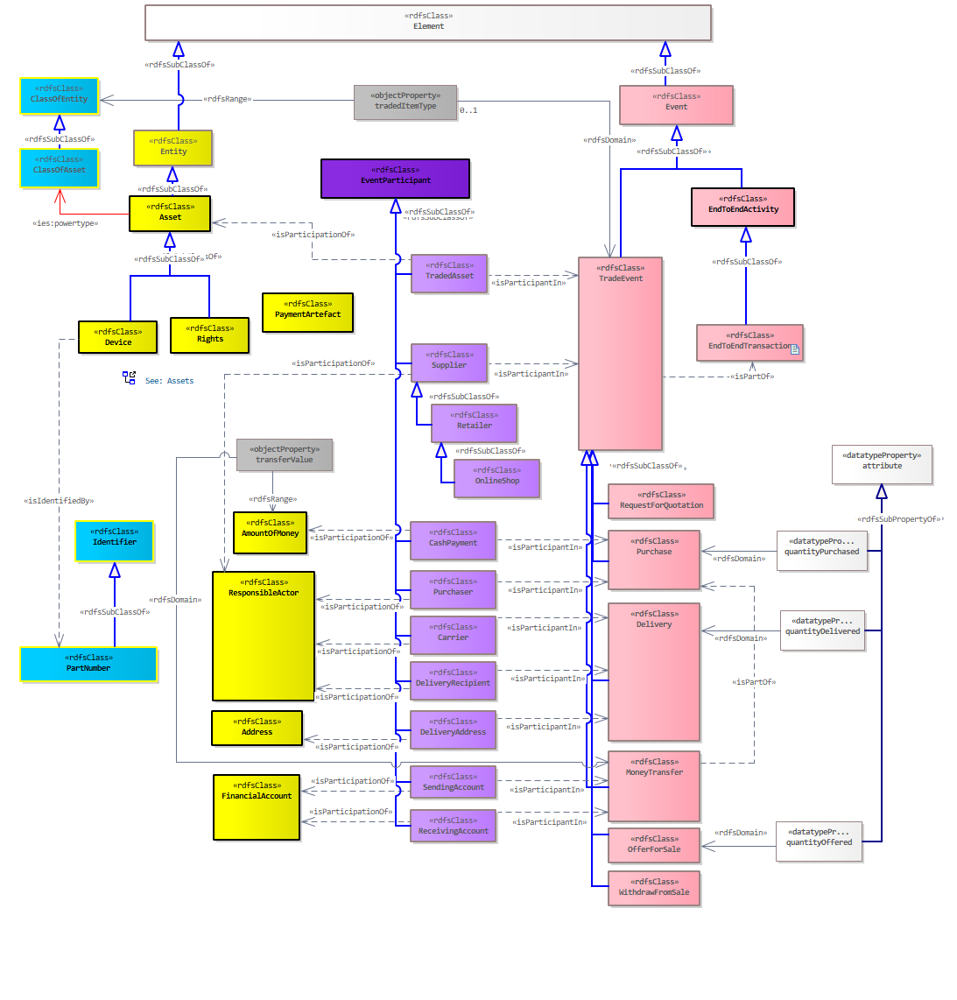

#### IES elements in this diagram:

* [Event](#b376370e-f5e8-4287-a3ec-ac35532919b1)
* [attribute](#4a8e5877-32df-428f-9a60-6ac3d083ffca)
* [EventParticipant](#c5ab420c-1ab6-479a-97e1-4f2fd37725cb)
* [TradeEvent](#ca86862b-da7e-487c-907b-26fa5d0564cd)
* [TradedAsset](#57adbc97-c089-4d1a-a334-a9c44eaec38a)
* [ResponsibleActor](#d09ede21-e862-4ec1-bc0f-045cce5454a9)
* [OfferForSale](#1d589649-490d-4558-91d5-2d977b2b42de)
* [RequestForQuotation](#300203ec-607a-4d77-ae6f-7eae7fa44df2)
* [Delivery](#f428ada5-2349-4cd0-815f-8f768b08c6e6)
* [tradedItemType](#a92f03f0-cb9e-4667-b985-25377303416a)
* [Address](#c90267b5-77a3-4b79-bd0d-7c50c3f4c333)
* [WithdrawFromSale](#9416f72a-9bf9-4c99-839c-76905f02b63b)
* [PaymentArtefact](#9882d901-1b22-4b89-81d1-031f840a20d0)
* [Supplier](#e4d44720-dbee-434e-a61e-35fe8b66a4be)
* [Retailer](#ba2472ab-56f0-462e-9460-f0192abcd979)
* [Purchaser](#b10a694d-31aa-456c-8c51-b7b5f101a39f)
* [OnlineShop](#980404c4-c512-4f36-b3b1-5088cc754dcf)
* [Carrier](#91dc18f6-3e35-411c-814d-5acee83be316)
* [DeliveryRecipient](#63289363-a4d6-4abf-be19-6dcddcf9b28f)
* [DeliveryAddress](#096f83d3-f25e-4d48-96e8-566731c06db1)
* [Purchase](#0a9a9f7d-a6f1-4629-bd2b-7990d2d36493)
* [quantityOffered](#aec476a1-ae39-4a9e-9ee3-dd45b50b0f26)
* [quantityPurchased](#0d2231e8-6af1-4e59-b8fa-86a26334cc71)
* [quantityDelivered](#7550da0f-df0e-4c61-9198-5de767677a3a)
* [AmountOfMoney](#0df94de5-68b7-45b4-a106-a11ce06c31b8)
* [CashPayment](#62a9aa44-6c36-448b-805f-e13203cfb4fc)
* [ClassOfEntity](#d1b2fb30-36ca-4012-b85f-514e270bf541)
* [Asset](#40231334-5acc-4dd4-a8c1-05012e2170e0)
* [EndToEndActivity](#a88abe99-1d6c-4843-a2e4-7531626d3859)
* [EndToEndTransaction](#911eb3de-a001-493d-850d-3cf5a848791d)
* [FinancialAccount](#44dac574-2a2e-44bc-acd2-236811fa8d29)
* [MoneyTransfer](#d94ed70f-8cca-4c6e-8ae5-65450bba62d7)
* [SendingAccount](#f7172876-85f6-4d29-b11f-a1b36616416a)
* [ReceivingAccount](#25965198-3fe0-4bb9-bca9-808e15a3ee49)
* [transferValue](#a9d01dab-281e-48ae-bb33-8518701abbde)
* [ClassOfAsset](#f999f59a-7c7b-40f3-8f86-5b2592889e95)
* [Device](#115f2f9b-21f3-4903-8eaa-ab3aefe97461)
* [Identifier](#315e6ad3-f2da-4f69-864f-da2b95121e2e)
* [PartNumber](#772cd8a3-3dca-4cc7-8ba3-17d1c57e94bc)
* [Element](#97edc90f-3b36-4da8-ae77-d5fdbdea2b21)
* [Entity](#f4ede167-6f5a-417d-9984-0221ccdf752c)
* [Rights](#487778e0-4bd7-4d9a-b7f7-63731478e1a2)

TradeEvents cover the whole sales lifecycle from RFQ to delivery. Individual TradeEvents can be grouped into an EndToEndTransaction 

### Movement
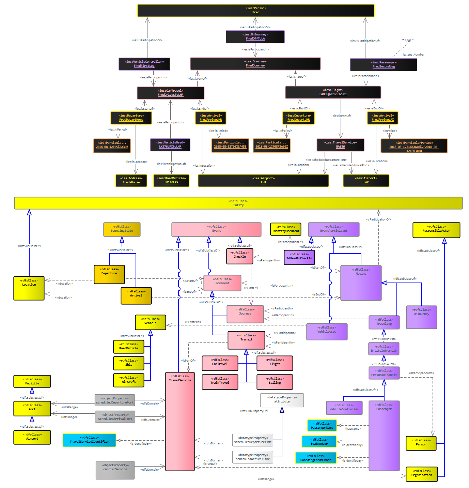

#### IES elements in this diagram:

* [IdUsedInCheckIn](#f481c966-058b-4caf-a427-9e492cad0d63)
* [attribute](#4a8e5877-32df-428f-9a60-6ac3d083ffca)
* [TravelService](#3d0fc30a-cf82-44f2-970e-bfd04eadba74)
* [Flight](#375b0887-712f-43f0-bbf4-5c544d75ac39)
* [Sailing](#803af0e7-01ec-4123-b888-3fb6369c840f)
* [TrainTravel](#f2d6cfe4-bce9-4bce-adb0-075656038a55)
* [scheduledDepartureTime](#340cf0cc-ba75-40b7-8b8a-167cd65c1830)
* [Port](#57860a04-0128-4c7e-9bfd-83d3ba432f8c)
* [scheduledDeparturePort](#1312d263-f609-4df3-a1db-aa0557b3b94b)
* [scheduledArrivalPort](#6bc73189-2b25-4e1c-a935-eda8106f3eb3)
* [scheduledArrivalTime](#db3878d9-ff24-4069-a8dd-c24f5d074c0c)
* [carrierService](#76c31798-780c-41b0-a985-0ae3b1c3a478)
* [Organisation](#1ecb4c6e-6a30-4dc5-a4ac-9a9df5b6a54f)
* [Event](#b376370e-f5e8-4287-a3ec-ac35532919b1)
* [Journey](#8b571665-0aa1-40be-a7a0-a35be86b7192)
* [Facility](#9cd2c1b1-85b1-4579-9376-07827ad68461)
* [BoundingState](#892345cd-9fa7-4982-978d-b6d3abae839c)
* [Arrival](#f2c03da3-b554-4bde-a0de-efb5bee19c56)
* [Departure](#0fcbda68-1b1c-40e1-9c5b-0e225ca827db)
* [Transit](#7693d2c9-0f06-4005-bb8d-b5b572b2281a)
* [EventParticipant](#c5ab420c-1ab6-479a-97e1-4f2fd37725cb)
* [TravelLeg](#55384377-146a-47c9-8706-18a1343a219c)
* [Person](#5d5c5b9b-5e90-4100-8353-8ee9f3d772e2)
* [Passenger](#d6d07656-1866-4cb4-97a7-fc4c1cb65416)
* [Movement](#95b5acc4-956a-4b29-ab9e-bdcd12ef319f)
* [Moving](#d06c3801-f91c-436d-9d7f-dfde29b48e5c)
* [Airport](#82e3793f-d0d1-40ca-927c-7a6fef913503)
* [CarTravel](#f5e2bcd3-4529-42f2-9ed9-95801b42ed3f)
* [PersonInTransit](#9888a3f3-7e9b-4806-bd4e-2fc4d87a5902)
* [VehicleController](#93a816a9-eb7b-4250-8a1a-8919488029a7)
* [Vehicle](#3b916f09-f3f4-43e9-9c84-99009c685396)
* [Entity](#f4ede167-6f5a-417d-9984-0221ccdf752c)
* [Location](#e1a494ed-d493-44ab-8bf9-abc6889d4d9a)
* [VehicleUsed](#2202f5b0-df49-4db5-a8f9-31fc2cc89005)
* [RoadVehicle](#830b2164-e880-4bef-a62c-b38ceb6a824d)
* [Aircraft](#01a64a84-7a14-45a5-aaf2-f1aa614d5f30)
* [Ship](#14098560-1ff3-4599-b9a5-41167861538b)
* [EntityInTransit](#74169219-a47c-48ce-a25f-3948e7e873b6)
* [ResponsibleActor](#d09ede21-e862-4ec1-bc0f-045cce5454a9)
* [OnJourney](#80afd655-a969-46be-be72-035c053c1c4f)
* [IdentityDocument](#bdf4ebd9-7f41-4d90-91a7-571177330c1b)
* [CheckIn](#87308a03-5c79-4d94-99e1-660042ac7929)
* [TravelServiceIdentifier](#680fd822-c1f6-4d09-94d5-5d586c947de1)
* [PassengerName](#e5c1270d-35ad-4f86-b0e4-1dc0039174e3)
* [SeatNumber](#03d1711e-f9a7-41b1-b82f-b442fdf82ebf)
* [BoardingCardNumber](#683e5b90-2514-4342-ae34-894d2dac2af0)

The Travel model in IES4 is based on that from IES3, but combines the concepts on TravelService an Travel into one model. As a result of this merging, the model can appear somewhat daunting, but is really made up four basic concepts:

* Movement - an event where one or more Entities move from one location to another. Pretty much everything about this is optional - we may not know what moved, where it started or where it ended.
* Moving - the state of an Entity when it is moving. This can be (and usually will be) part of a Movement event (when we want to say more about the other participants). However, it can be used on its own, as the state of an Entity just to say we knew the Entity moved.
* Journey - a Movement which is made up of two or more TravelLegs (also Movements). Journeys are used to collect together individual movements into an end-to-end journey
* TravelService - the end to end provision of a regular, scheduled travel function - this could be a bus route, a numbered flight (e.g. BA123) or a regular sailing.

All the above can have Departure and Arrival states, and those states can be in a Location, and in a Period. Additionally, IES allows for the specification of the actual Vehicle used, and in the case of People in transit, whether a person was driving / piloting or was simply as passenger.

Overall, much like the rest of IES, this model has been designed to work with as much or as little detail as is available. The (moderately complex) example below shows Fred's Journey to Los Angeles. The first leg is by car to Heathrow Airport, then by plane to LAX. We don't know what happened to him after his arrival in LAX.

### Travel Booking
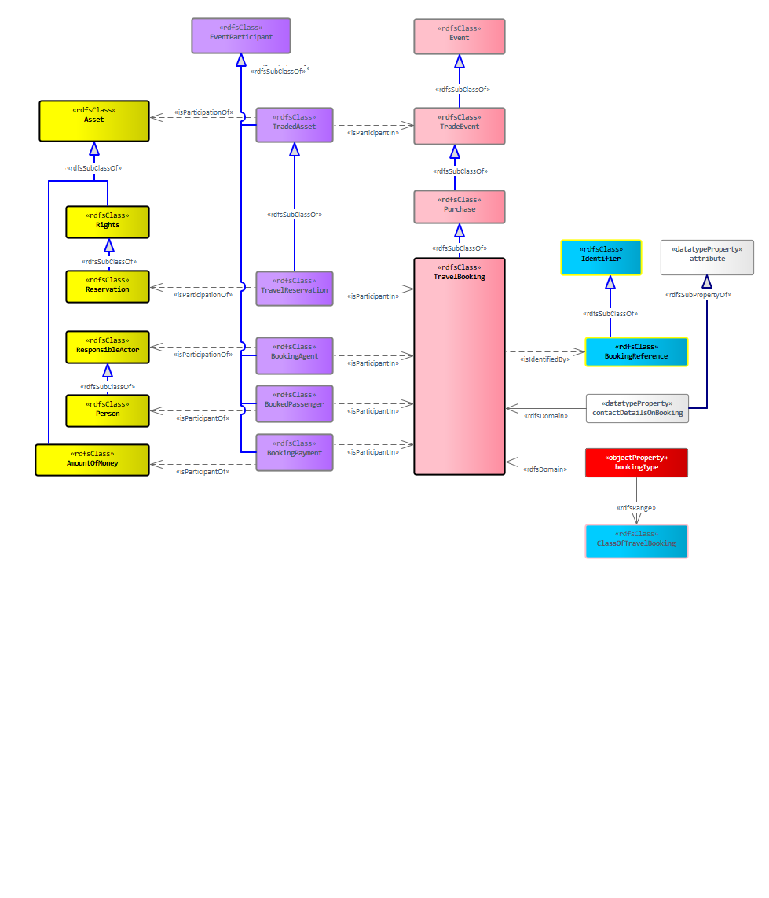

#### IES elements in this diagram:

* [attribute](#4a8e5877-32df-428f-9a60-6ac3d083ffca)
* [TravelBooking](#76dc9a0c-f6e8-4ff4-add6-072dc1ebe3ab)
* [contactDetailsOnBooking](#b54bb629-e007-4099-bc01-b512894f1e89)
* [BookedPassenger](#53c6bca9-4d66-4bac-b946-0a8541cf510a)
* [Person](#5d5c5b9b-5e90-4100-8353-8ee9f3d772e2)
* [ResponsibleActor](#d09ede21-e862-4ec1-bc0f-045cce5454a9)
* [EventParticipant](#c5ab420c-1ab6-479a-97e1-4f2fd37725cb)
* [BookingAgent](#0af87601-5b3e-4c5e-8149-d0d3c0073c42)
* [Event](#b376370e-f5e8-4287-a3ec-ac35532919b1)
* [AmountOfMoney](#0df94de5-68b7-45b4-a106-a11ce06c31b8)
* [BookingPayment](#61bdeba6-be87-44e3-a1c7-246d0ce60adc)
* [Identifier](#315e6ad3-f2da-4f69-864f-da2b95121e2e)
* [BookingReference](#d31e959a-6354-40e7-8370-1fe5246624ad)
* [Asset](#40231334-5acc-4dd4-a8c1-05012e2170e0)
* [Rights](#487778e0-4bd7-4d9a-b7f7-63731478e1a2)
* [Reservation](#cdf94674-d458-4996-9a99-6cbfff3907eb)
* [TradeEvent](#ca86862b-da7e-487c-907b-26fa5d0564cd)
* [TradedAsset](#57adbc97-c089-4d1a-a334-a9c44eaec38a)
* [Purchase](#0a9a9f7d-a6f1-4629-bd2b-7990d2d36493)
* [TravelReservation](#8b290363-239e-415e-9f2d-8267d1ba2ecb)

The booking of planned travel arrangements.

TravelBookings may include bookings for Flights, Ferry Crossings, Train Journeys (i.e Travel Services), and also Hotels, Hire Cars etc. when these have been modelled. These will be included on the booking as relationships to the appropriate other entities.

TravelBooking is currently an Entity though there is some debate as to whether it really should be an Event

### All Events
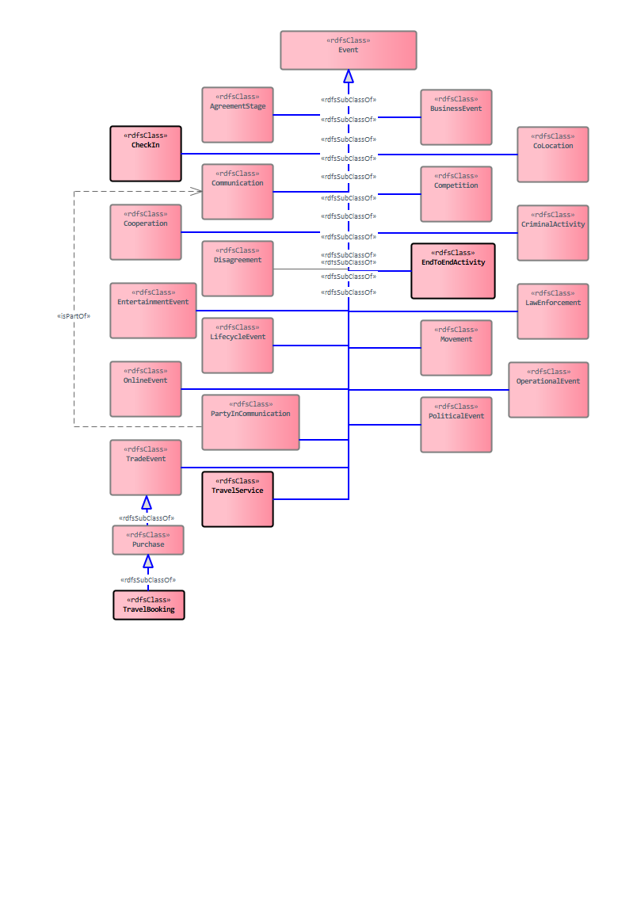

#### IES elements in this diagram:

* [BusinessEvent](#94cedbd1-8e3d-4cb4-8155-fbd621da6a0d)
* [Communication](#6698805f-f492-4f1f-954c-e1eb3c53e148)
* [LifecycleEvent](#fa07ab7a-0ee8-4258-be8b-260f9a1192a7)
* [CriminalActivity](#43e58528-16e4-48b3-8f13-10500879ea83)
* [OnlineEvent](#24499751-7d9b-4f2e-b880-8d5bc4fcef30)
* [TradeEvent](#ca86862b-da7e-487c-907b-26fa5d0564cd)
* [CheckIn](#87308a03-5c79-4d94-99e1-660042ac7929)
* [EndToEndActivity](#a88abe99-1d6c-4843-a2e4-7531626d3859)
* [Competition](#98421510-0a8a-4942-9743-191ea0dca9e6)
* [Cooperation](#f650b9e3-2669-455e-b20c-92737cfd9a08)
* [PartyInCommunication](#a5713b2c-e098-4dd2-bd46-42da51899fea)
* [Disagreement](#e73c74a9-b356-40a4-bdbb-40567592bbd0)
* [AgreementStage](#422b4f1c-da90-400b-8ffd-43c90b4f10f4)
* [Movement](#95b5acc4-956a-4b29-ab9e-bdcd12ef319f)
* [CoLocation](#3524d10d-d9b0-416d-aded-d5aaeb99dd09)
* [EntertainmentEvent](#78c33499-cd14-43cb-82ae-93a0f8cf022b)
* [PoliticalEvent](#3a0e6fdd-5b3b-4092-9549-c05e8a5fed41)
* [LawEnforcement](#3876b81c-e316-4e11-a6c4-8024e52f769b)
* [OperationalEvent](#59121c21-38e4-4224-8c2d-4d3e94a3a0d9)
* [TravelService](#3d0fc30a-cf82-44f2-970e-bfd04eadba74)
* [TravelBooking](#76dc9a0c-f6e8-4ff4-add6-072dc1ebe3ab)
* [Event](#b376370e-f5e8-4287-a3ec-ac35532919b1)
* [Purchase](#0a9a9f7d-a6f1-4629-bd2b-7990d2d36493)

The diagram below shows all the immediate subtypes of Event

## Relationships

### Familial
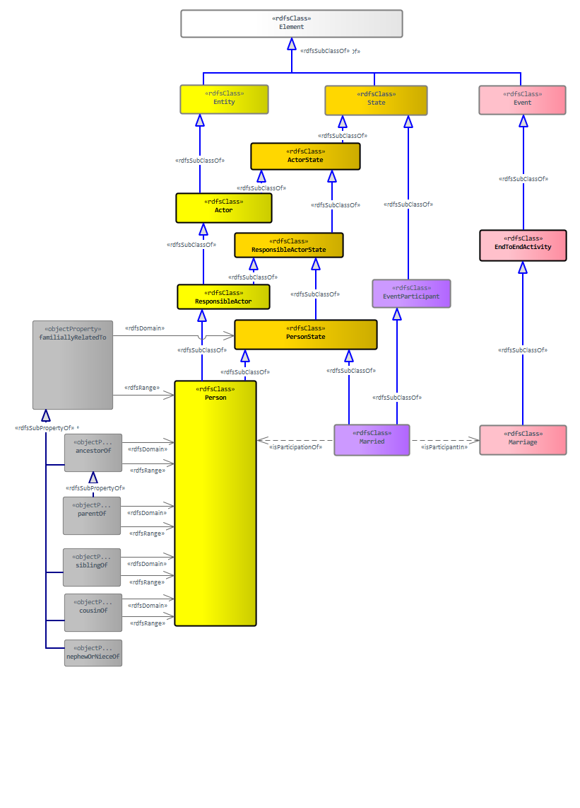

#### IES elements in this diagram:

* [Person](#5d5c5b9b-5e90-4100-8353-8ee9f3d772e2)
* [Element](#97edc90f-3b36-4da8-ae77-d5fdbdea2b21)
* [siblingOf](#a0d40c4f-b513-4c9f-8d4a-79d0fa7cef50)
* [Married](#d03a0d8b-79f5-4901-97bc-2767fd46cd5f)
* [parentOf](#6f13083c-505a-473e-9edb-b0e534a341fb)
* [ancestorOf](#15388c46-262d-4f70-8f65-83758a5aeaf5)
* [familiallyRelatedTo](#3aa26ac6-206d-4b6d-bdec-c9e2b4814be7)
* [Entity](#f4ede167-6f5a-417d-9984-0221ccdf752c)
* [ResponsibleActor](#d09ede21-e862-4ec1-bc0f-045cce5454a9)
* [State](#47301d66-cbd5-4d10-9481-b66966a3f3a2)
* [PersonState](#38f8b795-0bce-4945-8c69-8678ed935c1a)
* [ResponsibleActorState](#100b93cd-937e-4fdd-8851-02d1dc07f5b6)
* [Event](#b376370e-f5e8-4287-a3ec-ac35532919b1)
* [EndToEndActivity](#a88abe99-1d6c-4843-a2e4-7531626d3859)
* [Marriage](#9dfedf24-1203-4341-b282-bd37c1b9cdf5)
* [EventParticipant](#c5ab420c-1ab6-479a-97e1-4f2fd37725cb)
* [nephewOrNieceOf](#1995033d-7af2-468c-998d-61e86fb51b16)
* [cousinOf](#32a625fa-3159-4b36-b551-3742ba11c7a8)
* [ActorState](#7ed8bc7c-a85f-4ed5-ac6f-d640f2df4b7b)
* [Actor](#b2b15802-9ce9-4a9d-9de0-8289d8474e9b)

Most of the familial relationships from IES3 end up being relationships in IES4 - in fact the blood relations end up being between whole-life Person entities as the relationship lasts for life. The one exception is Marriage which has been modelled as an EndToEndActivity due to its temporal nature and the fact that the "relationship" is bidirectional. 

### Interest
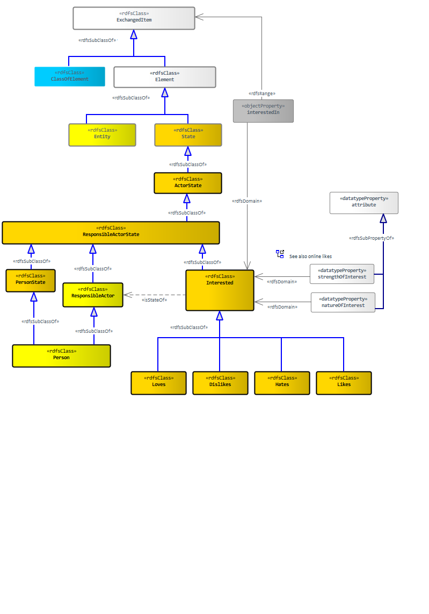

#### IES elements in this diagram:

* [Person](#5d5c5b9b-5e90-4100-8353-8ee9f3d772e2)
* [Entity](#f4ede167-6f5a-417d-9984-0221ccdf752c)
* [Element](#97edc90f-3b36-4da8-ae77-d5fdbdea2b21)
* [State](#47301d66-cbd5-4d10-9481-b66966a3f3a2)
* [PersonState](#38f8b795-0bce-4945-8c69-8678ed935c1a)
* [interestedIn](#7bd2b884-f02c-4da2-af6a-21b790fbf669)
* [ResponsibleActorState](#100b93cd-937e-4fdd-8851-02d1dc07f5b6)
* [Thing](#485cbf1a-04ff-4741-8471-46a03d28c406)
* [ClassOfElement](#3c13e07d-5796-4d03-9ebc-c75277e87ca4)
* [Dislikes](#30a0f2da-db31-40fd-8723-88a24b2f8448)
* [Likes](#b292748f-d41e-4c3b-9335-04d4b06a1f34)
* [attribute](#4a8e5877-32df-428f-9a60-6ac3d083ffca)
* [strengthOfInterest](#49b3d340-aadc-4fcd-80cc-283ae0fc85df)
* [natureOfInterest](#0c0728af-b9f2-418f-a03e-107689f0aca0)
* [Loves](#e543978a-06d0-4c79-bccd-a62de9294a85)
* [Hates](#6939ae2f-d74d-4446-8a88-5c26669689ba)
* [ActorState](#7ed8bc7c-a85f-4ed5-ac6f-d640f2df4b7b)
* [Interested](#b1d011f9-9585-49eb-97c4-86e82d6f0bcf)
* [ResponsibleActor](#d09ede21-e862-4ec1-bc0f-045cce5454a9)

The interestedIn relationship links a ResponsibleActorState to something they are interested in (any Thing). The state is used, as people tend not to be interested in something for their whole lives. 

GeneralConcepts are often the things of interest (e.g. football, finance, animal husbandry, etc.), but there may be Entities that are also of interest (e.g. a financier being interested in Vodafone plc)

### Lifecycle Relationships
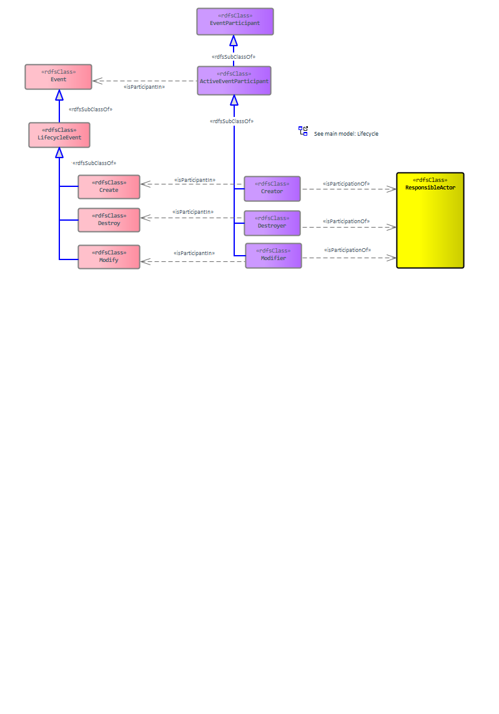

#### IES elements in this diagram:

* [Event](#b376370e-f5e8-4287-a3ec-ac35532919b1)
* [ResponsibleActor](#d09ede21-e862-4ec1-bc0f-045cce5454a9)
* [LifecycleEvent](#fa07ab7a-0ee8-4258-be8b-260f9a1192a7)
* [Create](#af60517b-e4ef-48ca-be0f-56e0a89660fd)
* [Creator](#850db6d5-c8e8-4aa8-87a0-4e7680ff854a)
* [Destroyer](#c029299d-5946-48dd-94cb-80ec23a56300)
* [Modifier](#21a341ae-9a38-4f45-bcb5-b29b02dc1b90)
* [Modify](#3ef09ce4-79b0-42be-9aa1-12b97611bf2b)
* [Destroy](#27000bba-f3f9-4355-b466-92ce04477c9b)
* [ActiveEventParticipant](#3360dcc9-d39b-4280-8872-2fe122240407)
* [EventParticipant](#c5ab420c-1ab6-479a-97e1-4f2fd37725cb)

All of the Lifecycle relationships from IES3 end up being EventParticipants in IES4

### Mutual Understanding

#### IES elements in this diagram:

* [EndToEndAgreement](#1b39630b-b00f-4def-9c65-48082c4ad2e0)
* [Negotiation](#fb2ea8ae-164a-4642-82e3-d2622dc6fccb)
* [Ratification](#31977608-5432-4d6f-aee0-19838197c813)
* [ResponsibleActor](#d09ede21-e862-4ec1-bc0f-045cce5454a9)
* [PartyToAgreement](#af57e842-9bf7-4f6e-b180-ddeacb0f5386)
* [Signatory](#c55a12c9-cf85-4b7c-b422-1d41054e9570)
* [Negotiator](#d4b25aaf-f083-45ba-8188-25de9d86013d)
* [Organisation](#1ecb4c6e-6a30-4dc5-a4ac-9a9df5b6a54f)
* [War](#d4f568f5-7bc4-489d-94bc-ae1305e5c0c2)
* [AtWar](#89953404-8a71-46ef-8f7b-90c12ee286fd)
* [ActiveEventParticipant](#3360dcc9-d39b-4280-8872-2fe122240407)
* [EventParticipant](#c5ab420c-1ab6-479a-97e1-4f2fd37725cb)
* [InDisagreement](#f12d45ea-66d5-4016-bdf7-e1cd8f48ccf5)
* [Disagreement](#e73c74a9-b356-40a4-bdbb-40567592bbd0)

All of the Mutual Understanding relationships from IES3 end up being EventParticipants in IES4

### Operational Part 1
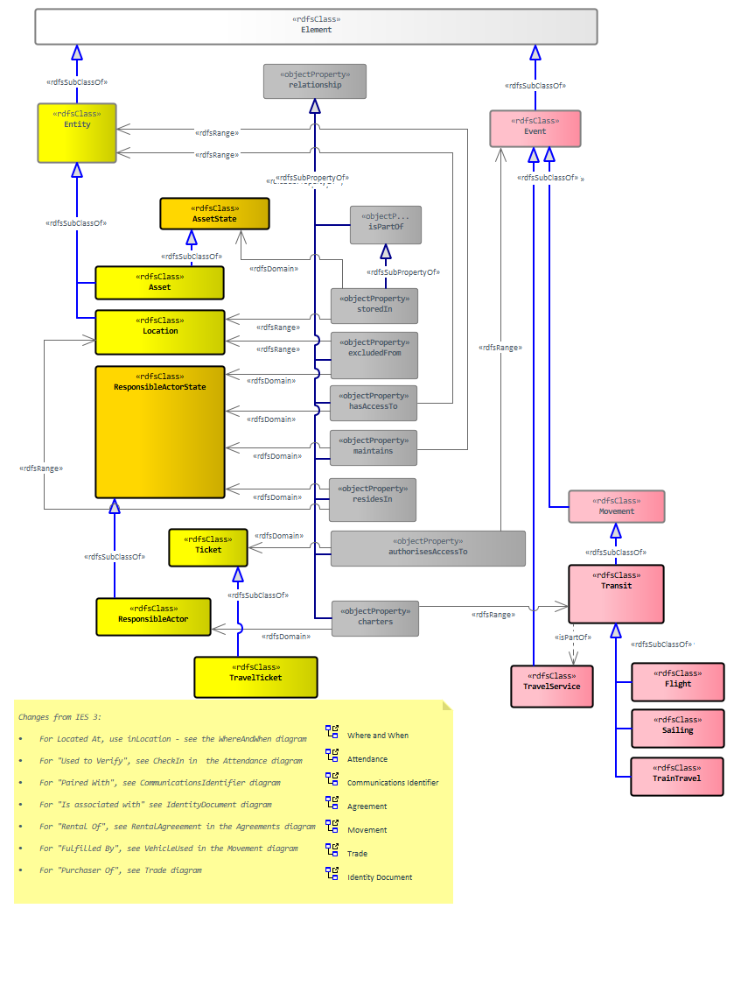

#### IES elements in this diagram:

* [TravelService](#3d0fc30a-cf82-44f2-970e-bfd04eadba74)
* [Flight](#375b0887-712f-43f0-bbf4-5c544d75ac39)
* [Sailing](#803af0e7-01ec-4123-b888-3fb6369c840f)
* [TrainTravel](#f2d6cfe4-bce9-4bce-adb0-075656038a55)
* [Transit](#7693d2c9-0f06-4005-bb8d-b5b572b2281a)
* [relationship](#dce662f5-7bdb-457e-ae7e-2e5fe43dba1a)
* [ResponsibleActor](#d09ede21-e862-4ec1-bc0f-045cce5454a9)
* [charters](#48223a62-12e6-4953-8f80-8c7a48151825)
* [excludedFrom](#883b5479-62dd-47a4-bc14-9a11835d820b)
* [Location](#e1a494ed-d493-44ab-8bf9-abc6889d4d9a)
* [ResponsibleActorState](#100b93cd-937e-4fdd-8851-02d1dc07f5b6)
* [Entity](#f4ede167-6f5a-417d-9984-0221ccdf752c)
* [hasAccessTo](#cb7f872f-7999-4bfd-8274-2c0e0afe22ab)
* [Movement](#95b5acc4-956a-4b29-ab9e-bdcd12ef319f)
* [Event](#b376370e-f5e8-4287-a3ec-ac35532919b1)
* [Element](#97edc90f-3b36-4da8-ae77-d5fdbdea2b21)
* [maintains](#727175d4-0998-49a0-baee-6b8f1f1fd8d4)
* [residesIn](#6bc3ddd8-477e-4c8a-b85d-e637cf9db6df)
* [Asset](#40231334-5acc-4dd4-a8c1-05012e2170e0)
* [AssetState](#ca196722-9531-4eb4-a8cf-b9a5145cdcfd)
* [TravelTicket](#6c669bef-9267-4612-9f29-b28918b203f5)
* [Ticket](#0bc61540-2afb-42e6-a845-79771ee0268d)
* [authorisesAccessTo](#a2da918d-843c-43c9-a974-4795601e9d65)

### Operational Part 2
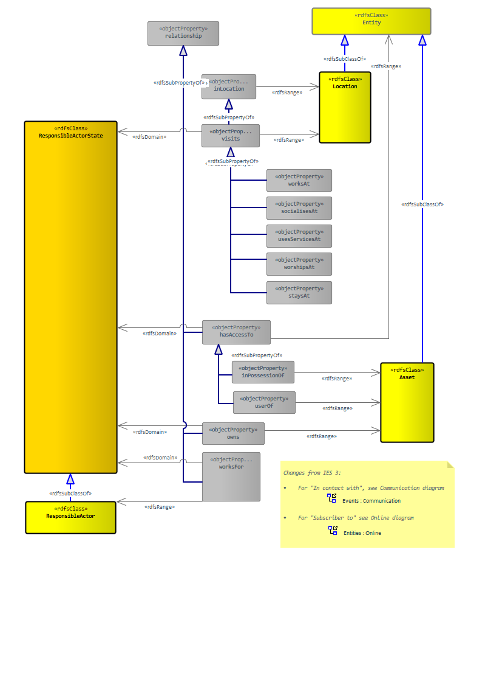

#### IES elements in this diagram:

* [Asset](#40231334-5acc-4dd4-a8c1-05012e2170e0)
* [relationship](#dce662f5-7bdb-457e-ae7e-2e5fe43dba1a)
* [Location](#e1a494ed-d493-44ab-8bf9-abc6889d4d9a)
* [ResponsibleActorState](#100b93cd-937e-4fdd-8851-02d1dc07f5b6)
* [owns](#fdd94d9f-f343-4c1b-9688-752c896a3c7c)
* [inPossessionOf](#0a28624b-c5e3-461e-b84a-e55b550b5dd6)
* [ResponsibleActor](#d09ede21-e862-4ec1-bc0f-045cce5454a9)
* [userOf](#01984617-c96d-48b3-acde-25f525719aef)
* [worksFor](#181aac84-26ce-4531-ac32-a73b8fd8b858)
* [visits](#92fc2c35-d40b-4393-ba0b-88849743feb6)
* [inLocation](#463f9b14-2d14-4364-b4f0-658a20dfcbfa)
* [socialisesAt](#1d9f0978-efd2-4e27-9242-219637c574ef)
* [worksAt](#55161540-8869-4af9-b159-51857e0b0bdb)
* [usesServicesAt](#958e4d57-8a19-4855-b9b3-6bb2f93f77b7)
* [worshipsAt](#475617c7-bee3-4c5e-8749-9386b68a8da5)
* [hasAccessTo](#cb7f872f-7999-4bfd-8274-2c0e0afe22ab)
* [Entity](#f4ede167-6f5a-417d-9984-0221ccdf752c)
* [staysAt](#90332c00-0188-4773-8a71-f9ed15f5ed33)

### Professional
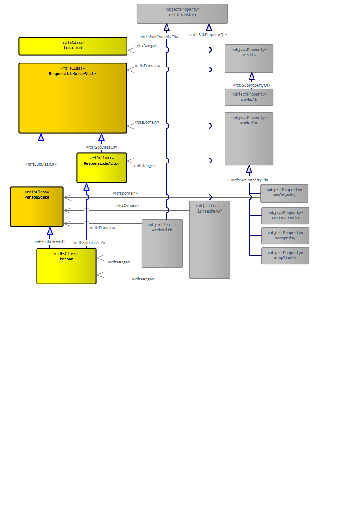

#### IES elements in this diagram:

* [relationship](#dce662f5-7bdb-457e-ae7e-2e5fe43dba1a)
* [ResponsibleActorState](#100b93cd-937e-4fdd-8851-02d1dc07f5b6)
* [ResponsibleActor](#d09ede21-e862-4ec1-bc0f-045cce5454a9)
* [visits](#92fc2c35-d40b-4393-ba0b-88849743feb6)
* [worksFor](#181aac84-26ce-4531-ac32-a73b8fd8b858)
* [PersonState](#38f8b795-0bce-4945-8c69-8678ed935c1a)
* [Location](#e1a494ed-d493-44ab-8bf9-abc6889d4d9a)
* [worksAt](#55161540-8869-4af9-b159-51857e0b0bdb)
* [Person](#5d5c5b9b-5e90-4100-8353-8ee9f3d772e2)
* [employedBy](#74721df1-18d6-4c1b-93cc-71c888c6d405)
* [contractedTo](#0876ae1f-7202-41d9-a00f-208b118bbf79)
* [managedBy](#8991d995-1915-47b7-b180-d9ebc4a1fd1f)
* [supplierTo](#4f013d3f-e237-489a-96d5-5e9e54c6a388)
* [isTeacherOf](#b8650a61-3b08-4f62-8eab-0f9d007b20ce)
* [worksWith](#25dd07e3-2500-4b9b-af50-446eec927ad2)

### Social
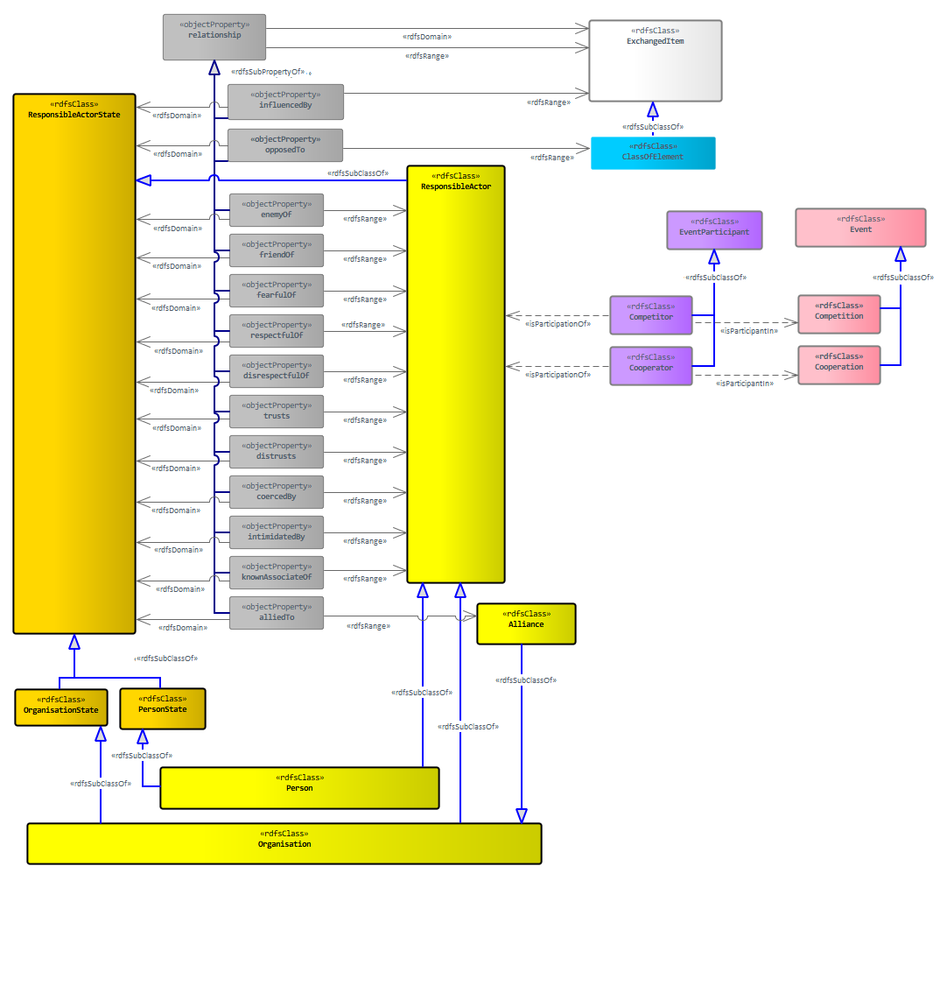

#### IES elements in this diagram:

* [relationship](#dce662f5-7bdb-457e-ae7e-2e5fe43dba1a)
* [ResponsibleActorState](#100b93cd-937e-4fdd-8851-02d1dc07f5b6)
* [ResponsibleActor](#d09ede21-e862-4ec1-bc0f-045cce5454a9)
* [PersonState](#38f8b795-0bce-4945-8c69-8678ed935c1a)
* [Person](#5d5c5b9b-5e90-4100-8353-8ee9f3d772e2)
* [OrganisationState](#f3db6a59-b2de-4743-a9a8-7da9ccc68638)
* [Organisation](#1ecb4c6e-6a30-4dc5-a4ac-9a9df5b6a54f)
* [enemyOf](#7f1a6a06-5223-4bf9-b903-1061a127d62c)
* [friendOf](#13eb3439-497f-49ad-a7f4-def8a600f640)
* [fearfulOf](#a589f81d-dc15-4b71-80b5-ba4cd46b2e41)
* [respectfulOf](#eebce0a4-4882-4c95-9c2d-93ce5eb7a275)
* [disrespectfulOf](#369d2ca7-bffd-4bc3-941f-47262c3dbf1f)
* [trusts](#37ceea2e-93e7-446d-a181-a55a091c3b22)
* [distrusts](#3499fb8a-aa42-4367-bbbc-79a69338bd70)
* [alliedTo](#7f818f57-2c3b-4629-8eec-f5f8310ae655)
* [Alliance](#3d83e15f-aca8-48e4-8c7b-84580807e06f)
* [coercedBy](#9e413787-42c8-4cd4-b7b1-63e38f6a02d9)
* [Event](#b376370e-f5e8-4287-a3ec-ac35532919b1)
* [Competition](#98421510-0a8a-4942-9743-191ea0dca9e6)
* [EventParticipant](#c5ab420c-1ab6-479a-97e1-4f2fd37725cb)
* [Competitor](#763c82f1-5ce0-4652-8a93-d56d93de1544)
* [Cooperation](#f650b9e3-2669-455e-b20c-92737cfd9a08)
* [Cooperator](#2b96182a-9363-4c6a-be62-132b072a7520)
* [influencedBy](#411f5c4c-9ad0-462a-be10-3f43958b7d66)
* [intimidatedBy](#39d0ac05-01db-423a-861a-26e6125df906)
* [opposedTo](#436e6abb-c1e3-484e-b15b-63e700b27ea8)
* [ClassOfElement](#3c13e07d-5796-4d03-9ebc-c75277e87ca4)
* [Thing](#485cbf1a-04ff-4741-8471-46a03d28c406)
* [knownAssociateOf](#57f3607c-0204-4590-9442-24f372a35931)

The nearest an ontologist gets to Tinder

### Structural
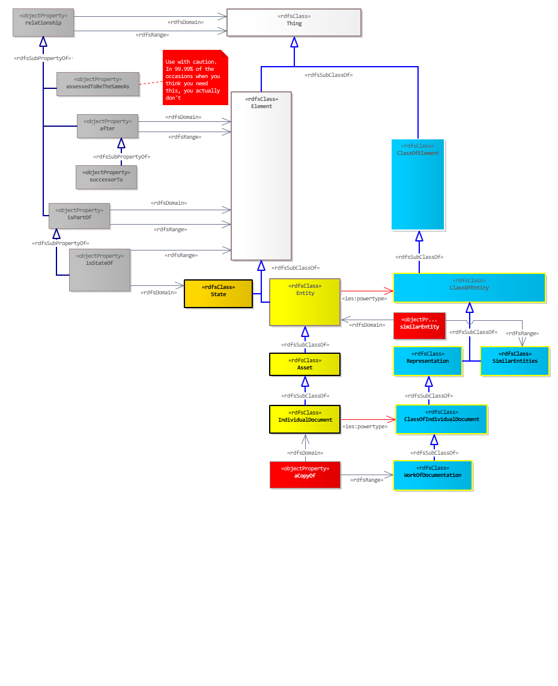

#### IES elements in this diagram:

* [Entity](#f4ede167-6f5a-417d-9984-0221ccdf752c)
* [State](#47301d66-cbd5-4d10-9481-b66966a3f3a2)
* [Element](#97edc90f-3b36-4da8-ae77-d5fdbdea2b21)
* [isStateOf](#f7cbf87a-6ecc-4c9f-b698-fd3cf3f7980e)
* [relationship](#dce662f5-7bdb-457e-ae7e-2e5fe43dba1a)
* [isPartOf](#cd85d7f7-783b-4d06-b023-56dbbddc02dc)
* [Thing](#485cbf1a-04ff-4741-8471-46a03d28c406)
* [assessedToBeTheSameAs](#6a1c6c65-d671-4ea3-9184-044ae2a802cf)
* [ClassOfElement](#3c13e07d-5796-4d03-9ebc-c75277e87ca4)
* [Asset](#40231334-5acc-4dd4-a8c1-05012e2170e0)
* [IndividualDocument](#0f327324-6b4e-40b1-b96b-97a334ba5e4a)
* [ClassOfEntity](#d1b2fb30-36ca-4012-b85f-514e270bf541)
* [Representation](#675a5c23-0746-43d0-96d0-af0df72cd697)
* [ClassOfIndividualDocument](#ccc8fa06-cda8-491d-bffc-0a88d6a565b1)
* [WorkOfDocumentation](#f0b48978-d4e4-45a4-8238-091a5b714d82)
* [aCopyOf](#22d9054c-ae5c-4afe-99d9-3c9d65c86cb9)
* [SimilarEntities](#a4b13044-00fd-4868-8147-1a3c9e84daab)
* [similarEntity](#333e73ad-563f-443c-a9b3-ca122fdf75b9)
* [after](#fa4ddf04-16da-4b5c-ae9a-6ab8cd07dcdb)
* [successorTo](#bec84e4f-f407-4a20-bc68-ad1723a3f860)

The way that structural relationships handled (as defined in IES3) has changed in IES 4. Care must be taken in how these are used.
&nbsp;
<ul>
	<li>assessedToBeTheSameAs - in a 4D (extensional) ontology if two things are the same, there should only be one instance. In most (IES3) cases, things that were deemed to be the same were often just two states of the same whole-life thing. In other cases, they were just two sets of identifiers for the same thing, used by different naming schemes. That said, in very rare circumstances (usually when data arrives from more than one place) two things genuinely are the same (same spatial and temporal extents). If possible, these should be merged into one, and their original identifiers kept. If not, and when all other approaches are not possible, then the assessedToBeTheSameAs relationship may be used. Please try not to though. Thanks.</li>
	<li>Copy of (IES3) is simply two instances of the same class. So for documents, this would be two IndividualDocument instances from one WorkOfDocumentation, using the aCopyOf relationship.</li>
	<li>"Similar to" is now handled by creating a SimilarEntities class and using similarEntity to link the Entity instances to the class. This allows for more than two similar entities to be modelled.</li>
	<li>"Part of" is now "isPartOf" and is used in a similar way as to IES3, but has many subtypes that are used for putting things in locations, periods of time, etc.</li>
</ul>

### Topological
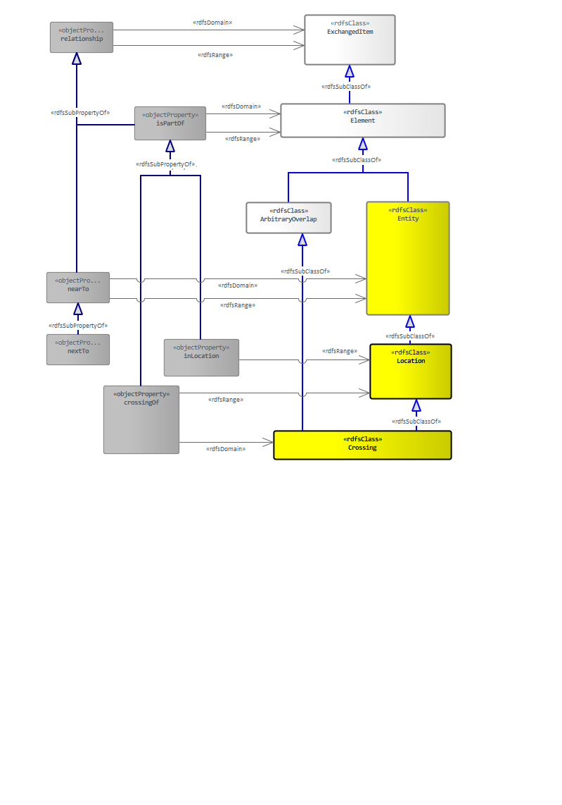

#### IES elements in this diagram:

* [Entity](#f4ede167-6f5a-417d-9984-0221ccdf752c)
* [Element](#97edc90f-3b36-4da8-ae77-d5fdbdea2b21)
* [relationship](#dce662f5-7bdb-457e-ae7e-2e5fe43dba1a)
* [isPartOf](#cd85d7f7-783b-4d06-b023-56dbbddc02dc)
* [Thing](#485cbf1a-04ff-4741-8471-46a03d28c406)
* [ArbitraryOverlap](#f8fabf60-63d3-42ae-ba6a-54cfd0c036bf)
* [Location](#e1a494ed-d493-44ab-8bf9-abc6889d4d9a)
* [Crossing](#b85f065a-6a18-433e-9195-7b6bcbb91c7c)
* [crossingOf](#5a0e8f10-ee46-49bd-8e25-a67040d4a40b)
* [inLocation](#463f9b14-2d14-4364-b4f0-658a20dfcbfa)
* [nearTo](#e3bb8b07-9cc5-407a-8cc7-e2b0e1b69476)
* [nextTo](#f33caaa7-85a7-4e41-b0d4-3eac4e6f73cc)

As with the Structural Relationships, Topological Relationships are handled differently in IES4 due to the criteria of identity (space and time - if "two things" occupy precisely the same space for the same period of time, they are the same thing and only one instance should be created). 
&nbsp;
<ul>
	<li>"Equal to" is a case in point. Here, there should be just one location with multiple identifiers. Note that the examples in IES3 are not always exactly the same extent, so sometimes, these would be <i>isPartOf </i>relationships</li>
	<li>"Crosses" is a case of two extents having shared parts, and is modelled using the <b>Crossing </b>Entity and <i>crossingOf </i>relationship</li>
	<li>For "is within", use the more general <i>inLocation </i>relationship</li>
</ul>

### All Relationships
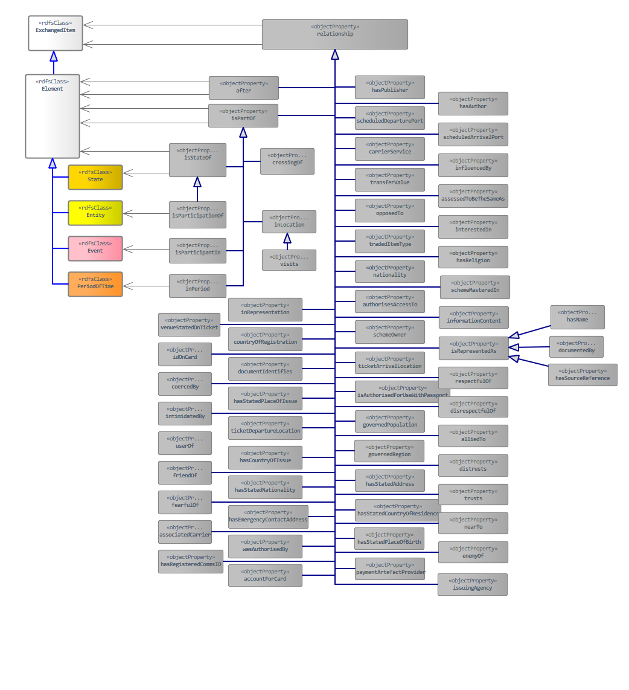

#### IES elements in this diagram:

* [isPartOf](#cd85d7f7-783b-4d06-b023-56dbbddc02dc)
* [isStateOf](#f7cbf87a-6ecc-4c9f-b698-fd3cf3f7980e)
* [after](#fa4ddf04-16da-4b5c-ae9a-6ab8cd07dcdb)
* [inPeriod](#2f08ef25-a5c8-48ad-85e3-903db008aa19)
* [relationship](#dce662f5-7bdb-457e-ae7e-2e5fe43dba1a)
* [hasPublisher](#07fd1df6-ba77-4657-b3d3-d6d579fd4608)
* [hasAuthor](#9464d864-e76f-4e09-89e1-d3b2d3e63f3b)
* [hasCountryOfIssue](#e7500475-8c4f-47a3-8aab-c5679621fae8)
* [hasStatedPlaceOfBirth](#f95710a9-b0a7-4f7b-adaa-08a2dcbd9c35)
* [wasAuthorisedBy](#7a58c9ad-c198-4a61-8244-de5bbc591416)
* [hasStatedAddress](#0451b5d4-99cb-47a7-bb93-df4df6625837)
* [hasEmergencyContactAddress](#0aaf6757-aac9-43c4-8b43-cb3358eadca4)
* [hasStatedPlaceOfIssue](#644b75e8-92a0-4f16-861e-3b4fdfdf572e)
* [hasStatedCountryOfResidence](#9a4eb722-0bda-4ba7-b895-7a4e273865c9)
* [hasStatedNationality](#c8ab9a91-97ed-4868-8167-44e71f40afe7)
* [isAuthorisedForUseWithPassport](#1ca57828-3b6b-450b-b477-c59a196eae34)
* [countryOfRegistration](#d33498ed-b6a0-41ea-864f-ce95e2b1e010)
* [paymentArtefactProvider](#c793e699-c27b-49cc-9358-c4a0e17e609e)
* [accountForCard](#7891e893-56db-4d47-80b4-c78a667767f6)
* [venueStatedOnTicket](#3345aeca-925e-4bfc-820e-2294d5921e71)
* [associatedCarrier](#2e464c7f-fc0b-4dcc-9b1c-5dca87b4ce3a)
* [issuingAgency](#74d86486-8e18-474a-8930-b92e759bbe06)
* [ticketDepartureLocation](#952e5981-257f-429e-9f22-8d2e3b9282c7)
* [ticketArrivalLocation](#a4906b5e-8718-404e-8eef-20ae29106383)
* [scheduledDeparturePort](#1312d263-f609-4df3-a1db-aa0557b3b94b)
* [scheduledArrivalPort](#6bc73189-2b25-4e1c-a935-eda8106f3eb3)
* [carrierService](#76c31798-780c-41b0-a985-0ae3b1c3a478)
* [transferValue](#a9d01dab-281e-48ae-bb33-8518701abbde)
* [governedRegion](#72dc3e90-53ce-434d-a5f3-89bdce08a201)
* [governedPopulation](#917c549c-259f-4850-9cfd-35e05485bf63)
* [tradedItemType](#a92f03f0-cb9e-4667-b985-25377303416a)
* [interestedIn](#7bd2b884-f02c-4da2-af6a-21b790fbf669)
* [isRepresentedAs](#d106a0a9-55c4-454f-9e20-35ba54114036)
* [schemeOwner](#8d42b4a8-30d3-459d-a729-f5c8fe16d418)
* [schemeMasteredIn](#c2c5ff87-189c-478a-b3bf-4706d798087f)
* [idOnCard](#92d9b068-f8d4-4cbc-ad57-1da39d5cc1c7)
* [hasRegisteredCommsID](#e076afb8-f6f8-4b06-82b3-7ed568d1ee73)
* [documentIdentifies](#2f8738a6-5eba-4d80-980b-aa9e6f28b81a)
* [influencedBy](#411f5c4c-9ad0-462a-be10-3f43958b7d66)
* [opposedTo](#436e6abb-c1e3-484e-b15b-63e700b27ea8)
* [assessedToBeTheSameAs](#6a1c6c65-d671-4ea3-9184-044ae2a802cf)
* [inRepresentation](#7238489d-6802-4733-9f7f-9b31d02b3c81)
* [Entity](#f4ede167-6f5a-417d-9984-0221ccdf752c)
* [Thing](#485cbf1a-04ff-4741-8471-46a03d28c406)
* [Element](#97edc90f-3b36-4da8-ae77-d5fdbdea2b21)
* [State](#47301d66-cbd5-4d10-9481-b66966a3f3a2)
* [nationality](#45cda5c1-624d-4f2f-81f6-ef19300820a9)
* [hasReligion](#6d1839a4-342a-4e34-823c-bdb392483048)
* [nearTo](#e3bb8b07-9cc5-407a-8cc7-e2b0e1b69476)
* [intimidatedBy](#39d0ac05-01db-423a-861a-26e6125df906)
* [coercedBy](#9e413787-42c8-4cd4-b7b1-63e38f6a02d9)
* [alliedTo](#7f818f57-2c3b-4629-8eec-f5f8310ae655)
* [distrusts](#3499fb8a-aa42-4367-bbbc-79a69338bd70)
* [trusts](#37ceea2e-93e7-446d-a181-a55a091c3b22)
* [disrespectfulOf](#369d2ca7-bffd-4bc3-941f-47262c3dbf1f)
* [respectfulOf](#eebce0a4-4882-4c95-9c2d-93ce5eb7a275)
* [fearfulOf](#a589f81d-dc15-4b71-80b5-ba4cd46b2e41)
* [friendOf](#13eb3439-497f-49ad-a7f4-def8a600f640)
* [enemyOf](#7f1a6a06-5223-4bf9-b903-1061a127d62c)
* [visits](#92fc2c35-d40b-4393-ba0b-88849743feb6)
* [authorisesAccessTo](#a2da918d-843c-43c9-a974-4795601e9d65)
* [informationContent](#5bee4248-dc98-4625-8553-3bb2171a1ede)
* [isParticipantIn](#baea86d9-c90e-4f8d-96f5-a01bb0c49711)
* [inLocation](#463f9b14-2d14-4364-b4f0-658a20dfcbfa)
* [crossingOf](#5a0e8f10-ee46-49bd-8e25-a67040d4a40b)
* [PeriodOfTime](#3fdfa898-c340-4279-8b3c-275359d5b02d)
* [isParticipationOf](#df9f6056-ccd4-41aa-9a86-536f6150ec25)
* [Event](#b376370e-f5e8-4287-a3ec-ac35532919b1)
* [hasName](#c3a36e36-0c73-4af7-88e3-81c9243ce456)
* [documentedBy](#ac7c948a-f19c-4296-ac38-0fee6a4c5e90)
* [hasSourceReference](#16480e86-9fe4-4b37-acfb-9e410f190664)
* [userOf](#01984617-c96d-48b3-acde-25f525719aef)

## All Elements

### Accent
A Characteristic whose members are people who all share the same national or regional accent

### Account
An <a href="#F4EDE167-6F5A-417d-9984-0221CCDF752C"><u>Entity</u></a> that is the collection of all transactions between a provider and a customer

### AccountAdminEvent
A <a href="#94CEDBD1-8E3D-4cb4-8155-FBD621DA6A0D"><u>BusinessEvent</u></a> that an <a href="#31BFE794-924E-44e3-942E-ADC9ED19FBA1"><u>Account</u></a> participates in

### accountForCard
Relates a <a href="#848A9E0F-F3B4-47c3-AA7E-2FF6BE92170C"><u>BankCard</u></a> to the <a href="#44DAC574-2A2E-44bc-ACD2-236811FA8D29"><u>FinancialAccount</u></a> which the card is issued against.

### AccountHolder
A <a href="#38F8B795-0BCE-4945-8C69-8678ED935C1A"><u>PersonState</u></a> when they hold an <a href="#31BFE794-924E-44e3-942E-ADC9ED19FBA1"><u>Account</u></a>

### AccountInCommunication
An <a href="#0BCDB801-1F3B-4496-B04B-95EF545E9445"><u>AccountState</u></a> (and an <a href="#C5AB420C-1AB6-479a-97E1-4F2FD37725CB"><u>EventParticipant</u></a>) when an <a href="#31BFE794-924E-44e3-942E-ADC9ED19FBA1"><u>Account</u></a> is involved in communicating. 

### AccountNumber
The account number for the respective <a href="#44DAC574-2A2E-44bc-ACD2-236811FA8D29"><u>FinancialAccount</u></a>.

### accountProvider
The <a href="#1ECB4C6E-6A30-4dc5-A4AC-9A9DF5B6A54F"><u>Organisation</u></a> that provides the <a href="#44DAC574-2A2E-44bc-ACD2-236811FA8D29"><u>FinancialAccount</u></a>

### AccountState
A temporal state of an <a href="#31BFE794-924E-44e3-942E-ADC9ED19FBA1"><u>Account</u></a>

### Accused
A <a href="#D09EDE21-E862-4ec1-BC0F-045CCE5454A9"><u>ResponsibleActor</u></a>'s role as the accused in a <a href="#024133FE-9D0B-4e5d-A97D-A34B5EA01C41"><u>Prosecution</u></a>

### aCopyOf
An <a href="#BBC06281-340F-458f-A057-82193F32C9DD"><u>rdf:type</u></a> <a href="#DCE662F5-7BDB-457e-AE7E-2E5FE43DBA1A"><u>relationship</u></a> that asserts a Document is a copy of WorkOfDocumentation

Note: Document instances are individual physical documents whereas <a href="#F0B48978-D4E4-45a4-8238-091A5B714D82"><u>WorkOfDocumentation</u></a> is the general case of a document - e.g. "War and Peace" vs "my copy of <a href="#D4F568F5-7BC4-489d-94BC-AE1305E5C0C2"><u>War</u></a> and Peace"

### ActiveEventParticipant
An <a href="#C5AB420C-1AB6-479a-97E1-4F2FD37725CB"><u>EventParticipant</u></a> where the participant is "actively" engaged in the <a href="#B376370E-F5E8-4287-A3EC-AC35532919B1"><u>Event</u></a>.

Note: In BORO, EventParticipant would be "Involvement" and ActiveEventParticipant would be "Participation".

### Actor
An <a href="#F4EDE167-6F5A-417d-9984-0221CCDF752C"><u>Entity</u></a> that is capable of performing functions - i.e. actively participating in an Event.

### ActorState
A temporal state of an <a href="#B2B15802-9CE9-4a9d-9DE0-8289D8474E9B"><u>Actor</u></a>

### Address
A <a href="#E1A494ED-D493-44ab-8BF9-ABC6889D4D9A"><u>Location</u></a> that can be specified by a postal address

### AdministeredAccount
An <a href="#C5AB420C-1AB6-479a-97E1-4F2FD37725CB"><u>EventParticipant</u></a> where a <a href="#44DAC574-2A2E-44bc-ACD2-236811FA8D29"><u>FinancialAccount</u></a> is administered

### after
A <a href="#DCE662F5-7BDB-457e-AE7E-2E5FE43DBA1A"><u>relationship</u></a> linking two Elements where one ends before the other starts

### AgreementExecution
An <a href="#422B4F1C-DA90-400b-8FFD-43C90B4F10F4"><u>AgreementStage</u></a> which includes all the ongoing activities that conform to the agreement reached

### AgreementName
A <a href="#7D7CC966-56EB-4220-A650-A993E598F2E2"><u>Name</u></a> that is used to refer to an <a href="#1B39630B-B00F-4def-9C65-48082C4AD2E0"><u>EndToEndAgreement</u></a>.

### AgreementStage
An <a href="#B376370E-F5E8-4287-A3EC-AC35532919B1"><u>Event</u></a> which is part of an <a href="#1B39630B-B00F-4def-9C65-48082C4AD2E0"><u>EndToEndAgreement</u></a>

### Aircraft
A <a href="#3B916F09-F3F4-43e9-9C84-99009C685396"><u>Vehicle</u></a> that travels by air

### Airport
A <a href="#57860A04-0128-4c7e-9BFD-83D3BA432F8C"><u>Port</u></a> used for air travel

### allHaveCharacteristic
An rdfs:subClassOf <a href="#DCE662F5-7BDB-457e-AE7E-2E5FE43DBA1A"><u>relationship</u></a> that asserts that all instances of a ClassOfElement share a particular Characteristic or Measure

e.g. all London buses being red, all heavyweight boxers weighing more than 200lbs

### allHaveDisposition
An rdfs:subClassOf <a href="#DCE662F5-7BDB-457e-AE7E-2E5FE43DBA1A"><u>relationship</u></a> that asserts that all instances of a ClassOfElement share a disposition

e.g. all Eurofighters being cable of Mach 2

### Alliance
An <a href="#1ECB4C6E-6A30-4dc5-A4AC-9A9DF5B6A54F"><u>Organisation</u></a> made up of allies - these could be people or organisations, and the alliance may be quite loose.

### alliedTo
A Relationship between two <a href="#D09EDE21-E862-4ec1-BC0F-045CCE5454A9"><u>ResponsibleActor</u></a> Entities where one is allied to the other.

### allocatedSeatNumber
The seat number associated with the ticket

### Altitude
The Length that is the distance above (or below in the case of negative numbers) the surface of the WGS84 spheroid of the respective <a href="#E1A494ED-D493-44ab-8BF9-ABC6889D4D9A"><u>Location</u></a> 

### AmountOfMoney
A specific amount of a given currency

### AmountOfSubstance
The Measure of the stoichiometric quantity of substance (usually measured in moles)

### ancestorOf
A Relationship between two <a href="#5D5C5B9B-5E90-4100-8353-8EE9F3D772E2"><u>Person</u></a> Entities that indicates one is and ancestor of the other

Note: was called "relative of" in IES 3.x, but was really only about ancestry, so is changed here. 

### andGroup
The groups (if any) which the requesting user must be a member of in order to access the item. See the EDH specification for further details.

Allowable Values:

See EDH Standard

### ArbitraryOverlap
An <a href="#97EDC90F-3B36-4da8-AE77-D5FDBDEA2B21"><u>Element</u></a> whose extent is defined by being the shared overlap of two or more Elements

### ArbitraryPeriod
A <a href="#3FDFA898-C340-4279-8B3C-275359D5B02D"><u>PeriodOfTime</u></a> for which is not delineated by a particular clock period - e.g. not a year, not a month, not a day, not an hour, etc. Instead it is one which is most clearly specified in terms of start and end that are <a href="#2173F463-524C-457c-B106-51322F64F122"><u>ParticularPeriods</u></a>.

### areaOfCoverage
The area over which the TravelCard is valid 

Examples:

London - Zone 1
London - All Zones

### Arrest
A <a href="#3876B81C-E316-4e11-A6C4-8024E52F769B"><u>LawEnforcement</u></a> <a href="#B376370E-F5E8-4287-A3EC-AC35532919B1"><u>Event</u></a> where a <a href="#5D5C5B9B-5E90-4100-8353-8EE9F3D772E2"><u>Person</u></a> is arrested

### Arrested
A <a href="#5D5C5B9B-5E90-4100-8353-8EE9F3D772E2"><u>Person</u></a>'s role when arrested

### ArrestingOfficer
A <a href="#5D5C5B9B-5E90-4100-8353-8EE9F3D772E2"><u>Person</u></a>'s role as arresting officer

### Arrival
A <a href="#892345CD-9FA7-4982-978D-B6D3ABAE839C"><u>BoundingState</u></a> that marks the end of a <a href="#95B5ACC4-956A-4b29-AB9E-BDCD12EF319F"><u>Movement</u></a> event

The date/time of the arrival can be specified using the <a href="#2F08EF25-A5C8-48ad-85E3-903DB008AA19"><i><u>inPeriod</u></i></a><i> </i>relationship. 

### assessed
An owl:objectProperty that links an AssesToBeTrue to the rdfs:Resource that is assessed to be true.

### assessedToBeTheSameAs
A <a href="#DCE662F5-7BDB-457e-AE7E-2E5FE43DBA1A"><u>relationship</u></a> that asserts two Things that may have been previously judged to be different are in fact the same thing. 

WARNING:  by "the same" we mean they occupy the same space for the same period of time - i.e. not two different things in the same place at different times, and not the same physical item at two different periods of time. The <a href="#315E6AD3-F2DA-4f69-864F-DA2B95121E2E"><u>Identifier</u></a> and <a href="#47301D66-CBD5-4d10-9481-B66966A3F3A2"><u>State</u></a> patterns should do most of what is needed here, and it is <i>extremely rare </i>that this would ever be needed. Do not use unless absolutely necessary. 

### Assessment
An Event where an actor makes a subjective judgement against a thing. This can be a judgement of belief in a thing�s possibility, categorisation or other qualitative aspect.

Examples include:
- Having 'HIGH' confidence that Anne committed the murder.
- Assessing a statement made in an internet article as being true or false.
- Assessing a house to having an energy performance of 'B'
- Assessing the odds of England winning the World Cup as 20-1

### Assessor
An <a href="#C5AB420C-1AB6-479a-97E1-4F2FD37725CB"><u>EventParticipant</u></a> where an Actor assesses something to be true.

### AssessToBeTrue
An Assessment where a fact is assessed to be true by a Actor (i.e. a <a href="#5D5C5B9B-5E90-4100-8353-8EE9F3D772E2"><u>Person</u></a> or Device)

An AssessToBeTrue shall have one and only one <a href="#04F797E7-9B5C-48c5-A50D-A14CFF7725DE"><u>hmlConfidence</u></a> attribute (i.e. this is mandatory)

### Asset
An <a href="#F4EDE167-6F5A-417d-9984-0221CCDF752C"><u>Entity</u></a> that is either man-made (or defined - see <a href="#487778E0-4BD7-4d9a-B7F7-63731478E1A2"><u>Rights</u></a>) or whose extent is defined in such a way as to specify ownership - e.g. a parcel of real estate

### AssetState
A temporal state of an <a href="#40231334-5ACC-4dd4-A8C1-05012E2170E0"><u>Asset</u></a>

### associatedCarrier
The Organisation that provides the transport specified on the <a href="#0BC61540-2AFB-42e6-A845-79771EE0268D"><u>Ticket</u></a>

### associatedPersonName
The name of the Person which is associated with the Entity

This may be the name of an account holder, the name printed on ID, tickets, etc.

Note in 3.x, this was several different attributes:
accountHolderName on FinancialAccount
nameOnLicense, etc. on IdentityDocument
ticketHolderName on Ticket

### Attacker
Relates a <a href="#8787BE51-8FE0-4d76-97B4-608311434F5B"><u>MilitaryAttack</u></a> to the <a href="#1ECB4C6E-6A30-4dc5-A4AC-9A9DF5B6A54F"><u>Organisation</u></a> conducting the attack

### Attendance
A <a href="#8404464D-3904-4c59-AE0E-B3FAFB46AC4E"><u>Presence</u></a> where the <a href="#5D5C5B9B-5E90-4100-8353-8EE9F3D772E2"><u>Person</u></a> is present

Note - we may not know the identity of the person, so would just create only the <a href="#626D5F2C-9153-40f4-9F2A-393B6DB072D3"><u>Attendance</u></a> (<a href="#C5AB420C-1AB6-479a-97E1-4F2FD37725CB"><u>EventParticipant</u></a>). This allows the <a href="#98BDD06F-1BD7-42b8-B338-20A198BCF90A"><u>model</u></a> to grow as more information is discovered without recourse to using sameAs relationships.

### attribute
A feature or property of a Thing.

Note: In IES4 it is important to distinguish between names and attributes - attribute should never be used to identify or name something - for that, use Name or Identifier.

### AtWar
An <a href="#F12D45EA-66D5-4016-BDF7-E1CD8F48CCF5"><u>InDisagreement</u></a> where the parties have declared war

### AuthorisationDocument
A <a href="#F0B48978-D4E4-45a4-8238-091A5B714D82"><u>WorkOfDocumentation</u></a> that provides permission

### AuthorisationRequest
An <a href="#2D5069F2-FE77-477f-A607-FA6458E64173"><u>AuthorisationStage</u></a> where a <a href="#D09EDE21-E862-4ec1-BC0F-045CCE5454A9"><u>ResponsibleActor</u></a> requests authorisation to act from another <a href="#D09EDE21-E862-4ec1-BC0F-045CCE5454A9"><u>ResponsibleActor</u></a>

### AuthorisationRequester
An <a href="#3360DCC9-D39B-4280-8872-2FE122240407"><u>ActiveEventParticipant</u></a> where a <a href="#D09EDE21-E862-4ec1-BC0F-045CCE5454A9"><u>ResponsibleActor</u></a> requests authority to act 

### AuthorisationReviewer
An <a href="#3360DCC9-D39B-4280-8872-2FE122240407"><u>ActiveEventParticipant</u></a> where a <a href="#D09EDE21-E862-4ec1-BC0F-045CCE5454A9"><u>ResponsibleActor</u></a> reviews an <a href="#1D6BAE08-B8F1-4eee-928E-991B3B46EADF"><u>AuthorisationRequest</u></a>

### AuthorisationStage
An <a href="#B376370E-F5E8-4287-A3EC-AC35532919B1"><u>Event</u></a> which is part of an <a href="#D75F18D1-95D6-481b-84D5-F8D7F3A5A389"><u>EndToEndAuthorisation</u></a>

### AuthorisedActor
An <a href="#3360DCC9-D39B-4280-8872-2FE122240407"><u>ActiveEventParticipant</u></a> where a <a href="#D09EDE21-E862-4ec1-BC0F-045CCE5454A9"><u>ResponsibleActor</u></a> is granted authority to act in a <a href="#F5EAAEEE-C0B2-469f-9048-3E0731ED8342"><u>GrantOfAuthority</u></a> 

### Authoriser
An <a href="#3360DCC9-D39B-4280-8872-2FE122240407"><u>ActiveEventParticipant</u></a> where a <a href="#D09EDE21-E862-4ec1-BC0F-045CCE5454A9"><u>ResponsibleActor</u></a> acts as the authoriser (sign off) in a <a href="#F5EAAEEE-C0B2-469f-9048-3E0731ED8342"><u>GrantOfAuthority</u></a> 

### authorisesAccessTo
The Event for which the respective Ticket applies.

### Bank
An <a href="#1ECB4C6E-6A30-4dc5-A4AC-9A9DF5B6A54F"><u>Organisation</u></a> that holds a banking license and can conduct financial transactions on behalf of customers

### BankBranch
An operating division of a <a href="#4E10343E-8350-4354-B3DB-A7F74B4535EF"><u>Bank</u></a>, usually a high street branch, but might also be the online arm of a Bank

### BankCard
A <a href="#9882D901-1B22-4b89-81D1-031F840A20D0"><u>PaymentArtefact</u></a> that is a physical card used for making financial transactions.

Note: when used online, the accompanying Fan

### beginBoundOfClass
A <a href="#DCE662F5-7BDB-457e-AE7E-2E5FE43DBA1A"><u>relationship</u></a> linking a <a href="#E7A659A5-9059-4ea5-8FAB-8A29AFC47D9A"><u>TimeBoundedClass</u></a> to the <a href="#2173F463-524C-457c-B106-51322F64F122"><u>ParticularPeriod</u></a> that marks the beginning bound date of its instances

### BirthCertificate
An <a href="#BDF4EBD9-7F41-4d90-91A7-571177330C1B"><u>IdentityDocument</u></a> issued to prove the data and place of birth of a <a href="#5D5C5B9B-5E90-4100-8353-8EE9F3D772E2"><u>Person</u></a>

### BirthState
A <a href="#892345CD-9FA7-4982-978D-B6D3ABAE839C"><u>BoundingState</u></a> that marks the beginning of a <a href="#5D5C5B9B-5E90-4100-8353-8EE9F3D772E2"><u>Person</u></a>'s life.

The location of the birth can be specified using <a href="#463F9B14-2D14-4364-B4F0-658A20DFCBFA"><i><u>inLocation</u></i></a>

The date/time of the birth can be specified using the <a href="#2F08EF25-A5C8-48ad-85E3-903DB008AA19"><i><u>inPeriod</u></i></a><i> </i>relationship. 

### BoardingCardNumber
The number of the boarding card issued to the Passenger. 

### Book
A <a href="#F0B48978-D4E4-45a4-8238-091A5B714D82"><u>WorkOfDocumentation</u></a> that is a published book

### BookedPassenger
A <a href="#5D5C5B9B-5E90-4100-8353-8EE9F3D772E2"><u>Person</u></a>'s involvement as a booked traveller in a <a href="#76DC9A0C-F6E8-4ff4-ADD6-072DC1EBE3AB"><u>TravelBooking</u></a>

### BookingAgent
A <a href="#D09EDE21-E862-4ec1-BC0F-045CCE5454A9"><u>ResponsibleActor</u></a>'s involvement as the facilitator of a <a href="#76DC9A0C-F6E8-4ff4-ADD6-072DC1EBE3AB"><u>TravelBooking</u></a>

### BookingPayment
An <a href="#C5AB420C-1AB6-479a-97E1-4F2FD37725CB"><u>EventParticipant</u></a> where an <a href="#0DF94DE5-68B7-45b4-A106-A11CE06C31B8"><u>AmountOfMoney</u></a> in cash is used as payment in a <a href="#76DC9A0C-F6E8-4ff4-ADD6-072DC1EBE3AB"><u>TravelBooking</u></a>.

When neither card nor cash is used, there will be an accompanying <a href="#D94ED70F-8CCA-4c6e-8AE5-65450BBA62D7"><u>MoneyTransfer</u></a>

### BookingReference
An <a href="#315E6AD3-F2DA-4f69-864F-DA2B95121E2E"><u>Identifier</u></a> that is  notionally unique number that is allocated to a <a href="#76DC9A0C-F6E8-4ff4-ADD6-072DC1EBE3AB"><u>TravelBooking</u></a>.

Note that Booking Reference Numbers are recycled and so are not unique in their own right. When combined with the BookingDate it is potentially possible to identify a specific booking.

### BoundingState
A <a href="#6E5AF4BB-BB7F-4387-A7BB-476B81FEC103"><u>ContinuousState</u></a> that occurs at the beginning or end of an <a href="#97EDC90F-3B36-4da8-AE77-D5FDBDEA2B21"><u>Element</u></a> 

The date/time of the state can be specified using the <a href="#2F08EF25-A5C8-48ad-85E3-903DB008AA19"><i><u>inPeriod</u></i></a><i> </i>relationship. 

### BranchCode
In identifier for a <a href="#02E3C3B8-8650-4867-8390-823E4B3360E6"><u>BankBranch</u></a> - In the UK this is often referred to as the Sort Code.

### branding
A brand or logo that is represented on an Entity

e.g. some bank cards are branded by a car manufacturer, etc. but actually operated by a bank

### BusinessEvent
An <a href="#B376370E-F5E8-4287-A3EC-AC35532919B1"><u>Event</u></a> that is commercial or administrative in nature

### Callee
An <a href="#A5713B2C-E098-4dd2-BD46-42DA51899FEA"><u>PartyInCommunication</u></a> where the communicating party is called in an <a href="#6D5E11EE-C61A-4e38-913F-BBAF2A34A288"><u>InteractiveCommunication</u></a>

### Caller
An <a href="#A5713B2C-E098-4dd2-BD46-42DA51899FEA"><u>PartyInCommunication</u></a> where the communicating party is the caller in an <a href="#6D5E11EE-C61A-4e38-913F-BBAF2A34A288"><u>InteractiveCommunication</u></a>

### Callsign
In broadcasting and radio communications, a call sign (also known as a call name or call letters � and historically as a call signal) is a unique designation for a transmitting station.

### Capability
A DispositionalClass where all the instances share the same capability

Example: Vehicles capable of Mach 2

### CardNumber
An <a href="#315E6AD3-F2DA-4f69-864F-DA2B95121E2E"><u>Identifier</u></a> that is the long number on the face of the card (<a href="#9882D901-1B22-4b89-81D1-031F840A20D0"><u>PaymentArtefact</u></a>)

### CardUsed
An <a href="#C5AB420C-1AB6-479a-97E1-4F2FD37725CB"><u>EventParticipant</u></a> where a <a href="#9882D901-1B22-4b89-81D1-031F840A20D0"><u>PaymentArtefact</u></a> is participant in a <a href="#CA86862B-DA7E-487c-907B-26FA5D0564CD"><u>TradeEvent</u></a>

### Carrier
An <a href="#C5AB420C-1AB6-479a-97E1-4F2FD37725CB"><u>EventParticipant</u></a> where a <a href="#D09EDE21-E862-4ec1-BC0F-045CCE5454A9"><u>ResponsibleActor</u></a> participates in a <a href="#F428ADA5-2349-4cd0-815F-8F768B08C6E6"><u>Delivery</u></a> as a carrier

### carrierService
The Organisation that provides the transport specified on the <a href="#0BC61540-2AFB-42e6-A845-79771EE0268D"><u>Ticket</u></a>

### CarTravel
A <a href="#3D0FC30A-CF82-44f2-970E-BFD04EADBA74"><u>TravelService</u></a> by car

### CashPayment
An <a href="#C5AB420C-1AB6-479a-97E1-4F2FD37725CB"><u>EventParticipant</u></a> where an <a href="#0DF94DE5-68B7-45b4-A106-A11CE06C31B8"><u>AmountOfMoney</u></a> in cash is used as payment in a <a href="#0A9A9F7D-A6F1-4629-BD2B-7990D2D36493"><u>Purchase</u></a>.

When neither card nor cash is used, there will be an accompanying <a href="#D94ED70F-8CCA-4c6e-8AE5-65450BBA62D7"><u>MoneyTransfer</u></a>

### Casualty
Relates a <a href="#8787BE51-8FE0-4d76-97B4-608311434F5B"><u>MilitaryAttack</u></a> to a <a href="#5D5C5B9B-5E90-4100-8353-8EE9F3D772E2"><u>Person</u></a> who was injured or killed in the attack

### CBRadioHandset
A <a href="#18EB7B22-5927-4b0e-98A8-638D28BDCF87"><u>CommunicationsDevice</u></a> used to hold radio conversations on frequencies allocated as "Citizen Band"

### CellularBaseStation
A <a href="#F02CFF55-12A7-4308-9A60-E2353DE5BE58"><u>RadioMast</u></a> that is used for cellular communication

### ChangeOfGovernment
A <a href="#3A0E6FDD-5B3B-4092-9549-C05E8A5FED41"><u>PoliticalEvent</u></a> where one <a href="#D62DDBB8-53FC-405a-BC43-89CA337563A0"><u>Government</u></a> is replaced by another.

### Characteristic
A ClassOfElement whose instances all share a common property - e.g. they are all the same colour, mass, etc. 

### charters
A Relationship between a <a href="#D09EDE21-E862-4ec1-BC0F-045CCE5454A9"><u>ResponsibleActor</u></a> and the <a href="#7693D2C9-0F06-4005-BB8D-B5B572B2281A"><u>Transit</u></a> they have chartered.

### CheckIn
An <a href="#B376370E-F5E8-4287-A3EC-AC35532919B1"><u>Event</u></a> where a <a href="#5D5C5B9B-5E90-4100-8353-8EE9F3D772E2"><u>Person</u></a> checks in to a hotel or <a href="#7693D2C9-0F06-4005-BB8D-B5B572B2281A"><u>Transit</u></a>. This also includes swiping tickets to use public transport

The location of the <a href="#87308A03-5C79-4d94-99E1-660042AC7929"><u>CheckIn</u></a> is specified using a <a href="#60A37745-8DD5-4e4c-9A4C-6957F71AD971"><u>happensIn</u></a> relationship.

The CheckIn may be part of another Event - e.g. an <a href="#78C33499-CD14-43cb-82AE-93A0F8CF022B"><u>EntertainmentEvent</u></a> or <a href="#7693D2C9-0F06-4005-BB8D-B5B572B2281A"><u>Transit</u></a> event. Simply use the <a href="#CD85D7F7-783B-4d06-B023-56DBBDDC02DC"><u>isPartOf</u></a> <a href="#DCE662F5-7BDB-457e-AE7E-2E5FE43DBA1A"><u>relationship</u></a> to specify this.

### CinemaTicket
An <a href="#96989C30-99CC-4606-A8D4-DFD9421F0E34"><u>EntertainmentTicket</u></a> that permits attendance at a cinema

### ClassOfAmountOfMoney
The <a href="#D4BD48E8-76B8-4d3c-AB83-E653DB89170D"><u>powertype</u></a> of <a href="#0DF94DE5-68B7-45b4-A106-A11CE06C31B8"><u>AmountOfMoney</u></a>

### ClassOfAsset
The <a href="#D4BD48E8-76B8-4d3c-AB83-E653DB89170D"><u>powertype</u></a> of <a href="#40231334-5ACC-4dd4-A8C1-05012E2170E0"><u>Asset</u></a>- i.e. a <a href="#D1B2FB30-36CA-4012-B85F-514E270BF541"><u>ClassOfEntity</u></a> whose instances are classes of Asset

Examples:

* Vauxhall Insignia, VW Golf
* Smartphone
* Apple iPhone 6S

### ClassOfClassOfElement
An <a href="#58C6DE35-5E57-4009-A6CE-69C889B31D82"><u>rdfs:Class</u></a> and an <u>Thing</u> whose instances are classes of classes of <a href="#97EDC90F-3B36-4da8-AE77-D5FDBDEA2B21"><u>Element</u></a>

### ClassOfClassOfEntity
The <a href="#D4BD48E8-76B8-4d3c-AB83-E653DB89170D"><u>powertype</u></a> of <a href="#D1B2FB30-36CA-4012-B85F-514E270BF541"><u>ClassOfEntity</u></a>

### ClassOfElement
An <a href="#58C6DE35-5E57-4009-A6CE-69C889B31D82"><u>rdfs:Class</u></a> and an <a href="#485CBF1A-04FF-4741-8471-46A03D28C406"><u>Thing</u></a> whose instances are classes of <a href="#97EDC90F-3B36-4da8-AE77-D5FDBDEA2B21"><u>Element</u></a>

Examples:
&nbsp;
<ul>
	<li>Human groupings (e.g. Nigerian Women, British Men, Righthanded people, English Speakers);</li>
	<li>Political Ideologies</li>
	<li>Weapons</li>
	<li>Days of the week</li>
	<li>Standard procedures</li>
	<li>etc.</li>
</ul>

### ClassOfEntity
The <a href="#D4BD48E8-76B8-4d3c-AB83-E653DB89170D"><u>powertype</u></a> of <a href="#97EDC90F-3B36-4da8-AE77-D5FDBDEA2B21"><u>Entity</u></a> - i.e. a <a href="#3C13E07D-5796-4d03-9EBC-C75277E87CA4"><u>ClassOfElement</u></a> whose instances are classes of Entity

Examples:

� Human groupings (e.g. Nigerian Women, British Men, Righthanded people, English Speakers);
� Weapons
� Etc.

### ClassOfEvent
An <a href="#3C13E07D-5796-4d03-9EBC-C75277E87CA4"><u>ClassOfElement</u></a> whose instances are classes of <a href="#B376370E-F5E8-4287-A3EC-AC35532919B1"><u>Event</u></a>. This is the <a href="#D4BD48E8-76B8-4d3c-AB83-E653DB89170D"><u>powertype</u></a> of Event.

Examples:

* Conference
* Football Match
* Annual General <a href="#6445E51F-3DDF-4dcf-ABDF-3ED123D53188"><u>Meeting</u></a>

### ClassOfIndividualDocument
The <a href="#D4BD48E8-76B8-4d3c-AB83-E653DB89170D"><u>powertype</u></a> of <a href="#0F327324-6B4E-40b1-B96B-97A334BA5E4A"><u>IndividualDocument</u></a>

### ClassOfMeasureValue
A ClassOfRepresentation that is the powertype of MeasureValue

### ClassOfPerson
The <a href="#D4BD48E8-76B8-4d3c-AB83-E653DB89170D"><u>powertype</u></a> of <a href="#5D5C5B9B-5E90-4100-8353-8EE9F3D772E2"><u>Person</u></a>

### ClassOfPersonState
The <a href="#D4BD48E8-76B8-4d3c-AB83-E653DB89170D"><u>powertype</u></a> of <a href="#38F8B795-0BCE-4945-8C69-8678ED935C1A"><u>PersonState</u></a>

### ClassOfRepresentation
The <a href="#D4BD48E8-76B8-4d3c-AB83-E653DB89170D"><u>powertype</u></a> of <a href="#675A5C23-0746-43d0-96D0-AF0DF72CD697"><u>Representation</u></a>

### ClassOfResponsibleActor
The <a href="#D4BD48E8-76B8-4d3c-AB83-E653DB89170D"><u>powertype</u></a> of <a href="#D09EDE21-E862-4ec1-BC0F-045CCE5454A9"><u>ResponsibleActor</u></a> 

### ClassOfResponsibleActorState
A <a href="#0358DDAB-D22C-4ee5-8F9A-CF18F3E432BD"><u>ClassOfState</u></a> that is the <a href="#D4BD48E8-76B8-4d3c-AB83-E653DB89170D"><u>powertype</u></a> of <a href="#100B93CD-937E-4fdd-8851-02D1DC07F5B6"><u>ResponsibleActorState</u></a> 

### ClassOfState
A <a href="#3C13E07D-5796-4d03-9EBC-C75277E87CA4"><u>ClassOfElement</u></a> whose instances are classes of States. This is the <a href="#D4BD48E8-76B8-4d3c-AB83-E653DB89170D"><u>powertype</u></a> of State.

Examples:

* Roles

### CloseAccount
An <a href="#19E90CA4-F0EB-4245-826E-EDC278642B41"><u>AccountAdminEvent</u></a> where an <a href="#31BFE794-924E-44e3-942E-ADC9ED19FBA1"><u>Account</u></a> is shut down.

### coercedBy
A Relationship between two <a href="#D09EDE21-E862-4ec1-BC0F-045CCE5454A9"><u>ResponsibleActor</u></a> Entities where one (range) coerces the other (domain).

### CoLocation
An <a href="#B376370E-F5E8-4287-A3EC-AC35532919B1"><u>Event</u></a> where the activity is uncertain, but it is known that some Entities were present

Note: whilst colocation can be easily inferred from data, sometimes it's important to call out specific instances where entities of interest were in the same place at the same time.

### Colour
A Characteristic whose members all have the same colour

### CommercialOrganisation
An <a href="#1ECB4C6E-6A30-4dc5-A4AC-9A9DF5B6A54F"><u>Organisation</u></a> that is run for profit

### Communication
An <a href="#B376370E-F5E8-4287-A3EC-AC35532919B1"><u>Event</u></a> where two or more parties interact and exchange information

### CommunicationsAccount
An <a href="#31BFE794-924E-44e3-942E-ADC9ED19FBA1"><u>Account</u></a> of the communications transactions provided to a customer

### CommunicationsAccountState
A temporal state of a <a href="#8300451C-1DF9-4545-9174-D8AA69C58CCD"><u>CommunicationsAccount</u></a>

### CommunicationsDevice
A <a href="#115F2F9B-21F3-4903-8EAA-AB3AEFE97461"><u>Device</u></a> that provides an endpoint for communications � e.g. mobile telephone, landline, satellite phone, CB Radio, etc.

### CommunicationsIdentifier
An <a href="#315E6AD3-F2DA-4f69-864F-DA2B95121E2E"><u>Identifier</u></a> for the end-point of a communication 

### CommunicationsIdentifierRange
A specified range of identifiers for the end-points of a communication.

### Competition
An <a href="#B376370E-F5E8-4287-A3EC-AC35532919B1"><u>Event</u></a> where the participants are competing with each other

### Competitor
An <a href="#C5AB420C-1AB6-479a-97E1-4F2FD37725CB"><u>EventParticipant</u></a> where a <a href="#D09EDE21-E862-4ec1-BC0F-045CCE5454A9"><u>ResponsibleActor</u></a> is in competition

### ConcertTicket
An <a href="#96989C30-99CC-4606-A8D4-DFD9421F0E34"><u>EntertainmentTicket</u></a> where the <a href="#B376370E-F5E8-4287-A3EC-AC35532919B1"><u>Event</u></a> is a concert

### ConferenceHost
A <a href="#5C76FE3F-FE06-4abc-B495-0D4F35FB5252"><u>ConferenceParticipant</u></a> that is in the role of host

### ConferenceParticipant
An <a href="#A5713B2C-E098-4dd2-BD46-42DA51899FEA"><u>PartyInCommunication</u></a> that is a participant in a <a href="#6EAC8930-3D16-4e44-9706-989BDF6564A5"><u>TeleConference</u></a>

### confidence
A qualitative or quantitative indication of the confidence of an AssessToBeTrue 

### contactDetailsOnBooking
The contact details of the Person making the booking as recorded on the actual Travel Booking.

Note that if these details can be parsed to identify the contact telephone number, contact email address etc. then they should be mapped as instances of <a href="#DCE662F5-7BDB-457e-AE7E-2E5FE43DBA1A"><u>relationship</u></a> to the respective <a href="#A82378B9-9774-46b9-9845-CC75BE882F06"><u>CommunicationsIdentifier</u></a> (TelephoneNumber, EmailAddress, etc.).

### ContentCategory
An <a href="#1F9AC8FE-3862-48d6-A3DC-E429B08D2B26"><u>ClassOfClassOfEntity</u></a> whose instances collect together all Representations that have similar content.

Examples:

* Fiction
* Non-Fiction
* Financial Information
* Extremist Media

### ContinuousState
A <a href="#47301D66-CBD5-4d10-9481-B66966A3F3A2"><u>State</u></a> that is temporally continuous - i.e. it is not a <a href="#52DB371E-71AC-4812-B3CF-0FD7D73F1BB0"><u>DiscontinuousState</u></a>

### contractedTo
A <a href="#181AAC84-26CE-4531-AC32-A73B8FD8B858"><u>worksFor</u></a> <a href="#DCE662F5-7BDB-457e-AE7E-2E5FE43DBA1A"><u>relationship</u></a> where a <a href="#D09EDE21-E862-4ec1-BC0F-045CCE5454A9"><u>ResponsibleActor</u></a> (domain) is contracted to another ResponsibleActor (range).

### Cookie
An <a href="#54500458-51CF-46b5-A5A3-14B1D5C7F755"><u>OnlineArtefact</u></a> that is stored on a <a href="#115F2F9B-21F3-4903-8EAA-AB3AEFE97461"><u>Device</u></a> to enable continuity of session, log-in, or simply to track activity online.

Cookies tend to be ephemeral, an unique to a device, so no states are required. Simply use <a href="#76D8EA41-E338-4db5-BB30-D642CF0F90EB"><u>cookieOnDevice</u></a> <a href="#DCE662F5-7BDB-457e-AE7E-2E5FE43DBA1A"><u>relationship</u></a> mark the stand and end BoundingStates of the Cookie. 

### cookieOnDevice
Relates a <a href="#C81B6EAD-8494-45ca-928C-21CB6D395C39"><u>Cookie</u></a> to the <a href="#115F2F9B-21F3-4903-8EAA-AB3AEFE97461"><u>Device</u></a> it is installed on.

Note: there is usually no need for states here as the Cookie itself has begin and end times.

### cookieOriginSite
Relates a <a href="#C81B6EAD-8494-45ca-928C-21CB6D395C39"><u>Cookie</u></a> to the <a href="#79098C74-E063-4c45-886D-D0B88A48E954"><u>Webpage</u></a> from which it originated.

### Cooperation
An <a href="#B376370E-F5E8-4287-A3EC-AC35532919B1"><u>Event</u></a> where the participants are cooperating with each other

### Cooperator
An <a href="#C5AB420C-1AB6-479a-97E1-4F2FD37725CB"><u>EventParticipant</u></a> where a <a href="#D09EDE21-E862-4ec1-BC0F-045CCE5454A9"><u>ResponsibleActor</u></a> is in <a href="#F650B9E3-2669-455e-B20C-92737CFD9A08"><u>Cooperation</u></a>

### Country
A <a href="#E1A494ED-D493-44ab-8BF9-ABC6889D4D9A"><u>Location</u></a> whose land extent / borders are recognised as a <a href="#92EBA9B9-48C2-4082-9FE5-603977BD6846"><u>Country</u></a> by the International Standards <a href="#1ECB4C6E-6A30-4dc5-A4AC-9A9DF5B6A54F"><u>Organisation</u></a> (ISO)

Note: this is simply the land, any buildings on it, and the airspace and ground beneath as recognised by the ISO definition. It does not include the nationals of the Country, its Government, etc. 

### countryOfRegistration
The Country in which the respective <a href="#F4EDE167-6F5A-417d-9984-0221CCDF752C"><u>Entity</u></a> is registered / recognised.

### countryUsingDialCode
A <a href="#DCE662F5-7BDB-457e-AE7E-2E5FE43DBA1A"><u>relationship</u></a> between a <a href="#79C84EC1-83EC-45a8-A3CE-F88CFFBF9434"><u>TelephoneCountryCode</u></a> and a <a href="#92EBA9B9-48C2-4082-9FE5-603977BD6846"><u>Country</u></a> that uses that code.

Note:  more than one Country may use the same code, and in rare cases a given Country may have more than one code.

### cousinOf
A Relationship between two <a href="#5D5C5B9B-5E90-4100-8353-8EE9F3D772E2"><u>Person</u></a> Entities that indicates one is the cousin of the other

### Create
A <a href="#FA07AB7A-0EE8-4258-BE8B-260F9A1192A7"><u>LifecycleEvent</u></a> where an <a href="#F4EDE167-6F5A-417d-9984-0221CCDF752C"><u>Entity</u></a> is brought into existence.

### Created
An <a href="#C5AB420C-1AB6-479a-97E1-4F2FD37725CB"><u>EventParticipant</u></a> where an <a href="#F4EDE167-6F5A-417d-9984-0221CCDF752C"><u>Entity</u></a> is created

The date/time of the creation can be specified using the <i>inPeriod </i>relationship. 

### CreatedContent
A <a href="#AF60517B-E4EF-48ca-BE0F-56E0A89660FD"><u>Create</u></a> <a href="#C5AB420C-1AB6-479a-97E1-4F2FD37725CB"><u>EventParticipant</u></a> where online content is created

### Creator
An <a href="#C5AB420C-1AB6-479a-97E1-4F2FD37725CB"><u>EventParticipant</u></a> where a <a href="#D09EDE21-E862-4ec1-BC0F-045CCE5454A9"><u>ResponsibleActor</u></a> participates in a <a href="#AF60517B-E4EF-48ca-BE0F-56E0A89660FD"><u>Create</u></a> event as a creator

### CreditCard
A <a href="#848A9E0F-F3B4-47c3-AA7E-2FF6BE92170C"><u>BankCard</u></a> that allows the customer to carry a line of credit

### CriminalActivity
An <a href="#B376370E-F5E8-4287-A3EC-AC35532919B1"><u>Event</u></a> which is illegal within the laws of the jurisdiction in which it takes place.

Note: If the <a href="#43E58528-16E4-48b3-8F13-10500879EA83"><u>CriminalActivity</u></a> falls into one of the Home Office Offence Classification Index codes, then this should be provided using the offenceCode attribute.

### CriminalOrganisation
An <a href="#F3DB6A59-B2DE-4743-A9A8-7DA9CCC68638"><u>OrganisationState</u></a> that is assessed to be breaking the law in an organised manner

### Crossing
A <a href="#E1A494ED-D493-44ab-8BF9-ABC6889D4D9A"><u>Location</u></a> and an <a href="#F8FABF60-63D3-42ae-BA6A-54CFD0C036BF"><u>ArbitraryOverlap</u></a> whose extent is defined by the shared overlap of two or more Locations

### crossingOf
A partOf <a href="#DCE662F5-7BDB-457e-AE7E-2E5FE43DBA1A"><u>relationship</u></a> to indicate a <a href="#E1A494ED-D493-44ab-8BF9-ABC6889D4D9A"><u>Location</u></a> (range) has a <a href="#B85F065A-6A18-433e-9195-7B6BCBB91C7C"><u>Crossing</u></a> (domain)

### Currency
A <a href="#E5C27DA8-7DF1-49ea-A9EC-ABE17AFD2047"><u>ClassOfAmountOfMoney</u></a> that is the denomination as currency.

The identifier should be specified as an ISO4217 three-letter code (e.g. USD, GBP, EUR, etc.)

### currencyAmount
A number that represents the amount of currency. 

Note: sometimes the number and/or the currency may be unknown and therefore not instantiated

### currencyDenomination
The currency in which the <a href="#0DF94DE5-68B7-45b4-A106-A11CE06C31B8"><u>AmountOfMoney</u></a> is denominated

### Customer
An <a href="#C5AB420C-1AB6-479a-97E1-4F2FD37725CB"><u>EventParticipant</u></a> where a <a href="#D09EDE21-E862-4ec1-BC0F-045CCE5454A9"><u>ResponsibleActor</u></a> is the customer for the <a href="#B376370E-F5E8-4287-A3EC-AC35532919B1"><u>Event</u></a> - i.e. the Event has been conducted as a service to them, or in production of goods for them.

### CustomerIdentifier
The customer identifier associated with the Financial Account.

A single <a href="#76689446-5969-49d3-8E7E-A92C86C244D5"><u>Customer</u></a> Identity could be associated with more than one Financial <a href="#31BFE794-924E-44e3-942E-ADC9ED19FBA1"><u>Account</u></a> managed by the same provider.

### CyberStalking
A form of <a href="#9B232210-27A3-410a-A713-EFDE7922C61C"><u>Stalking</u></a> which takes place online.

### Database
A <a href="#CAC97EB4-E0E8-4576-9637-1FBED5F9FEF2"><u>DataObject</u></a> that is the contents of an entire database (note this is still a class, as there may be many copies of the database)

### DatabaseItem
A <a href="#CAC97EB4-E0E8-4576-9637-1FBED5F9FEF2"><u>DataObject</u></a> that is part of the data in a Database

Examples:

* A table, row, column in RDBMS
* A document in a document db
* a key-value pair in KVDB
* named graph in a graph db

### DatabaseRow
A <a href="#CAC97EB4-E0E8-4576-9637-1FBED5F9FEF2"><u>DataObject</u></a> that is an entire row of a table in a database (note this is still a class, as there may be many copies of the database)

### DatabaseTable
A <a href="#CAC97EB4-E0E8-4576-9637-1FBED5F9FEF2"><u>DataObject</u></a> that is the entire contents of a table in a database (note this is still a class, as there may be many copies of the database)

### DataKey
A unique key (usually only unique within a Database, though it could be a GUID) that identifies a <a href="#CAC97EB4-E0E8-4576-9637-1FBED5F9FEF2"><u>DataObject</u></a>

### DataObject
A <a href="#675A5C23-0746-43d0-96D0-AF0DF72CD697"><u>Representation</u></a> which might contain internal structure that can be exploited using bespoke tools and/or applications. Data objects might be geoobjects, video files, audio files, etc.

### DeathState
A <a href="#892345CD-9FA7-4982-978D-B6D3ABAE839C"><u>BoundingState</u></a> that marks the end of a <a href="#5D5C5B9B-5E90-4100-8353-8EE9F3D772E2"><u>Person</u></a>'s life

The location of the death can be specified using inLocation

The date/time of the death can be specified using the <i>inPeriod </i>relationship. 

### DebitCard
A <a href="#848A9E0F-F3B4-47c3-AA7E-2FF6BE92170C"><u>BankCard</u></a> where transactions debit from a bank account

### DeclarationOfWar
A <a href="#53D5957B-E4B6-4cbb-8CE9-887F7152820F"><u>PoliticalAnnouncement</u></a> marking the start of a <a href="#D4F568F5-7BC4-489d-94BC-AE1305E5C0C2"><u>War</u></a>

### DeclaredTarget
The <a href="#1ECB4C6E-6A30-4dc5-A4AC-9A9DF5B6A54F"><u>Organisation</u></a> against which <a href="#D4F568F5-7BC4-489d-94BC-AE1305E5C0C2"><u>War</u></a> has been declared

### DeclaringParty
An <a href="#C5AB420C-1AB6-479a-97E1-4F2FD37725CB"><u>EventParticipant</u></a> where a <a href="#D09EDE21-E862-4ec1-BC0F-045CCE5454A9"><u>ResponsibleActor</u></a> makes an Announcement

Note: this also covers GoverningParty from IES 3.2

### Delivery
A <a href="#CA86862B-DA7E-487c-907B-26FA5D0564CD"><u>TradeEvent</u></a> where one or more Entities are delivered to the receiving party

### DeliveryAddress
An <a href="#C5AB420C-1AB6-479a-97E1-4F2FD37725CB"><u>EventParticipant</u></a> where an <a href="#C90267B5-77A3-4b79-BD0D-7C50C3F4C333"><u>Address</u></a> participates in a <a href="#F428ADA5-2349-4cd0-815F-8F768B08C6E6"><u>Delivery</u></a> as a the location to which the delivery is made

### DeliveryRecipient
An <a href="#C5AB420C-1AB6-479a-97E1-4F2FD37725CB"><u>EventParticipant</u></a> where a <a href="#D09EDE21-E862-4ec1-BC0F-045CCE5454A9"><u>ResponsibleActor</u></a> participates in a <a href="#F428ADA5-2349-4cd0-815F-8F768B08C6E6"><u>Delivery</u></a> as a recipient

### DemocraticChangeOfGovernment
A <a href="#7FA15F56-86C4-47f4-9032-999C17703368"><u>ChangeOfGovernment</u></a> that comes about by democratic means

### Department
An <a href="#1ECB4C6E-6A30-4dc5-A4AC-9A9DF5B6A54F"><u>Organisation</u></a> that is part of another Organisation - usually part of a <a href="#1456439C-65C9-4a39-A743-09A7D0FBF248"><u>CommercialOrganisation</u></a>, though other Organisations have departments

### Departure
An <a href="#C5AB420C-1AB6-479a-97E1-4F2FD37725CB"><u>EventParticipant</u></a> and a <a href="#892345CD-9FA7-4982-978D-B6D3ABAE839C"><u>BoundingState</u></a> that marks the start of a Travel event

The date/time of the departure can be specified using the <i>inPeriod </i>relationship. 

### Destroy
A <a href="#FA07AB7A-0EE8-4258-BE8B-260F9A1192A7"><u>LifecycleEvent</u></a> where an <a href="#F4EDE167-6F5A-417d-9984-0221CCDF752C"><u>Entity</u></a> is destroyed

### Destroyed
An <a href="#C5AB420C-1AB6-479a-97E1-4F2FD37725CB"><u>EventParticipant</u></a> where an <a href="#F4EDE167-6F5A-417d-9984-0221CCDF752C"><u>Entity</u></a> is destroyed

### Destroyer
An <a href="#C5AB420C-1AB6-479a-97E1-4F2FD37725CB"><u>EventParticipant</u></a> where a <a href="#D09EDE21-E862-4ec1-BC0F-045CCE5454A9"><u>ResponsibleActor</u></a> participates in a <a href="#27000BBA-F3F9-4355-B466-92CE04477C9B"><u>Destroy</u></a> event as a destroyer

### Device
An <a href="#40231334-5ACC-4dd4-A8C1-05012E2170E0"><u>Asset</u></a> that is man-made and performs one or more functions - i.e. it is also an <a href="#B2B15802-9CE9-4a9d-9DE0-8289D8474E9B"><u>Actor</u></a>

### DeviceInCommunication
A <a href="#6107EEA5-1A13-46e4-83FB-14740437B814"><u><a href="#115F2F9B-21F3-4903-8EAA-AB3AEFE97461"><u>Device</u></a>State</u></a> (and an EventParticipant) when a Device is communicating. 

### DeviceOnline
An <a href="#C5AB420C-1AB6-479a-97E1-4F2FD37725CB"><u>EventParticipant</u></a> where a <a href="#115F2F9B-21F3-4903-8EAA-AB3AEFE97461"><u>Device</u></a> participates in an <a href="#24499751-7D9B-4f2e-B880-8D5BC4FCEF30"><u>OnlineEvent</u></a>

### DeviceState
A temporalState of a <a href="#115F2F9B-21F3-4903-8EAA-AB3AEFE97461"><u>Device</u></a>

### dialInNumber
The number dialed to take part in the <a href="#6EAC8930-3D16-4e44-9706-989BDF6564A5"><u>TeleConference</u></a>

### Disagreement
An <a href="#B376370E-F5E8-4287-A3EC-AC35532919B1"><u>Event</u></a> that covers the end-to-end disagreement between parties

### DiscontinuousState
A <a href="#47301D66-CBD5-4d10-9481-B66966A3F3A2"><u>State</u></a> that is temporally dissected - i.e. it is not a continuous state, but in fact a fusion of states (which may or may not be specified)

This is used for managing situations where something happens from time to time, and we don't always know when it happens. For example, if a vehicle is usually parked in a street, we would use a <a href="#52DB371E-71AC-4812-B3CF-0FD7D73F1BB0"><u>DiscontinuousState</u></a> of the vehicle that would be inLocation.

### Dislikes
A <a href="#B1D011F9-9585-49eb-97C4-86E82D6F0BCF"><u>Interested</u></a> state where a <a href="#D09EDE21-E862-4ec1-BC0F-045CCE5454A9"><u>ResponsibleActor</u></a> dislikes something

### DispositionalClass
A ClassOfElement whose instances all share the same disposition - e.g. capability or tendency

Example: Vehicles capable of Mach 2

### disrespectfulOf
A Relationship between two <a href="#D09EDE21-E862-4ec1-BC0F-045CCE5454A9"><u>ResponsibleActor</u></a> Entities where one is disrespectful of the other.

Note: this should not be considered a bi-directional relationship. Just because one person disrespects another person does not necessarily mean the feeling is reciprocated. 

### distrusts
A Relationship between two <a href="#D09EDE21-E862-4ec1-BC0F-045CCE5454A9"><u>ResponsibleActor</u></a> Entities where one <a href="#3499FB8A-AA42-4367-BBBC-79A69338BD70"><u>distrusts</u></a> the other.

Note: this should not be considered a bi-directional relationship. Just because one person distrusts another person does not necessarily mean the feeling is reciprocated. 

### documentedBy
An <a href="#D106A0A9-55C4-454f-9E20-35BA54114036"><u>isRepresentedAs</u></a> <a href="#DCE662F5-7BDB-457e-AE7E-2E5FE43DBA1A"><u>relationship</u></a> that asserts a <a href="#F0B48978-D4E4-45a4-8238-091A5B714D82"><u>WorkOfDocumentation</u></a> is about an <a href="#485CBF1A-04FF-4741-8471-46A03D28C406"><u>Thing</u></a>

### DocumentFormat
A <a href="#CCC8FA06-CDA8-491d-BFFC-0A88D6A565B1"><u>ClassOfIndividualDocument</u></a> whose members are all of the same document <a href="#EF2C13D4-7106-4799-BB72-7CD47714F257"><u>format</u></a> - e.g.

PDF
MS Word

### documentIdentifies
Links an <a href="#BDF4EBD9-7F41-4d90-91A7-571177330C1B"><u>IdentityDocument</u></a> to the <a href="#5D5C5B9B-5E90-4100-8353-8EE9F3D772E2"><u>Person</u></a> it identifies.

Note: was "Is associated with" in IES3

### DocumentSection
A <a href="#675A5C23-0746-43d0-96D0-AF0DF72CD697"><u>Representation</u></a> that is a section/chapter/paragraph in a <a href="#F0B48978-D4E4-45a4-8238-091A5B714D82"><u>WorkOfDocumentation</u></a>

Note: inRepresentation should be used to associate the DocumentSection with the WorkOfDocumentation or other DocumentSection it is part of.

### DomainName
A <a href="#DF388418-F296-46a5-A2A3-4297F084DD07"><u>CommunicationsIdentifierRange</u></a> that defines a realm of administrative autonomy, authority or control within the internet.  [from wikipedia]

### DrivingLicence
An <a href="#BDF4EBD9-7F41-4d90-91A7-571177330C1B"><u>IdentityDocument</u></a> that permits a <a href="#5D5C5B9B-5E90-4100-8353-8EE9F3D772E2"><u>Person</u></a> to drive a <a href="#3B916F09-F3F4-43e9-9C84-99009C685396"><u>Vehicle</u></a> in the <a href="#92EBA9B9-48C2-4082-9FE5-603977BD6846"><u>Country</u></a> of issue. 

### Duration
The Measure of an Element's temporal extent

### Easting
The GeoIdentity that is a representation of the eastward componrnent of cartesian point on a map - i.e. on a 2D projection of the globe such as a mercator projection.

### EducationalOrganisation
An <a href="#1ECB4C6E-6A30-4dc5-A4AC-9A9DF5B6A54F"><u>Organisation</u></a> that provides education

### Election
A <a href="#3A0E6FDD-5B3B-4092-9549-C05E8A5FED41"><u>PoliticalEvent</u></a> where the population vote for their preferred <a href="#E035D766-CB68-49c3-AC69-A56F3487C625"><u>ElectoralCandidate</u></a> to become their representative. 

### ElectoralCandidate
A <a href="#5D5C5B9B-5E90-4100-8353-8EE9F3D772E2"><u>Person</u></a> standing for elected office

### ElectoralRegion
The <a href="#FC55D479-07C4-4d98-B48C-5032190E493D"><u>RegionalConstituency</u></a> being decided in an <a href="#7D9E328D-345E-43f5-8163-9657E4D016BD"><u>Election</u></a>

### ElectricCurrent
The Measure of the flow of electric charge.

Note: whilst this is a tricky Measure in a 4D ontology, it should be used in a niaive manner - i.e. a measure of a State of an Entity when the current is flowing through it.

### Element
An <a href="#485CBF1A-04FF-4741-8471-46A03D28C406"><u>Thing</u></a> that has a spatial extent and can have start and end dates

### EmailAccount
A <a href="#8300451C-1DF9-4545-9174-D8AA69C58CCD"><u>CommunicationsAccount</u></a> that is used to administer the use of one or more e-mail addresses.

### EmailAddress
A <a href="#A82378B9-9774-46b9-9845-CC75BE882F06"><u>CommunicationsIdentifier</u></a> that uniquely identifiers an email account.

Format: local-part@domain

### employedBy
A <a href="#181AAC84-26CE-4531-AC32-A73B8FD8B858"><u>worksFor</u></a> <a href="#DCE662F5-7BDB-457e-AE7E-2E5FE43DBA1A"><u>relationship</u></a> where the worker is employed.

### EncodedData
A <a href="#675A5C23-0746-43d0-96D0-AF0DF72CD697"><u>Representation</u></a> which is external data according to a data format that is not in IES format. 

### endBoundOfClass
A <a href="#DCE662F5-7BDB-457e-AE7E-2E5FE43DBA1A"><u>relationship</u></a> linking a <a href="#E7A659A5-9059-4ea5-8FAB-8A29AFC47D9A"><u>TimeBoundedClass</u></a> to the <a href="#2173F463-524C-457c-B106-51322F64F122"><u>ParticularPeriod</u></a> that marks the end bound date of its instances

### endsIn
An xsd:DateTime for the end of the period

### EndToEndActivity
An <a href="#B376370E-F5E8-4287-A3EC-AC35532919B1"><u>Event</u></a> (usually of long duration) that is composed of a number of other Events.

### EndToEndAgreement
An <a href="#A88ABE99-1D6C-4843-A2E4-7531626D3859"><u>EndToEndActivity</u></a> which is the overall process of agreeing something, including all the events that take place under that agreement, such as the negotiation, signing, delivery of service, etc.

### EndToEndAuthorisation
An <a href="#A88ABE99-1D6C-4843-A2E4-7531626D3859"><u>EndToEndActivity</u></a> which is the overall process of requesting, receiving authority to act, and the conduct of activities under that authorisation until the period of authorisation ends. 

### EndToEndTransaction
An <a href="#A88ABE99-1D6C-4843-A2E4-7531626D3859"><u>EndToEndActivity</u></a> covering the lifecycle of the trade

### enemyOf
A Relationship between two <a href="#D09EDE21-E862-4ec1-BC0F-045CCE5454A9"><u>ResponsibleActor</u></a> Entities where one is the enemy of the other.

Note: this should not be considered a bi-directional relationship. Just because one person considers another person their enemy does not necessarily mean the feeling is reciprocated. 

### EntertainmentEvent
An <a href="#B376370E-F5E8-4287-A3EC-AC35532919B1"><u>Event</u></a> where entertainment (sporting, music, theatre, etc.) is provided

### EntertainmentTicket
A <a href="#0BC61540-2AFB-42e6-A845-79771EE0268D"><u>Ticket</u></a> to an <a href="#78C33499-CD14-43cb-82AE-93A0F8CF022B"><u>EntertainmentEvent</u></a>

### Entity
An <a href="#F4EDE167-6F5A-417d-9984-0221CCDF752C"><u>Entity</u></a> typically represents a tangible thing like a Person, a Communications Device, or a Location.

### EntityInTransit
A <a href="#55384377-146A-47c9-8706-18A1343A219C"><u>TravelLeg</u></a> where an <a href="#F4EDE167-6F5A-417d-9984-0221CCDF752C"><u>Entity</u></a> is moving in <a href="#7693D2C9-0F06-4005-BB8D-B5B572B2281A"><u>Transit</u></a>

### Ethnicity
A <a href="#2A62C672-1757-4a2d-874B-C099C9DEC416"><u>ClassOfPerson</u></a> whose members all share the same ethnicity

### Event
An <a href="#B376370E-F5E8-4287-A3EC-AC35532919B1"><u>Event</u></a> represents an activity or incident, involving one or more participating entities, that occurred/started at a specific point in time � e.g. a meeting, or a telephone call.

### eventDateTime
The date/time of the performance to which the ticket is valid.

### EventParticipant
A <a href="#47301D66-CBD5-4d10-9481-B66966A3F3A2"><u>State</u></a> which is the participating role of an <a href="#F4EDE167-6F5A-417d-9984-0221CCDF752C"><u>Entity</u></a> in an Event.

Note: this includes inactive participation (e.g. something that is being repaired). If the participation is known to be active then ActiveEventPartipant (or one of its subtypes) should be used. In BORO, EventParticipant would be "Involvement" and ActiveEventParticipant would be "Participation".

### EventState
A temporal state of an <a href="#B376370E-F5E8-4287-A3EC-AC35532919B1"><u>Event</u></a>

Note: care must be taken with using this in a 4D, extensional model such as IES. States such as "Ended" would not be appropriate, for example - in such a case, the temporal extent of the Event or the presence of a BoundingState to end it would be correct. 

### EvidentialPhotograph
Relates a <a href="#AD0F575E-5C28-4594-B346-50E9F22C2A8E"><u>Surveillance</u></a> <a href="#B376370E-F5E8-4287-A3EC-AC35532919B1"><u>Event</u></a> to a Document that is the evidence resulting from the Surveillance

### ExchangePayload
A marker object that shall be present in all IES exchange files. This object is the domain for all meta-data about the file.

Wherever possible, Dublin-Core meta-data tags should be used on an ExchangePayload. If locally defined properties are needed, then these may also be defined and included in the exchange file. 

### excludedFrom
A Relationship between a <a href="#100B93CD-937E-4fdd-8851-02D1DC07F5B6"><u>ResponsibleActorState</u></a> and a <a href="#E1A494ED-D493-44ab-8BF9-ABC6889D4D9A"><u>Location</u></a> they are not allowed to enter.

Note: any additional information about how or why the exclusion is in place should be added to the state

### Facility
A <a href="#E1A494ED-D493-44ab-8BF9-ABC6889D4D9A"><u>Location</u></a> that is man-made, but is typically larger than an <a href="#C90267B5-77A3-4b79-BD0D-7C50C3F4C333"><u>Address</u></a> (i.e. it may have more than one postal address)

Examples:

Military camps, factories, sports facilities, airports, etc.

### familiallyRelatedTo
A Relationship between <a href="#38F8B795-0BCE-4945-8C69-8678ED935C1A"><u>PersonState</u></a> (which may be a Person, or just a temporal state of Person) and another <a href="#5D5C5B9B-5E90-4100-8353-8EE9F3D772E2"><u>Person</u></a> to indicate they have a familial relationship.

Note:  some relationships will be temporal (e.g. spouseOf) and therefore related a state to a Person. Others will be for life (i.e. from the birth of the youngest until one of them dies) and therefore between two whole-life Person entities.

### fearfulOf
A Relationship between two <a href="#D09EDE21-E862-4ec1-BC0F-045CCE5454A9"><u>ResponsibleActor</u></a> Entities where one is fearful of the other.

Note: this should not be considered a bi-directional relationship. Just because one person considers another person a threat does not necessarily mean the feeling is reciprocated. 

### FerryTicket
A <a href="#0BC61540-2AFB-42e6-A845-79771EE0268D"><u>Ticket</u></a> that is used to travel by sea

### FinancialAccount
An <a href="#31BFE794-924E-44e3-942E-ADC9ED19FBA1"><u>Account</u></a> held for financial management purposes.

### FiniteClassOfElement
A ClassOfElement whose instances are classes with finite, fixed  membership of Elements.

### finiteMembershipCount
An integer count of members of a FiniteClassOfElement. 

### FirstLineOfAddress
The first line of the Address including the number of the dwelling and the street name.

### Flight
A <a href="#3D0FC30A-CF82-44f2-970E-BFD04EADBA74"><u>TravelService</u></a> by air

### FlightTicket
A <a href="#0BC61540-2AFB-42e6-A845-79771EE0268D"><u>Ticket</u></a> that is used to travel by air

### FootballMatchTicket
An EntertainmentTicket for a football match

### Forgery
A <a href="#43E58528-16E4-48b3-8F13-10500879EA83"><u>CriminalActivity</u></a> that is the creation of fake items

(also a subclass of Create). 

### format
The <a href="#EF2C13D4-7106-4799-BB72-7CD47714F257"><u>format</u></a> of the respective WorkOfDocumentation.

Examples:

PDF
MS Word

### formatOfIndividualDocument
The <a href="#EF2C13D4-7106-4799-BB72-7CD47714F257"><u>format</u></a> of the respective IndividualDocument.

Examples:

PDF
Printed

### FoundOrganisation
A Create Event where an Organisation is founded

### friendOf
A Relationship between two <a href="#D09EDE21-E862-4ec1-BC0F-045CCE5454A9"><u>ResponsibleActor</u></a> Entities where one is the friend of the other.

Note: this should not be considered a bi-directional relationship. Just because one person considers another person their friend does not necessarily mean the feeling is reciprocated. Not that I'm bitter or anything. See also <a href="#9B232210-27A3-410a-A713-EFDE7922C61C"><u>Stalking</u></a> if you must. 

### Gender
A ClassOfPerson whose members all share the same gender

### GeographicFeature
A Location that is a naturally occurring feature on the earth.

### GeoIdentity
A unique Identifier attributed to the respective Location

### GeoJSON
<a href="#417C1F4E-6A5D-4631-B275-8E982252791A"><u>GeoJSON</u></a> is an open standard <a href="#EF2C13D4-7106-4799-BB72-7CD47714F257"><u>format</u></a> designed for representing simple geographical features, along with their non-spatial attributes. It is based on JSON, the JavaScript Object Notation.

GeoJSON mandates use of WGS 84 coordinate system - see IETF RFC 7946

### GeoObject
A DataObject and a GeoRepresentation that contains geographical information

### GeoPoint
A <a href="#E1A494ED-D493-44ab-8BF9-ABC6889D4D9A"><u>Location</u></a> that is a point (mathematically speaking, of vanishing volume) on, below or above the surface of the WGS84 spheroid. The distance from the spheroid surface is given by the altitudeInMetres attribute.

### GeoRepresentation
A <a href="#675A5C23-0746-43d0-96D0-AF0DF72CD697"><u>Representation</u></a> for a <a href="#E1A494ED-D493-44ab-8BF9-ABC6889D4D9A"><u>Location</u></a> - e.g. a point, a polyline, etc.

### GivenName
A PersonName that is one of the given names of a Person

Note:
A GivenName will often be applied to a <a href="#47301D66-CBD5-4d10-9481-B66966A3F3A2"><u>State</u></a> of the Person, as names tend to change over time

### GML
The Geography-Markup-Language (GML) is the XML grammar defined by the Open Geospatial Consortium (OGC) to express geographical features. <a href="#AE59CB88-3178-4bad-9F43-1276337C7944"><u>GML</u></a> serves as a modeling language for geographic systems as well as an open interchange <a href="#EF2C13D4-7106-4799-BB72-7CD47714F257"><u>format</u></a> for geographic transactions on the Internet. 

Key to GML's utility is its ability to integrate all forms of geographic information, including not only conventional "vector" or discrete objects, but coverages (see also GMLJP2) and sensor data.

### governedPopulation
Relates a <a href="#D62DDBB8-53FC-405a-BC43-89CA337563A0"><u>Government</u></a> to the RegionalPopulation that it governs. 

### governedRegion
The <a href="#E1A494ED-D493-44ab-8BF9-ABC6889D4D9A"><u>Location</u></a> which the respective <a href="#D62DDBB8-53FC-405a-BC43-89CA337563A0"><u>Government</u></a> is in charge of.

See also goverenedPopulation - sometimes Locations have no people, and sometimes people reside outside the region in which they are legally citizens.

Note: A Government instance has a start and end date corresponding to its time in power. 

### Government
An Organisation that is (usually) elected to run a governedRegion

### GovernmentOrganisation
An <a href="#1ECB4C6E-6A30-4dc5-A4AC-9A9DF5B6A54F"><u>Organisation</u></a> that is part of, or controlled by a national or local Government

### GrantOfAuthority
An <a href="#2D5069F2-FE77-477f-A607-FA6458E64173"><u>AuthorisationStage</u></a> where a <a href="#D09EDE21-E862-4ec1-BC0F-045CCE5454A9"><u>ResponsibleActor</u></a> grants another <a href="#D09EDE21-E862-4ec1-BC0F-045CCE5454A9"><u>ResponsibleActor</u></a> authority to act.

### groupDescription
A simple text description of a GroupOfItems

### groupName
A name given to a GroupOfItems

### GroupOfItems
A collection of <u>Thing</u> that have been gathered together for a purpose. 

Note: The same Thing can be in more than one <a href="#04C2111A-D958-4a95-9271-7208B849DDD8"><u>GroupOfItems</u></a>

### Hacking
A <a href="#43E58528-16E4-48b3-8F13-10500879EA83"><u>CriminalActivity</u></a> where computer equipment is interfered with without the owners permission

### handlingCaveat
A textual description of any handling caveats that must be adhered to.

### hasAccessTo
A Relationship between a <a href="#100B93CD-937E-4fdd-8851-02D1DC07F5B6"><u>ResponsibleActorState</u></a> and an <a href="#F4EDE167-6F5A-417d-9984-0221CCDF752C"><u>Entity</u></a> they have access to - e.g. a FinancialAccount, CommunicationsDevice, etc.

### hasAuthor
The author of the respective document.

### hasCharacteristic
An <a href="#BBC06281-340F-458f-A057-82193F32C9DD"><u>rdf:type</u></a> <a href="#DCE662F5-7BDB-457e-AE7E-2E5FE43DBA1A"><u>relationship</u></a> that asserts an Element has a Characteristic or Measure

### hasCountryOfIssue
The country in which the respective <a href="#BDF4EBD9-7F41-4d90-91A7-571177330C1B"><u>IdentityDocument</u></a> or <a href="#9882D901-1B22-4b89-81D1-031F840A20D0"><u>PaymentArtefact</u></a> was issued.

### hasEmergencyContactAddress
The address of an emergency contact as printed on the <a href="#BDF4EBD9-7F41-4d90-91A7-571177330C1B"><u>IdentityDocument</u></a>

### hasEthnicity
The ethnic group that the respective <a href="#5D5C5B9B-5E90-4100-8353-8EE9F3D772E2"><u>Person</u></a> belongs to.

The Metropolitan Police standard shall be used as the reference data standard.

### hasGeneticGender
The gender the <a href="#5D5C5B9B-5E90-4100-8353-8EE9F3D772E2"><u>Person</u></a> was born with (sex) and which would result from a DNA test.

### hasIdentifiedGender
The gender the <a href="#5D5C5B9B-5E90-4100-8353-8EE9F3D772E2"><u>Person</u></a> chooses to identify as

### hasLanguageProficiency
A language spoken by the respective <a href="#5D5C5B9B-5E90-4100-8353-8EE9F3D772E2"><u>Person</u></a> at a stage (PersonState) in their life

### hasName
An <a href="#D106A0A9-55C4-454f-9E20-35BA54114036"><u>isRepresentedAs</u></a> <a href="#DCE662F5-7BDB-457e-AE7E-2E5FE43DBA1A"><u>relationship</u></a> that asserts an <a href="#485CBF1A-04FF-4741-8471-46A03D28C406"><u>Thing </u></a>is identified (albeit loosely) by a <a href="#7D7CC966-56EB-4220-A650-A993E598F2E2"><u>Name</u></a>

### hasPublisher
The publisher of the document.

### hasRegisteredCommsID
A <a href="#DCE662F5-7BDB-457e-AE7E-2E5FE43DBA1A"><u>relationship</u></a> between a <a href="#A82378B9-9774-46b9-9845-CC75BE882F06"><u>CommunicationsIdentifier</u></a> and the <a href="#20BB42F0-3F2D-4bb7-88DD-F4D05377D59B"><u>CommunicationsAccountState</u></a> of the account to which the identifier is registered

### hasReligion
A <a href="#DCE662F5-7BDB-457e-AE7E-2E5FE43DBA1A"><u>relationship</u></a> where a <a href="#38F8B795-0BCE-4945-8C69-8678ED935C1A"><u>PersonState</u></a> holds or follows a <a href="#BD538820-CE91-4b9a-ADB8-C105FE0F2E7B"><u>Religion</u></a>

### hasSourceReference
A <a href="#D106A0A9-55C4-454f-9E20-35BA54114036"><u>isRepresentedAs</u></a> <a href="#DCE662F5-7BDB-457e-AE7E-2E5FE43DBA1A"><u>relationship</u></a> that asserts a <a href="#675A5C23-0746-43d0-96D0-AF0DF72CD697"><u>Representation</u></a> is the source (information provenance) for an <u>Thing</u>

### hasStatedAddress
The address of the owner/user as recorded on the respective <a href="#BDF4EBD9-7F41-4d90-91A7-571177330C1B"><u>IdentityDocument</u></a> or PaymentArtefact.

### hasStatedCountryOfResidence
The country of residence as printed on the respective <a href="#BDF4EBD9-7F41-4d90-91A7-571177330C1B"><u>IdentityDocument</u></a> 

### hasStatedNationality
The <a href="#45CDA5C1-624D-4f2f-81F6-EF19300820A9"><u>nationality</u></a> of the identity holder as specified on the IdentityDocument.

### hasStatedPlaceOfBirth
A <a href="#DCE662F5-7BDB-457e-AE7E-2E5FE43DBA1A"><u>relationship</u></a> to the place of birth as recorded on the respective <a href="#BDF4EBD9-7F41-4d90-91A7-571177330C1B"><u>IdentityDocument</u></a>

### hasStatedPlaceOfIssue
A <a href="#DCE662F5-7BDB-457e-AE7E-2E5FE43DBA1A"><u>relationship</u></a> to the place of issue as specified on the <a href="#BDF4EBD9-7F41-4d90-91A7-571177330C1B"><u>IdentityDocument</u></a>

### hasTheme
A <a href="#DCE662F5-7BDB-457e-AE7E-2E5FE43DBA1A"><u>relationship</u></a> linking an <a href="#B376370E-F5E8-4287-A3EC-AC35532919B1"><u>Event</u></a> (e.g. Communication, <a href="#6445E51F-3DDF-4dcf-ABDF-3ED123D53188"><u>Meeting</u></a> or Investigation) to an <u>Thing</u> that is a theme (or topic)

Examples:

* A Event being investigated <a href="#FA4DDF04-16DA-4b5c-AE9A-6AB8CD07DCDB"><u>after</u></a> it occurred
* A general investigation into a Location
* A Meeting discussing a new project
* A <a href="#F186E39F-A251-4b84-85E9-577C7290F6D9"><u>VoiceCall</u></a> about a <a href="#3B916F09-F3F4-43e9-9C84-99009C685396"><u>Vehicle</u></a>

### hasValue
An <a href="#D106A0A9-55C4-454f-9E20-35BA54114036"><u>isRepresentedAs</u></a> <a href="#DCE662F5-7BDB-457e-AE7E-2E5FE43DBA1A"><u>relationship</u></a> that asserts a Measure has a MeasureValue

Note: a given Measure may have more than one value (e.g. 1kg or 2.2lbs) in different units of measure.

### Hates
An <a href="#B1D011F9-9585-49eb-97C4-86E82D6F0BCF"><u>Interested</u></a> state where a <a href="#D09EDE21-E862-4ec1-BC0F-045CCE5454A9"><u>ResponsibleActor</u></a> hates something

### HealthServiceIdentifier
A NationalIdentityNumber used for managing a citizen's through-life healthcare

In UK, this would be an NHS number, apart from Scotland where it is called a CHI number

### hmlConfidence
A confidence whose value must be one of "HIGH", "MEDIUM", or "LOW"

This is a mandatory attribute for AssessToBeTrue

### holdsAccount
Relates an <a href="#C93379F2-6B01-4100-ABFA-BD26098AC1CB"><u>AccountHolder</u></a> (PersonState) to the <a href="#31BFE794-924E-44e3-942E-ADC9ED19FBA1"><u>Account</u></a> they hold

### hostedOn
Relates a <a href="#3BE61CCF-DCD0-411d-9D43-5DEABF8381F2"><u>WebResourceState</u></a> to the <a href="#27BEFD0A-B30B-47db-B863-13E48D1172F9"><u>OnlineService</u></a> that hosts it

### IATACode
A GeoIdentity that is administered by the International Air Transport Associate for airport identification

### IBAN
An Identifier that is an International <a href="#4E10343E-8350-4354-B3DB-A7F74B4535EF"><u>Bank</u></a> <a href="#31BFE794-924E-44e3-942E-ADC9ED19FBA1"><u>Account</u></a> Number

See ISO 13616:2007

### ICAOCode
A GeoIdentity that is administered by the International Civil Aviation Organisation for identifying airports

### idAuthenticity
Provides an indication of the believed authenticity of the IdentityDocument

Genuine
Fake
Unknown

### idDateOfBirth
The Date of Birth as specified on the respective IdentityDocument.

### idDateOfIssue
The date that the respective Identity Document was actually issued � this is different from the ValidFromDate on EphemeralIdDocuments.

### idEmergencyContactName
The name of an emergency contact as printed on the <a href="#BDF4EBD9-7F41-4d90-91A7-571177330C1B"><u>IdentityDocument</u></a>

### idEmergencyContactTelNo
The telephone number of an emergency contact as printed on the <a href="#BDF4EBD9-7F41-4d90-91A7-571177330C1B"><u>IdentityDocument</u></a>

### Identifier
A <a href="#7D7CC966-56EB-4220-A650-A993E598F2E2"><u>Name</u></a> that is unique within the specified context

### IdentityDocument
An IndividualDocument used to confirm the identity of the bearer (and often enables a particular activity � e.g. a passport enables the bearer to travel across international borders).

### idFamilyName
The family name as printed on the <a href="#BDF4EBD9-7F41-4d90-91A7-571177330C1B"><u>IdentityDocument</u></a>

### idGender
The gender as recorded on the respective <a href="#BDF4EBD9-7F41-4d90-91A7-571177330C1B"><u>IdentityDocument</u></a>

### idGivenNames
The given names as printed on the <a href="#BDF4EBD9-7F41-4d90-91A7-571177330C1B"><u>IdentityDocument</u></a>

### idLowerRange
A <a href="#DCE662F5-7BDB-457e-AE7E-2E5FE43DBA1A"><u>relationship</u></a> between a <a href="#DF388418-F296-46a5-A2A3-4297F084DD07"><u>CommunicationsIdentifierRange</u></a> and the <a href="#A82378B9-9774-46b9-9845-CC75BE882F06"><u>CommunicationsIdentifier</u></a> that is the lower limit of the identifier range 

### idOnCard
A <a href="#DCE662F5-7BDB-457e-AE7E-2E5FE43DBA1A"><u>relationship</u></a> that asserts a <a href="#F2CF8705-DA4A-4131-AB60-CF1AC33BED95"><u>NationalIdentityNumber</u></a> (which identifies a person) is featured on a <a href="#843EDE77-78C4-4a09-9866-DBCC726AD5E6"><u>NationalIdentityCard</u></a>

### idUpperRange
A <a href="#DCE662F5-7BDB-457e-AE7E-2E5FE43DBA1A"><u>relationship</u></a> between a <a href="#DF388418-F296-46a5-A2A3-4297F084DD07"><u>CommunicationsIdentifierRange</u></a> and the <a href="#A82378B9-9774-46b9-9845-CC75BE882F06"><u>CommunicationsIdentifier</u></a> that is the upper limit of the identifier range 

### IdUsedInCheckIn
An <a href="#C5AB420C-1AB6-479a-97E1-4F2FD37725CB"><u>EventParticipant</u></a> where an <a href="#BDF4EBD9-7F41-4d90-91A7-571177330C1B"><u>IdentityDocument</u></a> is used in a <a href="#87308A03-5C79-4d94-99E1-660042AC7929"><u>CheckIn</u></a> event

### ilrProficiency
The Proficiency qualifier is specified using the Interagency <a href="#82652FF5-258F-459c-BC7F-6DAC65E1ECA1"><u>Language</u></a> Roundtable (ILR) scale [E].

(a) ILR Level 0 � No proficiency
(b) ILR Level 1 � Elementary Proficiency
(c) ILR Level 2 � Limited Working Proficiency
(d) ILR Level 3 � Professional Working Proficiency
(e) ILR Level 4 � Full Professional Proficiency
(f) ILR Level 5 � Native or Bilingual Proficiency

### IMEI
The International Mobile Equipment Identity used to identify GSM, WCDMA and iDEN mobile phone handsets, as well as some satellite phones.

Usually a 15-digit number (14 digits plus a check digit)

Example Value:

123456789012345

### IMSI
The International Mobile Subscriber Number
Historically, this is stored as a 64-bit number on the SIM Card (it is NOT identity of the SIM Card itself), but now can be a software assigned identifier to any mobile subscriber interface. 

An <a href="#C817C1ED-863B-41f0-B5C1-14117E926A94"><u>IMSI</u></a> is usually presented as a 15-digit number, but it can be shorter.

The first three digits are the Mobile <a href="#92EBA9B9-48C2-4082-9FE5-603977BD6846"><u>Country</u></a> Code (MCC), followed by a 2 or 3 digit Mobile Network Code (MNC) and the remaining digits are the Mobile Subscription Identification Number (MSIN).

For the example shown this would be:
- 404=India,
- 68=MTNL Delhi
- 1234567890=Subscriber ID

### IncarceratingOrganisation
An Organisations's role in incarcerating a <a href="#5D5C5B9B-5E90-4100-8353-8EE9F3D772E2"><u>Person</u></a>

### Incarceration
A <a href="#3876B81C-E316-4e11-A6C4-8024E52F769B"><u>LawEnforcement</u></a> <a href="#A88ABE99-1D6C-4843-A2E4-7531626D3859"><u>EndToEndActivity</u></a> where a <a href="#5D5C5B9B-5E90-4100-8353-8EE9F3D772E2"><u>Person</u></a> is incarcerated

### IncarcerationFacility
A Facility used for incarceration - e.g. a prison, detention centre, or remand facility

### inCategory
An <a href="#BBC06281-340F-458f-A057-82193F32C9DD"><u>rdf:type</u></a> <a href="#DCE662F5-7BDB-457e-AE7E-2E5FE43DBA1A"><u>relationship</u></a> that asserts a <a href="#675A5C23-0746-43d0-96D0-AF0DF72CD697"><u>Representation</u></a> belongs to a <a href="#8CA5551A-EAEB-4145-A75F-2E7D7DAD5A57"><u>ContentCategory</u></a>

### IncomingGovernment
The <a href="#D62DDBB8-53FC-405a-BC43-89CA337563A0"><u>Government</u></a> that took power after a ChangeOfGovernment

### IncumbentRepresentative
A <a href="#5D5C5B9B-5E90-4100-8353-8EE9F3D772E2"><u>Person</u></a> in-office prior to the <a href="#7D9E328D-345E-43f5-8163-9657E4D016BD"><u>Election</u></a> being decided

### InDisagreement
An <a href="#C5AB420C-1AB6-479a-97E1-4F2FD37725CB"><u>EventParticipant</u></a> where a <a href="#D09EDE21-E862-4ec1-BC0F-045CCE5454A9"><u>ResponsibleActor</u></a> is in disagreement

### IndividualDocument
An Asset that is a written, photographed or drawn representation of thoughts. This might include, but not limited to, formal reports, books, legal instruments. Such documents might exist in a wide variety of forms, both printed and in electronic form.

Note: this is an individual document  - i.e. physical or (rarely) a specific electronic copy (e.g. on a specific hard disk...told you it was rare). In most cases, we refer to the document in general - <a href="#F0B48978-D4E4-45a4-8238-091A5B714D82"><u>WorkOfDocumentation</u></a> 

### IndividualDocumentID
An Identifier used to uniquely identify an <a href="#0F327324-6B4E-40b1-B96B-97A334BA5E4A"><u>IndividualDocument</u></a>

### influencedBy
A <a href="#DCE662F5-7BDB-457e-AE7E-2E5FE43DBA1A"><u>relationship</u></a> between a <a href="#D09EDE21-E862-4ec1-BC0F-045CCE5454A9"><u>ResponsibleActor</u></a> and the thing that influences them

### informationContent
A <a href="#DCE662F5-7BDB-457e-AE7E-2E5FE43DBA1A"><u>relationship</u></a> between a WebResourceState and a <a href="#675A5C23-0746-43d0-96D0-AF0DF72CD697"><u>Representation</u></a> that asserts the Representation is the content of the WebResource

Note: a state is used here as the content may change over time even though the WebResource persists

### inGroup
A property linking a <u>Thing</u> to a <a href="#04C2111A-D958-4a95-9271-7208B849DDD8"><u>GroupOfItems</u></a> indicating that it belongs to that group.

Note: A Thing may be in more than one group and a group may contain more than one Thing

### inLanguage
An <a href="#BBC06281-340F-458f-A057-82193F32C9DD"><u>rdf:type</u></a> <a href="#DCE662F5-7BDB-457e-AE7E-2E5FE43DBA1A"><u>relationship</u></a> that asserts a <a href="#675A5C23-0746-43d0-96D0-AF0DF72CD697"><u>Representation</u></a> is in a particular <a href="#82652FF5-258F-459c-BC7F-6DAC65E1ECA1"><u>Language</u></a>

### inLocation
A partOf <a href="#DCE662F5-7BDB-457e-AE7E-2E5FE43DBA1A"><u>relationship</u></a> to indicate an <a href="#97EDC90F-3B36-4da8-AE77-D5FDBDEA2B21"><u>Element</u></a> is entirely within a <a href="#E1A494ED-D493-44ab-8BF9-ABC6889D4D9A"><u>Location</u></a>

### inPeriod
A partOf <a href="#DCE662F5-7BDB-457e-AE7E-2E5FE43DBA1A"><u>relationship</u></a> to indicate an Element's lifetime is entirely within a PeriodOfTime

Example:

Fred's birth is in May 1978

### inPossessionOf
A Relationship between a <a href="#D09EDE21-E862-4ec1-BC0F-045CCE5454A9"><u>ResponsibleActor</u></a> and an <a href="#40231334-5ACC-4dd4-A8C1-05012E2170E0"><u>Asset</u></a> they have in their possession.

Note: this is separate to ownership - e.g. the possessor may well be the owner (use the <a href="#FDD94D9F-F343-4c1b-9688-752C896A3C7C"><u>owns</u></a> relationship) but may also be a result of borrowing, theft, temporary custodianship, 

### InPost
An <a href="#6B36C428-3A86-493e-9B3B-6D394C567577"><u>InstalledState</u></a> of a <a href="#D09EDE21-E862-4ec1-BC0F-045CCE5454A9"><u>ResponsibleActor</u></a> when they are in a <a href="#7C28E83C-1895-4901-ABF8-9D78C9C12C62"><u>Post</u></a>.

### inRepresentation
A <a href="#DCE662F5-7BDB-457e-AE7E-2E5FE43DBA1A"><u>relationship</u></a> that asserts a <a href="#675A5C23-0746-43d0-96D0-AF0DF72CD697"><u>Representation</u></a> is part of another Representation

### InResidence
A temporal state of a ResponsibleActor

Note:  this is the superclass of <a href="#D09EDE21-E862-4ec1-BC0F-045CCE5454A9"><u>ResponsibleActor</u></a> (the whole life person or organisation) because the whole-life state is just a special case of a ResponsibleActorState. This pattern is true for all states. 

### inScheme
An <a href="#BBC06281-340F-458f-A057-82193F32C9DD"><u>rdf:type</u></a> <a href="#DCE662F5-7BDB-457e-AE7E-2E5FE43DBA1A"><u>relationship</u></a> that asserts a <a href="#675A5C23-0746-43d0-96D0-AF0DF72CD697"><u>Representation</u></a> is a member of a RepresentationScheme

### InstalledState
A temporal state of an Entity when it fulfils a ReplaceablePart.

### InstanceOfSoftware
An <a href="#40231334-5ACC-4dd4-A8C1-05012E2170E0"><u>Asset</u></a> that is an installed instance of a set of programmatic instructions that control or affect the behaviour of an <a href="#40231334-5ACC-4dd4-A8C1-05012E2170E0"><u>Asset</u></a> (usually a Device). 

### IntelligenceAgency
A <a href="#0D042066-06C8-48d6-8387-500CF8EE2592"><u>GovernmentOrganisation</u></a> that collects, analyses or disseminates intelligence

### IntelligenceOperation
An OperationalEvent that involves the gathering, analysis or dissemination of intelligence

### InteractiveCommunication
A Communication that occurs synchronously - e.g. a video or voice call

### Interested
A <a href="#100B93CD-937E-4fdd-8851-02D1DC07F5B6"><u>ResponsibleActorState</u></a> where the <a href="#B2B15802-9CE9-4a9d-9DE0-8289D8474E9B"><u>Actor</u></a> is interested in something

### interestedIn
A Relationship between a <a href="#D09EDE21-E862-4ec1-BC0F-045CCE5454A9"><u>ResponsibleActor</u></a> (or state thereof) and an <a href="#F4EDE167-6F5A-417d-9984-0221CCDF752C"><u>Entity</u></a> they are interested in.

### InternationalCoalition
An <a href="#1ECB4C6E-6A30-4dc5-A4AC-9A9DF5B6A54F"><u>Organisation</u></a> formed of Nations who have agreed to pursue a particular course (e.g. a war)

### intimidatedBy
A Relationship between two <a href="#D09EDE21-E862-4ec1-BC0F-045CCE5454A9"><u>ResponsibleActor</u></a> Entities where one (range) intimidates the other (domain).

### Investigation
An IntelligenceOperation that researches a particular threat, or theme. 

### Investigator
An <a href="#6730B57A-3E53-4bd2-B784-78C4FB239DBF"><u>Operator</u></a> role where a <a href="#5D5C5B9B-5E90-4100-8353-8EE9F3D772E2"><u>Person</u></a> is an investigator

### InWork
A temporal state of a ResponsibleActor

Note:  this is the superclass of <a href="#D09EDE21-E862-4ec1-BC0F-045CCE5454A9"><u>ResponsibleActor</u></a> (the whole life person or organisation) because the whole-life state is just a special case of a ResponsibleActorState. This pattern is true for all states. 

### InWorship
A temporal state of a ResponsibleActor

Note:  this is the superclass of <a href="#D09EDE21-E862-4ec1-BC0F-045CCE5454A9"><u>ResponsibleActor</u></a> (the whole life person or organisation) because the whole-life state is just a special case of a ResponsibleActorState. This pattern is true for all states. 

### IPAddress
An Identifier that is an Internet Protocol address.

### IPAddressRange
A CommunicationIdentifierRange between two IPAddress instances

In these examples the IPv4 address range is specified using the following format:
&lt;lower address&gt; - &lt;upper address&gt; using one of a number of different IPv4 address notations.

The IPv4 address range is all the IPv4 addresses between the &lt;lower address&gt; and the &lt;upper address&gt; (inclusive).

Both examples here represent the same address range (but in different notations).

The Dot Decimal Range notation specifies the &lt;lower address&gt; and the &lt;upper address&gt; in Dot Decimal form � where
each of these 32-bit IPv4 addresses are expressed as four octets expressed individually in decimal and separated by periods.

The Dot Hexadecimal Range notation specifies the &lt;lower address&gt; and the &lt;upper address&gt; in Dot Hexadecimal form � where each of these 32-bit IPv4 addresses are expressed as four octets where each octet is prefixed with 0x, expressed individually in hexadecimal and separated by periods.

### IPPhoneHandset
A CommunicationsDevice that is a telephone using internet protocols

### IPv4Address
An IPAddress conforming to v4 of the standard

### IPv6Address
An IPAddress conforming to v6 of the standard

### isAuthorisedForUseWithPassport
The passport associated with the Visa.

Note: if the IES data does not already contain the associated passport, a <a href="#13ABC7CA-915E-4069-8EA7-FD205A5336C5"><u>Passport</u></a> instance must be created, and the appropriate passport number specified.

### isCentroidOf
An <a href="#463F9B14-2D14-4364-B4F0-658A20DFCBFA"><u>inLocation</u></a> <a href="#DCE662F5-7BDB-457e-AE7E-2E5FE43DBA1A"><u>relationship</u></a> to indicate a <a href="#9A9467C3-D5FC-4964-8943-FE63ADF38914"><u>PointOnEarthSurface</u></a> is the centroid of a <a href="#E1A494ED-D493-44ab-8BF9-ABC6889D4D9A"><u>Location</u></a>

### isDisposedTo
An <a href="#BBC06281-340F-458f-A057-82193F32C9DD"><u>rdf:type</u></a> <a href="#DCE662F5-7BDB-457e-AE7E-2E5FE43DBA1A"><u>relationship</u></a> that asserts an Element is a member of a DispositionalClass - i.e. it is disposed to (capable of, tends to, etc.) the specified disposition.

### isEndOf
An <a href="#F7CBF87A-6ECC-4c9f-B698-FD3CF3F7980E"><u>isStateOf</u></a> that relates a <a href="#892345CD-9FA7-4982-978D-B6D3ABAE839C"><u>BoundingState</u></a> to the <a href="#97EDC90F-3B36-4da8-AE77-D5FDBDEA2B21"><u>Element</u></a> it marks the end of

### isIdentifiedBy
A <a href="#C3A36E36-0C73-4af7-88E3-81C9243CE456"><u>hasName</u></a> <a href="#DCE662F5-7BDB-457e-AE7E-2E5FE43DBA1A"><u>relationship</u></a> that asserts an <a href="#315E6AD3-F2DA-4f69-864F-DA2B95121E2E"><u>Identifier</u></a> identifies an <u>Thing</u>

### isLegalTenderIn
The <a href="#92EBA9B9-48C2-4082-9FE5-603977BD6846"><u>Country</u></a> in which a <a href="#A06EE74F-9A66-4b63-8DC3-3B1C2B362862"><u>Currency</u></a> is legal tender

### ISO19125-WKT
A <a href="#A8C07233-5D62-4ad4-B405-2D15CFC37497"><u>GeoRepresentation</u></a> using Well-Known-Text encoding for ISO19125 simple features.

Note: the WKT must include the coordinate reference system used - e.g WGS 84

### ISO3166_1Alpha_3
ISO 3166-1 alpha 3 (3-Letter <a href="#92EBA9B9-48C2-4082-9FE5-603977BD6846"><u>Country</u></a> Code)

### ISO4217Code
ISO4217 three-letter currency code (e.g. USD, GBP, EUR, etc.)

### ISO639-3Code
ISO639-3 three-letter language code

### iso8601PeriodRepresentation
A ISO8601 datetime (as <a href="#57843280-4451-47eb-9616-B0843FE4E2C5"><u>xsd:dateTime</u></a>) that represents the ParticularPeriod. 

This representation is also encoded in the URI of the period, this is an additional required <a href="#4A8E5877-32DF-428f-9A60-6AC3D083FFCA"><u>attribute</u></a> to enable querying by dateTime and SPARQL temporal operations. The literal string shall be encoded in UTC (Coordinated Universal Time) but unlike the URI, it must be punctuated. For example: "2007-01-18T15:30:00"

### isParticipantIn
An <a href="#CD85D7F7-783B-4d06-B023-56DBBDDC02DC"><u>isPartOf</u></a> that relates an <a href="#C5AB420C-1AB6-479a-97E1-4F2FD37725CB"><u>EventParticipant</u></a> to the <a href="#B376370E-F5E8-4287-A3EC-AC35532919B1"><u>Event</u></a> it participates in.

### isParticipationOf
An <a href="#F7CBF87A-6ECC-4c9f-B698-FD3CF3F7980E"><u>isStateOf</u></a> that relates an <a href="#C5AB420C-1AB6-479a-97E1-4F2FD37725CB"><u>EventParticipant</u></a> to the <a href="#97EDC90F-3B36-4da8-AE77-D5FDBDEA2B21"><u>Element</u></a> that is the participant

### isPartOf
A <a href="#DCE662F5-7BDB-457e-AE7E-2E5FE43DBA1A"><u>relationship</u></a> linking an <a href="#97EDC90F-3B36-4da8-AE77-D5FDBDEA2B21"><u>Element</u></a> to another that it is part of.

Examples:

London partOf UK
My Arm partOf Me

### isPrimaryForOrganisation
A <a href="#DCE662F5-7BDB-457e-AE7E-2E5FE43DBA1A"><u>relationship</u></a> linking an <u>Thing</u> to the <a href="#D09EDE21-E862-4ec1-BC0F-045CCE5454A9"><u>ResponsibleActor</u></a> that prefers the use of that Thing.

This is used when there are more than one state, name, etc. for a given item, and there is a requirement to specify which one is considered primary / preferred by a particular Organisation.

Examples:

* A primary name for a person (applied to PersonName)
* A primary DoB for a person (applied to BirthState)
* A primary <a href="#45CDA5C1-624D-4f2f-81F6-EF19300820A9"><u>nationality</u></a> for a person (applied to the <a href="#38F8B795-0BCE-4945-8C69-8678ED935C1A"><u>PersonState</u></a> that links to the Nation)

### isRepresentedAs
A <a href="#DCE662F5-7BDB-457e-AE7E-2E5FE43DBA1A"><u>relationship</u></a> that asserts a <a href="#675A5C23-0746-43d0-96D0-AF0DF72CD697"><u>Representation</u></a> in someway depicts an <u>Thing</u>

### isStartOf
An <a href="#F7CBF87A-6ECC-4c9f-B698-FD3CF3F7980E"><u>isStateOf</u></a> that relates a <a href="#892345CD-9FA7-4982-978D-B6D3ABAE839C"><u>BoundingState</u></a> to the <a href="#97EDC90F-3B36-4da8-AE77-D5FDBDEA2B21"><u>Element</u></a> it marks the start of

### isStateOf
An <a href="#CD85D7F7-783B-4d06-B023-56DBBDDC02DC"><u>isPartOf</u></a> linking an <a href="#97EDC90F-3B36-4da8-AE77-D5FDBDEA2B21"><u>Element</u></a> to a temporal <a href="#47301D66-CBD5-4d10-9481-B66966A3F3A2"><u>State</u></a> of that Element 

Examples:

You, you yesterday

### issuerIdentificationNumber
The IIN is a number that uniquely identifies the issuer of the <a href="#4E10343E-8350-4354-B3DB-A7F74B4535EF"><u>Bank</u></a> Card.

An ISO/IEC 7812 number contains a single-digit <i>major industry identifier </i>(MII), a six-digit <i>issuer identification number </i>(IIN), an <i>individual account identification </i>number, and a single digit checksum.

### issuingAgency
The <a href="#1ECB4C6E-6A30-4dc5-A4AC-9A9DF5B6A54F"><u>Organisation</u></a> that issued the ticket � this might be different from the travel provider.

### isTeacherOf
A Relationship between two <a href="#D09EDE21-E862-4ec1-BC0F-045CCE5454A9"><u>ResponsibleActor</u></a> Entities that indicates one teaches the other.

In the case where the teaching is occasional / ad-hoc (i.e. there isn't an ongoing course) then the instance of the <a href="#100B93CD-937E-4fdd-8851-02D1DC07F5B6"><u>ResponsibleActorState</u></a> should also be an instance of <a href="#52DB371E-71AC-4812-B3CF-0FD7D73F1BB0"><u>DiscontinuousState</u></a>

### JointAccount
A <a href="#44DAC574-2A2E-44bc-ACD2-236811FA8D29"><u>FinancialAccount</u></a> held by more than one person

### Journey
A <a href="#95B5ACC4-956A-4b29-AB9E-BDCD12EF319F"><u>Movement</u></a> which is made up of two or more TravelLegs

Note:  this may include a number of legs to the journey (i.e. instances of <a href="#55384377-146A-47c9-8706-18A1343A219C"><u>TravelLeg</u></a> that are part of the Journey)

### JsonData
An <a href="#8AF1DB0B-9BEB-4a33-A459-7EF2BE309E81"><u>EncodedData</u></a> which is in JSON format

### jurisdictionOfRights
A Relationship between <a href="#487778E0-4BD7-4d9a-B7F7-63731478E1A2"><u>Rights</u></a> and the <a href="#6AE6F8A5-F427-4ea6-BABD-5720F07430F5"><u>Nation</u></a> under whose laws the Rights are established

### knownAssociateOf
A Relationship between two <a href="#D09EDE21-E862-4ec1-BC0F-045CCE5454A9"><u>ResponsibleActor</u></a> Entities where both are known to know each other but the extent to which they interact (e.g. friendship, work, criminal activity, etc.) is not known.

### LandlineHandset
A CommunicationsDevice that connects using fixed line telecommunications

### LandlineTelephoneAccount
A <a href="#593AE684-C2E9-4e40-A7FD-549BFA64900D"><u>TelephoneAccount</u></a> where the telephones in use connect using a wired network and operate only in a specific location

### Language
A ClassOfRepresentation that is a spoken or written form of human communication

### LanguageProficiency
A <a href="#92CDC810-9DFA-476b-A2E7-33121F65905B"><u>ClassOfPersonState</u></a> indicating the proficiency a person has in a particular language at that state in their life.

### Latitude
A GeoIdentity that is a decimal representation of an angle of latitude of a <a href="#9A9467C3-D5FC-4964-8943-FE63ADF38914"><u>PointOnEarthSurface</u></a> (WGS84)

### LawEnforcement
An Event that involves the application of criminal law

### LawEnforcementOrganisation
A <a href="#0D042066-06C8-48d6-8387-500CF8EE2592"><u>GovernmentOrganisation</u></a> that investigates crimes and brings the perpetrators to justice. 
Wikipedia definition: Law enforcement is any system by which some members of society act in an organized manner to enforce the law by discovering, deterring, rehabilitating, or punishing people who violate the rules and norms governing that society.

### LeadInvestigator
An <a href="#3525F314-87ED-43c8-9A84-68EDCD203B30"><u>Investigator</u></a> who is charge of an <a href="#2912E599-436D-4b79-B94F-02FA2319F201"><u>Investigation</u></a>

### Length
The Measure of distance as specified by the International System of Quantities

### LifecycleEvent
An Event that brings about change to its environment or another Element - e.g. creation, destruction or modification

### Likes
An <a href="#B1D011F9-9585-49eb-97C4-86E82D6F0BCF"><u>Interested</u></a> <a href="#47301D66-CBD5-4d10-9481-B66966A3F3A2"><u>State</u></a> where a <a href="#D09EDE21-E862-4ec1-BC0F-045CCE5454A9"><u>ResponsibleActor</u></a> likes something

### LineOfAddress
A line in an Address. There may be any number of these.

### LiveCast
An OnlineArtefact that is video or audio streamed online in real time.

Note: the begin and end dates for a <a href="#ECC6E85E-CB08-464d-81A4-BA3ECDCB784C"><u>LiveCast</u></a> instance mark its life online rather than the <a href="#5382F9B3-0A28-4245-8EEB-BF3CEFFD4058"><u>duration</u></a> of the actual recording. The recording itself should be tracked using an <a href="#DB70D7EE-5076-4eb2-950B-63C71A3C8859"><u>OnlineContentCreation</u></a> Event.

### Location
An Entity that is a geographic place which specifies a point or an area on the Earth's surface or elsewhere.

### LocationState
A temporal state of a <a href="#E1A494ED-D493-44ab-8BF9-ABC6889D4D9A"><u>Location</u></a>

### Logoff
A OnlineEvent where an <a href="#E95170B9-2599-46dc-BEDC-012B08F09D43"><u>OnlineAccount</u></a> logs out of an <a href="#27BEFD0A-B30B-47db-B863-13E48D1172F9"><u>OnlineService</u></a>

### Logon
A OnlineEvent where an <a href="#E95170B9-2599-46dc-BEDC-012B08F09D43"><u>OnlineAccount</u></a> logs onto an <a href="#27BEFD0A-B30B-47db-B863-13E48D1172F9"><u>OnlineService</u></a>

### Longitude
The GeoIdentity that is a decimal representation of an angle of longitude of a <a href="#9A9467C3-D5FC-4964-8943-FE63ADF38914"><u>PointOnEarthSurface</u></a> (WGS84)

### Loves
A <a href="#7BD2B884-F02C-4da2-AF6A-21B790FBF669"><u>interestedIn</u></a> <a href="#DCE662F5-7BDB-457e-AE7E-2E5FE43DBA1A"><u>relationship</u></a> where a <a href="#5D5C5B9B-5E90-4100-8353-8EE9F3D772E2"><u>Person</u></a> loves another Person

### lowerBound
A <a href="#DCE662F5-7BDB-457e-AE7E-2E5FE43DBA1A"><u>relationship</u></a> a MeasureRange to the Measure that is its lower bound

### LuminousIntensity
The Measure of radiated light

### MACAddress
A CommunicationsIdentifier that is used to identify network interface controllers

Various forms of the MAC address can be used:
(a) six groups of two hexadecimal digits, separated by hyphens (-) or colons (:), in transmission order
(b) three groups of four hexadecimal digits separated by dots (.) again in transmission order.
2. The <a href="#E0036B31-8D73-4268-8959-6E9A5EE55BB2"><u>make</u></a> &amp; <a href="#98BDD06F-1BD7-42b8-B338-20A198BCF90A"><u>model</u></a> of the network interface is encoded within the MAC address.

### maintains
A Relationship between a <a href="#100B93CD-937E-4fdd-8851-02D1DC07F5B6"><u>ResponsibleActorState</u></a> and an <a href="#F4EDE167-6F5A-417d-9984-0221CCDF752C"><u>Entity</u></a> they maintain

### make
A <a href="#DCE662F5-7BDB-457e-AE7E-2E5FE43DBA1A"><u>relationship</u></a> from the device to its "make" - i.e. organisation that brands it (even if the manufacture is contracted-out)

Example - an iPhone 6S has <a href="#E0036B31-8D73-4268-8959-6E9A5EE55BB2"><u>make</u></a> Apple

### MaliciousAccountUse
An OnlineAccountInUse where the account is used to conduct a <a href="#43E58528-16E4-48b3-8F13-10500879EA83"><u>CriminalActivity</u></a> online

### managedBy
A <a href="#181AAC84-26CE-4531-AC32-A73B8FD8B858"><u>worksFor</u></a> <a href="#DCE662F5-7BDB-457e-AE7E-2E5FE43DBA1A"><u>relationship</u></a> where the managed <a href="#100B93CD-937E-4fdd-8851-02D1DC07F5B6"><u>ResponsibleActorState</u></a> (domain) is managed by another <a href="#D09EDE21-E862-4ec1-BC0F-045CCE5454A9"><u>ResponsibleActor</u></a> (range).

### MapGridArea
A <a href="#E1A494ED-D493-44ab-8BF9-ABC6889D4D9A"><u>Location</u></a> whose area is specified by a grid on a map.

Note this is the actual area, not the map grid. 

### Marriage
An <a href="#A88ABE99-1D6C-4843-A2E4-7531626D3859"><u>EndToEndActivity</u></a> covering the entire extent of a two people's marriage (from the ceremony to either divorce or death)

Note: As IES4 does not increase the scope of IES3, <a href="#9DFEDF24-1203-4341-B282-BD37C1B9CDF5"><u>Marriage</u></a> also includes common-law partners and civil partnerships

### Married
A <a href="#47301D66-CBD5-4d10-9481-B66966A3F3A2"><u>State</u></a> when a <a href="#5D5C5B9B-5E90-4100-8353-8EE9F3D772E2"><u>Person</u></a> is married to another person

### Mass
The Measure of an Entity's resistance to acceleration as specified by the International System of Quantities

### Measure
An Characteristic which is measurable on a scale

### MeasureRange
A Measure specified by upper and lower bound Measures

### measureUnit
An <a href="#BBC06281-340F-458f-A057-82193F32C9DD"><u>rdf:type</u></a> <a href="#DCE662F5-7BDB-457e-AE7E-2E5FE43DBA1A"><u>relationship</u></a> that asserts a Measure is represented using a particular UnitOfMeasure

### MeasureValue
A <a href="#675A5C23-0746-43d0-96D0-AF0DF72CD697"><u>Representation</u></a> of the value of a Measure

Note: A UnitOfMeasure is almost always required. The reason it is not mandatory is that in some cases (due to partial reporting) we do not have complete information - e.g. we know the value was stated to be 10 but we don't know if that's metres or feet

### MediaFile
A DataObject that is a stand-alone file - e.g. a video, image or sound recording

### Meeting
A <a href="#3524D10D-D9B0-416d-ADED-D5AAEB99DD09"><u>CoLocation</u></a> where the attendees (Presence) communicate with each other

### MeetingChair
An Attendance where the <a href="#5D5C5B9B-5E90-4100-8353-8EE9F3D772E2"><u>Person</u></a> involved is the chair of a <a href="#6445E51F-3DDF-4dcf-ABDF-3ED123D53188"><u>Meeting</u></a>

### Message
A <a href="#6698805F-F492-4f1f-954C-E1EB3C53E148"><u>Communication</u></a> where a message is sent.

### messageContent
An attribute representing the content of a message

Example:
messageContent = See you at Waterloo station at 18:15

### MilitaryAttack
A MilitaryEvent where force is used

Note: was called "Attack" in v3.x - now called "MilitaryAttack" to distinguish from domestic attacks, terrorist attacks, hacking attacks, etc.

### MilitaryEvent
An OperationalEvent that involves military staff

### MilitaryOrganisation
A <a href="#0D042066-06C8-48d6-8387-500CF8EE2592"><u>GovernmentOrganisation</u></a> that conducts warfighting, peacekeeping and emergency civil support functions

### missionPurpose
A short description of why an IntelligenceOperation was carried out used for legal justification

Agencies that work in the intelligence domain may wish to standardise these descriptions. 

### MobileHandset
A CommunicationsDevice that is a portable telephone using cellular networks

### MobileTelephoneAccount
A <a href="#593AE684-C2E9-4e40-A7FD-549BFA64900D"><u>TelephoneAccount</u></a> where the telephones in use connects using a cellular network

### Modifier
An <a href="#C5AB420C-1AB6-479a-97E1-4F2FD37725CB"><u>EventParticipant</u></a> where a <a href="#D09EDE21-E862-4ec1-BC0F-045CCE5454A9"><u>ResponsibleActor</u></a> participates in a <a href="#3EF09CE4-79B0-42be-9AA1-12B97611BF2B"><u>Modify</u></a> event as a modifier

### Modify
A LifecycleEvent where something is changed

### MoneyTransfer
A <a href="#94CEDBD1-8E3D-4cb4-8155-FBD621DA6A0D"><u>BusinessEvent</u></a> where an <a href="#0DF94DE5-68B7-45b4-A106-A11CE06C31B8"><u>AmountOfMoney</u></a> is moved from one <a href="#44DAC574-2A2E-44bc-ACD2-236811FA8D29"><u>FinancialAccount</u></a> to another.

Usually a Money Transfer event will involve two accounts but we might not know both, or it might be a cash transfer � in which case only one of the participants might be specified.

### Movement
An <a href="#B376370E-F5E8-4287-A3EC-AC35532919B1"><u>Event</u></a> where an <a href="#F4EDE167-6F5A-417d-9984-0221CCDF752C"><u>Entity</u></a> moves from one place to another.

### Moving
An EventParticipant in which an <a href="#F4EDE167-6F5A-417d-9984-0221CCDF752C"><u>Entity</u></a> moves from one <a href="#E1A494ED-D493-44ab-8BF9-ABC6889D4D9A"><u>Location</u></a> to another

### Name
A <a href="#675A5C23-0746-43d0-96D0-AF0DF72CD697"><u>Representation</u></a> that is used to refer to something, usually in context of a NamingScheme

Examples:

GBR - the ISO Trigram for the United Kingdom
GB - the FIPS two-letter code for the United Kingdom
"Michael Caine"  - stage name for Maurice Micklewhite

### NamingScheme
An <a href="#1F9AC8FE-3862-48d6-A3DC-E429B08D2B26"><u>ClassOfClassOfEntity</u></a> whose instances collect together all Names that belong to a particular scheme - i.e. an organisational identity scheme, a systems primary key format, etc.

### Nation
The people of a <a href="#92EBA9B9-48C2-4082-9FE5-603977BD6846"><u>Country</u></a> (or group of Countries recognised as a Nation).

Note: this is distinct to a Country which is the land mass under control by the Nation, though ISO Country codes are regularly used to also identify Nations. 

### NationalIdentityCard
An IdentityDocument issued by a Government to identify a Person

### NationalIdentityNumber
An Identifier of a Person that is specified by a GovernmentOrganisation 

### nationality
A <a href="#DCE662F5-7BDB-457e-AE7E-2E5FE43DBA1A"><u>relationship</u></a> to a <a href="#6AE6F8A5-F427-4ea6-BABD-5720F07430F5"><u>Nation</u></a> which recognises the <a href="#5D5C5B9B-5E90-4100-8353-8EE9F3D772E2"><u>Person</u></a> (or <a href="#47301D66-CBD5-4d10-9481-B66966A3F3A2"><u>State</u></a> of Person, as it is possible to renounce a nationality) as one of their nationals.

### natureOfInterest
NatureOfInterest is limited to the following values:
� Personal
� Professional
� Academic

### nearTo
A <a href="#DCE662F5-7BDB-457e-AE7E-2E5FE43DBA1A"><u>relationship</u></a> linking an <a href="#F4EDE167-6F5A-417d-9984-0221CCDF752C"><u>Entity</u></a> to another Entity it is proximate to in space

### Negotiation
An <a href="#422B4F1C-DA90-400b-8FFD-43C90B4F10F4"><u>AgreementStage</u></a> where parties are trying to find agreement

### Negotiator
An <a href="#C5AB420C-1AB6-479a-97E1-4F2FD37725CB"><u>EventParticipant</u></a> where a <a href="#D09EDE21-E862-4ec1-BC0F-045CCE5454A9"><u>ResponsibleActor</u></a> negotiates an agreement

### nephewOrNieceOf
A Relationship between two <a href="#5D5C5B9B-5E90-4100-8353-8EE9F3D772E2"><u>Person</u></a> Entities that indicates one is the nephew or niece of the other.

Note: people can become nephews or nieces at different stages in their lives (e.g. as people marry) so PersonState should be used in cases where someone has not always been related in this way (i.e. not from birth)

### NetworkInterface
An <a href="#115F2F9B-21F3-4903-8EAA-AB3AEFE97461"><u>Device</u></a> (usually part of another Device) that provides wired or wireless access to a network.

Network interfaces can often be removable. To model this, create DeviceStates of the NetworkInterface and make them part of the Device which hosts the interface for that period of time. 

### nextTo
A <a href="#E3BB8B07-9CC5-407a-8CC7-E2B0E1B69476"><u>nearTo</u></a> linking an <a href="#F4EDE167-6F5A-417d-9984-0221CCDF752C"><u>Entity</u></a> to another Entity it is immediately proximate to (i.e. touching) in space

### Nickname
A PersonName that is an unofficial or casual name

Note:
An nickname will often be applied to a <a href="#47301D66-CBD5-4d10-9481-B66966A3F3A2"><u>State</u></a> of the Person, as these tend to be non-permanent names

### NonDisclosureAgreement
An <a href="#1B39630B-B00F-4def-9C65-48082C4AD2E0"><u>EndToEndAgreement</u></a> where parties agree not to disclose certain information

### Northing
The GeoIdentity that is a representation of the northward componrnent of cartesian point on a map - i.e. on a 2D projection of the globe such as a mercator projection.

### NotForProfitOrganisation
An <a href="#1ECB4C6E-6A30-4dc5-A4AC-9A9DF5B6A54F"><u>Organisation</u></a> where all income is reinvested, or distributed - i.e. no profit is made.

### Notify
An OnlineContentEvent where a notification is raised - i.e.  an application-generated event (not a user-generated event)

### objectContent
The content of the data object.

Whenever a <a href="#CAC97EB4-E0E8-4576-9637-1FBED5F9FEF2"><u>DataObject</u></a> is exchanged it must include either the ObjectContent or an ObjectContentReference or both.

The ContentStandard qualifier specifies the standard (either by name or by reference) that is applicable to the content of the DataObject.

The ContentFormat qualifier specifies the <a href="#EF2C13D4-7106-4799-BB72-7CD47714F257"><u>format</u></a> of the content of the DataObject.

### objectContentReference
An ObjectContentReference is a resolvable reference to the �content� of the respective DataObject.

Whenever a <a href="#CAC97EB4-E0E8-4576-9637-1FBED5F9FEF2"><u>DataObject</u></a> is exchanged it must include either the ObjectContent or an ObjectContentReference or both.

### ObjectName
A Name given to a DataObject.

### Observation
An <a href="#B376370E-F5E8-4287-A3EC-AC35532919B1"><u>Event</u></a> where an <a href="#97EDC90F-3B36-4da8-AE77-D5FDBDEA2B21"><u>Element</u></a> (Event or Entity) is observed by an <a href="#F4EDE167-6F5A-417d-9984-0221CCDF752C"><u>Entity</u></a> (i.e. a <a href="#5D5C5B9B-5E90-4100-8353-8EE9F3D772E2"><u>Person</u></a> or Device)

### Observed
An <a href="#C5AB420C-1AB6-479a-97E1-4F2FD37725CB"><u>EventParticipant</u></a> where an <a href="#97EDC90F-3B36-4da8-AE77-D5FDBDEA2B21"><u>Element</u></a> is <a href="#CC05ABD0-7BAB-4484-8E8C-ED07C1AA3C93"><u>Observed</u></a>

### Observer
An <a href="#C5AB420C-1AB6-479a-97E1-4F2FD37725CB"><u>EventParticipant</u></a> where an <a href="#F4EDE167-6F5A-417d-9984-0221CCDF752C"><u>Entity</u></a> observes another Entity or <a href="#B376370E-F5E8-4287-A3EC-AC35532919B1"><u>Event</u></a>

### ObserverStatus
When a <a href="#D62DDBB8-53FC-405a-BC43-89CA337563A0"><u>Government</u></a> has observer rights at a <a href="#78D65599-BCBB-491a-8C34-75B9F7AB60D5"><u>Summit</u></a>

### OfferForSale
A <a href="#CA86862B-DA7E-487c-907B-26FA5D0564CD"><u>TradeEvent</u></a> where one or more Entities of the same type (specified by an ClassOfEntity) are offered for sale or exchange

### OnJourney
An EventParticipant in which an <a href="#F4EDE167-6F5A-417d-9984-0221CCDF752C"><u>Entity</u></a> is on a <a href="#8B571665-0AA1-40be-A7A0-A35BE86B7192"><u>Journey</u></a> (i.e. a multi-part journey)

### OnlineAccount
An Account that enables a person, organisation or other entity to participate within a particular online domain.

Note: was called "OnlineIdentifier" in previous versions of IES

### OnlineAccountInUse
An <a href="#C5AB420C-1AB6-479a-97E1-4F2FD37725CB"><u>EventParticipant</u></a> where an <a href="#E95170B9-2599-46dc-BEDC-012B08F09D43"><u>OnlineAccount</u></a> participates in an <a href="#24499751-7D9B-4f2e-B880-8D5BC4FCEF30"><u>OnlineEvent</u></a>

### onlineAccountProvider
Relates an <a href="#E95170B9-2599-46dc-BEDC-012B08F09D43"><u>OnlineAccount</u></a> to the <a href="#27BEFD0A-B30B-47db-B863-13E48D1172F9"><u>OnlineService</u></a> that provides and administers the account.

Note:  was called "Domain" in previous IES versions

### OnlineAccountState
A temporal state of an <a href="#E95170B9-2599-46dc-BEDC-012B08F09D43"><u>OnlineAccount</u></a>

### OnlineArtefact
A WebResource which is any kind of media presented online that is more granular than a webpage, and user-generated - e.g. a blog post, tweet, facebook post, etc.

Note: when applying begin and end states (and periods of time) to OnlineArtefact, the times should correspond to the life of the content, not the <a href="#5382F9B3-0A28-4245-8EEB-BF3CEFFD4058"><u>duration</u></a> of the posting activity.

### OnlineArtefactInEvent
An <a href="#C5AB420C-1AB6-479a-97E1-4F2FD37725CB"><u>EventParticipant</u></a> where an <a href="#54500458-51CF-46b5-A5A3-14B1D5C7F755"><u>OnlineArtefact</u></a> participates in an <a href="#24499751-7D9B-4f2e-B880-8D5BC4FCEF30"><u>OnlineEvent</u></a>

### OnlineComment
An OnlineArtefact that is a comment on an existing OnlineArtefact instance

### onlineCommentOn
Relates an <a href="#FF216817-5B58-4db5-88C5-20AE6A466265"><u>OnlineComment</u></a> to the OnlineContent that was commented on

### OnlineContentCreation
An OnlineContentEvent where a "post" is made.

Examples:

* Posting a blog
* Posting a comment
* Tweeting (other microblogs are available, probably)
* A Facebook, LinkedIn, Instagram, etc. post

### OnlineContentEvent
An <a href="#24499751-7D9B-4f2e-B880-8D5BC4FCEF30"><u>OnlineEvent</u></a> where content (text, images, video, etc.) is uploaded, downloaded or viewed

### OnlineEvent
An <a href="#B376370E-F5E8-4287-A3EC-AC35532919B1"><u>Event</u></a> on a computer network. This can include events on any network of computer including the internet or other air-gapped or isolated network.

### OnlineLike
OnlineArtefact that is a "like" of an existing OnlineArtefact instance

### onlineLikeOf
Relates an <a href="#5B50EECC-45FC-4e5b-933E-51BC0FEE0FCD"><u>OnlineLike</u></a> to the OnlineContent that was "liked"

### OnlineMessage
A <a href="#70AEDFC7-2B17-43d8-BF49-B5ACF8812317"><u>Message</u></a> that was sent Online or any other networked system including air-gapped networks.

### onlinePublisher
Relates an <a href="#54500458-51CF-46b5-A5A3-14B1D5C7F755"><u>OnlineArtefact</u></a> to the <a href="#D09EDE21-E862-4ec1-BC0F-045CCE5454A9"><u>ResponsibleActor</u></a> that produced it.

### OnlineService
A service provided on a computer network.

### onlineServiceProvider
Relates an <a href="#27BEFD0A-B30B-47db-B863-13E48D1172F9"><u>OnlineService</u></a> to the <a href="#D09EDE21-E862-4ec1-BC0F-045CCE5454A9"><u>ResponsibleActor</u></a> that owns/runs it

### OnlineShop
An <a href="#C5AB420C-1AB6-479a-97E1-4F2FD37725CB"><u>EventParticipant</u></a> where a <a href="#D09EDE21-E862-4ec1-BC0F-045CCE5454A9"><u>ResponsibleActor</u></a> participates in a <a href="#CA86862B-DA7E-487c-907B-26FA5D0564CD"><u>TradeEvent</u></a> as an online shop

### OpenAccount
An AccountAdminEvent where a new Account is opened

### OperatingSystem
<a href="#B6014BB6-FD82-4748-8DFF-65401770515C"><u>Software</u></a> that provides the basic access layer to hardware

### OperationalEvent
An Event conducted by military or national security actors

### Operator
A ResponsibleActor's role in an <a href="#59121C21-38E4-4224-8C2D-4D3E94A3A0D9"><u>OperationalEvent</u></a> where they are one of the operators 

### opposedTo
A coupling between a <a href="#D09EDE21-E862-4ec1-BC0F-045CCE5454A9"><u>ResponsibleActor</u></a> (or state thereof) and an <a href="#3C13E07D-5796-4d03-9EBC-C75277E87CA4"><u>ClassOfElement</u></a> to which they are opposed

Examples: an organisation that is opposed to Nuclear Weapons

### Organisation
A ResponsibleActor that is a group of people formed for one or more of purposes � e.g. government organisations, educational organisations, terrorists organisations, religious organisations, etc.

### OrganisationIdentifier
A unique Identifier for an Organisation (more usually an OrganisationState)

Example:
DUNS number
VAT number
Companies House Number
Registered Charity Number

### OrganisationName
A <a href="#7D7CC966-56EB-4220-A650-A993E598F2E2"><u>Name</u></a> used to identify an <a href="#1ECB4C6E-6A30-4dc5-A4AC-9A9DF5B6A54F"><u>Organisation</u></a>

### OrganisationState
A temporal state of an <a href="#1ECB4C6E-6A30-4dc5-A4AC-9A9DF5B6A54F"><u>Organisation</u></a>

### orGroup
The groups (if any) which the requesting user must be a member of at least one of in order to access the item. See the EDH specification for further details.

Allowable Values:

See EDH Standard

### originatingSystem
The <a href="#F682A265-1AFE-4287-A9CD-0D4C83F54C52"><u>System</u></a> that produced the dataset

### originator
The <a href="#D09EDE21-E862-4ec1-BC0F-045CCE5454A9"><u>ResponsibleActor</u></a> that produced the dataset

### OSGridReference
A GeoIdentity that is an Ordnance Survey Grid Reference - i.e. pertaining to Great Britain.

### OutgoingGovernment
The <a href="#D62DDBB8-53FC-405a-BC43-89CA337563A0"><u>Government</u></a> that left power following a ChangeOfGovernment

### owns
A Relationship between a <a href="#D09EDE21-E862-4ec1-BC0F-045CCE5454A9"><u>ResponsibleActor</u></a> and an <a href="#40231334-5ACC-4dd4-A8C1-05012E2170E0"><u>Asset</u></a> they legally own

### parentOf
A Relationship between two <a href="#5D5C5B9B-5E90-4100-8353-8EE9F3D772E2"><u>Person</u></a> Entities that indicates one is the parent of the other

### Parked
A temporal state of a <a href="#3B916F09-F3F4-43e9-9C84-99009C685396"><u>Vehicle</u></a> where it is not moving. 

Examples:
* A car parked on the roadside
* A ship in dock or at anchor
* An aircraft parked on the tarmac or in a hangar

### ParticularPeriod
A <a href="#3FDFA898-C340-4279-8B3C-275359D5B02D"><u>PeriodOfTime</u></a> that is a specific, contiguous extent of time.

IMPORTANT NOTE: The URI of a <a href="#2173F463-524C-457c-B106-51322F64F122"><u>ParticularPeriod</u></a> shall be encoded in UTC (Coordinated Universal Time) and as follows:

http://iso8601.iso.org/20070118T153000

Where the content <a href="#FA4DDF04-16DA-4b5c-AE9A-6AB8CD07DCDB"><u>after</u></a> the / is encoded without punctuation and without the trailing "Z". In the example above, the punctuated equivalent would be "2007-01-18T15:30:00Z"

The reason behind using a URI is that receiving systems can resolve the periods of time and de-duplicate. 

Examples:

Tuesday 28th August 2018
2016
December 1944

### PartNumber
A unique Identifier for the a ModelOfDevice

Note:  this is different to a serial number which is unique to each <a href="#115F2F9B-21F3-4903-8EAA-AB3AEFE97461"><u>Device</u></a>

### PartOfFacility
A <a href="#E1A494ED-D493-44ab-8BF9-ABC6889D4D9A"><u>Location</u></a> that is contained within a Facility - e.g. a room, laboratory, floor, etc.

### PartyInCommunication
An <a href="#B376370E-F5E8-4287-A3EC-AC35532919B1"><u>Event</u></a> that is part of (usually one end of) a <a href="#6698805F-F492-4f1f-954C-E1EB3C53E148"><u>Communication</u></a> Event.

Sometimes, all we know about a <a href="#A5713B2C-E098-4dd2-BD46-42DA51899FEA"><u>PartyInCommunication</u></a> is their <a href="#A82378B9-9774-46b9-9845-CC75BE882F06"><u>CommunicationsIdentifier</u></a> (phone number, e-mail address, maybe even just an IP address) so the <a href="#FBA54EEF-91BF-4ba2-8B67-79C899963149"><u>isIdentifiedBy</u></a> <a href="#DCE662F5-7BDB-457e-AE7E-2E5FE43DBA1A"><u>relationship</u></a> may be applied to PartyInCommunication

### PartyToAgreement
An <a href="#C5AB420C-1AB6-479a-97E1-4F2FD37725CB"><u>EventParticipant</u></a> where a <a href="#D09EDE21-E862-4ec1-BC0F-045CCE5454A9"><u>ResponsibleActor</u></a> is party to an EndToEndAgreement

Note:  this includes EndToEndAgreements that were never ratified - i.e. they got to the negotiation stage but were never put into force

### Passenger
A <a href="#9888A3F3-7E9B-4806-BD4E-2FC4D87A5902"><u>PersonInTransit</u></a> where the <a href="#5D5C5B9B-5E90-4100-8353-8EE9F3D772E2"><u>Person</u></a> travelling is a <a href="#D6D07656-1866-4cb4-97A7-FC4C1CB65416"><u>Passenger</u></a> on a <a href="#7693D2C9-0F06-4005-BB8D-B5B572B2281A"><u>Transit</u></a>

### PassengerName
The Name of the Person being used for Travel - it may not be known if this is the actual Name the Person travelling, as someone else may be using their ticket.

### Passport
An IdentityDocument that confirms a Person's nationality and permits them to cross national boundaries

### payloadContents
A link from an <a href="#749B002E-37B1-4754-B3B2-96642B3CF4A7"><u>ExchangePayload</u></a> to an rdfs:Resource that is in that payload.

If there is no payloadContents link, then it is assumed that all the contents of the file are in the ExchangePayload. Under this circumstance, more than one ExchangePayload would be an error. 

The payloadContents link will usually refer to a named graph, but it can also be used to refer to individual rdf:Statements and rdfs:Resources.

### payloadLabel
A mandatory link from an <a href="#749B002E-37B1-4754-B3B2-96642B3CF4A7"><u>ExchangePayload</u></a> to the <a href="#CED628E4-8641-486b-BCD7-CB4E147E7AE6"><u>SecurityLabel</u></a> that provides the default access control for all statements in the payload.

Note: individual statements may deviate from the default by applying their own SecurityLabels

### PaymentArtefact
An Asset that is means of payment

### paymentArtefactProvider
The <a href="#1ECB4C6E-6A30-4dc5-A4AC-9A9DF5B6A54F"><u>Organisation</u></a> that provided the <a href="#9882D901-1B22-4b89-81D1-031F840A20D0"><u>PaymentArtefact</u></a>

### PeaceTreaty
A <a href="#59599C4B-F3DE-49a0-B76F-BE4CB1293CBA"><u>Treaty</u></a> that formalises the end of hostilities in a <a href="#D4F568F5-7BC4-489d-94BC-AE1305E5C0C2"><u>War</u></a>

### PeriodOfTime
A <a href="#3FDFA898-C340-4279-8B3C-275359D5B02D"><u>PeriodOfTime</u></a> is an <a href="#97EDC90F-3B36-4da8-AE77-D5FDBDEA2B21"><u>Element</u></a> whose spatial extent is everywhere, but whose temporal extent is limited. 

### permittedNationality
The nationalities of those who are permitted to access the item. See the EDH specification for further details.

Allowable Values:

See EDH Standard

### permittedOrganisation
The organisations who are permitted to access the item. See the EDH specification for further details.

Allowable Values:

See EDH Standard

### Perpetrator
An <a href="#B2B15802-9CE9-4a9d-9DE0-8289D8474E9B"><u>Actor</u></a> where the <a href="#D09EDE21-E862-4ec1-BC0F-045CCE5454A9"><u>ResponsibleActor</u></a> conducts a <a href="#43E58528-16E4-48b3-8F13-10500879EA83"><u>CriminalActivity</u></a>

### Person
A human being, living or dead. This also includes what may appear to be a person, but is in fact an Alias

### PersonalRadioHandset
A CommunicationsDevice for portable radio communications - e.g. a walkie-talkie

### PersonHeight
The Length that is the height of a PersonState

### PersonInCommunication
A <a href="#38F8B795-0BCE-4945-8C69-8678ED935C1A"><u>PersonState</u></a> (and an EventParticipant) when a <a href="#5D5C5B9B-5E90-4100-8353-8EE9F3D772E2"><u>Person</u></a> is involved in communicating. 

### PersonInTransit
An <a href="#74169219-A47C-48ce-A25F-3948E7E873B6"><u>EntityInTransit</u></a> where the <a href="#F4EDE167-6F5A-417d-9984-0221CCDF752C"><u>Entity</u></a> is a <a href="#5D5C5B9B-5E90-4100-8353-8EE9F3D772E2"><u>Person</u></a>

### PersonName
A <a href="#7D7CC966-56EB-4220-A650-A993E598F2E2"><u>Name</u></a> used to identify / refer to a Person

Note: this is the full name as known to the organisation managing the NamingScheme. For first names, surnames, etc. use a subtype of PersonName

A <a href="#F114F86C-3BA8-4be7-A686-A1D80002DF28"><u>PersonName</u></a> may be composed of Surname, GivenName, etc. using the <a href="#7238489D-6802-4733-9F7F-9B31D02B3C81"><u>inRepresentation</u></a> <a href="#DCE662F5-7BDB-457e-AE7E-2E5FE43DBA1A"><u>relationship</u></a>

### PersonState
A temporal state of a <a href="#5D5C5B9B-5E90-4100-8353-8EE9F3D772E2"><u>Person</u></a>

### PersonTitle
The title associated with the name of the person.

### PlaceName
A <a href="#7D7CC966-56EB-4220-A650-A993E598F2E2"><u>Name</u></a> that is used to refer to a Location.

Note:  the naming pattern is used here as different parties (even standards bodies !) may have different names for the same <a href="#E1A494ED-D493-44ab-8BF9-ABC6889D4D9A"><u>Location</u></a>

### PointOnEarthSurface
A <a href="#E1A494ED-D493-44ab-8BF9-ABC6889D4D9A"><u>Location</u></a> that is a point (mathematically speaking, of vanishing area) on the surface of the WGS84 spheroid

### PolicyAnnouncement
A PoliticalAnnouncement about policy

### PoliticalAgreement
A PoliticalEvent that is also an EndToEndAgreement

Note: was called Agreement in IES 3.x, but that was confusing for business agreements, personal agreements, etc.

### PoliticalAnnouncement
A PoliticalEvent where information is released to the public

Note: was called Announcement in IES 3.x, but that was confusing for business announcements , personal announcements , etc.

### PoliticalEvent
An Event related to democratic processes or party politics

### Port
A <a href="#9CD2C1B1-85B1-4579-9376-07827AD68461"><u>Facility</u></a> which is a recognised terminus for international travel

### PossibleWorld
An Element that encompasses a number of Events, Entities and States that may occur / have occurred. A PossibleWorld is used for scenario planning and forensics.  

This is a very simple placeholder for an area of IES that is likely to grow in the future. For now, it can be used to group together a number of elements (using isPartOf relationship) to assert that they share the same truth - i.e. in one possible scenario, all of them were true. The same Element may exist in more than one PossibleWorld - i.e. scenarios may share elements. For version 4.1.0 of IES, PossibleWorld is to be used with AssessToBeTrue in order to specify a level of confidence or probability. More work is needed on this in later IES versions. 

### Post
A part of an <a href="#1ECB4C6E-6A30-4dc5-A4AC-9A9DF5B6A54F"><u>Organisation</u></a> that has particular responsibilities

### PostalCode
A GeoIdentity used to (partially) identify and address

### postModificationState
A partOf <a href="#DCE662F5-7BDB-457e-AE7E-2E5FE43DBA1A"><u>relationship</u></a> to indicate a <a href="#47301D66-CBD5-4d10-9481-B66966A3F3A2"><u>State</u></a> of an <a href="#F4EDE167-6F5A-417d-9984-0221CCDF752C"><u>Entity</u></a> just <a href="#FA4DDF04-16DA-4b5c-AE9A-6AB8CD07DCDB"><u>after</u></a> the <a href="#3EF09CE4-79B0-42be-9AA1-12B97611BF2B"><u>Modify</u></a> event

Note: For BORO purists, this means the post State is part of the Modify <a href="#B376370E-F5E8-4287-A3EC-AC35532919B1"><u>Event</u></a> (i.e. the extent of the Modify Event includes the State)

### PostState
A temporal state of a <a href="#7C28E83C-1895-4901-ABF8-9D78C9C12C62"><u>Post</u></a>

### powertype
An <a href="#BBC06281-340F-458f-A057-82193F32C9DD"><u>rdf:type</u></a> <a href="#DCE662F5-7BDB-457e-AE7E-2E5FE43DBA1A"><u>relationship</u></a> that asserts one Class is the powerset of the other (see Cantor's theorem).

### preModificationState
A partOf <a href="#DCE662F5-7BDB-457e-AE7E-2E5FE43DBA1A"><u>relationship</u></a> to indicate a <a href="#47301D66-CBD5-4d10-9481-B66966A3F3A2"><u>State</u></a> of an <a href="#F4EDE167-6F5A-417d-9984-0221CCDF752C"><u>Entity</u></a> just prior to the <a href="#3EF09CE4-79B0-42be-9AA1-12B97611BF2B"><u>Modify</u></a> event

Note: For BORO purists, this means the pre State is part of the Modify <a href="#B376370E-F5E8-4287-A3EC-AC35532919B1"><u>Event</u></a> (i.e. the extent of the Modify Event includes the State)

### Presence
An <a href="#C5AB420C-1AB6-479a-97E1-4F2FD37725CB"><u>EventParticipant</u></a> where an <a href="#F4EDE167-6F5A-417d-9984-0221CCDF752C"><u>Entity</u></a> is CoLocated with other Entities of interest

### Prisoner
A person's role when incarcerated

### Prosecution
A LawEnforcement Event that is the trial of a suspect

### Prosecutor
A person's role as a prosecutor in a trial

### protectiveMarking
The classification applied to the respective item. This is equivalent to the Classification field within the EDH

Allowable Values:

OFFICIAL
OFFICIAL-SENSITIVE
SECRET
TOP SECRET

### publicationDate
The date of publication of the respective document.

### Purchase
A <a href="#CA86862B-DA7E-487c-907B-26FA5D0564CD"><u>TradeEvent</u></a> where an <a href="#F4EDE167-6F5A-417d-9984-0221CCDF752C"><u>Entity</u></a> is bought

### Purchaser
An <a href="#C5AB420C-1AB6-479a-97E1-4F2FD37725CB"><u>EventParticipant</u></a> where a <a href="#D09EDE21-E862-4ec1-BC0F-045CCE5454A9"><u>ResponsibleActor</u></a> participates in a <a href="#CA86862B-DA7E-487c-907B-26FA5D0564CD"><u>TradeEvent</u></a> as a purchaser

Note: in the case of a RequestForQuotation, the purchaser is the person or organisation issuing the RfQ

Note: in the case of an online purchase where the buyer is unknown, the participant may be an OnlineIdentifier

### quantityDelivered
The number of Entities (of the same type) that were delivered

### quantityOffered
The number of Entities (of the same type) that are being offered for sale

### quantityPurchased
The number of Entities (of the same type) that were purchased

### radioCoverage
A <a href="#DCE662F5-7BDB-457e-AE7E-2E5FE43DBA1A"><u>relationship</u></a> linking a RadioMast to its RadioCoverageArea

### RadioCoverageArea
A <a href="#E1A494ED-D493-44ab-8BF9-ABC6889D4D9A"><u>Location</u></a> whose area is that in which a <a href="#F02CFF55-12A7-4308-9A60-E2353DE5BE58"><u>RadioMast</u></a> hast viable communications coverage.

Note: The RadioMast itself may not be part of this area, as often the immediate area around the base of a RadioMast is a deadspot. 

Note: Most radio area coverage is complex in shape, and the preferred representation in IES4 is <a href="#417C1F4E-6A5D-4631-B275-8E982252791A"><u>GeoJSON</u></a>. No attempt is made here to differentiate between signal strength zones. To do this, create multople RadioCoverAreas for the same RadioMast and label them appropriately. 

### RadioMast
An <a href="#115F2F9B-21F3-4903-8EAA-AB3AEFE97461"><u>Device</u></a> that is placed in a Location to provide either a link from a wired to wireless connection, or to relay between two wireless endpoints.

### Ratification
An <a href="#422B4F1C-DA90-400b-8FFD-43C90B4F10F4"><u>AgreementStage</u></a> where parties have arrived at a consensus and approve the agreement

### RealEstate
A <a href="#E1A494ED-D493-44ab-8BF9-ABC6889D4D9A"><u>Location</u></a> (and an Asset) that has been defined or constructed for the purpose of ownership

### ReceivingAccount
An <a href="#C5AB420C-1AB6-479a-97E1-4F2FD37725CB"><u>EventParticipant</u></a> where a <a href="#44DAC574-2A2E-44bc-ACD2-236811FA8D29"><u>FinancialAccount</u></a> receives money

### Recipient
An <a href="#A5713B2C-E098-4dd2-BD46-42DA51899FEA"><u>PartyInCommunication</u></a> where the communicating party is the recipient of a message

### Reconnaisance
An IntelligenceOperation where an Entity or Event is observed for the purposes of planning

### recurrentPeriodRepresentation
A modified ISO8601 <a href="#EF2C13D4-7106-4799-BB72-7CD47714F257"><u>format</u></a> (hence use of xsd:string) where elements of the time/date are blanked with ?? characters. The purpose of this is to be able to specify e.g.  a time of day with no date - i.e. all recurrences of that time of day.

### RecurringPeriod
A <a href="#3FDFA898-C340-4279-8B3C-275359D5B02D"><u>PeriodOfTime</u></a> that is composed of regularly recurring periods of time.

ISO8601 is used to represent these periods (<i>recurrentPeriodRepresentation </i>property), using the blanking technique (e.g. blanking the date to give a daily time). The recurrence can be limited using the <i>startsIn </i>and <i>endsIn </i>properties 
Examples:

Every Tuesday from 28th August 2018 to 2 October 2018
13:00 to 14:00 on every day from 27th June 2016 to 2 October 2024

### ReferenceNumber
An Identifier used to uniquely identity a document.

### RegionalConstituency
The people residing (or entitled to reside / vote in) a particular Location.

### RegionOfCountry
A <a href="#E1A494ED-D493-44ab-8BF9-ABC6889D4D9A"><u>Location</u></a> that is a general subdivision of a Country

e.g. cities, towns, counties, states, etc.

### RegionOfWorld
A <a href="#E1A494ED-D493-44ab-8BF9-ABC6889D4D9A"><u>Location</u></a> that is a general subdivision of the world - e.g. continents, sub-continents, economic areas, etc.

Regions of the world may sometimes be spatially separated (e.g. economic areas)

### RegistrationNumber
The registration number for the respective <a href="#3B916F09-F3F4-43e9-9C84-99009C685396"><u>Vehicle</u></a> (with or without spaces).

For road vehicles this is often referred to as the VRN (vehicle registration number).

For aircraft the tail number is often used as a means of identification and/or registration.

### relationship
A relationship represents an association between two Things

### Religion
An <a href="#F4EDE167-6F5A-417d-9984-0221CCDF752C"><u>Entity</u></a> whose extent is all the people (PersonState) who share the same belief.

Religions may be part of other religions - e.g. Christianity being made up of Catholic, Protestant, Orthodox, etc. 

1. The religion �practiced� by the respective Person..
2. The religion may be qualified to identity a particular sect.
3. The Metropolitan Police standard [F] shall be used as the reference data standard

### ReligionState
A temporal state of an <a href="#BD538820-CE91-4b9a-ADB8-C105FE0F2E7B"><u>Religion</u></a>

### ReligiousOrganisation
An <a href="#1ECB4C6E-6A30-4dc5-A4AC-9A9DF5B6A54F"><u>Organisation</u></a> formed around a particular religious belief

### RentalAgreement
An <a href="#1B39630B-B00F-4def-9C65-48082C4AD2E0"><u>EndToEndAgreement</u></a> where one Party rents an <a href="#F4EDE167-6F5A-417d-9984-0221CCDF752C"><u>Entity</u></a> to another

### RentalProvider
A <a href="#AF57E842-9BF7-4f6e-B180-DDEACB0F5386"><u>PartyToAgreement</u></a> where a <a href="#D09EDE21-E862-4ec1-BC0F-045CCE5454A9"><u>ResponsibleActor</u></a> provides an <a href="#F4EDE167-6F5A-417d-9984-0221CCDF752C"><u>Entity</u></a> to rent

### Rented
An <a href="#C5AB420C-1AB6-479a-97E1-4F2FD37725CB"><u>EventParticipant</u></a> where an <a href="#F4EDE167-6F5A-417d-9984-0221CCDF752C"><u>Entity</u></a> is rented

### Renter
A <a href="#AF57E842-9BF7-4f6e-B180-DDEACB0F5386"><u>PartyToAgreement</u></a> where a <a href="#D09EDE21-E862-4ec1-BC0F-045CCE5454A9"><u>ResponsibleActor</u></a> rents an <a href="#F4EDE167-6F5A-417d-9984-0221CCDF752C"><u>Entity</u></a> from another party

### ReplaceablePart
An <a href="#97EDC90F-3B36-4da8-AE77-D5FDBDEA2B21"><u>Element</u></a> which is a part of a whole that can be replaced (possibly multiple times) without altering its overall identity. It is coincident with any Element which fulfils its purpose, role or function to the whole.

The identity of a RepleacablePart can survive periods when no Element fulfils its purpose.

A RepleacablePart does not survive the destruction of the whole it is a part of, though an Element that fulfils the RepleacablePart may do.

Examples include:
-	Tyres of a car
-	CEO of a company
-	Simcard in a mobile handset
-	A pump in an oil refinery system

### Report
A WorkOfDocumentation that offers one or more persons view on a particular topic. 

### Representation
An <a href="#D1B2FB30-36CA-4012-B85F-514E270BF541"><u>ClassOfEntity</u></a> whose instances are representations of things in the real world

Examples:
* an identifier used for a Person
* a document (though not an individual copy of a document)

### representationValue
The examplar text, number, etc. of a <a href="#675A5C23-0746-43d0-96D0-AF0DF72CD697"><u>Representation</u></a>

### RequestDocument
A <a href="#F0B48978-D4E4-45a4-8238-091A5B714D82"><u>WorkOfDocumentation</u></a> that requests permission

### RequestForQuotation
A <a href="#CA86862B-DA7E-487c-907B-26FA5D0564CD"><u>TradeEvent</u></a> where one or more Entities are is required

### Reservation
<a href="#487778E0-4BD7-4d9a-B7F7-63731478E1A2"><u>Rights</u></a> where the rights holder has reserved some future event - e.g. hotel reservation, travel reservation, delivery, etc.

### residesIn
A Relationship between a <a href="#100B93CD-937E-4fdd-8851-02D1DC07F5B6"><u>ResponsibleActorState</u></a> and a <a href="#E1A494ED-D493-44ab-8BF9-ABC6889D4D9A"><u>Location</u></a> at which they registered as a resident.

Note this is legal / administrative construct. See also StaysAt

### respectfulOf
A Relationship between two <a href="#D09EDE21-E862-4ec1-BC0F-045CCE5454A9"><u>ResponsibleActor</u></a> Entities where one respects the other.

Note: this should not be considered a bi-directional relationship. Just because one person respects another person does not necessarily mean the feeling is reciprocated. 

### ResponsibleActor
An <a href="#B2B15802-9CE9-4a9d-9DE0-8289D8474E9B"><u>Actor</u></a> that can be held legally responsible for their actions - generally a <a href="#5D5C5B9B-5E90-4100-8353-8EE9F3D772E2"><u>Person</u></a> or an Organisation. This also includes Posts which may be filled by people or organisations.

Note: there are many situations (mostly due to the law) where a Person or <a href="#1ECB4C6E-6A30-4dc5-A4AC-9A9DF5B6A54F"><u>Organisation</u></a> can be the subject of a <a href="#DCE662F5-7BDB-457e-AE7E-2E5FE43DBA1A"><u>relationship</u></a> or <a href="#B376370E-F5E8-4287-A3EC-AC35532919B1"><u>Event</u></a> interchangeably. Hence the need for a parent class in the IES ontology. 

### ResponsibleActorState
A temporal state of a ResponsibleActor

Note:  this is the superclass of <a href="#D09EDE21-E862-4ec1-BC0F-045CCE5454A9"><u>ResponsibleActor</u></a> (the whole life person or organisation) because the whole-life state is just a special case of a ResponsibleActorState. This pattern is true for all states. 

### Retailer
An <a href="#C5AB420C-1AB6-479a-97E1-4F2FD37725CB"><u>EventParticipant</u></a> where a <a href="#D09EDE21-E862-4ec1-BC0F-045CCE5454A9"><u>ResponsibleActor</u></a> participates in a <a href="#CA86862B-DA7E-487c-907B-26FA5D0564CD"><u>TradeEvent</u></a> as a retailer

### Rights
An <a href="#40231334-5ACC-4dd4-A8C1-05012E2170E0"><u>Asset</u></a> which encompasses the legal rights to an <a href="#97EDC90F-3B36-4da8-AE77-D5FDBDEA2B21"><u>Element</u></a> 

Strictly speaking, all property (therefore most Assets) are a question of rights. No-one actually <a href="#FDD94D9F-F343-4c1b-9688-752C896A3C7C"><u>owns</u></a> something, they have a legal right of that thing. In most cases, we can deal with this just using Asset. However in more complex cases, rights can be bought and sold (and of course owned) to things which aren't generally viewed as assets - e.g. paying a delivery cost, owning the leasehold to a property, etc. 

Examples:

* The performance rights to a Song
* The rights to purchase currency at a pre-agreed rate in the future

### rightsTo
A Relationship between <a href="#487778E0-4BD7-4d9a-B7F7-63731478E1A2"><u>Rights</u></a> and the <a href="#97EDC90F-3B36-4da8-AE77-D5FDBDEA2B21"><u>Element</u></a> to which the Rights apply 

Example:

* Rights to travel on a particular service (a travel reservation)
* Rights to a parcel of land

### RoadVehicle
A <a href="#3B916F09-F3F4-43e9-9C84-99009C685396"><u>Vehicle</u></a> that travels by road (surprisingly enough)

### RoomNumber
A GeoIdentity used to identify a PartOfFacility

### Sailing
A <a href="#3D0FC30A-CF82-44f2-970E-BFD04EADBA74"><u>TravelService</u></a> by sea

### SatellitePhoneHandset
A CommunicationsDevice that communicates via satellite. 

### scheduledArrivalPort
The <a href="#57860A04-0128-4c7e-9BFD-83D3BA432F8C"><u>Port</u></a> from which the <a href="#3D0FC30A-CF82-44f2-970E-BFD04EADBA74"><u>TravelService</u></a> is scheduled to arrive

### scheduledArrivalTime
The date/time on which the service was scheduled to arrive

The <a href="#EF2C13D4-7106-4799-BB72-7CD47714F257"><u>format</u></a> of this <a href="#4A8E5877-32DF-428f-9A60-6AC3D083FFCA"><u>attribute</u></a> is a restricted string based upon the ISO 8601 Extended Format.

### scheduledDeparturePort
The <a href="#57860A04-0128-4c7e-9BFD-83D3BA432F8C"><u>Port</u></a> from which the <a href="#3D0FC30A-CF82-44f2-970E-BFD04EADBA74"><u>TravelService</u></a> is scheduled to depart

### scheduledDepartureTime
The date/time on which the service was scheduled to depart

The <a href="#EF2C13D4-7106-4799-BB72-7CD47714F257"><u>format</u></a> of this <a href="#4A8E5877-32DF-428f-9A60-6AC3D083FFCA"><u>attribute</u></a> is a restricted string based upon the ISO 8601 Extended Format.

### SchemaObject
A DataObject that is a standardised plan or outline for something.

e.g. Bristol City Street Furniture Schema

### schemeMasteredIn
A <a href="#DCE662F5-7BDB-457e-AE7E-2E5FE43DBA1A"><u>relationship</u></a> that asserts a <a href="#222534A5-25C8-4ecd-BE55-27DA1534D402"><u>NamingScheme</u></a> is owned by a <a href="#F682A265-1AFE-4287-A9CD-0D4C83F54C52"><u>System</u></a> that is the master for its names / identifiers - i.e. the uniqueness of the name/identifier is limited to the system.

### schemeOwner
A <a href="#DCE662F5-7BDB-457e-AE7E-2E5FE43DBA1A"><u>relationship</u></a> that asserts a RepresentationScheme is governed and used by a <a href="#D09EDE21-E862-4ec1-BC0F-045CCE5454A9"><u>ResponsibleActor</u></a> 

### ScreenName
A display Name used by the account which may be non-unique, and may not be the same as the username

### SeatNumber
The number of the seat that the Passenger should be travelling in. Whilst this partially identifies the Passenger, there is no guarantee that people have not swapped seats. 

### SecurityLabel
A SecurityLabel may be assigned at the statement (triple) level or to the entire ExchangePayload. They provide a mechanism to specify access restrictions and handling instructions for specific triples.

Note: In any given IES exchange, a <a href="#CED628E4-8641-486b-BCD7-CB4E147E7AE6"><u>SecurityLabel</u></a> must be applied to the ExchangePayload. Individual SecurityLabels at the statement level are used to indicate where individual statements deviate from the overall payload SecurityLabel

### Sender
An <a href="#A5713B2C-E098-4dd2-BD46-42DA51899FEA"><u>PartyInCommunication</u></a> where the communicating party is the sender of a message

### SendingAccount
An <a href="#C5AB420C-1AB6-479a-97E1-4F2FD37725CB"><u>EventParticipant</u></a> where a <a href="#44DAC574-2A2E-44bc-ACD2-236811FA8D29"><u>FinancialAccount</u></a> sends money

### SerialNumber
An Identifier for Device that has been assigned at manufacture.

Example Value:

123ABC456DEF

### ServiceName
The Name of the OnlineService

This should not be confused with a webpage (see the <a href="#79098C74-E063-4c45-886D-D0B88A48E954"><u>Webpage</u></a> entity type). The Online Service may be provided via a webpage.

### ServiceProvider
The role of an <a href="#1ECB4C6E-6A30-4dc5-A4AC-9A9DF5B6A54F"><u>Organisation</u></a> in providing a Service (e.g. a TeleConference)

### ServiceUser
A temporal state of a ResponsibleActor

Note:  this is the superclass of <a href="#D09EDE21-E862-4ec1-BC0F-045CCE5454A9"><u>ResponsibleActor</u></a> (the whole life person or organisation) because the whole-life state is just a special case of a ResponsibleActorState. This pattern is true for all states. 

### Ship
A <a href="#3B916F09-F3F4-43e9-9C84-99009C685396"><u>Vehicle</u></a> that travels on water

### siblingOf
A Relationship between two <a href="#5D5C5B9B-5E90-4100-8353-8EE9F3D772E2"><u>Person</u></a> Entities that indicates one is the sibling of the other

### Signatory
An <a href="#C5AB420C-1AB6-479a-97E1-4F2FD37725CB"><u>EventParticipant</u></a> where a <a href="#D09EDE21-E862-4ec1-BC0F-045CCE5454A9"><u>ResponsibleActor</u></a> ratifies an agreement

### SIMCard
A CommunicationsDevice that holds data about a IMSI

### SimilarEntities
An <a href="#D1B2FB30-36CA-4012-B85F-514E270BF541"><u>ClassOfEntity</u></a> whose instances are considered similar

### similarEntity
An <a href="#BBC06281-340F-458f-A057-82193F32C9DD"><u>rdf:type</u></a> <a href="#DCE662F5-7BDB-457e-AE7E-2E5FE43DBA1A"><u>relationship</u></a> that asserts an <a href="#F4EDE167-6F5A-417d-9984-0221CCDF752C"><u>Entity</u></a> is similar to other Entities that are also related to the same <a href="#A4B13044-00FD-4868-8147-1A3C9E84DAAB"><u>SimilarEntities</u></a> class.

### SMS
A Message (text and images) sent over a cellular network

### socialisesAt
A <a href="#92FC2C35-D40B-4393-BA0B-88849743FEB6"><u>visits</u></a> <a href="#DCE662F5-7BDB-457e-AE7E-2E5FE43DBA1A"><u>relationship</u></a> between a <a href="#D09EDE21-E862-4ec1-BC0F-045CCE5454A9"><u>ResponsibleActor</u></a> and a <a href="#E1A494ED-D493-44ab-8BF9-ABC6889D4D9A"><u>Location</u></a> they socialise in.

Note: more often than not, this will be a statement of occasional socialising, so the instance of the <a href="#100B93CD-937E-4fdd-8851-02D1DC07F5B6"><u>ResponsibleActorState</u></a> should also be an instance of DiscontinuousState. In rarer occasions, it may be used to highlight a single, continuous visit, but in that case, <a href="#463F9B14-2D14-4364-B4F0-658A20DFCBFA"><u>inLocation</u></a> would generally be used.

### Socialising
A temporal state of a ResponsibleActor

Note:  this is the superclass of <a href="#D09EDE21-E862-4ec1-BC0F-045CCE5454A9"><u>ResponsibleActor</u></a> (the whole life person or organisation) because the whole-life state is just a special case of a ResponsibleActorState. This pattern is true for all states. 

### SocialMediaPage
An OnlineArtefact that is user-created - e.g. a facebook timeline, twitter feed, etc. 

### SocialMediaPost
An OnlineArtefact that is part of a SocialMediaPage

Note: the content may be created by a different account to the one which created the <a href="#3DC012C3-E273-4ec2-A462-CEDEB27262C1"><u>SocialMediaPage</u></a>

### SocialServicesIdentifier
An NationalIdentityNumber used for managing a citizen's access to social services

In UK, this would be an NI number, in the US, it would be the social security number

### Software
A <a href="#F999F59A-7C7B-40f3-8F86-5B2592889E95"><u>ClassOfAsset</u></a> that is programmatic instructions that control or affect the behaviour of an <a href="#40231334-5ACC-4dd4-A8C1-05012E2170E0"><u>Asset</u></a> (usually a Device). 

Note that <a href="#B6014BB6-FD82-4748-8DFF-65401770515C"><u>Software</u></a> is a class, as the same Software may be installed in multiple locations.

### spokenLanguage
The language in which someone is proficient

### Stalking
A CriminalActivity involving the malicious surveillance of a person, often in threatening manner

### StandardMeasure
A Measure specified in the International system of quantities

### StandardMeasureValue
A MeasureValue that is expressed in SI units

### startsIn
An xsd:DateTime for the start of the period

### State
A temporal state of an Element

Note: IES requires that any <a href="#47301D66-CBD5-4d10-9481-B66966A3F3A2"><u>State</u></a> must be related to its whole-life Element. In some cases, the identity of the whole-life element may be unknown (or of unknown type) but a whole-life element must still be created and related to the State.

Note: When Events are decomposed into temporal parts, those parts are often Events themselves. The exception is when the temporal part is arbitrary (e.g. the 11th second of a meeting) when a State should be used. These are rare though.

### statementLabel
A link from an <a href="#23C7BEF3-23D3-4d16-9401-16E537BE9B35"><u>rdf:Statement</u></a> (see W3C guidance on RDF reification) to the <a href="#CED628E4-8641-486b-BCD7-CB4E147E7AE6"><u>SecurityLabel</u></a> that provides the access control for that statement.

Note: All exchanges should have a default <a href="#259167E4-D0B3-4f03-9653-CAD778F5F6F3"><u>payloadLabel</u></a> specified. The use of <a href="#7EC7FCEE-7C60-4233-8938-D6320BD951F2"><u>statementLabel</u></a> is required when individual statements deviate from the default in terms of their access control.

### staysAt
A <a href="#92FC2C35-D40B-4393-BA0B-88849743FEB6"><u>visits</u></a> <a href="#DCE662F5-7BDB-457e-AE7E-2E5FE43DBA1A"><u>relationship</u></a> between a <a href="#D09EDE21-E862-4ec1-BC0F-045CCE5454A9"><u>ResponsibleActor</u></a> and a <a href="#E1A494ED-D493-44ab-8BF9-ABC6889D4D9A"><u>Location</u></a> where the person stays at the Location. This should not be confused with residesIn which is an assertion of legal residence. 
Note: more often than not, this will be a statement of regular/occasional stays, so the instance of the <a href="#100B93CD-937E-4fdd-8851-02D1DC07F5B6"><u>ResponsibleActorState</u></a> should also be an instance of DiscontinuousState. In rarer occasions, it may be used to highlight a single, continuous visit, but in that case, <a href="#463F9B14-2D14-4364-B4F0-658A20DFCBFA"><u>inLocation</u></a> would generally be used.

### StoreCard
A PaymentArtefact issued by a retail Organisation that can only be used to pay for items supplied by that Organisation. 

### strengthOfInterest
StrengthOfInterest is used in its most general sense and is limited to the following values:
� Weak
� Strong
� Fanatical

### Stuff
An element that is highly dissective or generally uncountable. For example, sand, water, gas and coffee.

### SubjectOfInterest
A <a href="#47301D66-CBD5-4d10-9481-B66966A3F3A2"><u>State</u></a> during which an <a href="#97EDC90F-3B36-4da8-AE77-D5FDBDEA2B21"><u>Element</u></a> is of interest to an investigation

### SubjectOfOperation
An EventParticipant where an <a href="#F4EDE167-6F5A-417d-9984-0221CCDF752C"><u>Entity</u></a> is the subject of an OperationalEvent

Examples:

* person / organisation under investigation
* recon'd location
* subject of surveillance

### successorTo
An <a href="#FA4DDF04-16DA-4b5c-AE9A-6AB8CD07DCDB"><u>after</u></a> <a href="#DCE662F5-7BDB-457e-AE7E-2E5FE43DBA1A"><u>relationship</u></a> linking two Elements where one ends and the other comes after as a replacement

### Summit
A PoliticalEvent where senior leaders assemble to discuss and agree policy or treaties

### Supplier
An <a href="#C5AB420C-1AB6-479a-97E1-4F2FD37725CB"><u>EventParticipant</u></a> where a <a href="#D09EDE21-E862-4ec1-BC0F-045CCE5454A9"><u>ResponsibleActor</u></a> participates in a <a href="#CA86862B-DA7E-487c-907B-26FA5D0564CD"><u>TradeEvent</u></a> as a supplier

### supplierTo
A <a href="#181AAC84-26CE-4531-AC32-A73B8FD8B858"><u>worksFor</u></a> <a href="#DCE662F5-7BDB-457e-AE7E-2E5FE43DBA1A"><u>relationship</u></a> where the supplier (domain) is contracted to deliver goods or services to client (range)

### Surname
A PersonName that is their inherited or married name

Note:
A surname will often be applied to a <a href="#47301D66-CBD5-4d10-9481-B66966A3F3A2"><u>State</u></a> of the Person, as names tend to change over time

### Surveillance
An IntelligenceOperation that involves the continued observation of a Person or Location

### SurveillanceWarrant
Relates a <a href="#AD0F575E-5C28-4594-B346-50E9F22C2A8E"><u>Surveillance</u></a> <a href="#B376370E-F5E8-4287-A3EC-AC35532919B1"><u>Event</u></a> to a Document that is the warrant for the Surveillance

### System
An <a href="#115F2F9B-21F3-4903-8EAA-AB3AEFE97461"><u>Device</u></a>  comprising software and hardware brought together for a purpose. The Devices may or may not be removable / replaceable

### SystemState
A temporal state of a <a href="#F682A265-1AFE-4287-A9CD-0D4C83F54C52"><u>System</u></a>

### TargetLocation
Relates an <a href="#8787BE51-8FE0-4d76-97B4-608311434F5B"><u>MilitaryAttack</u></a> to the location specified for the attack

### Team
An <a href="#1ECB4C6E-6A30-4dc5-A4AC-9A9DF5B6A54F"><u>Organisation</u></a> formed around a particular pursuit or task

### TeleConference
An InteractiveCommunication where 2 or more parties communicate using audio

### TelephoneAccount
A <a href="#8300451C-1DF9-4545-9174-D8AA69C58CCD"><u>CommunicationsAccount</u></a> that is used to administer the use of one or more telephone numbers.

### TelephoneCountryCode
The dialing code for a country as specified by the ITU

### TelephoneNumber
A CommunicationsIdentifier that enables calls to be directed to particular handset

### TelephoneNumberRange
A CommunicationsIdentifierRange of TelehoneNumbers

### Temperature
The Measure of the thermodynamic temperature of an Element

### Tendency
A DispositionalClass where all the instances share the same tendency

Example: People who tend to violence

### TerrorAttack
A CriminalActivity that is politically motivated and designed to cause terror

### TerroristOrganisation
An <a href="#F3DB6A59-B2DE-4743-A9A8-7DA9CCC68638"><u>OrganisationState</u></a> that is assessed to be conducting acts of terror to achieve a political or religious goal.

### TheatreTicket
An EntertainmentTicket for a theatre show

### Thing
A rdfs:Resource which is a real or possible world 'thing'.

Thing and its immediate subclasses are too broad a set of concepts to ever need to instantiate directly.

EXAMPLES:
- An instance of a class (element)
- A class (class of element)

### Ticket
Documented authority (paid-for or otherwise) entitling the bearer to some specified activity.

### ticketArrivalLocation
The arrival location as stated on the ticket.

### ticketDepartureLocation
The departure location as stated on the ticket.

### TicketUsedInCheckIn
An <a href="#C5AB420C-1AB6-479a-97E1-4F2FD37725CB"><u>EventParticipant</u></a> where a Ricket is used in a <a href="#87308A03-5C79-4d94-99E1-660042AC7929"><u>CheckIn</u></a> event

e.g. a London Underground ticket being used at a barrier, or a concert ticket being scanned on arrival at the venue

### TimeBoundedClass
A <a href="#3C13E07D-5796-4d03-9EBC-C75277E87CA4"><u>ClassOfElement</u></a> whose instances all begin and end within the bounds specified for the Class. In other words, a class that is defined by the temporal extent of its members. 

Note, if either the begin or end bound are missing, it is taken to be indeterminate. For example, if the begin bound is 1st Jan 2018, the class has instances that all started after that date, and their end is irrelevant. 

Example:
Everything that began and ended in the year 1900 - this would include all activities that took place within that year (but did not extend beyond it), everything created and destroyed within that time, and everything that was born and died during the period. 

### Title
The title of the respective document.

### TOID
TOIDs (TOpographic IDentifiers) are unique and persistent identifiers created and managed by Ordnance Survey Great Britain to identify topographic objects in OS datasets. 

Example: the <a href="#79D9049D-E63F-4c94-B348-49506A75B9F8"><u>TOID</u></a> for the Tower of London is osgb1000006032892.

### TradeAgreement
A PoliticalAgreement that sets tariffs and standards for trade between nations. 

### TradedAsset
An <a href="#C5AB420C-1AB6-479a-97E1-4F2FD37725CB"><u>EventParticipant</u></a> where an <a href="#40231334-5ACC-4dd4-A8C1-05012E2170E0"><u>Asset</u></a> is participant in a TradeEvent

This could be a specific Asset (e.g. serial numbered item) being offered for sale (as opposed to a type of Asset) or an Asset being delivered, withdrawn from sale, etc.

### tradedItemType
The type of entity involved in the TradeEvent

e.g. "Dyson Animal Mk3"

Note: there may be no more than one itemType for a given <a href="#CA86862B-DA7E-487c-907B-26FA5D0564CD"><u>TradeEvent</u></a> - i.e. a new TradeEvent must be instantiated for each <a href="#D1B2FB30-36CA-4012-B85F-514E270BF541"><u>ClassOfEntity</u></a> sold, offered, delivered, etc.

Note: was "ItemType" in IES 3.2

### TradeEvent
An <a href="#B376370E-F5E8-4287-A3EC-AC35532919B1"><u>Event</u></a> where something is offered, bought or exchanged

### TrainTicket
A <a href="#0BC61540-2AFB-42e6-A845-79771EE0268D"><u>Ticket</u></a> that is used to travel by rail

### TrainTravel
A <a href="#3D0FC30A-CF82-44f2-970E-BFD04EADBA74"><u>TravelService</u></a> by rail

### transferValue
A relationship from a MoneyTransfer to the AmountOfMoney transferred.

### Transit
A <a href="#95B5ACC4-956A-4b29-AB9E-BDCD12EF319F"><u>Movement</u></a> that is an individual transportation - e.g. an individual flight, sailing, etc.

### TravelBooking
The Purchase of planned travel arrangements.

3. Travel Bookings may include bookings for Flights, Ferry Crossings, Train Journeys (i.e Travel Services), and also Hotels, Hire Cars etc. when these have been modelled. These will be included on the booking as relationships to the appropriate other entities.

### TravelCard
A PaymentArtefact that permits travel on public transport

### TravelLeg
An EventParticipant in which a <a href="#F4EDE167-6F5A-417d-9984-0221CCDF752C"><u>Entity</u></a> travels. That travel may be part of a Journey.

The <a href="#55384377-146A-47c9-8706-18A1343A219C"><u>TravelLeg</u></a> may be part of a <a href="#8B571665-0AA1-40be-A7A0-A35BE86B7192"><u>Journey</u></a> (i.e. the Journey has one of more legs).

### TravelReservation
A <a href="#57ADBC97-C089-4d1a-A334-A9C44EAEC38A"><u>TradedAsset</u></a> where the asset is a <a href="#CDF94674-D458-4996-9A99-6CBFFF3907EB"><u>Reservation</u></a>

### TravelService
A transportation service, often provided as a public service � e.g. a scheduled flight, rail journey, ferry crossing, etc.

### TravelServiceIdentifier
The Identifier for the respective Travel Service � this is how humans would usually refer to the service 

Note however that often this identifier does not, on its own, uniquely identify any given instance of a travel service � e.g. <a href="#375B0887-712F-43f0-BBF4-5C544D75AC39"><u>Flight</u></a> BA0010 is reused on a daily basis to refer to the flight between London Heathrow and Los Angeles. As such, to uniquely identify any given instance of a Travel Service you would need to combine it with other attributes � typically departure date/time.

For Flights, this will be the Flight Number.

For Ferry Sailings this is typically the name of the vessel that is scheduled to <a href="#E0036B31-8D73-4268-8959-6E9A5EE55BB2"><u>make</u></a> that sailing and, when combined with the departure date/time can be used to uniquely identify that sailing. Note that if the actual vessel that makes the sailing is different to that which was scheduled (e.g. as result of the scheduled vessel being out of commission), this identifier is not modified.

### TravelTicket
A Ticket that permits travel on a particular route or set of routes

### TravelVisa
An IdentityDocument, usually attached to a Passport, which allows a Person to remain in a Country for a set period of time. 

### Treaty
An <a href="#1B39630B-B00F-4def-9C65-48082C4AD2E0"><u>EndToEndAgreement</u></a> that is between Nations and subject to international law

### trusts
A Relationship between two <a href="#D09EDE21-E862-4ec1-BC0F-045CCE5454A9"><u>ResponsibleActor</u></a> Entities where one <a href="#37CEEA2E-93E7-446d-A181-A55A091C3B22"><u>trusts</u></a> the other.

Note: this should not be considered a bi-directional relationship. Just because one person trusts another person does not necessarily mean the feeling is reciprocated. 

### UN_LOCODE
A GeoIdentity that is a United Nations Code for Trade and Transport Locations

### UnitOfMeasure
A ClassOfMeasureValue that is used to quantify a Measure on a standard scale

### UpdateAccount
An AccountAdminEvent where an Account is modified

### upperBound
A <a href="#DCE662F5-7BDB-457e-AE7E-2E5FE43DBA1A"><u>relationship</u></a> a MeasureRange to the Measure that is its upper bound

### uriScheme
URI scheme is the top level of the uniform resource identifier (URI) naming structure. All URIs and absolute URI references are formed with a scheme name, followed by a colon character (":"), and the remainder of the URI called the <i>scheme-specific part</i>.

### uriSchemeName
URI scheme is the top level of the uniform resource identifier (URI) naming structure. All URIs and absolute URI references are formed with a scheme name, followed by a colon character (":"), and the remainder of the URI called the scheme-specific part.

A list of official IANA-registered URI schemes can be found at:
http://en.wikipedia.org/wiki/URI_scheme#Official_IANAregistered_schemes

### URL
An Identifier for a WebResource

### Username
The Identity for an account registered with a computer-network-based service e.g. the internet.

An email address can be used as an online identifier for a specific domain (like Facebook). Where this is the case it can be considered to be both an instance of an email address and an instance of a username for an online identity.

### userOf
A hasAccessTo relationship between a <a href="#D09EDE21-E862-4ec1-BC0F-045CCE5454A9"><u>ResponsibleActor</u></a> and an <a href="#40231334-5ACC-4dd4-A8C1-05012E2170E0"><u>Asset</u></a> they use.

Note: more often than not, this will be a statement of occasional use, so the instance of the <a href="#100B93CD-937E-4fdd-8851-02D1DC07F5B6"><u>ResponsibleActorState</u></a> should also be an instance of DiscontinuousState. In rarer occasions, it may be used to highlight a single, continuous use, but generally this would be modelled with the appropriate type of <a href="#B376370E-F5E8-4287-A3EC-AC35532919B1"><u>Event</u></a> and EventParticipants

### usesServicesAt
A <a href="#92FC2C35-D40B-4393-BA0B-88849743FEB6"><u>visits</u></a> <a href="#DCE662F5-7BDB-457e-AE7E-2E5FE43DBA1A"><u>relationship</u></a> between a <a href="#D09EDE21-E862-4ec1-BC0F-045CCE5454A9"><u>ResponsibleActor</u></a> and a <a href="#E1A494ED-D493-44ab-8BF9-ABC6889D4D9A"><u>Location</u></a> where they use services - e.g. banking, shopping, etc..

Note: more often than not, this will be a statement of regular/occasional use, so the instance of the <a href="#100B93CD-937E-4fdd-8851-02D1DC07F5B6"><u>ResponsibleActorState</u></a> should also be an instance of DiscontinuousState. In rarer occasions, it may be used to highlight a single, continuous visit, but in that case, <a href="#463F9B14-2D14-4364-B4F0-658A20DFCBFA"><u>inLocation</u></a> would generally be used.

### UsuallyParked
A temporal state of a <a href="#3B916F09-F3F4-43e9-9C84-99009C685396"><u>Vehicle</u></a> which is the fusion of all its <a href="#B6A503E5-3FC4-4a45-8DC0-994EA31A895A"><u>Parked</u></a> states

Examples:
* A car that is usually parked in Acacia Avenue
* A ship that regularly docks at Dover
* An aircraft that regularly resides in a private hangar

### vafNumber
The Visa Application Form (VAF) number.

### validFromDate
The date that the respective <a href="#BDF4EBD9-7F41-4d90-91A7-571177330C1B"><u>IdentityDocument</u></a> or <a href="#0BC61540-2AFB-42e6-A845-79771EE0268D"><u>Ticket</u></a> is valid from.

### validToDate
The date that the respective <a href="#BDF4EBD9-7F41-4d90-91A7-571177330C1B"><u>IdentityDocument</u></a> or <a href="#0BC61540-2AFB-42e6-A845-79771EE0268D"><u>Ticket</u></a> is valid to.

### ValueInAmperes
A StandardMeasureValue for ElectricCurrent in amperes

### ValueInCandela
A StandardMeasureValue for LuminousIntensity in candela

### ValueInKelvin
A StandardMeasureValue for Temperature in kelvin

### ValueInKilograms
A StandardMeasureValue for Mass in kilograms

### ValueInMetres
A StandardMeasureValue for Length in metres

### ValueInMoles
A StandardMeasureValue for AmountOfSubstance in moles

### ValueInSeconds
A StandardMeasureValue for Duration in seconds

### Vehicle
An Asset that is a means of transportation � e.g. car, aircraft, ship.

### VehicleController
A <a href="#9888A3F3-7E9B-4806-BD4E-2FC4D87A5902"><u>PersonInTransit</u></a> where the <a href="#5D5C5B9B-5E90-4100-8353-8EE9F3D772E2"><u>Person</u></a> is in control of the Transit

e.g. driver of a car, pilot of plane, captain of a ship

### VehicleIdentificationNumber
VIN � <a href="#3B916F09-F3F4-43e9-9C84-99009C685396"><u>Vehicle</u></a> Identification Number.

For road vehicles this is often directly referred to as the VIN, but this can also be applied in a generic fashion to other vehicle types.

ISO 3833 for road vehicles (17-digits)

### VehicleName
The Name of the respective <a href="#3B916F09-F3F4-43e9-9C84-99009C685396"><u>Vehicle</u></a> (if applicable) � often this only applies to ships/boats. 

Examples:

The Saucy Sue
The Bountiful Blumpkin

### VehicleState
A temporal state of a <a href="#3B916F09-F3F4-43e9-9C84-99009C685396"><u>Vehicle</u></a>

### VehicleUsed
An EventParticipant in which a <a href="#3B916F09-F3F4-43e9-9C84-99009C685396"><u>Vehicle</u></a> is used to transport Entities

### venueStatedOnTicket
The venue of the event the <a href="#0BC61540-2AFB-42e6-A845-79771EE0268D"><u>Ticket</u></a> is for.

Note: venues change, and the actual event may not run at the stated venue. 

### VersionNumber
The number or code that identifies the version of something.

### versionOf
A relationship between a VersionOfDocument and the WorkOfDocumentation it is a version of.

### VersionOfDocument
A <a href="#F0B48978-D4E4-45a4-8238-091A5B714D82"><u>WorkOfDocumentation</u></a> and a <a href="#E7A659A5-9059-4ea5-8FAB-8A29AFC47D9A"><u>TimeBoundedClass</u></a> that is a versionOf a WorkOfDocumentation

### Victim
An EventParticipant where a <a href="#D09EDE21-E862-4ec1-BC0F-045CCE5454A9"><u>ResponsibleActor</u></a> is the victim of a <a href="#43E58528-16E4-48b3-8F13-10500879EA83"><u>CriminalActivity</u></a>

### VideoConference
A <a href="#6EAC8930-3D16-4e44-9706-989BDF6564A5"><u>TeleConference</u></a> where parties communicate over video (with audio)

### Visiting
A temporal state of a ResponsibleActor

Note:  this is the superclass of <a href="#D09EDE21-E862-4ec1-BC0F-045CCE5454A9"><u>ResponsibleActor</u></a> (the whole life person or organisation) because the whole-life state is just a special case of a ResponsibleActorState. This pattern is true for all states. 

### visits
A Relationship and in <a href="#463F9B14-2D14-4364-B4F0-658A20DFCBFA"><u>inLocation</u></a> between a <a href="#D09EDE21-E862-4ec1-BC0F-045CCE5454A9"><u>ResponsibleActor</u></a> and a <a href="#E1A494ED-D493-44ab-8BF9-ABC6889D4D9A"><u>Location</u></a> they visit.

Note: more often than not, this will be a statement of occasional visiting, so the instance of the <a href="#100B93CD-937E-4fdd-8851-02D1DC07F5B6"><u>ResponsibleActorState</u></a> should also be an instance of DiscontinuousState. In rarer occasions, it may be used to highlight a single, continuous visit, but in that case, inLocation would generally be used.

### VoiceCall
An InteractiveCommunication by voice

### VoipAccount
A <a href="#593AE684-C2E9-4e40-A7FD-549BFA64900D"><u>TelephoneAccount</u></a> where the voice communication is over IP. This may also include video communication, screen sharing, etc. 

### VotingAttendee
When a <a href="#D62DDBB8-53FC-405a-BC43-89CA337563A0"><u>Government</u></a> has voting rights at a <a href="#78D65599-BCBB-491a-8C34-75B9F7AB60D5"><u>Summit</u></a>

### War
A <a href="#E73C74A9-B356-40a4-BDBB-40567592BBD0"><u>Disagreement</u></a> where at least one party has declared war

### Warrant
An <a href="#8177A2FB-CA54-4dc5-9884-33FBA660B174"><u>AuthorisationDocument</u></a> that provides legal permission, usually for something that would be considered illegal or intrusive otherwise

### Warrantry
An EndToEndAuthorisation where the process involves legal warrants. 

### wasAuthorisedBy
A <a href="#DCE662F5-7BDB-457e-AE7E-2E5FE43DBA1A"><u>relationship</u></a> to the <a href="#1ECB4C6E-6A30-4dc5-A4AC-9A9DF5B6A54F"><u>Organisation</u></a> that was the authorising agency for the <a href="#BDF4EBD9-7F41-4d90-91A7-571177330C1B"><u>IdentityDocument</u></a>

### WeaponLocation
Relates an <a href="#8787BE51-8FE0-4d76-97B4-608311434F5B"><u>MilitaryAttack</u></a> to the location of the attacking weapon system

### Webpage
An OnlineArtefact that is a page on the web.

### WebResource
Any http presence on the web

### WebResourceState
A temporal state of an <a href="#46D508B4-F1CC-45d7-9E4B-BA8A3C88D82A"><u>WebResource</u></a>

### What3words
A GeoIdentity that is a what3words Location specifier

(see what3words.com)

### WinningCandidate
The <a href="#5D5C5B9B-5E90-4100-8353-8EE9F3D772E2"><u>Person</u></a> who won the <a href="#7D9E328D-345E-43f5-8163-9657E4D016BD"><u>Election</u></a>

### WithdrawFromSale
A <a href="#CA86862B-DA7E-487c-907B-26FA5D0564CD"><u>TradeEvent</u></a> where a type of entity is withdrawn from sale

### Witness
A <a href="#5D5C5B9B-5E90-4100-8353-8EE9F3D772E2"><u>Person</u></a>'s role as a witness in a trial

### WorkOfDocumentation
A <a href="#675A5C23-0746-43d0-96D0-AF0DF72CD697"><u>Representation</u></a> that is the general case of a document - i.e. "War and Peace" as opposed to "My copy of <a href="#D4F568F5-7BC4-489d-94BC-AE1305E5C0C2"><u>War</u></a> and Peace"

### worksAt
A <a href="#92FC2C35-D40B-4393-BA0B-88849743FEB6"><u>visits</u></a> <a href="#DCE662F5-7BDB-457e-AE7E-2E5FE43DBA1A"><u>relationship</u></a> between a <a href="#D09EDE21-E862-4ec1-BC0F-045CCE5454A9"><u>ResponsibleActor</u></a> and a <a href="#E1A494ED-D493-44ab-8BF9-ABC6889D4D9A"><u>Location</u></a> they work in.

Note: more often than not, this will be a statement of occasional presence, so the instance of the <a href="#100B93CD-937E-4fdd-8851-02D1DC07F5B6"><u>ResponsibleActorState</u></a> should also be an instance of DiscontinuousState. In rarer occasions, it may be used to highlight a single, continuous presence, but in that case, <a href="#463F9B14-2D14-4364-B4F0-658A20DFCBFA"><u>inLocation</u></a> would generally be used.

### worksFor
A Relationship between a <a href="#D09EDE21-E862-4ec1-BC0F-045CCE5454A9"><u>ResponsibleActor</u></a> (range - employer) and a <a href="#100B93CD-937E-4fdd-8851-02D1DC07F5B6"><u>ResponsibleActorState</u></a> (domain- employed) that indicates one works for the other.

In the case where the work is occasional / ad-hoc (i.e. there isn't an ongoing work contract) then the instance of the ResponsibleActorState should also be an instance of <a href="#52DB371E-71AC-4812-B3CF-0FD7D73F1BB0"><u>DiscontinuousState</u></a>

### worksWith
A Relationship between two <a href="#D09EDE21-E862-4ec1-BC0F-045CCE5454A9"><u>ResponsibleActor</u></a> Entities that indicates one works with the other.

In the case where the work is occasional / ad-hoc (i.e. there isn't an ongoing job) then the instance of the <a href="#100B93CD-937E-4fdd-8851-02D1DC07F5B6"><u>ResponsibleActorState</u></a> should also be an instance of DiscontinuousState

Note: this <a href="#DCE662F5-7BDB-457e-AE7E-2E5FE43DBA1A"><u>relationship</u></a> should only be used when it is not known who the two people work for (in which case create an organisation and used employedBy) or when the working relationship is rather loose - e.g. in cases of criminal cooperation.

### worshipsAt
A <a href="#92FC2C35-D40B-4393-BA0B-88849743FEB6"><u>visits</u></a> <a href="#DCE662F5-7BDB-457e-AE7E-2E5FE43DBA1A"><u>relationship</u></a> between a <a href="#D09EDE21-E862-4ec1-BC0F-045CCE5454A9"><u>ResponsibleActor</u></a> and a <a href="#E1A494ED-D493-44ab-8BF9-ABC6889D4D9A"><u>Location</u></a> where they undertake religious worship

Note: more often than not, this will be a statement of regular/occasional worship, so the instance of the <a href="#100B93CD-937E-4fdd-8851-02D1DC07F5B6"><u>ResponsibleActorState</u></a> should also be an instance of DiscontinuousState. In rarer occasions, it may be used to highlight a single, continuous visit, but in that case, <a href="#463F9B14-2D14-4364-B4F0-658A20DFCBFA"><u>inLocation</u></a> would generally be used.

### pluriverse
An instance of Element which is the sum of all possible worlds including everything in those worlds. Put another way, this is everything in our world and everything in all possible worlds.

### rdf:Statement

### rdf:type

### rdfs:Class

### rdfs:Resource

### rdfs:subClassOf

### xsd:dateTime

### xsd:float

